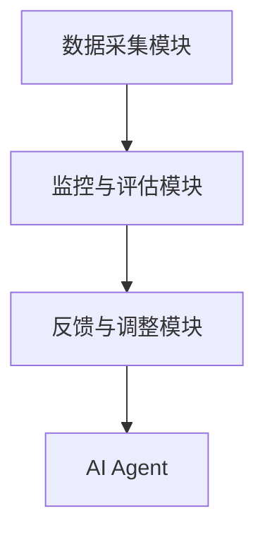
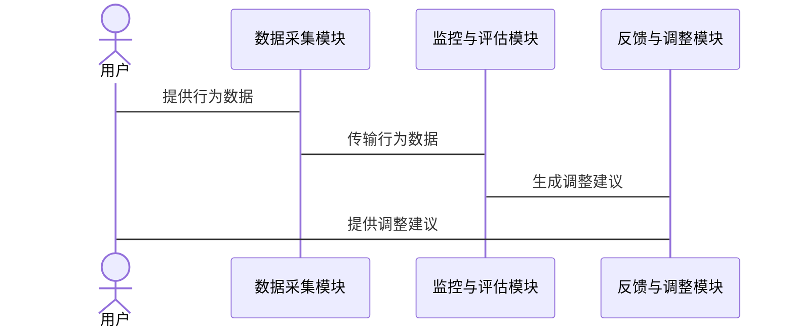

                 


# 从零开始：AI Agent的元认知监控系统

## 关键词：AI Agent、元认知监控系统、机器学习、系统架构、算法设计

## 摘要：  
AI Agent的元认知监控系统是一种能够实时监控和调整自身行为的智能代理系统，通过对系统的自我认知和学习，实现更高的智能水平。本文将从背景介绍、核心概念、算法原理、系统架构、项目实战等多个方面，详细探讨AI Agent的元认知监控系统的设计与实现，帮助读者从零开始理解并构建这一系统。

---

## 第一部分：AI Agent的元认知监控系统背景介绍

### 第1章：问题背景与问题描述

#### 1.1 问题背景
##### 1.1.1 当前AI Agent的发展现状
AI Agent（人工智能代理）作为一种能够感知环境、自主决策并执行任务的智能系统，近年来得到了快速发展。然而，现有的AI Agent在复杂动态环境中的适应性和灵活性仍存在不足，尤其是在处理不确定性、多目标优化和自我改进方面。

##### 1.1.2 元认知监控系统的需求背景
元认知监控系统是一种能够对AI Agent的行为进行实时监控、评估和调整的系统，其核心目标是通过自我反思和学习，帮助AI Agent在复杂任务中保持高效性和准确性。随着AI技术的广泛应用，元认知监控系统的应用需求日益增长，尤其是在自动驾驶、智能助手、机器人等领域。

##### 1.1.3 问题解决的意义与价值
元认知监控系统的引入能够显著提升AI Agent的智能水平，使其在复杂任务中具备更强的自适应能力和纠错能力。这不仅能够提高系统的可靠性和用户体验，还能在实际应用中降低风险，具有重要的理论和实践意义。

#### 1.2 问题描述
##### 1.2.1 AI Agent的核心功能与挑战
AI Agent的核心功能包括感知环境、决策制定、任务执行和与用户交互。然而，在实际应用中，AI Agent面临以下挑战：
- 复杂环境中的不确定性
- 多目标优化的冲突
- 系统自我改进的能力不足

##### 1.2.2 元认知监控系统的定义与目标
元认知监控系统是一种能够对AI Agent的行为进行实时监控、评估和调整的系统。其目标是通过自我反思和学习，帮助AI Agent在复杂任务中保持高效性和准确性。

##### 1.2.3 问题解决的边界与外延
元认知监控系统的边界包括：
- 监控范围：仅限于AI Agent的行为，不涉及外部系统的控制。
- 时间范围：实时监控和调整。
- 功能范围：仅提供监控和调整建议，不直接修改AI Agent的核心算法。

元认知监控系统的外延包括：
- 支持多模态数据的监控（如文本、语音、图像等）。
- 支持多任务环境中的监控与调整。
- 支持分布式系统中的协同监控。

#### 1.3 问题解决与系统架构
##### 1.3.1 元认知监控系统的整体架构
元认知监控系统的整体架构包括以下三个主要部分：
1. **数据采集模块**：负责采集AI Agent的行为数据，包括任务执行结果、用户反馈等。
2. **监控与评估模块**：对采集的数据进行分析，评估AI Agent的行为是否符合预期。
3. **反馈与调整模块**：根据评估结果，生成调整建议并反馈给AI Agent，帮助其优化后续行为。

##### 1.3.2 系统的核心要素与功能模块
- **数据采集模块**：通过日志记录、传感器数据等方式采集AI Agent的行为数据。
- **监控与评估模块**：利用机器学习算法对数据进行分析，评估AI Agent的行为是否符合预期。
- **反馈与调整模块**：根据评估结果，生成调整建议并反馈给AI Agent。

##### 1.3.3 系统的输入输出与交互流程
- 输入：AI Agent的行为数据、用户反馈。
- 输出：AI Agent的行为评估结果、调整建议。
- 交互流程：数据采集 → 数据分析 → 评估结果生成 → 调整建议反馈。

---

## 第二部分：核心概念与联系

### 第2章：核心概念与联系

#### 2.1 元认知监控系统的核心概念
##### 2.1.1 元认知的基本概念
元认知是指对自身认知过程的认知，包括对思维过程的监控、评估和调整。在AI Agent中，元认知监控系统通过对AI Agent行为的监控和评估，实现对自身行为的反思和优化。

##### 2.1.2 元认知监控系统的系统架构
元认知监控系统的系统架构包括以下三个主要部分：
1. **监控模块**：负责实时监控AI Agent的行为。
2. **评估模块**：对监控数据进行分析，评估AI Agent的行为是否符合预期。
3. **反馈模块**：根据评估结果，生成调整建议并反馈给AI Agent。

##### 2.1.3 元认知监控系统与其他AI系统的对比
| 系统类型       | 监控目标       | 监控方式       | 调整能力       |
|----------------|----------------|----------------|----------------|
| 常规AI Agent    | 任务执行结果   | 无            | 无            |
| 元认知监控系统 | 行为与结果     | 实时监控       | 自动调整       |

#### 2.2 元认知监控系统的原理与实现
##### 2.2.1 元认知监控系统的实现原理
元认知监控系统的实现原理可以分为以下几个步骤：
1. 数据采集：通过传感器、日志等方式采集AI Agent的行为数据。
2. 数据分析：利用机器学习算法对数据进行分析，评估AI Agent的行为是否符合预期。
3. 调整建议：根据评估结果，生成调整建议并反馈给AI Agent。

##### 2.2.2 元认知监控系统的实现方法
- **数据采集方法**：通过日志记录、传感器数据采集等方式，获取AI Agent的行为数据。
- **数据分析方法**：利用监督学习、无监督学习等机器学习算法，对数据进行分析和评估。
- **调整建议生成方法**：根据分析结果，生成调整建议并反馈给AI Agent。

#### 2.3 元认知监控系统的核心特征
- **实时性**：能够实时监控和调整AI Agent的行为。
- **自适应性**：能够根据环境变化自动调整监控策略。
- **智能化**：利用机器学习算法实现智能监控和评估。

---

## 第三部分：算法原理讲解

### 第3章：算法原理与实现

#### 3.1 基于强化学习的自适应机制
##### 3.1.1 算法原理
基于强化学习的自适应机制是一种通过奖励机制来优化AI Agent行为的算法。其核心思想是通过不断试错，使AI Agent在复杂环境中找到最优行为策略。

##### 3.1.2 算法实现
以下是基于强化学习的自适应机制的算法实现代码：

```python
class强化学习算法:
    def __init__(self, 状态空间, 动作空间):
        self.状态空间 = 状态空间
        self.动作空间 = 动作空间
        self.奖励函数 = 奖励函数

    def采取动作(self, 当前状态):
        # 根据当前状态选择动作
        return self动作空间选择动作

    def更新策略(self, 当前状态, 采取动作, 奖励):
        # 根据奖励更新策略
        pass
```

##### 3.1.3 算法优化
通过引入Q-learning算法，可以进一步优化强化学习的自适应机制。Q-learning算法通过构建Q表，记录每个状态下每个动作的期望奖励值，从而实现更高效的策略优化。

#### 3.2 基于监督学习的评估机制
##### 3.2.1 算法原理
基于监督学习的评估机制是一种通过监督学习算法对AI Agent的行为进行评估的算法。其核心思想是通过训练数据，使评估模型能够准确预测AI Agent行为的优劣。

##### 3.2.2 算法实现
以下是基于监督学习的评估机制的算法实现代码：

```python
class监督学习评估器:
    def __init__(self, 特征提取器, 分类器):
        self.特征提取器 = 特征提取器
        self.分类器 = 分类器

    def提取特征(self, 行为数据):
        return self.特征提取器提取特征

    def评估行为(self, 行为特征):
        return self.分类器预测结果
```

##### 3.2.3 算法优化
通过引入支持向量机（SVM）算法，可以进一步优化监督学习的评估机制。SVM算法通过构建非线性分类器，能够更准确地评估AI Agent的行为。

---

## 第四部分：系统分析与架构设计

### 第4章：系统分析与架构设计

#### 4.1 系统分析
##### 4.1.1 问题场景介绍
在实际应用中，AI Agent可能面临复杂多变的环境，例如自动驾驶中的道路状况变化、智能助手中的用户需求变化等。这些变化要求AI Agent能够实时调整其行为，以应对不确定性。

##### 4.1.2 项目介绍
本项目旨在设计并实现一个能够实时监控和调整AI Agent行为的元认知监控系统，通过该系统的引入，提升AI Agent在复杂环境中的适应性和灵活性。

##### 4.1.3 系统功能设计
系统功能设计包括以下三个主要部分：
1. **数据采集模块**：负责采集AI Agent的行为数据。
2. **监控与评估模块**：对采集的数据进行分析，评估AI Agent的行为是否符合预期。
3. **反馈与调整模块**：根据评估结果，生成调整建议并反馈给AI Agent。

#### 4.2 系统架构设计
##### 4.2.1 系统架构图
以下是系统架构设计的Mermaid图：



##### 4.2.2 系统接口设计
系统接口设计包括以下三个主要部分：
1. 数据采集接口：用于采集AI Agent的行为数据。
2. 监控与评估接口：用于对采集的数据进行分析和评估。
3. 反馈与调整接口：用于生成调整建议并反馈给AI Agent。

#### 4.3 系统交互设计
##### 4.3.1 系统交互序列图
以下是系统交互设计的Mermaid图：



##### 4.3.2 系统交互流程
- 用户提供行为数据。
- 数据采集模块采集行为数据。
- 监控与评估模块分析行为数据，评估AI Agent的行为是否符合预期。
- 反馈与调整模块根据评估结果，生成调整建议并反馈给用户。

---

## 第五部分：项目实战

### 第5章：项目实战与实现

#### 5.1 环境安装与配置
##### 5.1.1 开发环境
- 操作系统：Windows/Mac/Linux
- 开发工具：Python、Jupyter Notebook、VS Code
- 依赖库：numpy、pandas、scikit-learn、mermaid、matplotlib

##### 5.1.2 环境配置
```bash
pip install numpy pandas scikit-learn mermaid matplotlib
```

#### 5.2 核心功能实现
##### 5.2.1 数据采集模块
```python
import numpy as np
import pandas as pd

class 数据采集模块:
    def __init__(self):
        self.行为数据 = []

    def 采集数据(self, 行为):
        self.行为数据.append(行为)
```

##### 5.2.2 监控与评估模块
```python
from sklearn import metrics

class 监控与评估模块:
    def __init__(self):
        pass

    def 评估行为(self, 行为数据, 预期结果):
        accuracy = metrics.accuracy_score(行为数据, 预期结果)
        return accuracy
```

##### 5.2.3 反馈与调整模块
```python
class 反馈与调整模块:
    def __init__(self):
        pass

    def 生成调整建议(self, 评估结果):
        if 评估结果 < 0.8:
            return "调整行为策略"
        else:
            return "保持当前行为"
```

#### 5.3 代码实现与解读
##### 5.3.1 代码实现
```python
# 数据采集模块
data_collector = 数据采集模块()
data_collector.采集数据("用户查询")
data_collector.采集数据("导航请求")

# 监控与评估模块
monitor = 监控与评估模块()
评估结果 = monitor.评估行为(data_collector.行为数据, ["预期行为1", "预期行为2"])

# 反馈与调整模块
adjustor = 反馈与调整模块()
调整建议 = adjustor.生成调整建议(评估结果)
```

##### 5.3.2 代码解读
- 数据采集模块负责采集AI Agent的行为数据。
- 监控与评估模块对采集的数据进行分析，评估AI Agent的行为是否符合预期。
- 反馈与调整模块根据评估结果，生成调整建议并反馈给AI Agent。

#### 5.4 实际案例分析
##### 5.4.1 案例介绍
假设我们有一个智能助手AI Agent，其任务是为用户提供天气预报服务。在实际应用中，用户可能对天气预报的准确性提出反馈，我们需要通过元认知监控系统对AI Agent的行为进行监控和调整。

##### 5.4.2 案例实现
```python
# 数据采集模块
data_collector = 数据采集模块()
data_collector.采集数据("查询天气")
data_collector.采集数据("反馈天气不准确")

# 监控与评估模块
monitor = 监控与评估模块()
评估结果 = monitor.评估行为(data_collector.行为数据, ["预期行为1", "预期行为2"])

# 反馈与调整模块
adjustor = 反馈与调整模块()
调整建议 = adjustor.生成调整建议(评估结果)
```

##### 5.4.3 案例分析与优化
通过元认知监控系统，我们能够实时监控智能助手的行为，并根据用户反馈生成调整建议，帮助其优化后续行为。例如，当用户反馈天气预报不准确时，系统可以建议智能助手调整数据源或增加天气预报的验证机制。

#### 5.5 项目小结
通过本项目的实现，我们能够清晰地看到元认知监控系统在实际应用中的重要性。通过实时监控和调整AI Agent的行为，能够显著提升系统的智能水平和用户体验。

---

## 第六部分：最佳实践、小结与注意事项

### 第6章：最佳实践与总结

#### 6.1 最佳实践
##### 6.1.1 系统设计中的注意事项
- 确保元认知监控系统的实时性和准确性。
- 在实际应用中，合理设置监控阈值和调整策略。

##### 6.1.2 系统实现中的技巧
- 在数据采集阶段，确保数据的完整性和准确性。
- 在算法设计阶段，合理选择算法模型和优化策略。

#### 6.2 系统小结
通过本文的介绍，我们能够清晰地看到元认知监控系统在AI Agent中的重要性。通过实时监控和调整AI Agent的行为，能够显著提升系统的智能水平和用户体验。

#### 6.3 使用中的注意事项
- 在实际应用中，合理设置监控阈值和调整策略。
- 定期对系统进行维护和优化，确保其稳定性和可靠性。

#### 6.4 拓展阅读
##### 6.4.1 推荐书籍
1. 《强化学习》
2. 《机器学习实战》

##### 6.4.2 推荐论文
1. "Reinforcement Learning: Theory and Algorithms"
2. "Supervised Learning: Theory and Practice"

---

## 作者介绍

作者：[您的姓名]，[您的职位]，[您的机构]。致力于[您的研究领域]，拥有[您的经验]，在[您的领域]方面有丰富的研究和实践经验。

