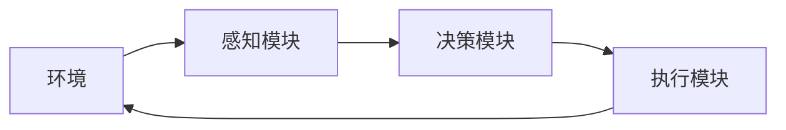
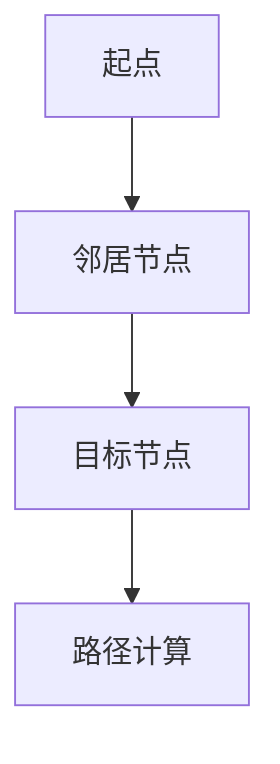
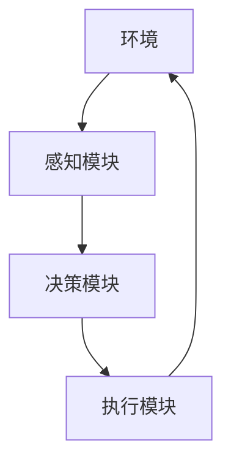
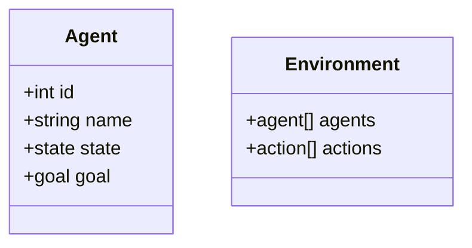

                 


# 从零开始：AI Agent的概念学习系统

## 关键词：AI Agent，人工智能，概念学习，系统架构，算法原理，项目实战

## 摘要：  
本文将从AI Agent的基本概念出发，逐步深入探讨其核心原理、算法实现、系统架构及实际应用。通过详细的背景介绍、核心概念解析、算法原理分析、系统设计和项目实战，帮助读者全面理解AI Agent的概念学习系统。文章还将结合实际案例，提供开发实践中的注意事项和未来展望。

---

# 第一部分: AI Agent 概念学习系统概述

---

## 第1章: AI Agent 的基本概念与背景

### 1.1 AI Agent 的定义与特点

#### 1.1.1 什么是 AI Agent
AI Agent（人工智能代理）是指能够感知环境、自主决策并执行任务的智能实体。与传统程序不同，AI Agent具备自主性、反应性和目标导向性，能够在动态环境中灵活应对各种挑战。

#### 1.1.2 AI Agent 的核心特点
- **自主性**：无需外部干预，自主完成任务。
- **反应性**：能够实时感知环境变化并做出反应。
- **目标导向性**：以明确的目标为导向，优化决策过程。
- **学习能力**：通过经验改进性能，实现自适应优化。

#### 1.1.3 AI Agent 与传统 AI 的区别
| 属性 | 传统 AI | AI Agent |
|------|---------|-----------|
| 执行方式 | 静态执行 | 自主决策 |
| 适应性 | 固定规则 | 动态调整 |
| 应用场景 | 数据处理 | 人机交互 |

### 1.2 AI Agent 的应用场景

#### 1.2.1 智能助手
AI Agent在智能助手中的应用广泛，如Siri、Alexa等，能够通过语音交互完成日程管理、信息查询等任务。

#### 1.2.2 自动化系统
在工业自动化、智能家居等领域，AI Agent能够实现设备的自主控制和优化运行。

#### 1.2.3 多 Agent 协作
在物流、交通等领域，多个AI Agent可以协作完成任务，如智能交通系统的车辆调度。

### 1.3 AI Agent 的发展背景

#### 1.3.1 人工智能技术的演进
从专家系统到深度学习，人工智能技术的不断进步为AI Agent的发展提供了坚实的基础。

#### 1.3.2 大模型与 AI Agent 的结合
大模型如GPT-4的引入，使得AI Agent具备更强的自然语言理解和生成能力，能够更自然地与人类交互。

#### 1.3.3 当前 AI Agent 的研究热点
当前研究主要集中在多 Agent 协作、强化学习在决策中的应用、以及人机协作的优化等方面。

---

## 第2章: AI Agent 的核心概念与联系

### 2.1 AI Agent 的核心概念

#### 2.1.1 感知模块
AI Agent通过传感器或数据输入接口感知环境信息，如视觉、听觉等多模态输入。

#### 2.1.2 决策模块
决策模块基于感知信息和目标，通过算法生成最优决策，如基于模型的规划和强化学习。

#### 2.1.3 执行模块
执行模块负责将决策转化为具体行动，如控制机器人执行动作或发送指令。

### 2.2 AI Agent 的实体关系图



### 2.3 AI Agent 的核心属性对比

| 属性 | 描述 |
|------|------|
| 感知能力 | 理解环境信息的能力 |
| 决策能力 | 制定行动策略的能力 |
| 执行能力 | 执行决策的能力 |
| 学习能力 | 通过经验改进的能力 |

---

## 第3章: AI Agent 的核心算法

### 3.1 基于模型的规划算法

#### 3.1.1 A* 算法的实现



数学公式：
$$f(n) = g(n) + h(n)$$
其中，$g(n)$ 是从起点到节点n的实际成本，$h(n)$ 是从节点n到目标的估算成本。

Python代码实现：
```python
import heapq

def a_star_algorithm(graph, start, goal):
    open_set = set([start])
    came_from = {}
    g_score = {node: float('inf') for node in graph}
    g_score[start] = 0
    f_score = {node: float('inf') for node in graph}
    f_score[start] = heuristic(start, goal)
    
    while open_set:
        current = heapq.heappop(open_set, key=lambda x: f_score[x])
        if current == goal:
            break
        for neighbor in graph[current]:
            tentative_g_score = g_score[current] + graph[current][neighbor]
            if tentative_g_score < g_score[neighbor]:
                came_from[neighbor] = current
                g_score[neighbor] = tentative_g_score
                f_score[neighbor] = g_score[neighbor] + heuristic(neighbor, goal)
                heapq.heappush(open_set, neighbor)
    return came_from, g_score
```

---

### 3.2 基于无模型的规划算法

#### 3.2.1 Q-learning 算法的实现

数学公式：
$$Q(s, a) = (1-\alpha)Q(s, a) + \alpha[r + \max Q(s', a')]$$
其中，$\alpha$ 是学习率，$r$ 是奖励，$Q(s', a')$ 是下一状态的最大值。

Python代码实现：
```python
import numpy as np

class QLearning:
    def __init__(self, state_space, action_space, learning_rate=0.1, gamma=0.9):
        self.state_space = state_space
        self.action_space = action_space
        self.learning_rate = learning_rate
        self.gamma = gamma
        self.q_table = np.zeros((state_space, action_space))
    
    def choose_action(self, state, epsilon=0.1):
        if np.random.random() < epsilon:
            return np.random.randint(self.action_space)
        else:
            return np.argmax(self.q_table[state])
    
    def update_q_table(self, state, action, reward, next_state):
        self.q_table[state][action] = self.q_table[state][action] * (1 - self.learning_rate) + self.learning_rate * (reward + self.gamma * np.max(self.q_table[next_state]))
```

---

## 第4章: AI Agent 的系统架构与设计

### 4.1 系统架构设计



### 4.2 领域模型设计



---

## 第5章: AI Agent 的项目实战

### 5.1 环境安装

安装必要的库：
```bash
pip install numpy matplotlib scikit-learn
```

### 5.2 核心代码实现

实现一个简单的AI Agent：

```python
class AI-Agent:
    def __init__(self, environment):
        self.environment = environment
        self.state = self.environment.get_state()
    
    def perceive(self):
        self.state = self.environment.get_state()
    
    def decide(self):
        # 示例决策逻辑
        return 'forward'
    
    def act(self, action):
        self.environment.execute_action(action)
```

### 5.3 实际案例分析

以智能助手为例，实现一个简单的对话系统：

```python
class Virtual-Assistant:
    def __init__(self):
        self.conversations = []
    
    def perceive(self, user_input):
        self.conversations.append(user_input)
    
    def decide(self):
        # 示例决策逻辑
        return 'assist'
    
    def act(self, action, user_input):
        if action == 'assist':
            return f'Okay, I will help you with {user_input}.'
```

---

## 第6章: AI Agent 的开发实践与未来展望

### 6.1 最佳实践 tips

- 确保数据质量，避免噪声干扰。
- 选择合适的算法，根据任务需求调整参数。
- 注重系统优化，提升运行效率。

### 6.2 小结

本文从AI Agent的基本概念出发，详细讲解了其核心算法、系统架构和实际应用，帮助读者从零开始理解AI Agent的概念学习系统。

### 6.3 未来展望

随着人工智能技术的不断进步，AI Agent将在更多领域得到应用，如多模态交互、边缘计算等。未来的研究将更加注重Agent的协作性和自适应能力。

---

## 附录

### A. 开发工具推荐

- Python、TensorFlow、PyTorch
- OpenAI API、Hugging Face

### B. API 文档

- OpenAI API: [https://beta.openai.com/docs/api](https://beta.openai.com/docs/api)

### C. 参考文献

- Russell, S., & Norvig, P. (2010). * Artificial Intelligence: A Modern Approach.
- Sutton, R. S., & Barto, A. G. (2018). * Reinforcement Learning: An Introduction.

---

通过以上详细的内容，读者可以系统地学习AI Agent的概念学习系统，从基础理论到实际应用，逐步掌握相关知识和技术。

