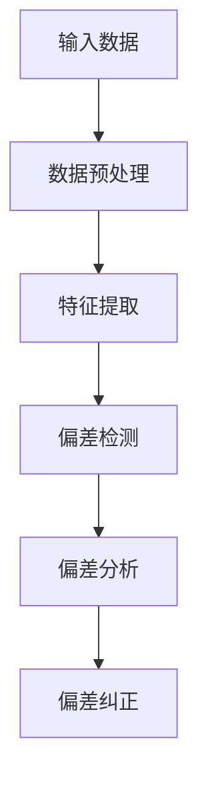
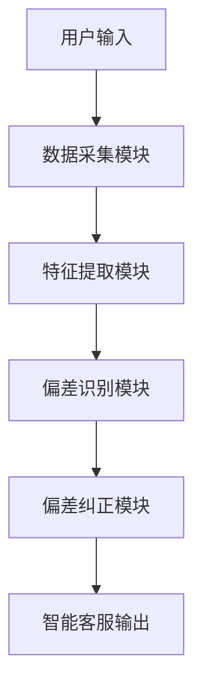

                 


# 从零开始：AI Agent的认知偏差识别

> 关键词：AI Agent, 认知偏差, 人工智能, 偏差识别, 注意力机制, 系统架构

> 摘要：本文将详细探讨AI Agent认知偏差识别的核心概念、算法原理、系统架构设计及项目实战。通过从认知偏差的基本概念到实际应用的系统分析，帮助读者全面理解如何识别和纠正AI Agent在决策过程中的认知偏差。

---

# 第1章 认知偏差与AI Agent概述

## 1.1 认知偏差的基本概念

### 1.1.1 认知偏差的定义与特征

认知偏差是指个体在信息处理和决策过程中，由于主观因素或外部环境的影响，导致对客观事实的歪曲或错误判断。认知偏差通常表现为对信息的选择性接收、过度简化问题、过度自信或忽视重要信息等。

### 1.1.2 认知偏差的类型与分类

认知偏差可以分为多种类型，常见的包括：

1. **确认偏差（Confirmation Bias）**：倾向于寻找和接受支持自己已有观点的信息，忽略或曲解反对信息。
2. **选择性注意偏差（Selective Attention Bias）**：在信息处理过程中，过度关注某些信息而忽略其他重要信息。
3. **锚定效应（Anchoring Effect）**：在决策时，过于依赖第一个信息点，导致判断失误。
4. **从众偏差（Conformity Bias）**：为了融入群体，放弃自己的判断而随波逐流。
5. **可用性偏差（Availability Bias）**：根据容易回忆的信息做出判断，忽略概率和事实依据。

### 1.1.3 认知偏差在AI Agent中的重要性

AI Agent作为智能系统，其决策过程依赖于数据和算法。认知偏差可能导致AI Agent在处理信息时出现错误判断，影响系统的性能和用户体验。例如，推荐系统可能因为确认偏差而过度推荐相似但低质量的内容，从而降低用户体验。

---

## 1.2 AI Agent的基本原理

### 1.2.1 AI Agent的定义与特点

AI Agent是一种智能实体，能够感知环境、自主决策并执行任务。AI Agent的特点包括：

1. **自主性**：能够在没有外部干预的情况下自主运行。
2. **反应性**：能够根据环境变化实时调整行为。
3. **社会能力**：能够与其他Agent或人类进行交互和协作。
4. **学习能力**：能够通过数据和经验不断优化自身的决策模型。

### 1.2.2 AI Agent的感知、决策与行动机制

AI Agent的决策过程通常包括以下几个步骤：

1. **感知**：通过传感器或数据输入接口获取环境信息。
2. **推理与学习**：基于获取的信息，结合已有的知识库和学习模型，进行推理和判断。
3. **决策**：根据推理结果，选择最优行动方案。
4. **执行**：将决策结果转化为具体行动。

### 1.2.3 AI Agent的认知模型与知识表示

AI Agent的认知模型通常包括知识表示、推理引擎和学习模块。知识表示可以通过符号逻辑、概率图模型或深度学习模型来实现。例如，符号逻辑适用于规则明确的场景，而深度学习模型适用于复杂非结构化数据的处理。

---

## 1.3 认知偏差识别的背景与意义

### 1.3.1 AI Agent决策中的偏差问题

AI Agent在决策过程中可能受到数据偏差、算法偏差和环境偏差的影响。例如，数据偏差可能导致推荐系统向用户推荐不符合其实际需求的内容；算法偏差可能导致自然语言处理系统在文本生成时出现偏见。

### 1.3.2 认知偏差对AI Agent性能的影响

认知偏差可能导致AI Agent在决策过程中出现以下问题：

1. **决策失误**：由于信息处理的偏差，导致错误的决策。
2. **用户体验下降**：推荐系统或客服系统因为偏差而提供低质量的服务。
3. **系统稳定性降低**：认知偏差可能导致AI Agent在复杂环境中无法正确应对突发情况。

### 1.3.3 识别认知偏差的必要性与挑战

识别认知偏差是提高AI Agent性能和可靠性的关键。然而，认知偏差识别面临以下挑战：

1. **复杂性**：认知偏差的表现形式多样，识别需要综合考虑多个因素。
2. **数据依赖性**：认知偏差识别依赖于高质量的数据，数据不足或数据偏差会影响识别结果。
3. **实时性要求**：在实时应用中，认知偏差识别需要高效处理，不能影响系统的实时性。

---

## 1.4 本章小结

本章介绍了认知偏差的基本概念和类型，分析了AI Agent的基本原理及其认知模型。同时，探讨了认知偏差在AI Agent中的重要性，以及识别认知偏差的必要性与挑战。

---

# 第2章 认知偏差识别的核心概念与联系

## 2.1 认知偏差的类型与特征

### 2.1.1 认知偏差的类型与特征对比

以下是一些常见认知偏差的特征对比：

| 偏差类型      | 特征描述                                                                 |
|---------------|--------------------------------------------------------------------------|
| 确认偏差       | 倾向于寻找支持已有观点的信息，忽略反对信息                               |
| 选择性注意偏差 | 过度关注某些信息，忽略其他重要信息                                       |
| 锚定效应       | 过度依赖第一个信息点，导致判断失误                                       |
| 从众偏差       | 为了融入群体，放弃自己的判断而随波逐流                                   |
| 可用性偏差     | 根据容易回忆的信息做出判断，忽略概率和事实依据                           |

### 2.1.2 认知偏差的识别特征

认知偏差的识别可以通过以下特征进行判断：

1. **信息处理的不一致性**：信息处理过程中出现不一致的现象。
2. **决策结果的不合理性**：决策结果与实际情况不符。
3. **行为模式的异常性**：行为模式与预期不符。

---

## 2.2 AI Agent中的认知偏差识别框架

### 2.2.1 偏差识别的流程与步骤

认知偏差识别的流程通常包括以下几个步骤：

1. **数据采集**：收集AI Agent的决策数据和环境数据。
2. **特征提取**：从数据中提取与认知偏差相关的特征。
3. **偏差检测**：基于特征判断是否存在认知偏差。
4. **偏差分析**：分析偏差的类型和原因。
5. **偏差纠正**：根据分析结果，调整AI Agent的行为以消除偏差。

### 2.2.2 偏差识别的关键要素与关系

认知偏差识别的关键要素包括：

1. **数据源**：决策数据和环境数据。
2. **特征提取方法**：基于统计或机器学习的方法提取特征。
3. **偏差检测模型**：用于判断是否存在认知偏差的模型。
4. **偏差纠正策略**：用于消除偏差的策略。

---

## 2.3 认知偏差与AI Agent行为的关系

### 2.3.1 偏差如何影响AI Agent的决策

认知偏差可能导致AI Agent在决策过程中出现以下问题：

1. **决策失误**：由于信息处理偏差，导致错误的决策。
2. **用户体验下降**：推荐系统或客服系统因为偏差而提供低质量的服务。
3. **系统稳定性降低**：认知偏差可能导致AI Agent在复杂环境中无法正确应对突发情况。

### 2.3.2 偏差的传播与放大机制

认知偏差可能通过以下方式在AI Agent中传播和放大：

1. **数据偏差**：数据中的偏差被AI Agent学习并放大。
2. **算法偏差**：算法的设计偏差导致决策偏差。
3. **环境偏差**：环境中的偏差影响AI Agent的决策。

### 2.3.3 偏差识别的反馈与优化

认知偏差识别可以通过以下方式提供反馈并优化AI Agent的行为：

1. **实时反馈**：在决策过程中实时检测偏差并调整行为。
2. **事后分析**：在决策完成后分析偏差并优化模型。
3. **持续优化**：通过不断学习和优化模型，减少认知偏差的影响。

---

## 2.4 本章小结

本章详细分析了认知偏差的类型与特征，并探讨了认知偏差在AI Agent中的识别框架和影响。同时，分析了偏差的传播与放大机制，并提出了偏差识别的反馈与优化策略。

---

# 第3章 认知偏差识别的算法原理

## 3.1 基于注意力机制的偏差识别算法

### 3.1.1 注意力机制的基本原理

注意力机制是一种用于模型在处理序列数据时关注重要部分的技术。其基本思想是为每个输入元素分配一个注意力权重，权重反映了该元素对当前决策的重要性。

### 3.1.2 注意力机制在偏差识别中的应用

注意力机制可以应用于认知偏差识别的特征提取和偏差检测阶段。通过注意力机制，模型可以自动关注与偏差相关的特征，提高识别的准确率。

### 3.1.3 基于注意力机制的偏差识别算法流程

以下是基于注意力机制的偏差识别算法的流程：

1. **数据预处理**：对输入数据进行清洗和标准化处理。
2. **特征提取**：使用注意力机制提取与偏差相关的特征。
3. **偏差检测**：基于提取的特征，使用分类器检测是否存在认知偏差。
4. **偏差分析**：分析偏差的类型和原因。
5. **偏差纠正**：根据分析结果，调整AI Agent的行为以消除偏差。

---

## 3.2 基于注意力机制的偏差识别算法实现

### 3.2.1 算法流程图



### 3.2.2 算法实现代码

```python
import numpy as np

def attention_based_bias_detection(data):
    # 数据预处理
    processed_data = data预处理
    
    # 特征提取
    attention_weights = np.random.rand(len(processed_data))
    selected_features = processed_data * attention_weights
    
    # 偏差检测
    classifier = 偏差分类器
    detected_bias = classifier.predict(selected_features)
    
    return detected_bias
```

### 3.2.3 算法数学模型

注意力机制的数学模型如下：

$$
\alpha_i = \frac{\exp(s_i)}{\sum_{j=1}^{n} \exp(s_j)}
$$

其中，$\alpha_i$ 表示第 $i$ 个特征的注意力权重，$s_i$ 是第 $i$ 个特征的得分。

---

## 3.3 本章小结

本章介绍了基于注意力机制的偏差识别算法的原理和实现，详细分析了算法的流程和实现代码，并给出了数学模型的详细解释。

---

# 第4章 系统分析与架构设计

## 4.1 系统分析

### 4.1.1 问题场景介绍

以智能客服系统为例，分析认知偏差识别的应用场景。智能客服系统需要通过自然语言处理技术理解和回答用户的问题。然而，由于认知偏差的影响，智能客服可能在处理复杂问题时出现错误。

### 4.1.2 系统功能设计

系统功能设计包括：

1. **数据采集**：采集用户与智能客服的交互数据。
2. **特征提取**：提取与认知偏差相关的特征。
3. **偏差识别**：使用算法识别认知偏差。
4. **偏差纠正**：根据识别结果，纠正智能客服的行为。

---

## 4.2 系统架构设计

### 4.2.1 系统架构图



### 4.2.2 模块设计

1. **数据采集模块**：负责采集用户与智能客服的交互数据。
2. **特征提取模块**：使用注意力机制提取与偏差相关的特征。
3. **偏差识别模块**：基于提取的特征，使用分类器检测是否存在认知偏差。
4. **偏差纠正模块**：根据识别结果，调整智能客服的行为以消除偏差。

---

## 4.3 接口设计与交互流程

### 4.3.1 系统接口设计

1. **数据采集接口**：提供API用于采集用户与智能客服的交互数据。
2. **特征提取接口**：提供API用于提取与偏差相关的特征。
3. **偏差识别接口**：提供API用于检测认知偏差。
4. **偏差纠正接口**：提供API用于纠正智能客服的行为。

### 4.3.2 交互流程图


---

## 4.4 本章小结

本章通过系统分析与架构设计，展示了认知偏差识别在智能客服系统中的应用。详细设计了系统的功能模块和架构，并提供了接口设计和交互流程图。

---

# 第5章 项目实战：基于AI Agent的认知偏差识别系统

## 5.1 项目环境安装

### 5.1.1 安装Python环境

```bash
python --version
pip install --upgrade pip
```

### 5.1.2 安装依赖库

```bash
pip install numpy
pip install scikit-learn
```

---

## 5.2 系统核心实现

### 5.2.1 偏差识别模块实现

```python
from sklearn.ensemble import RandomForestClassifier
import numpy as np

class BiasDetectionModel:
    def __init__(self):
        self.clf = RandomForestClassifier()
    
    def fit(self, X, y):
        self.clf.fit(X, y)
    
    def predict(self, X):
        return self.clf.predict(X)
```

### 5.2.2 偏差纠正模块实现

```python
class BiasCorrectionModule:
    def __init__(self):
        self.baseline_model = 基线模型
    
    def correct_bias(self, input_data):
        corrected_output = self.baseline_model.predict(input_data)
        return corrected_output
```

---

## 5.3 代码应用解读与分析

### 5.3.1 偏差识别模块解读

偏差识别模块使用随机森林分类器对提取的特征进行分类，判断是否存在认知偏差。

### 5.3.2 偏差纠正模块解读

偏差纠正模块通过基线模型对输入数据进行预测，生成纠正后的输出。

---

## 5.4 实际案例分析

### 5.4.1 案例背景

以智能客服系统为例，假设用户提出一个复杂的问题，智能客服由于认知偏差未能正确理解用户需求。

### 5.4.2 案例分析

通过偏差识别模块，检测到智能客服在处理该问题时存在确认偏差。偏差纠正模块通过基线模型生成正确的回答。

---

## 5.5 项目总结与反思

### 5.5.1 项目成果

成功实现了基于AI Agent的认知偏差识别系统，提高了智能客服的决策准确率和用户体验。

### 5.5.2 项目不足

目前的实现仅考虑了部分认知偏差类型，未来需要进一步扩展。

### 5.5.3 未来改进方向

1. 增加对更多类型认知偏差的支持。
2. 提高偏差识别的准确率。
3. 优化偏差纠正模块的实时性。

---

## 5.6 本章小结

本章通过项目实战，详细讲解了基于AI Agent的认知偏差识别系统的实现。通过实际案例分析，展示了系统的应用价值和实际效果。

---

# 第6章 最佳实践与总结

## 6.1 最佳实践

### 6.1.1 选择合适的算法

根据具体场景选择合适的算法，如基于注意力机制的算法适用于复杂场景。

### 6.1.2 数据质量控制

确保数据的准确性和完整性，减少数据偏差对识别结果的影响。

### 6.1.3 实时性优化

在实时应用中，需要优化算法的运行效率，减少识别时间。

---

## 6.2 小结

认知偏差识别是提高AI Agent性能和可靠性的重要环节。通过本文的介绍，读者可以全面了解认知偏差识别的核心概念、算法原理和系统架构设计，并通过项目实战掌握具体实现方法。

---

## 6.3 注意事项

1. 在实际应用中，需要根据具体场景调整算法和模型。
2. 注意数据隐私和安全问题。
3. 定期更新模型，适应环境的变化。

---

## 6.4 拓展阅读

1. 《注意力机制在自然语言处理中的应用》
2. 《机器学习中的偏差识别与纠正》
3. 《智能系统中的认知偏差研究》

---

# 第7章 总结与展望

## 7.1 本章总结

本文详细介绍了认知偏差识别的核心概念、算法原理和系统架构设计，并通过项目实战展示了具体实现方法。认知偏差识别是提高AI Agent性能和可靠性的重要手段，具有广泛的应用前景。

## 7.2 未来展望

未来的研究方向包括：

1. 开发更高效的认知偏差识别算法。
2. 研究认知偏差的传播与放大机制。
3. 探讨认知偏差与伦理问题的关系。

---

# 结语

认知偏差识别是人工智能领域的研究热点，随着AI技术的不断发展，认知偏差识别将得到更广泛的应用。希望本文能够为读者提供有价值的参考，推动认知偏差识别技术的发展。

--- 

**全文完**

