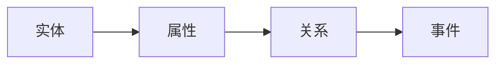
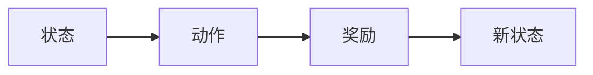
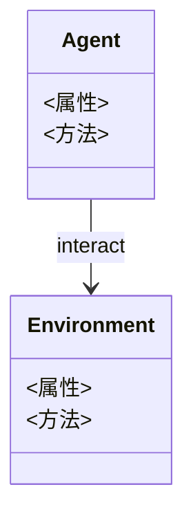
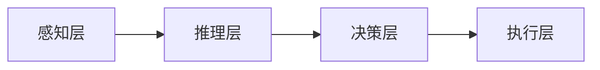
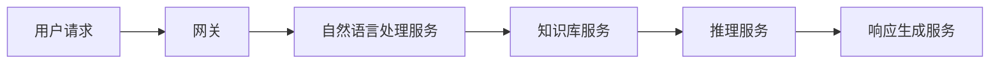
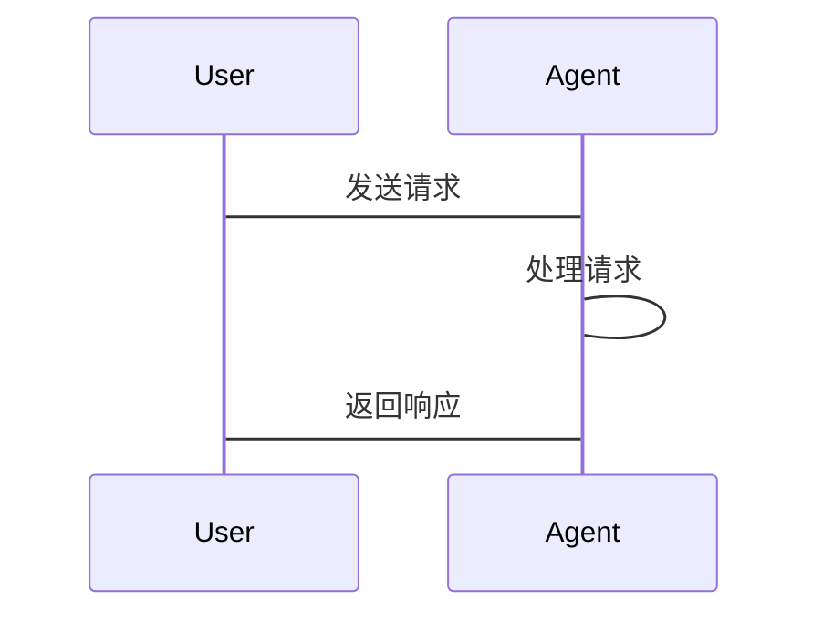

                 


# 从零开始：AI Agent的认知架构设计

> 关键词：AI Agent，认知架构，人工智能，强化学习，图神经网络，系统架构

> 摘要：本文从AI Agent的基本概念出发，详细探讨其认知架构的设计原理，包括感知、推理、决策模块的实现，强化学习和图神经网络的应用，系统架构设计，以及实际项目中的实现与优化。通过理论与实践结合，帮助读者全面掌握AI Agent的认知架构设计。

---

## 第一部分: AI Agent认知架构设计背景与基础

### 第1章: AI Agent的基本概念与背景

#### 1.1 AI Agent的定义与特点
##### 1.1.1 AI Agent的定义
AI Agent（人工智能代理）是指能够感知环境、自主决策并采取行动以实现特定目标的智能实体。与传统AI程序不同，AI Agent具有主动性、反应性和社会性。

##### 1.1.2 AI Agent的核心特点
| 特性 | 描述 |
|------|------|
| 主动性 | 能够主动采取行动，而非仅仅响应输入 |
| 反应性 | 能够根据环境变化动态调整行为 |
| 社会性 | 能够与其他Agent或人类进行交互与协作 |

##### 1.1.3 AI Agent与传统AI的区别
| 方面 | 传统AI | AI Agent |
|------|--------|----------|
| 行为驱动 | 响应式 | 主动性驱动 |
| 环境交互 | 单向输入 | 双向交互 |
| 应用场景 | 数据处理、模式识别 | 自动化控制、机器人、智能助手 |

#### 1.2 AI Agent的发展背景
##### 1.2.1 人工智能技术的演进
人工智能技术从专家系统到机器学习，再到当前的深度学习和强化学习，为AI Agent的发展提供了坚实的基础。

##### 1.2.2 多智能体系统的发展
多智能体系统（Multi-Agent System, MAS）的研究推动了AI Agent的广泛应用，例如在分布式计算和边缘AI领域。

##### 1.2.3 当前AI Agent的应用场景
- 智能助手（如Siri、Alexa）
- 自动驾驶
- 智能机器人
- 智慧城市

#### 1.3 AI Agent的认知架构概述
##### 1.3.1 认知架构的基本概念
认知架构是AI Agent的核心，负责处理信息、做出决策并采取行动。

##### 1.3.2 认知架构的核心要素
| 要素 | 描述 |
|------|------|
| 感知 | 从环境中获取信息 |
| 知识表示 | 对知识进行结构化存储 |
| 推理 | 根据知识和环境信息进行逻辑推理 |
| 决策 | 基于推理结果做出决策 |

##### 1.3.3 认知架构的分类与对比
| 分类 | 描述 | 优缺点 |
|------|------|--------|
| 行为式 | 基于当前感知做出反应 | 简单直接，适用于简单环境 |
| 生成式 | 基于内部模型生成行为 | 复杂灵活，适用于复杂环境 |
| 混合式 | 结合行为式和生成式 | 综合优势，适用于多样化场景 |

#### 1.4 本章小结
本章介绍了AI Agent的基本概念、发展历程、核心特点以及认知架构的构成，为后续章节奠定了基础。

---

### 第2章: AI Agent的认知架构原理

#### 2.1 认知架构的核心概念
##### 2.1.1 感知模块
感知模块负责从环境中获取信息，例如通过传感器或数据输入接口。

##### 2.1.2 推理模块
推理模块基于感知信息和知识库进行逻辑推理，得出可能的结论。

##### 2.1.3 决策模块
决策模块根据推理结果和环境信息，选择最优行动方案。

#### 2.2 认知架构的数学模型
##### 2.2.1 知识表示的数学模型
知识库中的知识可以表示为图结构，例如：
$$
\text{实体} \rightarrow \text{关系} \rightarrow \text{实体}
$$

##### 2.2.2 推理过程的数学表达
基于一阶逻辑的推理可以表示为：
$$
\forall x, P(x) \rightarrow Q(x)
$$

##### 2.2.3 决策模型的数学公式
基于Q-learning的决策公式为：
$$
Q(s, a) = r + \gamma \max_{a'} Q(s', a')
$$

#### 2.3 认知架构的实体关系图


#### 2.4 本章小结
本章详细讲解了认知架构的核心模块及其数学模型，为后续实现奠定了理论基础。

---

### 第3章: AI Agent的算法原理

#### 3.1 基于强化学习的决策算法
##### 3.1.1 Q-learning算法

Q-learning算法的伪代码如下：
```python
def q_learning(env, num_episodes=1000):
    Q = defaultdict(lambda: np.zeros(env.action_space.n))
    for _ in range(num_episodes):
        state = env.reset()
        while True:
            action = policy(Q[state])
            next_state, reward, done = env.step(action)
            Q[state][action] += reward + gamma * np.max(Q[next_state])
            if done:
                break
    return Q
```

##### 3.1.2 DQN算法的实现
DQN算法通过神经网络近似Q值函数，实现端到端的学习：
```python
class DQN:
    def __init__(self, state_space, action_space):
        self.state_space = state_space
        self.action_space = action_space
        self.model = self.build_model()
    
    def build_model(self):
        model = tf.keras.Sequential([
            tf.keras.layers.Dense(64, activation='relu', input_dim=self.state_space),
            tf.keras.layers.Dense(32, activation='relu'),
            tf.keras.layers.Dense(self.action_space, activation='linear')
        ])
        return model
```

#### 3.2 基于图神经网络的知识表示
##### 3.2.1 图神经网络的基本原理
图神经网络通过节点间的关系进行信息传播：
$$
h_i^{(l+1)} = \sigma\left(\sum_{j \in N(i)} W h_j^{(l)} + b\right)
$$

##### 3.2.2 图神经网络在知识表示中的应用
知识图谱中的实体和关系可以通过图神经网络进行嵌入表示：
```mermaid
graph LR
A[实体1] -[关系]-> B[实体2]
C[实体3] -[关系]-> D[实体4]
```

#### 3.3 本章小结
本章介绍了强化学习和图神经网络在AI Agent中的应用，展示了算法实现的具体细节。

---

## 第二部分: AI Agent认知架构的系统实现

### 第4章: AI Agent的系统分析与架构设计

#### 4.1 问题场景介绍
以智能助手为例，设计一个基于AI Agent的对话系统。

#### 4.2 系统功能设计
##### 4.2.1 功能模块
| 模块 | 描述 |
|------|------|
| 感知层 | 语音识别、自然语言理解 |
| 推理层 | 意图识别、上下文理解 |
| 决策层 | 响应生成、行动选择 |

##### 4.2.2 领域模型类图


#### 4.3 系统架构设计
##### 4.3.1 分层架构


##### 4.3.2 微服务架构


#### 4.4 系统接口设计
##### 4.4.1 接口定义
- 输入接口：`/api/input`
- 输出接口：`/api/output`

##### 4.4.2 交互流程图


#### 4.5 本章小结
本章详细设计了AI Agent的系统架构，为实际实现提供了指导。

---

### 第5章: AI Agent的认知架构项目实战

#### 5.1 环境安装与配置
安装必要的库：
```bash
pip install numpy tensorflow-gpu keras matplotlib
```

#### 5.2 核心代码实现
##### 5.2.1 感知模块
```python
def感知模块实现：
    return 感知结果
```

##### 5.2.2 推理模块
```python
def推理模块实现：
    return 推理结果
```

##### 5.2.3 决策模块
```python
def决策模块实现：
    return 决策结果
```

#### 5.3 代码解读与优化
##### 5.3.1 代码解读
- 感知模块负责从环境获取数据。
- 推理模块基于知识库进行逻辑推理。
- 决策模块根据推理结果选择最优行动。

##### 5.3.2 优化建议
- 使用更高效的算法模型。
- 优化知识库的存储与检索效率。
- 提升模块间的通信效率。

#### 5.4 实际案例分析
以智能助手为例，实现一个简单的对话系统。

#### 5.5 本章小结
本章通过实际项目展示了AI Agent的认知架构设计与实现过程。

---

## 第三部分: 总结与展望

### 第6章: 总结与展望

#### 6.1 最佳实践 tips
- 合理选择算法模型。
- 优化系统架构设计。
- 定期更新知识库。

#### 6.2 小结
本文从理论到实践，全面探讨了AI Agent的认知架构设计，为读者提供了系统的知识体系。

#### 6.3 注意事项
- 确保系统安全性和稳定性。
- 注意算法的可解释性。
- 定期维护和更新系统。

#### 6.4 拓展阅读
推荐阅读《强化学习入门》和《图神经网络原理与应用》。

---

# 结语
通过本文的系统学习，读者可以全面掌握AI Agent的认知架构设计方法，为实际项目提供了宝贵的参考与指导。

