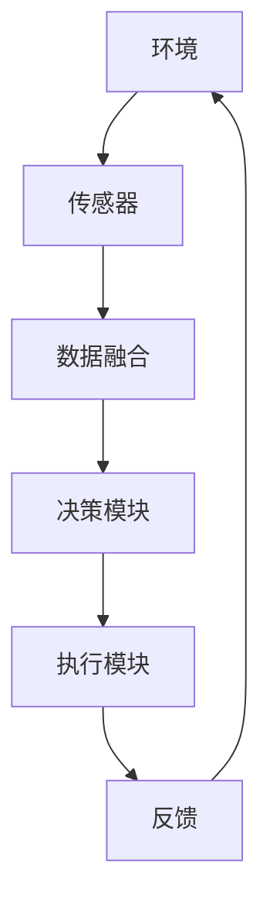
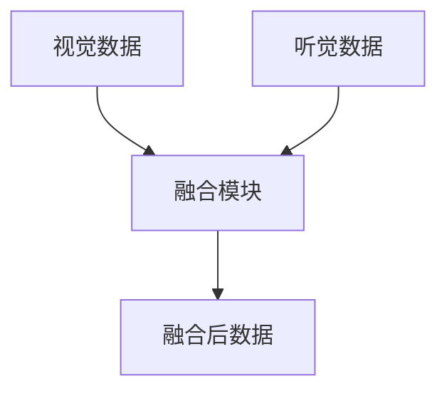
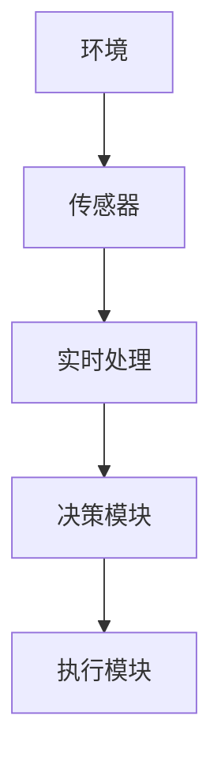
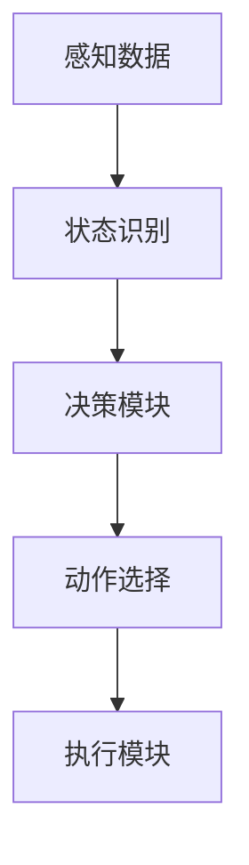
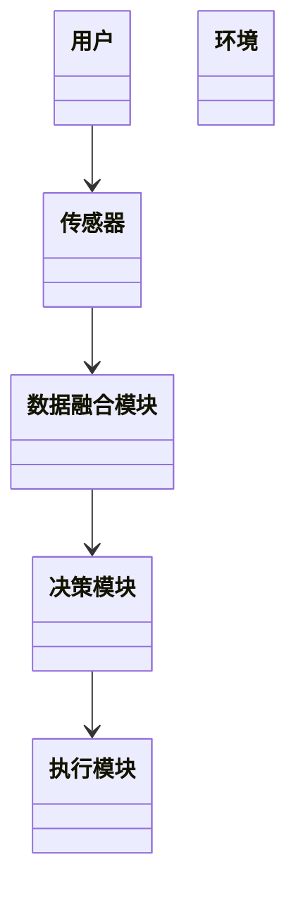
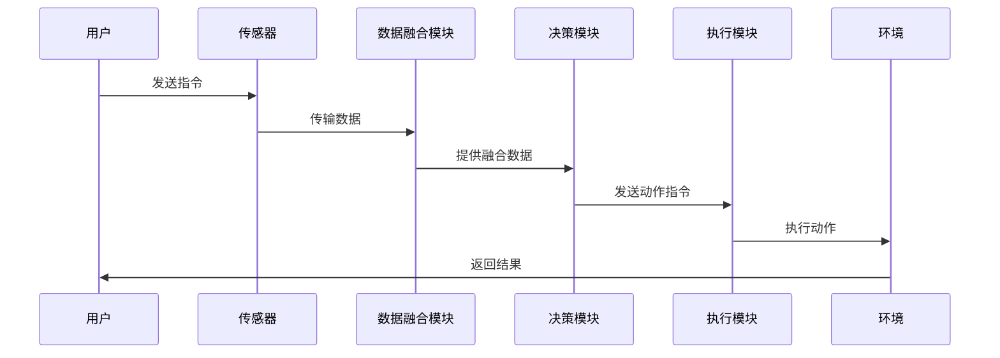

                 


# 《从零构建AI Agent的情境感知系统》

> 关键词：AI Agent, 情境感知系统, 多模态数据融合, 智能决策, 实时感知, 系统架构设计

> 摘要：  
本文将从零开始，系统地介绍AI Agent的情境感知系统的设计与实现。通过详细讲解核心概念、算法原理、系统架构设计以及实际项目案例，帮助读者全面理解并掌握如何构建一个高效的情境感知系统。文章内容涵盖从基础理论到实践应用的各个方面，适合AI开发者、研究人员以及对AI Agent感兴趣的读者阅读。

---

# 第1章: AI Agent与情境感知系统基础

## 1.1 AI Agent的基本概念

### 1.1.1 什么是AI Agent  
AI Agent（人工智能代理）是指能够感知环境、自主决策并执行任务的智能实体。它能够根据环境反馈调整行为，以实现特定目标。

### 1.1.2 AI Agent的核心特征  
- **自主性**：无需外部干预，自主完成任务。  
- **反应性**：能够实时感知环境并做出响应。  
- **目标导向**：所有行为均以实现特定目标为导向。  
- **学习能力**：能够通过经验改进性能。

### 1.1.3 情境感知系统的基本概念  
情境感知系统是指通过多模态数据（如视觉、听觉、文本等）实时感知环境状态，并理解当前情境的系统。

### 1.1.4 情境感知与AI Agent的关系  
情境感知是AI Agent实现自主决策的基础，AI Agent通过情境感知系统获取环境信息，从而做出更智能的决策。

### 1.1.5 情境感知系统的核心应用场景  
- 智能助手（如Siri、Alexa）  
- 智能驾驶  
- 智慧城市  
- 增强现实（AR）和虚拟现实（VR）  

## 1.2 情境感知系统的关键技术

### 1.2.1 多模态数据融合技术  
多模态数据融合是指将来自不同传感器（如摄像头、麦克风、GPS等）的数据进行融合，以提高感知的准确性和鲁棒性。

### 1.2.2 实时感知与响应机制  
实时感知是指系统能够快速处理环境数据并做出响应，通常需要高效的算法和低延迟的计算能力。

### 1.2.3 环境建模与动态更新  
环境建模是指将环境中的物体、场景等信息建模，动态更新则是指随着环境的变化实时更新模型。

### 1.2.4 智能决策与执行  
智能决策是指基于感知到的环境信息，通过算法做出最优决策，并通过执行机构（如机器人）完成任务。

## 1.3 当前AI Agent与情境感知系统的现状

### 1.3.1 学术研究进展  
近年来，学术界在多模态数据融合、实时感知算法、智能决策等方面取得了显著进展。

### 1.3.2 工业应用案例  
智能音箱、智能驾驶、智能安防等领域已经实现了情境感知系统的实际应用。

### 1.3.3 技术挑战与未来趋势  
- **技术挑战**：数据融合的准确性、实时性、鲁棒性等问题。  
- **未来趋势**：更加智能化、自主化，向人机协作方向发展。

## 1.4 本书的目标与结构

### 1.4.1 本书的核心目标  
通过系统化的讲解，帮助读者从零开始构建一个AI Agent的情境感知系统。

### 1.4.2 本书的章节安排  
- 第1章：基础概念与技术背景。  
- 第2章：核心概念与联系。  
- 第3章：算法原理。  
- 第4章：系统架构设计。  
- 第5章：项目实战与总结。  

### 1.4.3 学习本书的建议  
建议读者具备一定的AI基础，熟悉Python编程和基本的算法知识。

---

# 第2章: 情境感知系统的核心概念与联系

## 2.1 情境感知系统的实体关系分析

### 2.1.1 实体关系图（ER图）
以下是情境感知系统的ER图：

```mermaid
erdiagram
actor: 用户
agent: AI Agent
environment: 环境
sensors: 传感器
data: 数据
action: 行动
goal: 目标
```

### 2.1.2 系统实体的交互关系  
- 用户向AI Agent发送指令。  
- AI Agent通过传感器感知环境。  
- 根据感知到的数据，AI Agent做出决策并执行行动。  

### 2.1.3 实体关系的动态变化  
随着环境的变化，实体之间的关系也会动态调整。

## 2.2 核心概念的属性对比分析

### 2.2.1 情境感知与传统感知的区别

| 特性       | 情境感知                   | 传统感知                  |
|------------|----------------------------|---------------------------|
| 数据来源   | 多模态数据（视觉、听觉等）   | 单一数据来源              |
| 智能性     | 具有自主决策能力           | 仅完成数据采集            |
| 响应速度   | 实时响应                   | 延迟较高                  |

### 2.2.2 AI Agent与传统自动化的对比

| 特性       | AI Agent                     | 传统自动化                |
|------------|----------------------------|---------------------------|
| 智能性     | 具备学习和决策能力           | 仅执行预定义程序           |
| 灵活性     | 能够适应环境变化            | 灵活性较低                |
| 学习能力   | 具备学习能力                | 无学习能力                |

### 2.2.3 系统核心模块的功能对比

| 模块       | 输入                         | 输出                         |
|------------|------------------------------|------------------------------|
| 感知模块   | 多模态数据                   | 环境状态                     |
| 决策模块   | 环境状态                     | 行动策略                     |
| 执行模块   | 行动策略                     | 环境变化                     |

## 2.3 情境感知系统的动态架构

### 2.3.1 系统动态架构的Mermaid流程图  
以下是情境感知系统的动态架构图：



### 2.3.2 系统模块的交互关系  
- 环境通过传感器向数据融合模块提供数据。  
- 数据融合模块将多模态数据融合后传递给决策模块。  
- 决策模块根据融合后的数据做出决策，并将行动策略传递给执行模块。  
- 执行模块执行行动后，通过反馈机制将结果传递给环境。

### 2.3.3 动态架构的可扩展性分析  
动态架构允许根据需求添加或删除模块，具有较强的可扩展性。

---

# 第3章: 情境感知系统的算法原理

## 3.1 情境感知的核心算法

### 3.1.1 多模态数据融合算法

#### 3.1.1.1 数据融合流程  
以下是数据融合流程图：



#### 3.1.1.2 数据融合的数学模型  
融合多模态数据可以使用加权融合的方法，权重可以根据数据的置信度动态调整。公式如下：

$$ \text{融合后值} = \sum_{i=1}^{n} w_i x_i $$

其中，$w_i$ 是第$i$个数据的权重，$x_i$ 是第$i$个数据的值。

#### 3.1.1.3 代码实现  
以下是Python代码示例：

```python
def fuse_modalities(modalities, weights):
    return sum(w * m for w, m in zip(weights, modalities))
```

### 3.1.2 实时感知与响应算法

#### 3.1.2.1 实时感知流程  
以下是实时感知流程图：



#### 3.1.2.2 响应算法的数学模型  
响应算法可以通过概率图模型进行建模，公式如下：

$$ P(\text{动作} | \text{状态}) = \frac{P(\text{状态} | \text{动作}) P(\text{动作})}{P(\text{状态})} $$

#### 3.1.2.3 代码实现  
以下是Python代码示例：

```python
import numpy as np

def probability_action_given_state(state, actions):
    # 假设概率分布是均匀的
    return np.random.dirichlet([1]*len(actions), size=1)
```

### 3.1.3 智能决策算法

#### 3.1.3.1 决策流程  
以下是决策流程图：



#### 3.1.3.2 决策算法的数学模型  
决策算法可以使用强化学习中的Q-learning算法进行建模，公式如下：

$$ Q(s, a) = r + \gamma \max_{a'} Q(s', a') $$

其中，$s$ 是当前状态，$a$ 是当前动作，$r$ 是奖励，$\gamma$ 是折扣因子。

#### 3.1.3.3 代码实现  
以下是Python代码示例：

```python
class QLearning:
    def __init__(self, state_space, action_space, gamma=0.9):
        self.state_space = state_space
        self.action_space = action_space
        self.gamma = gamma
        self.Q = np.zeros((state_space, action_space))
    
    def update(self, state, action, reward, next_state):
        self.Q[state, action] = reward + self.gamma * np.max(self.Q[next_state])
```

---

# 第4章: 情境感知系统的系统架构设计

## 4.1 系统分析与架构设计方案

### 4.1.1 问题场景介绍  
我们假设需要构建一个智能家居中的情境感知系统，能够根据家庭成员的行为模式自动调节室内环境。

### 4.1.2 系统功能设计

#### 4.1.2.1 领域模型（Mermaid类图）  
以下是领域模型类图：



### 4.1.3 系统架构设计

#### 4.1.3.1 系统架构图（Mermaid架构图）  
以下是系统架构图：


### 4.1.4 系统接口设计

#### 4.1.4.1 接口交互关系  
以下是系统接口交互关系图：



---

# 第5章: 情境感知系统的项目实战

## 5.1 项目环境安装与配置

### 5.1.1 Python环境安装  
安装Python和必要的库（如numpy、pandas、mermaid等）。

### 5.1.2 开发工具配置  
配置IDE（如PyCharm、VS Code）和版本控制系统（如Git）。

## 5.2 系统核心实现

### 5.2.1 数据融合模块实现  
以下是数据融合模块的Python代码示例：

```python
def fuse_data(modalities, weights):
    return sum(w * d for w, d in zip(weights, modalities))
```

### 5.2.2 决策模块实现  
以下是决策模块的Python代码示例：

```python
def decide_action(state, actions, model):
    return model.predict(state)
```

### 5.2.3 执行模块实现  
以下是执行模块的Python代码示例：

```python
def execute_action(action):
    print(f"执行动作：{action}")
```

## 5.3 项目实战与案例分析

### 5.3.1 案例分析  
以智能家居为例，实现一个简单的环境调节系统。

### 5.3.2 代码实现  
以下是完整代码示例：

```python
import numpy as np

class Sensor:
    def __init__(self):
        self.data = None

class DataFuser:
    def __init__(self, weights):
        self.weights = weights

    def fuse(self, modalities):
        return sum(w * m for w, m in zip(self.weights, modalities))

class DecisionModel:
    def __init__(self):
        self.model = np.random.rand(1, 1)

    def predict(self, state):
        return "开空调" if state > 0.5 else "关空调"

class Executor:
    def execute(self, action):
        print(f"执行动作：{action}")

# 初始化模块
sensor = Sensor()
fuser = DataFuser(weights=[0.7, 0.3])
decision_model = DecisionModel()
executor = Executor()

# 模拟数据
sensor.data = [0.8, 0.2]
fused_data = fuser.fuse(sensor.data)
action = decision_model.predict(fused_data)
executor.execute(action)
```

## 5.4 项目总结与优化建议

### 5.4.1 项目总结  
通过本次实战，我们实现了从数据融合到决策执行的完整流程。

### 5.4.2 优化建议  
- 提高数据融合的准确性。  
- 优化决策算法的效率。  
- 增强系统的实时性。

---

# 第6章: 总结与展望

## 6.1 核心知识点回顾  
- AI Agent的基本概念与核心特征。  
- 情境感知系统的组成与关键算法。  
- 系统架构设计与实现。

## 6.2 未来趋势与挑战  
- 更加智能化和自主化的AI Agent。  
- 多模态数据融合的进一步优化。  
- 系统实时性和可靠性的提升。

## 6.3 最佳实践与注意事项  
- 在实际应用中，注重系统的可扩展性和可维护性。  
- 数据安全和隐私保护是需要重点关注的问题。  
- 结合具体场景，选择合适的算法和架构。

## 6.4 拓展阅读  
- 推荐阅读《强化学习导论》。  
- 推荐学习多模态数据融合的相关文献。

---

以上是《从零构建AI Agent的情境感知系统》的详细目录大纲，涵盖了从基础到实践的各个方面，适合技术博客文章的结构。

