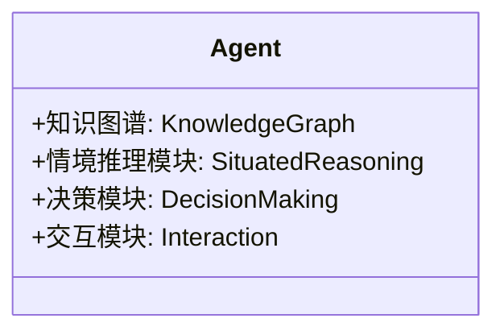
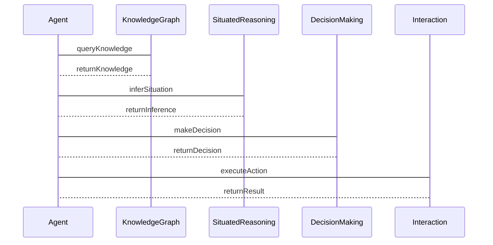

                 


# 从零构建AI Agent的情境推理能力

> 关键词：AI Agent, 情境推理, 知识图谱, 对话系统, 图神经网络, 强化学习

> 摘要：本文将从零开始，系统地介绍如何构建AI Agent的情境推理能力。文章首先阐述了AI Agent和情境推理的基本概念，然后详细讲解了情境推理的核心算法和数学模型，接着分析了系统架构设计与实现，最后通过项目实战和优化建议，帮助读者全面掌握AI Agent情境推理的能力构建方法。

---

## 第一部分: AI Agent与情境推理的背景与基础

### 第1章: AI Agent的基本概念与情境推理的定义

#### 1.1 AI Agent的定义与核心特征

##### 1.1.1 从传统AI到AI Agent的演进
人工智能（AI）经历了从专家系统到机器学习，再到深度学习的演变。AI Agent（智能体）是能够感知环境、做出决策并采取行动的实体。与传统AI不同，AI Agent具有更强的自主性和适应性。

##### 1.1.2 AI Agent的核心特征与分类
AI Agent的核心特征包括自主性、反应性、目标导向和社交能力。根据应用场景，AI Agent可以分为简单反射型、基于模型的反应型、目标驱动型和效用驱动型。

##### 1.1.3 情境推理的定义与重要性
情境推理是指AI Agent在特定情境下，结合环境信息和已有知识，理解情境、推导可能的行动及其后果的能力。它是AI Agent实现智能决策的关键。

#### 1.2 情境推理的基本原理

##### 1.2.1 情境推理的三要素模型
情境推理的三要素模型包括环境、目标和行动。AI Agent需要在环境中理解当前状态，明确目标，并选择合适的行动。

##### 1.2.2 情境推理的层次结构
情境推理可以分为感知层、理解层和决策层。感知层负责获取环境信息，理解层对信息进行解析和建模，决策层基于模型做出决策。

##### 1.2.3 情境推理与知识表示的关系
知识表示是情境推理的基础。通过知识图谱等表示方法，AI Agent能够更好地理解环境和任务。

### 第2章: 情境推理的关键技术与相关概念

#### 2.1 知识图谱与情境推理

##### 2.1.1 知识图谱的定义与构建方法
知识图谱是一种图结构，由节点（实体）和边（关系）组成。构建知识图谱需要进行数据抽取、实体识别和关系抽取。

##### 2.1.2 知识图谱在情境推理中的应用
知识图谱为情境推理提供了丰富的语义信息，帮助AI Agent理解任务背景和可能的行动后果。

##### 2.1.3 知识图谱与情境推理的关系
知识图谱是情境推理的重要支撑，情境推理则通过动态更新知识图谱，增强知识表示的灵活性。

#### 2.2 对话系统与情境推理

##### 2.2.1 对话系统的定义与分类
对话系统分为基于规则和基于模型的两类。基于模型的对话系统利用机器学习技术，能够更好地理解上下文。

##### 2.2.2 情境推理在对话系统中的作用
情境推理帮助对话系统理解用户意图，并根据上下文生成合适的回复。

##### 2.2.3 基于情境推理的对话系统设计
通过结合知识图谱和对话历史，情境推理能够提升对话系统的理解和生成能力。

#### 2.3 视觉推理与情境推理

##### 2.3.1 视觉推理的定义与应用
视觉推理是基于视觉信息进行推理的能力，广泛应用于图像识别和视频分析。

##### 2.3.2 情境推理在视觉任务中的作用
情境推理帮助AI Agent理解视觉信息中的语义关系，提升视觉任务的准确性和理解能力。

##### 2.3.3 基于视觉的情境推理技术
通过结合视觉数据和上下文信息，情境推理能够实现更复杂的视觉任务，如场景理解。

### 第3章: 情境推理的核心算法与数学模型

#### 3.1 图神经网络与情境推理

##### 3.1.1 图神经网络的基本原理
图神经网络是一种处理图结构数据的深度学习方法。它通过节点之间的关系，传播信息，更新节点表示。

##### 3.1.2 图神经网络在情境推理中的应用
图神经网络常用于知识图谱嵌入、关系推理和图结构数据的分类任务。

##### 3.1.3 基于图神经网络的情境推理模型
情境推理可以通过构建知识图谱，并利用图神经网络进行节点嵌入，进而进行关系推理和预测。

#### 3.2 注意力机制与情境推理

##### 3.2.1 注意力机制的基本原理
注意力机制通过计算输入序列中每个位置的重要性权重，聚焦关键信息。

##### 3.2.2 注意力机制在情境推理中的应用
注意力机制常用于对话系统和视觉任务，帮助模型聚焦重要信息。

##### 3.2.3 基于注意力机制的情境推理模型
通过结合注意力机制和图神经网络，情境推理模型能够更好地理解上下文关系。

#### 3.3 强化学习与情境推理

##### 3.3.1 强化学习的基本原理
强化学习通过智能体与环境的交互，学习最优策略，以最大化累积奖励。

##### 3.3.2 强化学习在情境推理中的应用
强化学习常用于动态环境中的决策问题，帮助AI Agent做出最优选择。

##### 3.3.3 基于强化学习的情境推理模型
情境推理可以通过强化学习框架，结合环境反馈，动态更新策略，提升决策能力。

---

## 第二部分: 情境推理算法的实现与优化

### 第4章: 情境推理算法的实现细节

#### 4.1 情境推理算法的实现步骤

##### 4.1.1 数据预处理与特征提取
数据预处理包括清洗和标准化，特征提取则需要从知识图谱中抽取相关实体和关系。

##### 4.1.2 知识表示与图构建
通过知识图谱构建图结构，节点表示可以利用图神经网络进行嵌入。

##### 4.1.3 模型训练与优化
训练过程中，利用监督学习或强化学习方法，优化模型参数，提升推理准确率。

#### 4.2 基于图神经网络的实现代码

##### 4.2.1 图神经网络的实现
```python
import tensorflow as tf
from tensorflow.keras import layers

class Graph Neural Network:
    def __init__(self, input_dim):
        self.embeddings = layers.Dense(input_dim, activation='relu')
        self.attention = layers.Attention()
        
    def call(self, inputs):
        x = self.embeddings(inputs)
        x = self.attention(x)
        return x
```

##### 4.2.2 情境推理模型的实现
```python
class SituatedReasoningModel:
    def __init__(self, graph, embeddings):
        self.graph = graph
        self.embeddings = embeddings
        self.model = self.build_model()
        
    def build_model(self):
        input_node = layers.Input(shape=(None, 100))
        input_relation = layers.Input(shape=(None, 100))
        x_node = self.graph(input_node)
        x_relation = self.graph(input_relation)
        x = layers.Concatenate()([x_node, x_relation])
        x = layers.Dense(200, activation='relu')(x)
        x = layers.Dropout(0.5)(x)
        x = layers.Dense(1, activation='sigmoid')(x)
        return tf.keras.Model(inputs=[input_node, input_relation], outputs=x)
```

#### 4.3 情境推理算法的数学模型

##### 4.3.1 图神经网络的数学模型
图神经网络的基本公式如下：
$$ h_v^{(k+1)} = \sigma\left(\sum_{u \in N(v)} \frac{1}{|N(v)|} W h_u^{(k)}\right) $$
其中，$h_v$ 是节点v的表示，$N(v)$ 是v的邻居节点，$\sigma$ 是激活函数。

##### 4.3.2 注意力机制的数学模型
注意力机制的计算公式为：
$$ \alpha_i = \text{softmax}(W_q q^T W_k k) $$
其中，$q$ 是查询向量，$k$ 是键向量，$W_q$ 和 $W_k$ 是参数矩阵。

##### 4.3.3 强化学习的数学模型
强化学习的值函数定义为：
$$ V(s) = \max_a Q(s, a) $$
其中，$s$ 是状态，$a$ 是动作，$Q$ 是Q值函数。

### 第5章: 系统架构设计与实现

#### 5.1 系统模块划分

##### 5.1.1 模块划分
系统主要模块包括：知识图谱构建模块、情境推理模块、决策模块和交互模块。

#### 5.2 系统功能设计

##### 5.2.1 领域模型设计


#### 5.3 系统架构设计

##### 5.3.1 系统架构图
```mermaid
graph TD
    Agent -> KnowledgeGraph: 查询知识
    Agent -> SituatedReasoning: 推理情境
    SituatedReasoning -> DecisionMaking: 生成决策
    DecisionMaking -> Interaction: 执行行动
```

#### 5.4 系统接口设计

##### 5.4.1 接口定义
主要接口包括：`queryKnowledge`, `inferSituation`, `makeDecision`, `executeAction`。

#### 5.5 系统交互流程

##### 5.5.1 交互流程图


---

## 第三部分: 项目实战与优化建议

### 第6章: 项目实战

#### 6.1 环境配置

##### 6.1.1 环境需求
需要安装TensorFlow、Keras、NetworkX和Python 3.8及以上版本。

#### 6.2 系统核心实现

##### 6.2.1 知识图谱构建
```python
import networkx as nx

G = nx.DiGraph()
G.add_nodes_from(['A', 'B', 'C'])
G.add_edges_from([('A', 'B'), ('B', 'C')])
```

##### 6.2.2 情境推理实现
```python
def infer_situation(G):
    for node in G.nodes():
        for neighbor in G.neighbors(node):
            print(f"{node} -> {neighbor}")
```

#### 6.3 案例分析与实现

##### 6.3.1 案例分析
假设有一个简单的知识图谱，包含节点A、B、C，关系A→B，B→C。情境推理任务是推断从A到C的关系。

##### 6.3.2 代码实现
```python
G = nx.DiGraph()
G.add_nodes_from(['A', 'B', 'C'])
G.add_edges_from([('A', 'B'), ('B', 'C')])
infer_situation(G)
```

##### 6.3.3 实验结果
输出：
```
A -> B
B -> C
```

#### 6.4 项目总结

##### 6.4.1 总结
通过简单案例，展示了情境推理的基本实现方法。

### 第7章: 优化建议与未来展望

#### 7.1 优化建议

##### 7.1.1 知识图谱优化
增加知识图谱的深度和广度，提升情境推理的准确性。

##### 7.1.2 算法优化
采用更先进的图神经网络和注意力机制，提升模型性能。

#### 7.2 未来展望

##### 7.2.1 新技术展望
结合大语言模型和多模态数据，进一步提升AI Agent的情境推理能力。

##### 7.2.2 应用场景扩展
将AI Agent应用于更多领域，如智能助手、自动驾驶等。

---

## 第四部分: 最佳实践与小结

### 第8章: 最佳实践与小结

#### 8.1 最佳实践

##### 8.1.1 数据质量的重要性
确保知识图谱的数据质量和完整性，是提升情境推理能力的关键。

##### 8.1.2 模型选择的策略
根据具体任务需求，选择合适的算法和模型，避免过度复杂化。

#### 8.2 小结

##### 8.2.1 总结
从零开始构建AI Agent的情境推理能力，需要结合知识图谱、图神经网络和强化学习等多种技术，实现复杂任务的智能决策。

##### 8.2.2 展望
随着技术的发展，AI Agent的情境推理能力将更加智能化和多样化，为更多领域带来创新和变革。

---

## 附录

### 附录A: 术语表

- **AI Agent**：人工智能代理，能够感知环境、做出决策并采取行动的实体。
- **情境推理**：AI Agent在特定情境下，理解环境信息并做出决策的能力。
- **知识图谱**：一种图结构，由实体和关系组成，用于表示知识。
- **图神经网络**：处理图结构数据的深度学习方法，用于节点嵌入和关系推理。
- **强化学习**：通过与环境交互，学习最优策略的机器学习方法。

### 附录B: 参考文献

1. 维基百科：人工智能代理
2. 图神经网络综述
3. 强化学习经典论文

---

通过以上思考过程，我们可以系统地构建AI Agent的情境推理能力，从基础概念到算法实现，再到系统设计和项目实战，逐步掌握这一复杂而有趣的技术领域。

