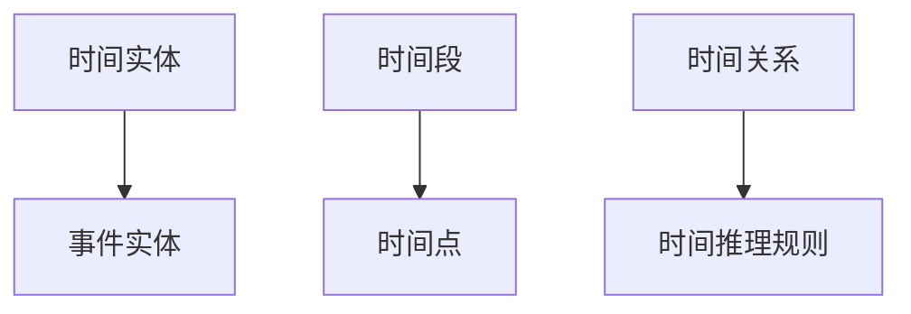
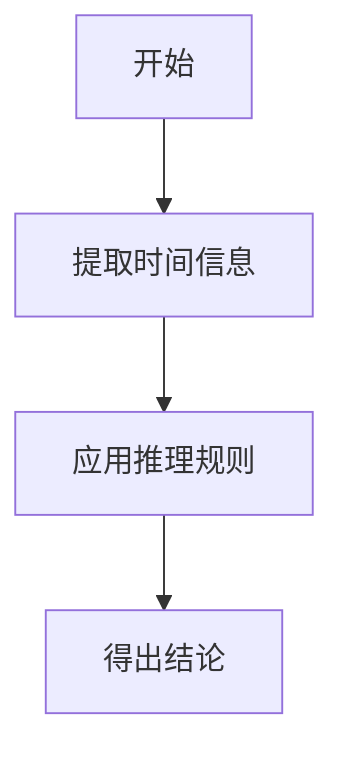
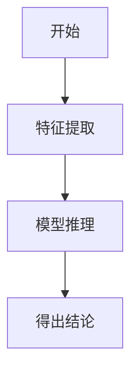
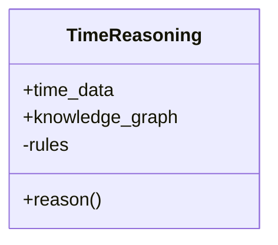
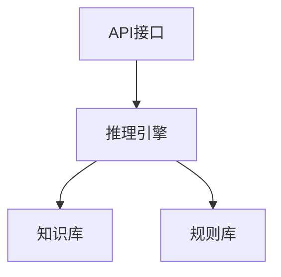
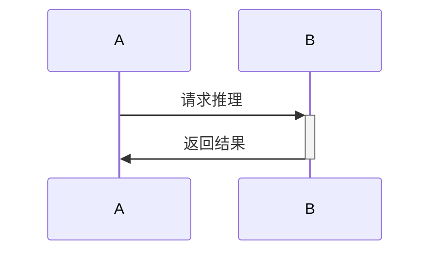

                 


# 《从零构建AI Agent的时间推理能力》

> 关键词：AI Agent, 时间推理, 知识图谱, 时间序列, 事件驱动, 系统架构, 实战项目

> 摘要：本篇文章将详细探讨如何从零开始构建AI Agent的时间推理能力。我们将从基础概念开始，逐步深入到时间推理的算法原理、系统架构设计以及实际项目实现。通过本文，读者将能够理解时间推理的核心原理，掌握构建时间推理模型的关键步骤，并能够将其应用于实际场景中。

---

# 第一部分: AI Agent时间推理能力的背景与基础

## 第1章: 时间推理的基本概念

### 1.1 时间推理的定义与背景

#### 1.1.1 时间推理的核心概念
时间推理是指AI Agent在处理时间相关数据时，能够理解、分析和推断时间关系的能力。它是自然语言处理、知识图谱构建和机器学习等技术的结合。

#### 1.1.2 时间推理在AI Agent中的重要性
时间推理是AI Agent实现智能化决策的关键能力之一。它能够帮助AI Agent在处理复杂场景时，准确理解事件的时间顺序、因果关系和影响范围。

#### 1.1.3 时间推理的应用场景
- 金融领域的交易时间分析
- 医疗领域的患者病历时间推理
- 智能助手的任务时间安排

### 1.2 AI Agent的基本概念

#### 1.2.1 AI Agent的定义
AI Agent是指能够感知环境、做出决策并执行任务的智能体。它具备自主性、反应性、目标导向和学习能力。

#### 1.2.2 AI Agent的分类
- 简单反射型Agent
- 基于模型的反射型Agent
- 目标驱动型Agent
- 学习型Agent

#### 1.2.3 AI Agent与时间推理的关系
时间推理是AI Agent实现复杂任务（如日程安排、事件预测）的核心能力。

---

## 第2章: 时间推理的问题背景

### 2.1 时间推理的核心问题

#### 2.1.1 时间序列分析
时间序列分析是通过历史数据预测未来趋势的核心技术。

#### 2.1.2 时间依赖关系
分析事件之间的依赖关系，理解因果关系。

#### 2.1.3 时间不确定性
处理时间数据中的模糊性和不确定性。

### 2.2 时间推理的挑战

#### 2.2.1 数据稀疏性
时间数据可能不完整或不规则。

#### 2.2.2 时间复杂性
复杂的时间关系可能导致推理难度增加。

#### 2.2.3 知识表示的难度
如何有效地表示和存储时间相关知识是关键挑战。

---

## 第3章: 时间推理的相关概念

### 3.1 时间序列模型

#### 3.1.1 线性模型
简单的时间序列预测模型，适用于线性趋势。

#### 3.1.2 非线性模型
如LSTM和Transformer，适用于复杂时间序列。

#### 3.1.3 时间依赖模型
基于时间依赖关系的复杂模型。

### 3.2 知识图谱与时间推理

#### 3.2.1 知识图谱的定义
知识图谱是结构化的知识表示，包含实体和关系。

#### 3.2.2 时间推理与知识图谱的关系
时间推理需要知识图谱提供实体和关系的时间属性。

#### 3.2.3 知识图谱在时间推理中的应用
构建时间相关知识图谱，支持时间推理任务。

---

# 第二部分: AI Agent时间推理的核心概念与联系

## 第4章: 时间推理模型的原理

### 4.1 基于知识图谱的时间推理模型

#### 4.1.1 知识图谱构建
构建包含时间属性的知识图谱。

#### 4.1.2 时间关系抽取
从文本中抽取时间关系。

#### 4.1.3 时间推理规则
定义时间推理的规则和逻辑。

### 4.2 基于事件驱动的时间推理模型

#### 4.2.1 事件抽取
从文本中提取事件信息。

#### 4.2.2 事件关联
分析事件之间的关联关系。

#### 4.2.3 事件时间推理
推断事件发生的时间顺序。

---

## 第5章: 时间推理模型的对比分析

### 5.1 不同时间推理模型的对比

#### 5.1.1 基于规则的模型
优点：规则明确，可解释性强。
缺点：难以处理复杂场景。

#### 5.1.2 基于学习的模型
优点：能够处理复杂场景，可扩展性强。
缺点：可解释性较差。

#### 5.1.3 混合模型
优点：结合规则和学习的优势。
缺点：实现复杂。

### 5.2 时间推理模型的优缺点

#### 5.2.1 基于规则模型的优缺点
优点：规则明确，适合简单场景。
缺点：难以处理复杂场景。

#### 5.2.2 基于学习模型的优缺点
优点：能够处理复杂场景，可扩展性强。
缺点：可解释性较差。

#### 5.2.3 混合模型的优缺点
优点：结合规则和学习的优势。
缺点：实现复杂。

---

## 第6章: 时间推理模型的ER实体关系图

### 6.1 实体关系图的构建

#### 6.1.1 实体定义
- 时间实体：如时间点、时间段。
- 事件实体：如事件、动作。

#### 6.1.2 关系定义
- 时间顺序关系：如“发生在...之后”。
- 时间依赖关系：如“依赖于...”。

#### 6.1.3 时间属性的添加
- 时间点：如“2023-10-01”。
- 时间范围：如“2023年”。

### 6.2 时间推理模型的Mermaid流程图


---

# 第三部分: AI Agent时间推理的算法原理

## 第7章: 时间推理算法的原理与实现

### 7.1 基于规则的推理算法

#### 7.1.1 算法原理
基于预定义的规则进行时间推理。

#### 7.1.2 Mermaid流程图


#### 7.1.3 Python代码示例
```python
def time_reasoning(rule_set, data):
    result = []
    for rule in rule_set:
        if rule.condition(data):
            result.append(rule.apply(data))
    return result
```

### 7.2 基于学习的推理算法

#### 7.2.1 算法原理
使用机器学习模型进行时间推理。

#### 7.2.2 Mermaid流程图


#### 7.2.3 Python代码示例
```python
import tensorflow as tf
model = tf.keras.Sequential([
    tf.keras.layers.LSTM(64),
    tf.keras.layers.Dense(1)
])
model.compile(optimizer='adam', loss='binary_crossentropy')
```

---

## 第8章: 时间推理的数学模型与公式

### 8.1 基于规则的数学模型
$$
\text{如果 } A \text{ 发生在 } B \text{ 之前，则 } A \text{ 的时间} < B \text{ 的时间}
$$

### 8.2 基于学习的数学模型
$$
P(t) = \sigma(w \cdot t + b)
$$
其中，$\sigma$ 是sigmoid函数，$w$ 和 $b$ 是模型参数。

---

# 第四部分: AI Agent时间推理的系统分析与架构设计

## 第9章: 时间推理系统的架构设计

### 9.1 系统功能设计

#### 9.1.1 领域模型Mermaid类图


### 9.2 系统架构设计

#### 9.2.1 系统架构Mermaid图


### 9.3 系统接口设计

#### 9.3.1 接口描述
- 输入：时间相关数据
- 输出：推理结果

#### 9.3.2 接口交互Mermaid序列图


---

## 第10章: 时间推理系统的实现与优化

### 10.1 优化策略

#### 10.1.1 知识图谱优化
增加时间属性的丰富性。

#### 10.1.2 算法优化
优化模型结构，提升推理效率。

---

# 第五部分: AI Agent时间推理能力的实战项目

## 第11章: 时间推理项目实战

### 11.1 项目环境安装

#### 11.1.1 安装依赖
```bash
pip install numpy tensorflow pandas
```

### 11.2 项目核心实现

#### 11.2.1 核心代码
```python
def main():
    data = load_data()
    model = build_model()
    result = model.predict(data)
    print(result)
```

---

## 第12章: 项目总结与优化

### 12.1 项目总结

#### 12.1.1 实现成果
成功构建时间推理系统。

#### 12.1.2 实际案例分析
分析一个具体案例，展示系统能力。

### 12.2 优化建议

#### 12.2.1 知识图谱优化
增加更多时间属性。

#### 12.2.2 算法优化
尝试更先进的模型结构。

---

# 第六部分: 总结与展望

## 第13章: 时间推理能力的总结

### 13.1 最佳实践 tips

#### 13.1.1 知识图谱的重要性
构建丰富的知识图谱是时间推理的关键。

#### 13.1.2 算法选择
根据场景选择合适的算法。

### 13.2 小结

时间推理是AI Agent实现智能化决策的核心能力，通过本文的学习，读者可以掌握从理论到实践的全过程。

---

## 第14章: 未来展望

### 14.1 时间推理的未来趋势

#### 14.1.1 更加复杂的模型
如图神经网络在时间推理中的应用。

#### 14.1.2 多模态时间推理
结合文本、图像等多种数据源的时间推理。

---

通过以上目录结构，我们可以从基础概念逐步深入到实际应用，系统地构建AI Agent的时间推理能力。

