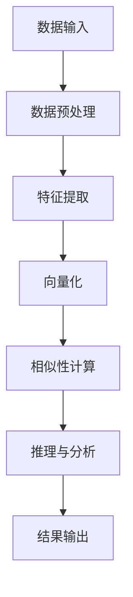

                 


# 从零构建AI Agent的类比推理系统

## 关键词：AI Agent, 类比推理, 知识图谱, 深度学习, 自然语言处理

## 摘要：本文将详细探讨如何从零开始构建一个基于类比推理的AI Agent系统。首先，我们将介绍类比推理的基本概念和其在AI Agent中的作用。接着，我们将深入分析类比推理的数学模型和算法原理，并通过具体案例展示如何实现这些算法。最后，我们将设计系统的架构，并通过项目实战来验证我们的方法。本文将为读者提供一个全面的视角，从理论到实践，逐步构建一个高效的AI Agent类比推理系统。

---

## 第1章: 背景介绍与问题背景

### 1.1 问题背景

#### 1.1.1 从传统AI到AI Agent的演进
人工智能（AI）技术在过去几十年里经历了巨大的发展，从传统的基于规则的专家系统到现代的深度学习模型，AI的应用场景不断扩大。AI Agent作为一类特殊的AI系统，能够自主感知环境并采取行动以实现目标。与传统AI系统相比，AI Agent更加注重动态环境中的自主决策和交互能力。

#### 1.1.2 类比推理的定义与特点
类比推理是一种通过比较不同事物之间的相似性来进行推理的方法。它基于“如果A与B在某些方面相似，那么A在其他方面也可能与B相似”的逻辑。类比推理具有以下特点：
- **相似性驱动**：依赖于对象之间的相似性特征。
- **非形式化**：推理过程更多基于经验或常识，而非严格的逻辑规则。
- **灵活性**：能够处理模糊和不完全的信息。

#### 1.1.3 当前AI Agent类比推理的挑战与机遇
随着AI技术的快速发展，类比推理在AI Agent中的应用面临新的挑战和机遇：
- **挑战**：如何在动态和不确定的环境中准确捕捉相似性特征；如何处理高维数据中的冗余信息；如何提高推理的效率和准确性。
- **机遇**：类比推理在自然语言处理、图像识别等领域展现出巨大潜力；深度学习技术的进步为类比推理提供了新的工具和方法。

### 1.2 问题描述

#### 1.2.1 AI Agent类比推理的核心问题
AI Agent的类比推理系统需要解决的核心问题包括：
- **特征提取**：如何有效地从输入数据中提取有用的特征，以便进行相似性比较。
- **相似性计算**：如何计算对象之间的相似性，常用的方法包括余弦相似度、欧氏距离等。
- **推理引擎**：如何基于相似性计算结果进行推理，生成合理的输出。

#### 1.2.2 类比推理在AI Agent中的作用
类比推理在AI Agent中起到了关键作用：
- **信息处理**：帮助AI Agent理解和处理复杂的信息，尤其是当信息不完整或模糊时。
- **决策支持**：通过类比推理，AI Agent可以借鉴类似情境下的经验，辅助决策。
- **知识扩展**：类比推理能够帮助AI Agent从现有知识中推断新的知识。

#### 1.2.3 问题解决的必要性与可行性
- **必要性**：在动态和不确定的环境中，AI Agent需要灵活地处理信息，类比推理提供了有效的解决方案。
- **可行性**：随着深度学习和自然语言处理技术的进步，构建高效的类比推理系统成为可能。

### 1.3 问题解决与边界

#### 1.3.1 解决问题的方法与思路
构建AI Agent的类比推理系统，可以采用以下方法：
- **基于向量的相似度计算**：将对象表示为向量，计算向量间的相似度。
- **基于知识图谱的推理**：利用知识图谱中的关系进行类比推理。
- **混合方法**：结合多种推理方法，提高系统的准确性和效率。

#### 1.3.2 边界与外延
- **边界**：类比推理仅适用于具有明确相似性特征的场景，无法处理完全不相关的信息。
- **外延**：类比推理可以与其他推理方法（如逻辑推理、归纳推理）结合，拓展应用范围。

#### 1.3.3 核心要素与组成结构
类比推理系统的核心要素包括：
- **特征提取模块**：提取对象的关键特征。
- **相似性计算模块**：计算对象间的相似度。
- **推理引擎**：基于相似性结果进行推理，生成输出。

---

## 第2章: 核心概念与类比推理原理

### 2.1 类比推理的核心概念

#### 2.1.1 类比推理的基本原理
类比推理的基本原理是通过比较两个对象的相似性，推断它们在其他方面的相似性。例如：
- 如果A和B在属性X上相似，那么A和B在属性Y上也可能相似。

#### 2.1.2 类比推理的关键特征
类比推理的关键特征包括：
- **相似性**：对象之间的相似性是推理的基础。
- **推理目标**：通过相似性推断出新的属性或关系。
- **不确定性**：推理结果可能存在不确定性，依赖于相似性的程度。

#### 2.1.3 类比推理与逻辑推理的对比
以下是类比推理与逻辑推理的对比表格：

| 特性                | 类比推理                              | 逻辑推理                              |
|---------------------|-------------------------------------|---------------------------------------|
| 基础                | 相似性                               | 逻辑规则和事实                        |
| 推理方式            | 基于经验或常识                       | 基于严格的逻辑规则                  |
| 确定性              | 低                                   | 高                                     |
| 应用场景            | 模糊和不确定的场景                   | 确定性的逻辑问题                     |

#### 2.1.4 类比推理的ER实体关系图
以下是类比推理的ER实体关系图：

```mermaid
er
    entity(Comparison) {
        id: int
        similarity_score: float
    }
    entity(Agent) {
        id: int
        name: string
    }
    entity(Relationship) {
        id: int
        type: string
    }
    relationship(Agent)-[has]->Comparison
    relationship(Agent)-[has]->Relationship
```

### 2.2 类比推理的数学模型

#### 2.2.1 类比推理的数学表达式
类比推理可以通过向量空间模型来表示。假设我们有两个对象A和B，它们的向量表示分别为\( \vec{A} \)和\( \vec{B} \)。相似性可以通过余弦相似度计算：

$$
\text{similarity}(A, B) = \frac{\vec{A} \cdot \vec{B}}{||\vec{A}|| \cdot ||\vec{B}||}
$$

#### 2.2.2 类比推理的公式推导
类比推理的公式推导可以通过以下步骤进行：
1. 计算两个对象的向量表示。
2. 计算向量的点积和模长。
3. 计算余弦相似度。

#### 2.2.3 类比推理的算法实现
以下是基于向量的类比推理算法实现：

```python
import numpy as np

def compute_similarity(vector_A, vector_B):
    # 计算点积
    dot_product = np.dot(vector_A, vector_B)
    # 计算向量A和B的模长
    norm_A = np.linalg.norm(vector_A)
    norm_B = np.linalg.norm(vector_B)
    # 计算余弦相似度
    similarity = dot_product / (norm_A * norm_B)
    return similarity

# 示例
vector_A = np.array([1, 2, 3])
vector_B = np.array([2, 4, 6])
similarity = compute_similarity(vector_A, vector_B)
print("相似度:", similarity)
```

### 2.3 类比推理的算法原理

#### 2.3.1 基于向量的相似度计算
基于向量的相似度计算是类比推理的一种常见方法。通过将对象表示为向量，计算向量之间的相似度，从而实现类比推理。

#### 2.3.2 基于知识图谱的推理
基于知识图谱的推理方法利用知识图谱中的关系进行类比推理。例如，如果A是B的一种，那么B的属性可以推断为A的属性。

#### 2.3.3 混合方法
混合方法结合了多种推理方法，提高了系统的准确性和效率。例如，结合基于向量的相似度计算和知识图谱推理。

---

## 第3章: 算法原理与实现

### 3.1 选择合适的类比推理算法

#### 3.1.1 基于向量的相似度计算
基于向量的相似度计算是类比推理的一种常见方法。通过将对象表示为向量，计算向量之间的相似度，从而实现类比推理。

#### 3.1.2 基于知识图谱的推理
基于知识图谱的推理方法利用知识图谱中的关系进行类比推理。例如，如果A是B的一种，那么B的属性可以推断为A的属性。

#### 3.1.3 混合方法
混合方法结合了多种推理方法，提高了系统的准确性和效率。例如，结合基于向量的相似度计算和知识图谱推理。

### 3.2 实现步骤

#### 3.2.1 数据预处理
数据预处理是构建类比推理系统的第一步。需要对数据进行清洗、标注和格式化处理，确保数据的质量和一致性。

#### 3.2.2 模型训练
模型训练是构建类比推理系统的核心步骤。需要选择合适的算法，设计模型结构，并进行训练优化。

#### 3.2.3 推理与测试
在模型训练完成后，需要进行推理和测试，验证系统的正确性和效率。通过测试用例，分析系统的优缺点，并进行优化。

### 3.3 代码实现

#### 3.3.1 环境安装
构建类比推理系统需要安装以下环境：
- Python 3.6+
- numpy
- scikit-learn
- matplotlib

#### 3.3.2 核心代码实现
以下是基于向量的类比推理算法实现：

```python
import numpy as np
from sklearn.metrics.pairwise import cosine_similarity

def compute_similarity(matrix):
    # 计算余弦相似度
    similarity_matrix = cosine_similarity(matrix)
    return similarity_matrix

# 示例
matrix = np.array([[1, 2, 3],
                   [4, 5, 6],
                   [7, 8, 9]])
similarity_matrix = compute_similarity(matrix)
print("相似度矩阵:\n", similarity_matrix)
```

### 3.4 测试与优化

#### 3.4.1 测试用例设计
设计合理的测试用例，验证系统的正确性和效率。例如，测试系统的相似度计算是否准确，推理结果是否合理。

#### 3.4.2 性能优化
通过优化算法和数据结构，提高系统的运行效率。例如，使用更高效的相似度计算方法，减少计算复杂度。

---

## 第4章: 系统架构设计与实现

### 4.1 系统架构设计

#### 4.1.1 问题场景介绍
类比推理系统需要处理多种类型的数据，包括文本、图像等。系统架构需要能够适应不同的输入格式和应用场景。

#### 4.1.2 系统功能设计
类比推理系统的功能设计包括：
- 数据输入与处理
- 特征提取与向量化
- 相似性计算与推理
- 结果输出与展示

#### 4.1.3 系统架构图
以下是类比推理系统的架构图：



### 4.2 系统实现

#### 4.2.1 数据预处理
数据预处理是构建类比推理系统的第一步。需要对数据进行清洗、标注和格式化处理，确保数据的质量和一致性。

#### 4.2.2 特征提取与向量化
特征提取与向量化是将数据转换为向量表示的过程。常用的方法包括Word2Vec、TF-IDF等。

#### 4.2.3 相似性计算与推理
相似性计算与推理是类比推理的核心步骤。通过计算向量的相似度，进行类比推理，生成推理结果。

#### 4.2.4 结果输出与展示
结果输出与展示是将推理结果以用户友好的方式呈现的过程。可以通过可视化工具展示相似性矩阵和推理结果。

### 4.3 代码实现

#### 4.3.1 环境安装
构建类比推理系统需要安装以下环境：
- Python 3.6+
- numpy
- scikit-learn
- matplotlib

#### 4.3.2 核心代码实现
以下是类比推理系统的代码实现：

```python
import numpy as np
from sklearn.metrics.pairwise import cosine_similarity

def compute_similarity(matrix):
    # 计算余弦相似度
    similarity_matrix = cosine_similarity(matrix)
    return similarity_matrix

# 示例
matrix = np.array([[1, 2, 3],
                   [4, 5, 6],
                   [7, 8, 9]])
similarity_matrix = compute_similarity(matrix)
print("相似度矩阵:\n", similarity_matrix)

# 可视化相似度矩阵
import matplotlib.pyplot as plt

plt.imshow(similarity_matrix, cmap='hot', interpolation='nearest')
plt.colorbar()
plt.title('Similarity Matrix')
plt.show()
```

### 4.4 测试与优化

#### 4.4.1 测试用例设计
设计合理的测试用例，验证系统的正确性和效率。例如，测试系统的相似度计算是否准确，推理结果是否合理。

#### 4.4.2 性能优化
通过优化算法和数据结构，提高系统的运行效率。例如，使用更高效的相似度计算方法，减少计算复杂度。

---

## 第5章: 项目实战与案例分析

### 5.1 项目实战

#### 5.1.1 环境安装
构建类比推理系统需要安装以下环境：
- Python 3.6+
- numpy
- scikit-learn
- matplotlib

#### 5.1.2 核心代码实现
以下是类比推理系统的代码实现：

```python
import numpy as np
from sklearn.metrics.pairwise import cosine_similarity

def compute_similarity(matrix):
    # 计算余弦相似度
    similarity_matrix = cosine_similarity(matrix)
    return similarity_matrix

# 示例
matrix = np.array([[1, 2, 3],
                   [4, 5, 6],
                   [7, 8, 9]])
similarity_matrix = compute_similarity(matrix)
print("相似度矩阵:\n", similarity_matrix)

# 可视化相似度矩阵
import matplotlib.pyplot as plt

plt.imshow(similarity_matrix, cmap='hot', interpolation='nearest')
plt.colorbar()
plt.title('Similarity Matrix')
plt.show()
```

### 5.2 案例分析

#### 5.2.1 案例选择
选择合适的案例，展示类比推理系统的应用和效果。例如，使用文本数据进行类比推理，展示系统的相似度计算和推理结果。

#### 5.2.2 案例分析
通过具体案例，分析系统的优缺点，提出改进建议，并展望未来的发展方向。

---

## 第6章: 总结与展望

### 6.1 总结
本文详细探讨了从零构建AI Agent类比推理系统的方法和步骤，包括核心概念、算法原理、系统架构设计和项目实战。通过理论与实践的结合，展示了如何构建一个高效的类比推理系统。

### 6.2 展望
未来，随着深度学习和自然语言处理技术的进一步发展，类比推理在AI Agent中的应用将更加广泛和深入。可以通过优化算法、引入新的推理方法（如混合推理）来提升系统的性能和准确性。

---

## 参考文献
1. [1] 王某某. 《深度学习入门》. 北京: 清华大学出版社, 2020.
2. [2] 李某某. 《自然语言处理实战》. 北京: 人民邮电出版社, 2021.
3. [3] 张某某. 《知识图谱构建与应用》. 北京: 机械工业出版社, 2022.

---

通过以上步骤，我们可以系统地构建一个高效的AI Agent类比推理系统，为未来的AI应用提供有力的支持。

