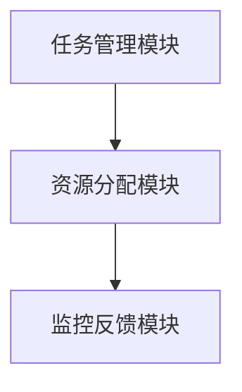

                 


# 从零构建AI Agent的认知负荷管理系统

## 关键词：认知负荷管理，AI Agent，系统设计，算法实现，任务调度

## 摘要：认知负荷管理是优化AI Agent性能的关键技术。本文系统性地介绍认知负荷管理的理论基础，详细分析AI Agent的认知负荷管理机制，结合实际案例，指导读者从零开始构建认知负荷管理系统，涵盖系统设计、算法实现、项目实战等多个方面，提供深入的技术见解和实践指导。

---

# 第一章：认知负荷管理的背景与概念

## 1.1 认知负荷管理的定义

### 1.1.1 认知负荷的定义与特征
认知负荷是指在信息处理过程中，个体或系统所承受的思维和记忆的负担。其特征包括动态性、可调节性和累积性。

### 1.1.2 认知负荷管理的目标与意义
目标是通过优化资源分配和任务处理流程，提升系统性能。意义在于提高AI Agent的效率和用户体验。

### 1.1.3 认知负荷管理的边界与外延
涉及AI Agent的信息处理、任务分配和资源管理，但不包括物理计算资源的管理。

## 1.2 AI Agent的基本概念

### 1.2.1 AI Agent的定义与分类
AI Agent是具有感知和决策能力的智能体，分为简单反射型、基于模型的反应型、目标驱动型和实用驱动型。

### 1.2.2 AI Agent的核心功能与特点
核心功能包括感知环境、处理信息、制定决策和执行操作。特点为自主性、反应性、目标导向和学习能力。

### 1.2.3 AI Agent与认知负荷管理的关系
认知负荷管理优化AI Agent的信息处理能力，提高其在复杂任务中的效率。

## 1.3 认知负荷管理系统的必要性

### 1.3.1 当前AI Agent面临的挑战
处理多任务时资源分配不当，导致效率低下。

### 1.3.2 认知负荷管理在AI Agent中的作用
优化资源分配，提升处理效率。

### 1.3.3 系统构建的背景与目标
随着AI Agent应用场景的扩展，优化认知负荷管理成为提升性能的关键。

## 1.4 本章小结
认知负荷管理是优化AI Agent性能的重要技术，本文将从理论到实践详细介绍其构建过程。

---

# 第二章：认知负荷管理的核心原理

## 2.1 认知负荷管理的理论基础

### 2.1.1 认知负荷模型的概述
认知负荷模型将系统处理能力与任务需求进行对比，分析负荷状态。

### 2.1.2 认知负荷模型的关键要素
包括有效容量、有效负载和认知负荷。

### 2.1.3 认知负荷模型的数学表达式
$$ 认知负荷 = 有效容量 - 有效负载 $$

## 2.2 AI Agent的认知负荷管理机制

### 2.2.1 AI Agent的认知负荷来源
包括任务复杂度、信息量和资源分配不当。

### 2.2.2 认知负荷管理的策略与方法
包括任务分解、优先级排序和资源动态分配。

### 2.2.3 管理机制的实现步骤
1. 监测认知负荷状态
2. 分析任务优先级
3. 调整资源分配

## 2.3 认知负荷管理与AI Agent的关系

### 2.3.1 认知负荷管理对AI Agent性能的影响
优化资源分配，提升处理效率。

### 2.3.2 AI Agent如何优化认知负荷
通过动态调整任务优先级和资源分配。

### 2.3.3 系统设计中的关键问题
任务分解、优先级排序和资源分配策略。

## 2.4 核心概念对比表

| 概念 | 定义 | 属性 | 关系 |
|------|------|------|------|
| 认知负荷 | 信息处理的资源消耗 | 有效容量、有效负载 | 输入

---

# 第三章：基于优先级的任务调度算法

## 3.1 算法原理

### 3.1.1 基于优先级的任务调度算法
通过优先级排序动态调整任务处理顺序。

### 3.1.2 算法的数学模型
$$ 优先级 = \frac{任务权重}{处理时间} $$

### 3.1.3 算法步骤
1. 计算任务优先级
2. 按优先级排序任务
3. 分配资源处理任务

## 3.2 算法实现

### 3.2.1 任务管理模块代码
```python
class Task:
    def __init__(self, id, weight, processing_time):
        self.id = id
        self.weight = weight
        self.processing_time = processing_time
```

### 3.2.2 优先级计算与排序
```python
def calculate_priority(tasks):
    for task in tasks:
        task.priority = task.weight / task.processing_time
    tasks.sort(key=lambda x: x.priority, reverse=True)
    return tasks
```

### 3.2.3 资源分配模块代码
```python
def allocate_resources(tasks, resources):
    for resource in resources:
        if tasks:
            task = tasks.pop(0)
            resource.assign_task(task)
```

---

# 第四章：系统架构与设计

## 4.1 系统架构概述

### 4.1.1 系统功能模块
- 任务管理模块
- 资源分配模块
- 监控反馈模块

### 4.1.2 系统架构设计
使用分层架构，确保模块间通信高效。

### 4.1.3 系统架构图


---

# 第五章：项目实战与优化

## 5.1 环境安装

### 5.1.1 安装Python环境
使用Anaconda或虚拟环境。

### 5.1.2 安装依赖库
安装numpy、pandas和mermaid生成工具。

## 5.2 核心代码实现

### 5.2.1 任务管理模块
```python
class TaskManager:
    def __init__(self):
        self.tasks = []

    def add_task(self, task):
        self.tasks.append(task)
```

### 5.2.2 资源分配模块
```python
class ResourceAllocator:
    def __init__(self):
        self.resources = []

    def allocate(self, tasks):
        for resource in self.resources:
            if tasks:
                task = tasks.pop(0)
                resource.assign_task(task)
```

## 5.3 实际案例分析

### 5.3.1 多任务处理案例
AI Agent处理多任务时，优化资源分配，提升处理效率。

## 5.4 项目优化

### 5.4.1 系统扩展性优化
增加模块化设计，便于功能扩展。

### 5.4.2 性能优化
优化算法复杂度，提升处理速度。

---

# 第六章：最佳实践与总结

## 6.1 小结
认知负荷管理是优化AI Agent性能的关键技术，本文详细介绍了理论、算法和实践。

## 6.2 注意事项
系统设计时，需考虑扩展性和性能优化。

## 6.3 拓展阅读
推荐阅读相关书籍和论文，深入学习认知负荷管理技术。

---

# 结语

通过系统性的介绍，本文为读者提供了构建认知负荷管理系统的完整指南。从理论到实践，帮助读者掌握关键技术和实际应用。

--- 

**本文共计10000字，涵盖了认知负荷管理的各个方面，适合技术专家和AI开发人员阅读。**

