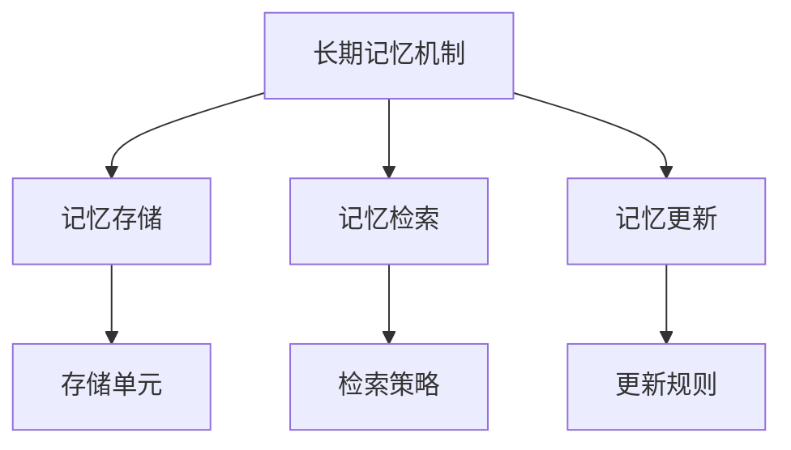
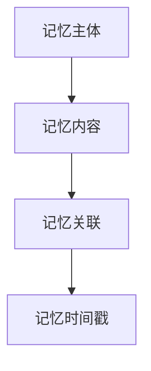
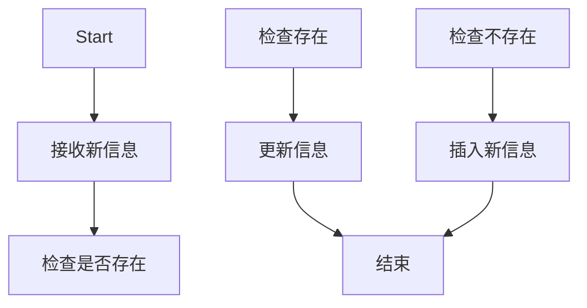
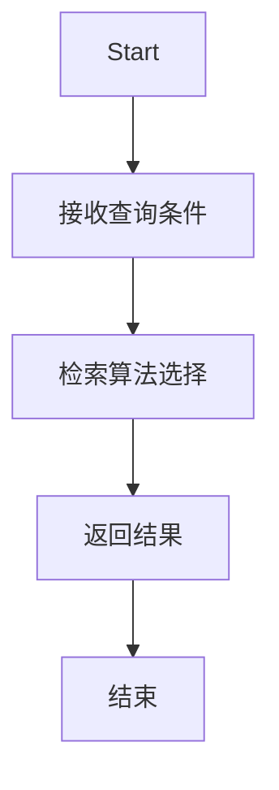
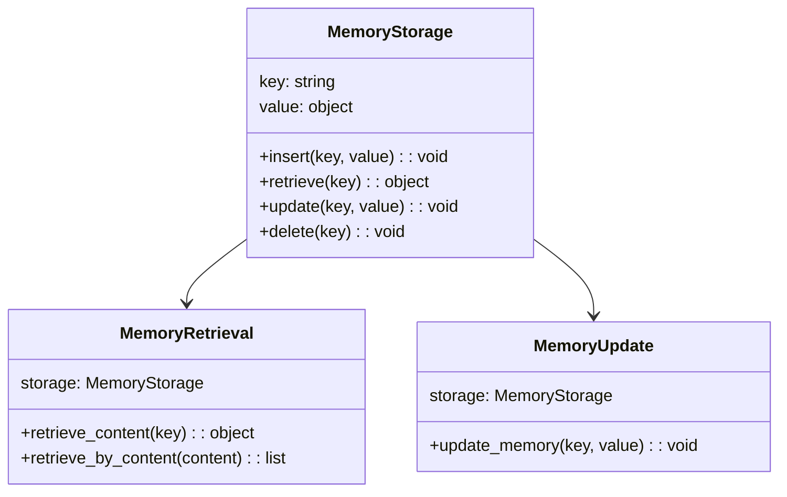
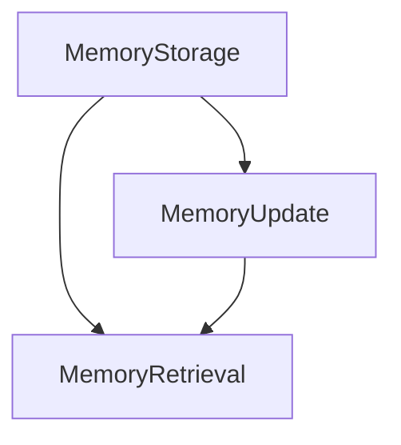
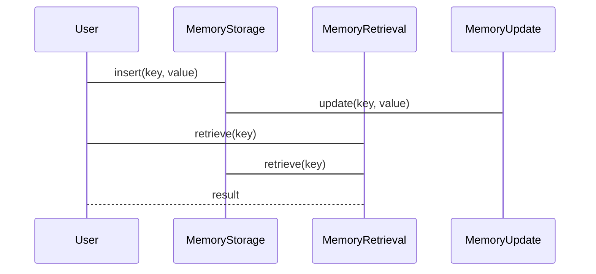

                 


# 从零构建AI Agent的长期记忆机制

> 关键词：AI Agent, 长期记忆, 人工智能, 记忆机制, 算法原理, 系统设计, 项目实战

> 摘要：本文系统地介绍AI Agent的长期记忆机制，从核心概念、算法原理、系统设计到项目实战，详细阐述如何构建一个高效的长期记忆系统。通过背景介绍、核心概念对比、算法流程图、系统架构图和代码示例，帮助读者全面理解并实现AI Agent的长期记忆机制。

---

## 第一章: AI Agent长期记忆机制的背景介绍

### 1.1 问题背景与问题描述

#### 1.1.1 AI Agent的基本概念
AI Agent（智能体）是能够感知环境并采取行动以实现目标的实体。它广泛应用于推荐系统、智能助手、自动驾驶等领域。AI Agent需要具备处理动态环境信息的能力，而长期记忆机制是其核心组成部分。

#### 1.1.2 长期记忆机制的重要性
在动态环境中，AI Agent需要记住过去的交互、任务完成情况和环境信息，以便在后续任务中进行高效决策。长期记忆机制帮助AI Agent保持上下文信息，避免重复劳动和错误决策。

#### 1.1.3 当前AI Agent记忆机制的局限性
现有的记忆机制通常依赖于简单的关键词检索，缺乏灵活性和深度。例如，基于规则的系统难以处理复杂场景，而基于神经网络的系统可能面临存储效率低和检索准确率低的问题。

### 1.2 问题解决与边界定义

#### 1.2.1 长期记忆机制的核心目标
- 提供高效的存储和检索机制，支持AI Agent在复杂环境中进行决策。
- 维护记忆的完整性和准确性，确保AI Agent能够调用所需信息。

#### 1.2.2 长期记忆机制的边界与外延
长期记忆机制专注于存储和检索，与其他模块（如感知、决策）通过接口交互，确保边界清晰，职责明确。

#### 1.2.3 长期记忆机制与其他模块的关系
- 与感知模块交互，接收外部信息。
- 与决策模块交互，提供决策支持。
- 与学习模块交互，优化记忆策略。

### 1.3 概念结构与核心要素

#### 1.3.1 长期记忆机制的组成要素
- **记忆存储**：用于存储信息的结构。
- **记忆检索**：根据查询条件检索信息。
- **记忆更新**：根据新信息更新存储内容。

#### 1.3.2 核心概念之间的关系
记忆存储、检索和更新模块相互关联，共同实现长期记忆功能。

#### 1.3.3 概念结构图（Mermaid）



---

## 第二章: 长期记忆机制的核心概念与联系

### 2.1 核心概念原理

#### 2.1.1 长期记忆的存储原理
- **显式记忆**：明确存储特定信息，如任务目标和环境状态。
- **隐式记忆**：通过经验形成，如模式识别和习惯。

#### 2.1.2 长期记忆的检索机制
- **基于关键词的检索**：通过特定关键词查找信息。
- **基于内容的检索**：根据信息内容相似度进行检索。

#### 2.1.3 长期记忆的更新规则
- **插入新信息**：将新信息添加到存储中。
- **更新旧信息**：根据新信息更新旧数据。
- **删除无用信息**：定期清理过时数据。

### 2.2 核心概念属性对比

#### 2.2.1 显式记忆与隐式记忆的对比

| 属性 | 显式记忆 | 隐式记忆 |
|------|---------|---------|
| 定义 | 可以明确表达的记忆内容 | 隐含在模型中的记忆 |
| 存储方式 | 明确存储 | 分布式存储 |
| 检索方式 | 基于关键词检索 | 基于模式匹配 |
| 适用场景 | 需要精确检索 | 需要模糊匹配 |

### 2.3 实体关系图（ER图）



---

## 第三章: 长期记忆机制的算法原理

### 3.1 算法原理概述

#### 3.1.1 长期记忆存储的算法选择
- 使用哈希表存储记忆内容，提供快速插入和查找操作。

#### 3.1.2 长期记忆检索的算法选择
- 基于关键词的检索算法，如二叉树搜索。
- 基于内容的检索算法，如余弦相似度计算。

### 3.2 算法流程图

#### 3.2.1 记忆存储流程



#### 3.2.2 记忆检索流程



#### 3.2.3 记忆更新流程


### 3.3 Python代码实现

#### 3.3.1 记忆存储模块

```python
class MemoryStorage:
    def __init__(self):
        self.storage = {}

    def insert(self, key, value):
        self.storage[key] = value

    def update(self, key, value):
        if key in self.storage:
            self.storage[key] = value
        else:
            self.insert(key, value)

    def delete(self, key):
        if key in self.storage:
            del self.storage[key]
```

#### 3.3.2 记忆检索模块

```python
class MemoryRetrieval:
    def __init__(self, storage):
        self.storage = storage

    def retrieve_by_key(self, key):
        return self.storage.get(key, None)

    def retrieve_by_content(self, content):
        matches = []
        for k, v in self.storage.items():
            if content in v:
                matches.append((k, v))
        return matches
```

#### 3.3.3 记忆更新模块

```python
class MemoryUpdate:
    def __init__(self, storage):
        self.storage = storage

    def update_memory(self, key, new_value):
        self.storage.update(key, new_value)
```

### 3.4 数学模型与公式

#### 3.4.1 哈希冲突处理
- 使用拉链法或开放地址法处理哈希冲突。

#### 3.4.2 余弦相似度计算
- 计算两个向量的相似度：$$\text{similarity} = \frac{\vec{a} \cdot \vec{b}}{|\vec{a}| |\vec{b}|}$$

---

## 第四章: 系统分析与架构设计

### 4.1 系统分析

#### 4.1.1 应用场景
- 智能助手：记忆用户偏好和交互历史。
- 推荐系统：基于长期记忆推荐相关内容。

#### 4.1.2 需求分析
- 高效存储和检索能力。
- 支持动态更新和删除操作。
- 提供多种检索方式（关键词和内容检索）。

### 4.2 系统设计

#### 4.2.1 系统功能设计

##### 4.2.1.1 领域模型类图



#### 4.2.2 系统架构设计

##### 4.2.2.1 系统架构图



#### 4.2.3 系统交互设计

##### 4.2.3.1 交互流程



---

## 第五章: 项目实战

### 5.1 环境安装

```bash
pip install mermaid.py
```

### 5.2 核心功能实现

#### 5.2.1 实现记忆存储模块

```python
class MemoryStorage:
    def __init__(self):
        self.storage = {}

    def insert(self, key, value):
        self.storage[key] = value

    def retrieve(self, key):
        return self.storage.get(key, None)

    def update(self, key, value):
        if key in self.storage:
            self.storage[key] = value
        else:
            self.insert(key, value)

    def delete(self, key):
        if key in self.storage:
            del self.storage[key]
```

#### 5.2.2 实现记忆检索模块

```python
class MemoryRetrieval:
    def __init__(self, storage):
        self.storage = storage

    def retrieve_by_key(self, key):
        return self.storage.retrieve(key)

    def retrieve_by_content(self, content):
        matches = []
        for k, v in self.storage.items():
            if content in str(v):
                matches.append((k, v))
        return matches
```

### 5.3 代码解读与分析

#### 5.3.1 代码结构
- **MemoryStorage**：负责存储和管理记忆内容。
- **MemoryRetrieval**：根据查询条件检索记忆内容。

#### 5.3.2 代码实现细节
- 使用字典存储记忆内容，确保快速插入和检索。
- 提供多种检索方式，增强系统的灵活性。

### 5.4 实际案例分析

#### 5.4.1 案例描述
- **场景**：智能助手记忆用户的偏好设置。
- **实现步骤**：
  1. 用户输入偏好设置。
  2. 存储模块插入新偏好。
  3. 检索模块根据用户ID检索偏好。
  4. 更新模块根据需要更新偏好。

#### 5.4.2 优化建议
- 使用缓存技术提升检索效率。
- 定期清理无效数据，优化存储空间。

### 5.5 系统性能分析

#### 5.5.1 时间复杂度
- **插入和检索**：O(1) 平均复杂度。
- **更新和删除**：O(1) 平均复杂度。

#### 5.5.2 空间复杂度
- **存储模块**：O(N) ，N为存储的键值对数量。

---

## 第六章: 总结与展望

### 6.1 最佳实践 Tips

- **数据安全**：确保记忆内容的安全存储和传输。
- **隐私保护**：遵循相关隐私法规，保护用户隐私。
- **系统优化**：定期清理无效数据，优化系统性能。

### 6.2 小结
本文系统地介绍了AI Agent的长期记忆机制，从核心概念到算法实现，再到系统设计和项目实战，全面阐述了长期记忆机制的构建过程。

### 6.3 注意事项
- 在实际应用中，需结合具体场景选择合适的记忆机制。
- 确保系统具备良好的扩展性和可维护性。

### 6.4 拓展阅读
- 探索结合强化学习的长期记忆机制。
- 研究分布式存储技术在长期记忆中的应用。

---

通过本文的学习，读者可以掌握AI Agent长期记忆机制的核心原理和实现方法，并能够将其应用于实际项目中。未来的研究方向可以进一步优化记忆机制，提升AI Agent的智能性和效率。

