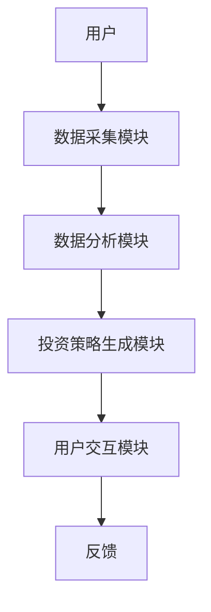
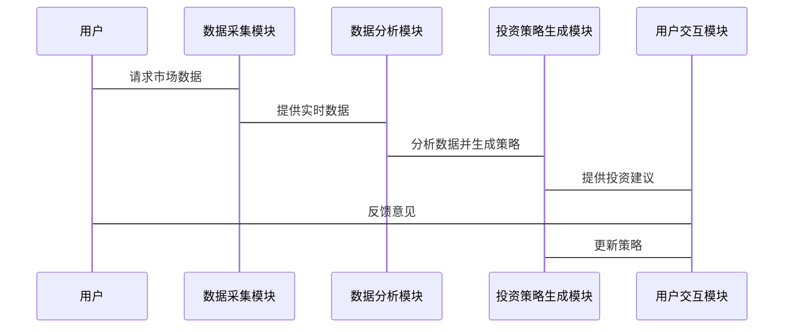

                 


# 从零构建投资理财智能助手AI Agent：基本概念与架构设计

> 关键词：投资理财，AI Agent，智能助手，架构设计，算法原理，系统架构

> 摘要：本文将详细探讨从零构建投资理财智能助手AI Agent的全过程，涵盖基本概念、核心原理、系统架构、算法实现及项目实战等内容。通过本文，读者将深入了解投资理财智能助手的核心技术与实现方法，掌握从零到一的完整构建流程。

---

# 第1章：投资理财智能助手AI Agent的背景与问题背景

## 1.1 问题背景与现状

### 1.1.1 当前投资理财领域的痛点
随着金融市场的发展，个人投资者面临信息过载、决策复杂化等挑战。传统的投资工具和方法难以满足用户个性化、实时化的需求。

### 1.1.2 传统投资理财工具的局限性
- 知识门槛高：普通投资者难以理解和运用复杂的金融工具。
- 信息滞后：传统投资工具的数据更新速度较慢。
- 个性化不足：传统工具难以根据用户的具体需求提供定制化服务。

### 1.1.3 AI技术在投资理财领域的应用潜力
- 提供实时数据分析与预测。
- 个性化投资建议。
- 自动化交易执行。

## 1.2 投资理财智能助手的定义与目标

### 1.2.1 投资理财智能助手的定义
投资理财智能助手是一种基于人工智能技术的辅助工具，旨在为用户提供个性化的投资建议、实时数据分析和自动化交易支持。

### 1.2.2 投资理财智能助手的核心目标
- 提供实时的市场数据与分析。
- 根据用户需求生成个性化投资策略。
- 支持自动化交易与风险控制。

### 1.2.3 投资理财智能助手的功能范围与边界
功能范围：
- 数据采集与分析。
- 投资策略生成。
- 自动化交易执行。
- 用户交互与反馈。

边界：
- 不直接操作用户的资金。
- 不承担投资风险。
- 不提供法律或税务建议。

## 1.3 投资理财智能助手的重要性与价值

### 1.3.1 提高投资效率的作用
通过自动化数据处理与分析，减少人工操作的时间与成本。

### 1.3.2 降低投资风险的意义
基于大数据分析与AI模型，提供更准确的投资建议。

### 1.3.3 个性化投资服务的实现
根据用户的风险偏好、财务状况等，提供定制化的投资策略。

## 1.4 本章小结
本章从问题背景、定义与目标、重要性与价值三个方面，全面介绍了投资理财智能助手AI Agent的基本概念与核心价值。

---

# 第2章：投资理财智能助手AI Agent的核心概念与基本原理

## 2.1 核心概念解析

### 2.1.1 AI Agent的基本概念
AI Agent是一种能够感知环境并采取行动以实现目标的智能实体。

### 2.1.2 投资理财智能助手的功能模块
- 数据采集模块：从金融市场获取实时数据。
- 数据分析模块：对数据进行清洗、特征提取与建模。
- 投资策略生成模块：基于分析结果生成投资建议。
- 用户交互模块：与用户进行自然语言交互。

### 2.1.3 多模态交互的核心要素
- 文本交互：支持用户通过自然语言输入查询与指令。
- 图表交互：通过可视化图表展示数据与投资建议。
- 语音交互：支持语音输入与输出。

## 2.2 投资理财智能助手的基本原理

### 2.2.1 数据驱动的决策机制
- 数据采集：从金融市场获取股票、基金、指数等数据。
- 数据清洗：去除噪声数据，确保数据质量。
- 数据建模：利用机器学习模型进行预测与分析。

### 2.2.2 知识图谱构建与应用
- 知识图谱构建：通过抽取金融市场数据，构建知识图谱。
- 知识图谱应用：基于知识图谱进行关联分析与推理。

### 2.2.3 自然语言处理技术在投资咨询中的应用
- 文本生成：生成投资建议报告。
- 情感分析：分析市场情绪，辅助投资决策。
- 意图识别：理解用户的查询意图。

## 2.3 核心概念之间的关系

### 2.3.1 核心概念属性特征对比表
| 概念       | 属性特征                         |
|------------|----------------------------------|
| 数据采集   | 实时性、多样性、准确性           |
| 数据分析   | 可视化、预测性、解释性           |
| 投资策略   | 个性化、动态性、风险控制         |
| 用户交互   | 自然性、实时性、便捷性           |

### 2.3.2 ER实体关系图架构
```mermaid
er
actor: User
goal: Investment Advice
system: Investment AI Agent
```

## 2.4 本章小结
本章从核心概念与基本原理两个方面，详细分析了投资理财智能助手AI Agent的构成与工作原理。

---

# 第3章：投资理财智能助手AI Agent的技术基础

## 3.1 自然语言处理技术

### 3.1.1 NLP在投资咨询中的应用
- 文本生成：生成投资报告与建议。
- 情感分析：分析市场情绪。
- 实体识别：识别公司名称、股票代码等。

### 3.1.2 文本生成与情感分析
- 文本生成：基于GPT模型生成投资建议。
- 情感分析：利用BERT模型分析市场情绪。

### 3.1.3 基于上下文的意图识别
- 上下文理解：基于历史对话理解用户意图。
- 意图分类：分类用户的查询类型。

## 3.2 机器学习与深度学习

### 3.2.1 机器学习在投资预测中的应用
- 时间序列预测：预测股票价格走势。
- 分类模型：分类股票的涨跌趋势。

### 3.2.2 深度学习模型的构建与优化
- 模型选择：LSTM、Transformer等模型的选择。
- 模型优化：超参数调优与模型评估。

### 3.2.3 时间序列分析在投资理财中的应用
- 时间序列预测：预测市场走势。
- 异常检测：检测市场异常波动。

## 3.3 知识图谱与语义理解

### 3.3.1 知识图谱的构建方法
- 数据抽取：从新闻、财报中抽取实体与关系。
- 图谱构建：构建金融知识图谱。
- 图谱存储：使用图数据库存储知识图谱。

### 3.3.2 基于知识图谱的语义理解
- 关系推理：基于图谱进行关联推理。
- 实体消解：解决同名实体歧义问题。

### 3.3.3 知识图谱在投资理财中的具体应用
- 关联分析：分析公司之间的关联关系。
- 风险评估：基于图谱进行风险传播分析。

## 3.4 数据处理与特征工程

### 3.4.1 数据清洗与预处理
- 数据清洗：去除噪声数据。
- 数据标准化：标准化处理金融数据。

### 3.4.2 特征提取与选择
- 特征提取：提取有用的特征。
- 特征选择：选择对模型影响大的特征。

### 3.4.3 数据增强技术在投资理财中的应用
- 数据增强：通过模拟数据增强训练集。

## 3.5 本章小结
本章从自然语言处理、机器学习、知识图谱与数据处理四个方面，详细介绍了投资理财智能助手AI Agent的技术基础。

---

# 第4章：投资理财智能助手AI Agent的算法原理与实现

## 4.1 算法原理概述

### 4.1.1 基于深度学习的自然语言处理模型
- 模型选择：使用Transformer架构。
- 模型训练：基于大规模金融文本数据训练模型。

### 4.1.2 投资策略生成算法
- 算法选择：基于强化学习的策略生成。
- 算法优化：优化策略生成的准确性和实时性。

### 4.1.3 多模态数据融合算法
- 数据融合：将文本、图像、语音等多种数据进行融合。
- 融合方法：使用注意力机制进行多模态融合。

## 4.2 算法实现细节

### 4.2.1 自然语言处理模型的实现
```python
class InvestmentAdvisor:
    def __init__(self, model):
        self.model = model
    def generate_advice(self, input_text):
        return self.model.generate(input_text)
```

### 4.2.2 投资策略生成算法的实现
```python
def generate_strategy(user_profile):
    # 基于用户资料生成投资策略
    return strategy
```

### 4.2.3 多模态数据融合算法的实现
```python
def multi_modal_fusion(text, image):
    # 使用注意力机制融合文本和图像数据
    return result
```

## 4.3 算法原理的数学模型与公式

### 4.3.1 变量定义
- $X$: 输入数据
- $Y$: 输出结果
- $W$: 模型权重
- $b$: 偏置项

### 4.3.2 模型训练的损失函数
$$ L = \frac{1}{N} \sum_{i=1}^{N} (Y_i - \hat{Y}_i)^2 $$

### 4.3.3 模型优化的数学推导
$$ \theta_{t+1} = \theta_t - \eta \cdot \frac{\partial L}{\partial \theta_t} $$

## 4.4 本章小结
本章从算法原理与实现细节两个方面，详细分析了投资理财智能助手AI Agent的核心算法与数学模型。

---

# 第5章：投资理财智能助手AI Agent的系统架构设计

## 5.1 系统架构概述

### 5.1.1 问题场景介绍
- 用户需求：个性化投资建议、实时市场监控。
- 系统目标：构建一个高效、可靠的投资理财智能助手。

### 5.1.2 系统功能设计
- 数据采集模块：实时采集金融市场数据。
- 数据分析模块：分析数据并生成投资建议。
- 用户交互模块：与用户进行多模态交互。

## 5.2 系统架构设计

### 5.2.1 系统架构图


### 5.2.2 系统功能模块设计
- 数据采集模块：负责采集股票、基金等数据。
- 数据分析模块：对数据进行清洗、建模与分析。
- 投资策略生成模块：根据分析结果生成投资建议。
- 用户交互模块：与用户进行文本、语音、图表等多种交互。

## 5.3 接口设计与交互流程

### 5.3.1 系统接口设计
- API接口：提供RESTful API接口。
- 数据格式：JSON格式数据。

### 5.3.2 系统交互流程


## 5.4 本章小结
本章从系统架构设计与交互流程两个方面，详细分析了投资理财智能助手AI Agent的系统实现方案。

---

# 第6章：投资理财智能助手AI Agent的项目实战

## 6.1 项目环境安装与配置

### 6.1.1 环境安装
- 安装Python：版本3.8以上。
- 安装依赖库：TensorFlow、Keras、NLTK、Jieba等。

### 6.1.2 数据源获取
- 数据获取：从Yahoo Finance获取股票数据。
- 数据存储：存储到本地数据库或云存储。

## 6.2 系统核心实现

### 6.2.1 数据采集模块实现
```python
import pandas as pd
from pandas_datareader import data

def get_stock_data(ticker, start, end):
    return data.DataReader(ticker, 'yahoo', start, end)
```

### 6.2.2 数据分析模块实现
```python
import numpy as np
from sklearn import linear_model

def predict_price(X, y):
    model = linear_model.LinearRegression()
    model.fit(X, y)
    return model
```

### 6.2.3 投资策略生成模块实现
```python
def generate_strategy(model, data):
    predictions = model.predict(data)
    return predictions
```

## 6.3 实际案例分析与解读

### 6.3.1 案例背景
- 投资目标：股票价格预测。
- 数据集：选取某只股票的历史数据。

### 6.3.2 案例分析
```python
# 数据加载
data = get_stock_data('AAPL', '2020-01-01', '2023-01-01')
# 数据分析
model = predict_price(data[['Close', 'Volume']], data['Close'])
# 策略生成
strategy = generate_strategy(model, data)
```

## 6.4 项目总结与优化建议

### 6.4.1 项目总结
- 成功实现了投资理财智能助手的核心功能。
- 系统架构设计合理，功能模块划分清晰。

### 6.4.2 优化建议
- 数据源扩展：引入更多的金融数据。
- 模型优化：尝试使用更先进的深度学习模型。
- 交互优化：支持更多形式的用户交互。

## 6.5 本章小结
本章通过项目实战，详细展示了投资理财智能助手AI Agent的实现过程，包括环境配置、核心代码实现、案例分析与项目总结。

---

# 第7章：投资理财智能助手AI Agent的最佳实践与未来发展

## 7.1 最佳实践 tips

### 7.1.1 数据处理的注意事项
- 数据清洗要彻底，确保数据质量。
- 特征工程要精细，选择对模型有影响力的特征。

### 7.1.2 模型选择与优化
- 根据任务选择合适的模型。
- 通过实验不断优化模型性能。

### 7.1.3 系统架构设计
- 模块划分要合理，便于维护与扩展。
- 接口设计要规范，便于集成与扩展。

## 7.2 未来发展与展望

### 7.2.1 技术发展趋势
- AI技术的不断进步：深度学习、强化学习等技术的进一步发展。
- 多模态交互的普及：支持更多形式的用户交互。

### 7.2.2 市场需求变化
- 个性化投资需求的增长。
- 机构投资者对智能工具的需求增加。

## 7.3 本章小结
本章从最佳实践与未来发展两个方面，总结了投资理财智能助手AI Agent的实践经验与未来发展方向。

---

# 第8章：总结与展望

## 8.1 本文总结
本文详细探讨了从零构建投资理财智能助手AI Agent的全过程，涵盖基本概念、核心原理、系统架构、算法实现及项目实战等内容。

## 8.2 未来展望
随着AI技术的不断进步，投资理财智能助手将更加智能化、个性化，为投资者提供更高效、更精准的服务。

---

# 结语

投资理财智能助手AI Agent的构建是一个复杂但极具挑战性的任务。通过本文的详细讲解，读者可以掌握从零到一的完整构建流程，为未来的研究与实践奠定坚实基础。

--- 

# 附录

## 附录A：相关代码与数据集

## 附录B：参考文献与拓展阅读

## 附录C：术语表与缩写说明

