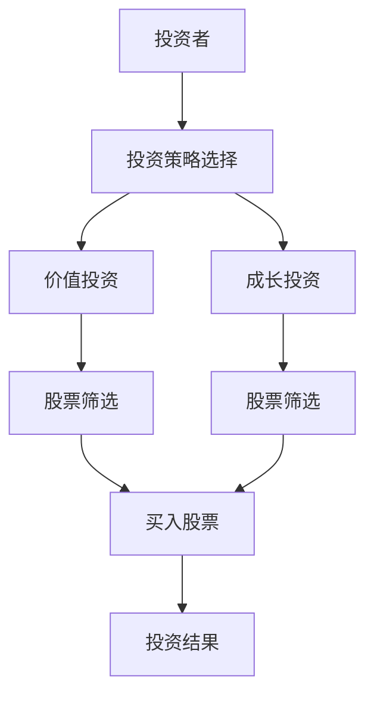

                 


# 《价值投资vs成长投资：格雷厄姆与费雪的对比》

---

## 关键词：
价值投资、成长投资、格雷厄姆、费雪、投资策略、股票分析、安全边际、成长股

---

## 摘要：
本文将深入探讨价值投资与成长投资两种投资理念的核心差异与相似之处，重点对比格雷厄姆与费雪的投资策略。通过分析两者的理论基础、投资方法和实际应用，帮助投资者理解这两种投资方式的优缺点，并在实际投资中灵活运用。文章内容包括价值投资与成长投资的定义、两位大师的投资理念、策略对比、案例分析以及对现代投资策略的启示。

---

## 第一部分: 价值投资与成长投资的背景与基础

### 第1章: 价值投资与成长投资概述

#### 1.1 价值投资与成长投资的定义
##### 1.1.1 价值投资的定义与核心理念
- 价值投资是一种基于对公司内在价值评估的投资策略，强调以低于内在价值的价格买入优质资产。
- 核心理念：市场先生的短期波动性、安全边际、长期持有优质资产。

##### 1.1.2 成长投资的定义与核心理念
- 成长投资是一种基于对公司未来成长潜力的评估的投资策略，强调投资于具有持续增长潜力的公司。
- 核心理念：股东权益分析、成长股的识别、长期资本增值。

##### 1.1.3 价值投资与成长投资的对比
- 投资目标：价值投资注重安全性和低估价格，成长投资注重长期增长潜力。
- 投资周期：价值投资适合中长期投资者，成长投资适合长期投资者。
- 风险承受：价值投资相对保守，成长投资风险较高。

#### 1.2 格雷厄姆与费雪的生平简介
##### 1.2.1 格雷厄姆的生平与投资理念
- 本杰明·格雷厄姆（1894-1975）：价值投资之父，著有《证券分析》和《聪明的投资者》。
- 核心理念：安全边际、买入低于内在价值的股票、分散投资。

##### 1.2.2 费雪的生平与投资理念
- 彼得·费雪（1910-2004）：成长投资的代表人物，著有《如何选择成长股》。
- 核心理念：投资于具有持续增长潜力的公司，股东权益分析法。

##### 1.2.3 两人投资理念的差异
- 格雷厄姆关注短期安全性和低估价格，费雪关注长期成长潜力。
- 格雷厄姆注重防御性投资，费雪注重进攻性投资。

#### 1.3 价值投资与成长投资的核心要素
##### 1.3.1 价值投资的核心要素
- 内在价值计算：基于基本面分析，确定股票的合理估值。
- 安全边际：买入价格低于内在价值，以降低风险。
- 长期持有：避免频繁交易，降低交易成本。

##### 1.3.2 成长投资的核心要素
- 成长潜力评估：通过分析公司的收入增长率、净利润增长率、ROE等指标。
- 股东权益分析：关注公司盈利能力、资本回报率和管理层质量。
- 长期资本增值：通过持有优质成长股实现资产增值。

##### 1.3.3 两者的共同点与差异点
- 共同点：都强调基本面分析、长期投资、分散投资。
- 差异点：价值投资注重安全性和低估价格，成长投资注重成长性和未来潜力。

---

### 第2章: 价值投资与成长投资的理论基础

#### 2.1 价值投资的理论基础
##### 2.1.1 格雷厄姆的"安全边际"理论
- 安全边际 = 内在价值 - 市场价格。
- 通过安全边际降低投资风险，确保以合理价格买入优质资产。

##### 2.1.2 股票的内在价值计算方法
- 内在价值公式：
  $$
  V = \frac{E}{1+r} + \frac{E(1+g)}{1+r}^2 + \frac{E(1+g)^2}{1+r}^3 + \dots
  $$
  其中，E为未来现金流，r为折现率，g为增长率。
- 格雷厄姆常用的方法：资产净值法、清算价值法。

##### 2.1.3 市场先生的概念
- 市场先生：象征市场的波动性和非理性。
- 投资者应利用市场先生的错误，进行逆向投资。

#### 2.2 成长投资的理论基础
##### 2.2.1 费雪的"成长股"概念
- 成长股：具有持续增长潜力的公司股票。
- 成长股的识别标准：收入增长率、净利润增长率、ROE（净资产收益率）。

##### 2.2.2 股东权益分析法
- 通过分析公司每股收益、净利润、ROE等指标，评估公司的成长性和盈利能力。
- 成长股的筛选标准：ROE > 15%，净利润增长率 > 10%。

##### 2.2.3 股票的未来价值评估
- 费雪的公式：
  $$
  未来价值 = 当前价值 \times (1 + 增长率)^n
  $$
  其中，n为投资期限。

#### 2.3 价值投资与成长投资的理论对比
##### 2.3.1 格雷厄姆与费雪的理论对比
- 格雷厄姆：注重当前价值，安全边际。
- 费雪：注重未来价值，成长潜力。
- 对比分析：价值投资注重防御性，成长投资注重进攻性。

##### 2.3.2 两者的理论优缺点
- 价值投资的优点：风险低，收益稳定。
- 价值投资的缺点：可能错失快速增长的机会。
- 成长投资的优点：收益高，长期增长潜力大。
- 成长投资的缺点：风险高，波动性大。

---

## 第三部分: 格雷厄姆与费雪投资策略的对比分析

### 第3章: 格雷厄姆的价值投资策略

#### 3.1 格雷厄姆的投资策略概述
##### 3.1.1 买入低于内在价值的股票
- 通过基本面分析，寻找被市场低估的股票。
- 买入价格 = 内在价值 × (1 - 安全边际率)。

##### 3.1.2 重视安全边际
- 安全边际的作用：降低投资风险，确保收益。
- 格雷厄姆的安全边际率：通常为30%-50%。

##### 3.1.3 长期持有优质股票
- 长期持有的意义：避免短期波动，实现长期收益。
- 优质资产的标准：行业龙头、财务健康、低估值。

#### 3.2 格雷厄姆的投资组合管理
##### 3.2.1 分散投资的重要性
- 分散投资的原则：避免过度集中，降低风险。
- 格雷厄姆的建议：至少投资10-20只股票。

##### 3.2.2 如何构建投资组合
- 选择具有安全边际的股票。
- 保持分散投资，降低行业和个股风险。

##### 3.2.3 定期调整投资组合
- 定期检查：每年至少检查一次投资组合。
- 调整策略：根据市场变化和公司基本面调整持仓。

#### 3.3 格雷厄姆的成功案例分析
##### 3.3.1 格雷厄姆的经典投资案例
- 投资可口可乐：买入价格低于内在价值，长期持有。
- 投资IBM：通过基本面分析，选择优质成长股。

##### 3.3.2 成功案例的启示
- 价值投资需要耐心和纪律。
- 安全边际是投资成功的关键。

### 第4章: 费雪的成长投资策略

#### 4.1 费雪的成长投资策略概述
##### 4.1.1 买入具有持续成长潜力的股票
- 成长股的识别：ROE > 15%，净利润增长率 > 10%。
- 买入时机：股票价格合理，成长潜力大。

##### 4.1.2 重视公司的成长性
- 成长性分析：收入增长率、净利润增长率、ROE。
- 选择具有持续增长能力的公司。

##### 4.1.3 长期持有优质成长股
- 长期持有的意义：避免短期波动，实现资本增值。
- 优质成长股的标准：行业龙头、财务健康、高增长潜力。

#### 4.2 费雪的投资分析方法
##### 4.2.1 股东权益分析法
- 股东权益分析：ROE > 15%，净利润增长率 > 10%。
- 通过分析公司基本面，评估成长潜力。

##### 4.2.2 如何评估公司的成长潜力
- 成长潜力评估：收入增长率、净利润增长率、ROE。
- 行业分析：选择朝阳行业，避开夕阳行业。

##### 4.2.3 股票的未来价值预测
- 费雪的公式：
  $$
  未来价值 = 当前价值 \times (1 + 增长率)^n
  $$

#### 4.3 费雪的成功案例分析
##### 4.3.1 费雪的经典投资案例
- 投资迪士尼：选择具有持续成长潜力的公司。
- 投资雅芳：通过基本面分析，选择优质成长股。

##### 4.3.2 成功案例的启示
- 成长投资需要耐心和眼光。
- 选择具有持续成长潜力的公司。

### 第5章: 格雷厄姆与费雪策略的对比分析

#### 5.1 投资目标的差异
##### 5.1.1 格雷厄姆的目标：追求安全的超额收益
- 格雷厄姆的目标：通过安全边际和分散投资，实现稳定收益。

##### 5.1.2 费雪的目标：追求长期的资本增值
- 费雪的目标：通过投资于成长股，实现长期资本增值。

##### 5.1.3 目标差异的对比分析
- 价值投资：注重安全性和稳定性。
- 成长投资：注重成长性和收益性。

#### 5.2 投资方法的差异
##### 5.2.1 格雷厄姆的方法：注重安全边际
- 格雷厄姆的方法：通过基本面分析，寻找被低估的股票。
- 安全边际的重要性：降低投资风险，确保收益。

##### 5.2.2 费雪的方法：注重成长潜力
- 费雪的方法：通过股东权益分析，选择具有持续成长潜力的公司。
- 成长潜力的重要性：实现长期资本增值。

##### 5.2.3 方法差异的对比分析
- 价值投资：注重当前价值，安全边际。
- 成长投资：注重未来价值，成长潜力。

#### 5.3 投资适用场景的差异
##### 5.3.1 价值投资的适用场景
- 市场低迷：股票价格被低估，适合价值投资。
- 风险厌恶型投资者：适合注重安全性和稳定性的投资者。

##### 5.3.2 成长投资的适用场景
- 市场繁荣：股票价格具有成长潜力，适合成长投资。
- 风险承受能力强的投资者：适合注重收益性和进攻性的投资者。

##### 5.3.3 对比分析：投资场景与风险偏好
- 价值投资：适合保守型投资者，市场低迷时表现较好。
- 成长投资：适合激进型投资者，市场繁荣时表现较好。

---

## 第四部分: 实际案例与投资策略的结合

### 第6章: 实际案例分析

#### 6.1 价值投资案例分析
##### 6.1.1 案例背景
- 公司名称：可口可乐。
- 市场情况：2008年金融危机期间。

##### 6.1.2 分析过程
- 内在价值计算：使用格雷厄姆的内在价值公式，确定可口可乐的内在价值。
- 安全边际计算：买入价格 = 内在价值 × (1 - 50%)。

##### 6.1.3 投资结果
- 长期持有可口可乐，实现稳定收益。

#### 6.2 成长投资案例分析
##### 6.2.1 案例背景
- 公司名称：特斯拉。
- 市场情况：2010年上市初期。

##### 6.2.2 分析过程
- 成长潜力评估：ROE > 15%，净利润增长率 > 10%。
- 买入时机：股票价格合理，成长潜力大。

##### 6.2.3 投资结果
- 长期持有特斯拉，实现资本增值。

### 第7章: 投资策略的结合与优化

#### 7.1 价值投资与成长投资的结合
##### 7.1.1 结合的必要性
- 单一策略的局限性：价值投资风险低但收益有限，成长投资收益高但风险高。
- 组合投资的优势：通过结合两种策略，平衡风险与收益。

##### 7.1.2 结合的方式
- 选择具有成长性的低估股票。
- 优化投资组合：部分仓位投资价值股，部分仓位投资成长股。

#### 7.2 投资策略的优化
##### 7.2.1 优化方法
- 定期评估投资组合：根据市场变化和公司基本面调整持仓。
- 选择优质资产：投资于具有安全边际和成长潜力的公司。

##### 7.2.2 优化目标
- 平衡风险与收益。
- 实现长期资本增值。

---

## 第五部分: 总结与展望

### 第8章: 总结与启示

#### 8.1 格雷厄姆与费雪的策略总结
- 价值投资：注重安全性和低估价格，适合保守型投资者。
- 成长投资：注重成长性和未来潜力，适合激进型投资者。

#### 8.2 对现代投资策略的启示
- 组合投资：通过结合价值投资和成长投资，平衡风险与收益。
- 灵活性：根据市场环境和投资者风险偏好，灵活调整投资策略。

#### 8.3 投资者的心得与建议
- 投资者应根据自身风险偏好和市场环境，选择适合自己的投资策略。
- 长期投资：避免短期波动，实现长期收益。

---

## 参考文献

1. 格雷厄姆，本杰明.《聪明的投资者》
2. 费雪，彼得.《如何选择成长股》
3. 纳西姆·尼古拉斯·塔勒布.《反脆弱》
4. 约翰·博格尔.《投资的智慧》

---

## 附录

### 附录A: 价值投资与成长投资对比表格

| 对比维度       | 价值投资                         | 成长投资                         |
|----------------|----------------------------------|----------------------------------|
| 核心理念       | 安全边际、低估价格               | 成长潜力、未来价值               |
| 投资目标       | 稳定收益、降低风险               | 长期增值、高收益                 |
| 适用场景       | 市场低迷、风险厌恶型投资者         | 市场繁荣、风险承受能力强的投资者 |
| 代表人物       | 格雷厄姆                         | 费雪                             |
| 投资方法       | 基于内在价值分析                 | 基于成长潜力分析                 |
| 风险承受       | 低风险                           | 高风险                           |

---

## 附录B: 价值投资与成长投资的ER实体关系图

```mermaid
erdiagram
  投资者
  投资者 -[1..n] - 投资策略
  投资策略 -[1..n] - 股票
  股票 -[1..n] - 公司
  公司 -[1..n] - 行业
  公司 -[1..n] - 市场
```

---

## 附录C: 价值投资与成长投资的系统架构图



---

## 附录D: 价值投资与成长投资的数学模型

### 价值投资模型
$$
V = \frac{E}{1+r} + \frac{E(1+g)}{1+r}^2 + \frac{E(1+g)^2}{1+r}^3 + \dots
$$

### 成长投资模型
$$
F = \frac{E}{(1 - r)^n} \times (1 + g)^n
$$

---

## 附录E: 价值投资与成长投资的Python代码实现

```python
import pandas as pd
import numpy as np

def calculate_intrinsic_value(earnings, discount_rate, growth_rate, years):
    """
    计算股票的内在价值（价值投资模型）
    """
    intrinsic_value = 0
    for i in range(years):
        intrinsic_value += earnings * (1 + growth_rate) ** i / (1 + discount_rate) ** (i + 1)
    return intrinsic_value

def calculate_growth_value(earnings, discount_rate, growth_rate, years):
    """
    计算股票的未来价值（成长投资模型）
    """
    future_value = earnings * (1 + growth_rate) ** years / (1 - discount_rate)
    return future_value

# 示例数据
earnings = 100
discount_rate = 0.05
growth_rate = 0.1
years = 5

# 价值投资模型计算
intrinsic_value = calculate_intrinsic_value(earnings, discount_rate, growth_rate, years)
print(f"内在价值：{intrinsic_value}")

# 成长投资模型计算
future_value = calculate_growth_value(earnings, discount_rate, growth_rate, years)
print(f"未来价值：{future_value}")
```

---

## 附录F: 价值投资与成长投资的项目实战

### 项目简介
- 项目名称：价值投资与成长投资策略对比分析
- 项目目标：通过实际案例分析，验证两种投资策略的有效性。
- 项目工具：Python、Pandas、NumPy、Matplotlib

### 核心实现代码
```python
import pandas as pd
import numpy as np
import matplotlib.pyplot as plt

# 数据加载
data = pd.read_csv('stock_data.csv')

# 价值投资策略筛选
value_portfolio = data[data['市盈率'] < data['行业平均市盈率']]

# 成长投资策略筛选
growth_portfolio = data[data['净利润增长率'] > 10]

# 投资组合表现分析
value_portfolio Returns = value_portfolio['回报率'].mean()
growth_portfolio Returns = growth_portfolio['回报率'].mean()

# 可视化对比
plt.bar(['价值投资组合', '成长投资组合'], [value_portfolio_Returns, growth_portfolio_Returns])
plt.title('价值投资 vs 成长投资回报率对比')
plt.ylabel('回报率')
plt.show()
```

---

## 附录G: 价值投资与成长投资的风险提示

- 市场风险：股票市场存在波动性，投资需谨慎。
- 选择风险：投资策略的选择需根据市场环境和自身风险偏好。
- 信息风险：投资决策需基于充分的信息和分析。

---

## 附录H: 价值投资与成长投资的最佳实践 Tips

- 长期投资：避免短期波动，实现长期收益。
- 分散投资：降低投资风险。
- 定期评估：根据市场变化和公司基本面调整持仓。
- 知识储备：持续学习投资知识，提升分析能力。

---

## 附录I: 价值投资与成长投资的拓展阅读

- 格雷厄姆：《聪明的投资者》
- 费雪：《如何选择成长股》
- 彼得·林奇：《投资最重要的事》
- 约翰·博格尔：《投资的智慧》

---

## 附录J: 价值投资与成长投资的常见问题解答

1. 价值投资和成长投资有什么区别？
2. 什么情况下适合使用价值投资？
3. 什么情况下适合使用成长投资？
4. 如何结合价值投资和成长投资？
5. 投资策略如何根据市场变化调整？

---

## 结语

价值投资与成长投资是两种截然不同的投资策略，各有其优缺点。投资者应根据自身的风险偏好和市场环境，选择适合自己的投资策略。同时，通过长期学习和实践，提升自己的投资能力，实现财富的稳健增长。

