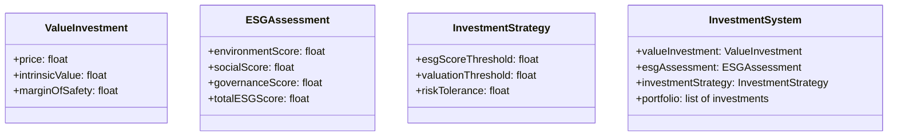
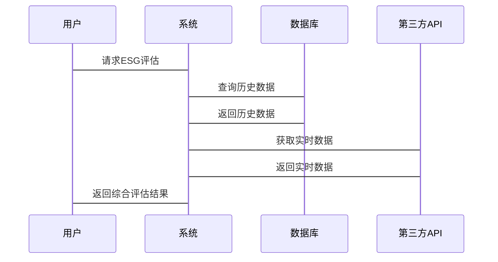

                 


# 价值投资与ESG：社会责任投资的融合

## 关键词：
- 价值投资
- ESG
- 社会责任投资
- 可持续投资
- 投资策略

## 摘要：
本文探讨了价值投资与ESG的融合，分析了如何在投资决策中纳入社会责任因素，提出了结合ESG评估的价值投资策略，并通过案例分析展示了其实际应用。

---

# 第1章 价值投资与ESG的背景介绍

## 1.1 价值投资的起源与发展

### 1.1.1 价值投资的定义与核心理念
- **定义**：价值投资是一种长期投资策略，关注于寻找市场价格低于其内在价值的证券。
- **核心理念**：强调安全边际和长期价值创造，避免短期市场波动的干扰。

### 1.1.2 价值投资的历史演变
- **早期发展**：20世纪初，本杰明·格雷厄姆和戴维·多德提出价值投资理论。
- **现代发展**：从传统基本面分析扩展到量化分析和风险管理。

### 1.1.3 价值投资在现代投资中的地位
- **重要性**：在不确定市场中提供稳定性，强调深度研究和长期持有。

## 1.2 ESG投资的起源与发展

### 1.2.1 ESG的定义与内涵
- **定义**：ESG是环境、社会和治理三个维度的综合评估。
- **内涵**：关注企业在可持续发展和社会责任方面的表现。

### 1.2.2 ESG投资的历史演变
- **早期发展**：20世纪60年代开始关注社会责任投资，70年代环境因素兴起。
- **现代发展**：全球ESG标准的制定和评级体系的完善。

### 1.2.3 ESG在现代投资中的地位
- **重要性**：成为衡量企业长期价值的重要因素，尤其在ESG投资趋势兴起后。

## 1.3 价值投资与ESG的融合背景

### 1.3.1 全球可持续发展背景下的投资趋势
- **可持续发展目标**：联合国提出的17个SDGs推动了ESG投资的发展。
- **政策支持**：各国政府出台相关政策鼓励ESG投资。

### 1.3.2 投资者对社会责任的关注
- **机构投资者责任**：越来越多的投资者关注企业的社会影响。
- **公众意识提升**：消费者和投资者对社会责任的关注增加。

### 1.3.3 价值投资与ESG的契合点
- **长期价值创造**：ESG因素与企业长期表现密切相关。
- **风险控制**：ESG表现优秀的公司在风险方面更具优势。

---

# 第2章 价值投资与ESG的核心概念

## 2.1 价值投资的核心要素

### 2.1.1 价值投资的三要素：安全边际、内在价值、市场先生
- **安全边际**：购买价格低于内在价值，提供安全空间。
- **内在价值**：企业未来现金流的现值，通过基本面分析确定。
- **市场先生**：市场情绪波动，影响价格但不影响价值。

### 2.1.2 价值投资的决策框架
- **基本面分析**：研究财务报表、行业地位、竞争优势。
- **安全边际分析**：确保购买价格低于内在价值。

### 2.1.3 价值投资的适用场景与局限性
- **适用场景**：市场低估、优质企业、长期持有。
- **局限性**：短期波动影响、竞争性行业难评估。

## 2.2 ESG的核心要素

### 2.2.1 ESG的三个维度：环境、社会、治理
- **环境**：碳排放、资源利用效率。
- **社会**：员工权益、社区关系、产品责任。
- **治理**：公司治理结构、高管薪酬、透明度。

### 2.2.2 ESG评估的主要指标与权重
- **指标**：碳排放强度、员工满意度、董事会多样性。
- **权重**：根据行业特点调整权重。

### 2.2.3 ESG评级的分类与标准
- **评级机构**：如MSCI、S&P、晨星。
- **评级分类**：从AAA到CCC。

## 2.3 价值投资与ESG的内在联系

### 2.3.1 价值投资与ESG的共同目标：创造长期价值
- **长期视角**：两者都关注企业的长期表现。
- **可持续发展**：ESG因素与企业可持续发展密切相关。

### 2.3.2 ESG因素对投资决策的影响
- **筛选标准**：排除不符合ESG标准的企业。
- **估值调整**：将ESG表现纳入内在价值评估。

### 2.3.3 价值投资与ESG的融合逻辑
- **逻辑一**：ESG优秀的企业更具竞争优势。
- **逻辑二**：ESG表现优秀的公司在市场波动中更具稳定性。

---

# 第3章 ESG评估框架与方法

## 3.1 ESG评估的框架体系

### 3.1.1 环境维度的评估指标
- **指标**：碳排放、能源效率、绿色技术创新。
- **权重**：根据不同行业调整权重。

### 3.1.2 社会维度的评估指标
- **指标**：员工权益、社区参与、产品安全。
- **权重**：关注社会影响大的行业。

### 3.1.3 治理维度的评估指标
- **指标**：董事会结构、高管薪酬、透明度。
- **权重**：治理问题严重的行业权重较高。

## 3.2 ESG评估的方法论

### 3.2.1 定性评估方法
- **方法**：案例分析、访谈、文本分析。
- **应用场景**：适用于数据不足的情况。

### 3.2.2 定量评估方法
- **方法**：统计分析、回归分析、指数计算。
- **应用场景**：数据丰富的行业。

### 3.2.3 综合评估模型
- **模型**：将定性和定量评估结果结合，得出综合评分。

## 3.3 ESG评估的挑战与解决方案

### 3.3.1 数据获取的困难
- **解决方案**：使用多源数据，建立数据清洗流程。

### 3.3.2 数据质量的问题
- **解决方案**：引入第三方验证，建立数据质量评估体系。

### 3.3.3 评估标准的多样性
- **解决方案**：根据行业特点定制评估标准。

---

# 第4章 价值投资与ESG的融合策略

## 4.1 理论融合策略

### 4.1.1 将ESG因素纳入基本面分析
- **步骤**：在分析财务指标时，同时评估ESG表现。
- **方法**：将ESG评分作为调整因子，影响内在价值评估。

### 4.1.2 建立综合评估模型
- **模型结构**：包括财务指标和ESG指标。
- **权重调整**：根据行业特点调整ESG指标的权重。

## 4.2 实务操作策略

### 4.2.1 筛选ESG表现优异的企业
- **筛选标准**：高ESG评级、行业领先。
- **实施步骤**：通过ESG评级筛选出候选企业。

### 4.2.2 结合安全边际进行投资
- **方法**：选择ESG评分高且市场价格低于内在价值的企业。
- **案例**：假设某企业ESG评分高，市场价格低于内在价值，具备投资价值。

## 4.3 投资组合优化策略

### 4.3.1 分散化投资
- **策略**：在不同行业和区域配置ESG表现优秀的企业。
- **优势**：降低行业风险，提高整体收益稳定性。

### 4.3.2 定期再平衡
- **方法**：定期评估投资组合，调整ESG评分变化和市场变化。
- **频率**：每季度或半年进行一次评估和调整。

---

# 第5章 系统分析与架构设计方案

## 5.1 系统功能设计

### 5.1.1 领域模型设计（Mermaid类图）


### 5.1.2 系统架构设计（Mermaid架构图）


### 5.1.3 系统接口设计
- **接口1**：获取ESG数据（从第三方API）
- **接口2**：计算ESG评分
- **接口3**：生成投资组合

### 5.1.4 系统交互设计（Mermaid序列图）


---

# 第6章 项目实战

## 6.1 环境安装

### 6.1.1 安装Python和相关库
```bash
pip install pandas numpy scikit-learn matplotlib
```

### 6.1.2 安装ESG数据获取工具
```bash
pip install pandas_datareader
```

## 6.2 核心实现源代码

### 6.2.1 数据获取与预处理
```python
import pandas as pd
from pandas_datareader import get_data_yahoo

# 获取数据
data = get_data_yahoo(tickers, start='2020-01-01', end='2023-12-31')

# 数据清洗
data.dropna(inplace=True)
data = data[~data.index.duplicated(keep='first')]
```

### 6.2.2 ESG评分计算
```python
from sklearn.linear_model import LinearRegression

# 训练模型
model = LinearRegression()
model.fit(X_train, y_train)

# 预测ESG评分
y_pred = model.predict(X_test)
```

### 6.2.3 价值投资策略实现
```python
def calculate_margin_of_safety(price, intrinsic_value):
    return intrinsic_value - price

# 应用策略
margin = calculate_margin_of_safety(current_price, calculated_intrinsic_value)
if margin > 0:
    invest = True
else:
    invest = False
```

## 6.3 案例分析与解读

### 6.3.1 案例分析
- **案例**：假设某公司ESG评分为85分，市场价格低于内在价值，具备投资价值。

### 6.3.2 结果解读
- **结果**：投资决策建议买入该股票，预期长期收益。

## 6.4 项目小结

### 6.4.1 成功经验
- **数据获取**：准确获取ESG数据。
- **模型训练**：建立有效的ESG评分模型。

### 6.4.2 改进方向
- **数据源**：引入更多数据源，提高评分准确性。
- **模型优化**：采用更复杂的机器学习模型，提高预测精度。

---

# 第7章 最佳实践与小结

## 7.1 最佳实践

### 7.1.1 数据质量控制
- **建议**：定期验证数据来源，确保数据准确性。

### 7.1.2 模型可解释性
- **建议**：选择易于解释的模型，便于调整和优化。

## 7.2 小结

### 7.2.1 核心观点总结
- 价值投资与ESG的融合能够提升投资的长期价值和可持续性。
- 结合ESG因素的评估，有助于发现更具投资价值的企业。

### 7.2.2 展望
- 随着ESG投资的兴起，价值投资与ESG的融合将更加深入，成为未来投资的重要趋势。

## 7.3 注意事项

### 7.3.1 数据风险
- **注意**：确保数据来源可靠，避免因数据问题导致决策失误。

### 7.3.2 模型局限性
- **注意**：模型预测结果仅供参考，需结合实际情况进行调整。

## 7.4 拓展阅读

### 7.4.1 推荐书籍
- 《价值投资：原理与实践》
- 《ESG投资：理论与应用》

### 7.4.2 推荐文章
- 《ESG投资与企业价值创造》
- 《价值投资的未来：ESG因素的融合》

---

# 结语

通过本文的分析，我们可以看到，价值投资与ESG的融合不仅能够提升投资的长期价值，还能促进企业的可持续发展。希望本文的分析对投资者在实践中的决策有所帮助，也为未来的研究提供了新的思路。

