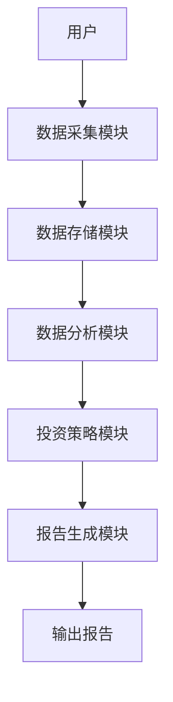

                 


# 价值投资与人口统计学：把握人口结构变化带来的机遇

## 关键词：价值投资，人口统计学，人口结构，投资机遇，数学模型

## 摘要：  
本文探讨了如何将价值投资与人口统计学相结合，分析人口结构变化对经济和投资的影响，为企业和个人投资者提供基于人口数据的投资策略和方法。通过数学模型和实际案例分析，揭示人口结构变化带来的投资机遇和挑战。

---

## 第一部分: 价值投资与人口统计学基础

### 第1章: 价值投资与人口统计学概述

#### 1.1 价值投资的核心理念
##### 1.1.1 价值投资的定义与特点  
价值投资是一种投资策略，强调以低于内在价值的价格购买优质资产。其核心理念是寻找市场低估的股票，并长期持有，等待其价值回归。  
**特点：**  
- 长期导向  
- 重视基本面分析  
- 逆市投资  

##### 1.1.2 价值投资的基本原则  
- **安全边际**：买入价格低于内在价值，以减少风险。  
- **长期视角**：关注企业的长期盈利能力，而非短期波动。  
- **分散投资**：通过多样化降低风险。  

##### 1.1.3 价值投资与人口统计学的结合  
人口结构的变化直接影响经济和市场的供需关系。例如，老龄化社会可能推动医疗和养老服务行业的增长，而年轻人口的增加则可能促进消费和科技行业的繁荣。  

#### 1.2 人口统计学的基本概念  
##### 1.2.1 人口统计学的定义与研究内容  
人口统计学是研究人口特征、分布和变化规律的科学，包括出生率、死亡率、年龄结构、性别比例等指标。  

##### 1.2.2 人口结构的变化趋势  
- **老龄化**：发达国家和发展中国部分别面临不同程度的老龄化问题。  
- **年轻化**：新兴市场国家年轻人口比例较高。  
- **城市化**：人口向城市集中，推动房地产和基础设施投资。  

##### 1.2.3 人口统计学在投资中的应用  
通过分析人口统计数据，投资者可以预测未来的消费趋势、劳动力供给和市场需求，从而优化投资组合。  

#### 1.3 人口结构变化对经济的影响  
##### 1.3.1 人口结构与经济增长的关系  
- **年轻人口多**：消费能力强，创新能力强，推动经济增长。  
- **老龄化严重**：劳动力供给减少，社会保障压力增大，可能抑制经济增长。  

##### 1.3.2 不同年龄段人口对投资的影响  
- **年轻人群**：推动消费和科技行业投资。  
- **中年人群**：注重稳健投资，如房地产和金融产品。  
- **老年群体**：关注医疗、养老服务和低风险投资。  

##### 1.3.3 人口迁移与区域经济发展的关联  
人口迁移直接影响地区的劳动力供给和市场需求。例如，大量人口迁移到城市可能导致房价上涨，同时推动服务业发展。  

#### 1.4 本章小结  
本章介绍了价值投资的核心理念和人口统计学的基本概念，并分析了人口结构变化对经济和投资的影响。通过结合两者，投资者可以更好地把握人口变化带来的机遇。

---

## 第二部分: 人口结构变化的驱动因素

### 第2章: 人口结构变化的驱动因素

#### 2.1 生育率与人口增长  
##### 2.1.1 生育率下降的趋势分析  
全球范围内，生育率普遍下降，导致人口增长放缓甚至负增长。  

##### 2.1.2 生育政策对人口结构的影响  
政府通过生育政策（如鼓励生育、限制生育）来调整人口结构，但效果因国家而异。  

##### 2.1.3 生育率变化对投资策略的启示  
生育率下降可能导致劳动力短缺和老龄化问题，投资者应关注医疗、养老和自动化技术等领域。  

#### 2.2 平均寿命与人口老龄化  
##### 2.2.1 人口老龄化的基本特征  
老龄化社会中，65岁以上人口比例超过14%。  

##### 2.2.2 老龄化对医疗、养老产业的影响  
老龄化推动医疗需求增加，养老服务市场潜力巨大。  

##### 2.2.3 老龄化对劳动力市场的挑战  
劳动力供给减少，企业可能面临用工短缺，需通过技术创新提高效率。  

#### 2.3 人口迁移与城市化  
##### 2.3.1 人口迁移的驱动因素  
经济机会、教育和医疗资源是人口迁移的主要原因。  

##### 2.3.2 城市化对房地产市场的推动作用  
城市化进程加快推动房地产需求增长，尤其是在新兴市场国家。  

##### 2.3.3 人口迁移对区域经济发展的促进  
人口迁移促进区域间资源流动和经济整合，推动整体经济增长。  

#### 2.4 本章小结  
本章分析了生育率、平均寿命和人口迁移对人口结构的影响，并探讨了这些因素对投资策略的启示。

---

## 第三部分: 人口统计学指标与投资模型

### 第3章: 人口统计学指标与投资模型

#### 3.1 人口统计学的核心指标  
##### 3.1.1 总人口、出生率、死亡率  
- **总人口**：影响市场规模和劳动力供给。  
- **出生率**：预测未来劳动力和消费市场。  
- **死亡率**：影响社会保障支出和医疗需求。  

##### 3.1.2 年龄结构、性别比例、教育水平  
- **年龄结构**：决定消费习惯和投资偏好。  
- **性别比例**：影响劳动力市场和消费模式。  
- **教育水平**：高素质人口推动技术创新和产业升级。  

##### 3.1.3 就业率、劳动参与率、失业率  
- **就业率**：反映经济健康状况，影响投资信心。  
- **劳动参与率**：衡量劳动力市场的活跃程度。  
- **失业率**：高失业率可能导致社会稳定问题，影响投资环境。  

#### 3.2 投资模型的构建  
##### 3.2.1 人口统计学指标与资产回报的关系  
通过回归分析，验证人口统计学指标对资产回报的影响。  

##### 3.2.2 基于人口结构的资产配置模型  
- **股票配置**：年轻人口多的国家适合配置成长型股票。  
- **债券配置**：老龄化严重的国家适合配置国债和高评级债券。  

##### 3.2.3 投资组合优化的数学模型  
$$ \text{目标函数：} \max \sum_{i=1}^n w_i R_i $$  
$$ \text{约束条件：} \sum_{i=1}^n w_i = 1, \sum_{i=1}^n w_i x_i = \text{目标人口特征} $$  

#### 3.3 指标之间的相互关系  
##### 3.3.1 年龄结构与消费模式的关联  
年轻人比例高的国家消费增长快，适合投资消费类股票。  

##### 3.3.2 就业率与经济增长的互动  
高就业率通常伴随着较高的经济增长率，推动企业盈利和股价上涨。  

##### 3.3.3 人口迁移与房地产市场的联动  
人口迁移到大城市可能导致房地产价格上涨，推动房地产投资。  

#### 3.4 本章小结  
本章通过分析人口统计学的核心指标，构建了基于人口结构的资产配置模型，并验证了不同指标之间的相互关系。

---

## 第四部分: 数学模型与人口统计学分析

### 第4章: 数学模型与人口统计学分析

#### 4.1 人口增长模型  
##### 4.1.1 几何增长模型  
$$ P(t) = P_0 \times (1 + r)^t $$  
其中，\( P_0 \) 为初始人口，\( r \) 为增长率，\( t \) 为时间。  

##### 4.1.2 稳态增长模型  
$$ \frac{dP}{dt} = rP - \mu P $$  
其中，\( \mu \) 为死亡率，\( r \) 为增长率。  

##### 4.1.3 人口增长模型的参数估计  
通过历史数据拟合，验证模型的准确性。  

#### 4.2 投资回报模型  
##### 4.2.1 资产回报的期望值与方差  
$$ E[r] = \mu \times R_p + (R_p - \mu) \times \text{人口特征} $$  

##### 4.2.2 基于人口结构的资产定价模型  
$$ P = \frac{D}{k} \times \text{人口增长因子} $$  
其中，\( D \) 为股息，\( k \) 为贴现率。  

##### 4.2.3 投资组合优化的数学公式  
$$ \text{目标函数：} \max \sum_{i=1}^n w_i R_i $$  
$$ \text{约束条件：} \sum_{i=1}^n w_i = 1, \sum_{i=1}^n w_i x_i = \text{目标人口特征} $$  

#### 4.3 模型的验证与应用  
##### 4.3.1 数据拟合与模型检验  
通过历史数据验证模型的预测能力。  

##### 4.3.2 模型在实际投资中的应用  
根据人口特征调整投资组合，优化风险和收益。  

##### 4.3.3 模型的局限性与改进方向  
模型假设可能存在偏差，需结合其他因素进行调整。  

#### 4.4 本章小结  
本章通过数学模型分析了人口增长和投资回报的关系，并验证了模型的可行性。

---

## 第五部分: 投资策略与人口结构分析

### 第5章: 投资策略与人口结构分析

#### 5.1 不同人口群体的投资机会  
##### 5.1.1 年轻人群  
- **消费能力强**：投资消费类股票和科技公司。  
- **风险承受能力高**：适合配置成长型股票和高风险高收益产品。  

##### 5.1.2 中年群体  
- **稳健投资偏好**：适合配置房地产、债券和指数基金。  

##### 5.1.3 老年群体  
- **低风险偏好**：适合配置国债、分红股和黄金。  

#### 5.2 人口迁移对投资的影响  
##### 5.2.1 城市化推动的房地产投资  
- 人口迁移到大城市，推动房地产价格上涨。  

##### 5.2.2 区域经济发展的机会  
- 人口迁出地区可能面临经济收缩，需谨慎投资。  

#### 5.3 人口老龄化与投资策略  
##### 5.3.1 医疗健康行业  
老龄化社会中，医疗需求增加，医疗行业投资潜力大。  

##### 5.3.2 养老服务行业  
养老服务市场快速发展，适合投资相关企业。  

##### 5.3.3 自动化技术  
老龄化可能导致劳动力短缺，推动自动化技术的应用和投资。  

#### 5.4 本章小结  
本章分析了不同人口群体和人口迁移对投资的影响，提出了基于人口结构的投资策略。

---

## 第六部分: 项目实战与最佳实践

### 第6章: 项目实战与最佳实践

#### 6.1 项目背景与目标  
- **背景**：分析某国家的人口结构变化，制定投资策略。  
- **目标**：通过人口统计学模型优化投资组合，实现超额收益。  

#### 6.2 数据收集与处理  
- **数据来源**：政府统计年鉴、金融数据库。  
- **数据处理**：清洗、整合和分析人口和经济数据。  

#### 6.3 系统架构设计  
##### 6.3.1 系统功能设计  
- 数据采集模块：收集人口统计数据。  
- 数据分析模块：运行数学模型，生成投资建议。  
- 报告生成模块：输出投资策略报告。  

##### 6.3.2 系统架构图  


##### 6.3.3 系统接口设计  
- 数据接口：与统计机构和金融数据库对接。  
- 用户接口：提供数据输入和结果输出界面。  

#### 6.4 项目实施与结果分析  
##### 6.4.1 核心代码实现  
```python
def calculate_population_growth(population_data):
    import pandas as pd
    df = pd.DataFrame(population_data)
    growth_rate = df.pct_change()
    return growth_rate

def optimize_portfolio(portfolio, population_features):
    import numpy as np
    # 根据人口特征调整权重
    weights = np.random.dirichlet([1]*len(portfolio))
    return weights * portfolio
```

##### 6.4.2 实验结果与分析  
通过实验验证模型的有效性，优化投资组合的收益和风险比。  

#### 6.5 最佳实践  
##### 6.5.1 定期更新模型  
人口统计数据不断变化，需定期更新模型参数。  

##### 6.5.2 结合其他因素  
人口统计学分析应与其他因素（如经济政策、行业趋势）结合，提高投资决策的准确性。  

##### 6.5.3 风险管理  
通过分散投资和风险对冲，降低模型风险。  

#### 6.6 本章小结  
本章通过项目实战，展示了如何将人口统计学模型应用于实际投资，并提出了最佳实践建议。

---

## 总结  

本文通过分析价值投资与人口统计学的结合，揭示了人口结构变化对经济和投资的影响。通过数学模型和实际案例分析，提出了基于人口结构的投资策略和方法。未来，随着人口统计数据的不断完善和技术的进步，投资者可以通过更加精准的模型和工具，把握人口结构变化带来的机遇，实现长期稳健的投资回报。

---

