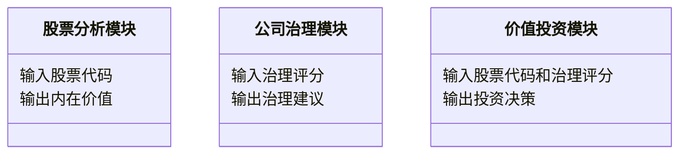

                 

# 价值投资与公司治理的关系

> 关键词：价值投资、公司治理、内在价值、股东权益、企业治理、投资策略

> 摘要：本文探讨了价值投资与公司治理之间的深层关系，从价值投资的核心理念出发，分析了公司治理对投资价值的影响。通过内在价值评估算法、系统架构设计和项目实战，详细展示了如何将价值投资的理念应用于公司治理，并通过案例分析验证了其实际效果。

---

## 引言

价值投资与公司治理是现代金融与企业管理中的两大核心议题。价值投资强调以低于内在价值的价格买入优质资产，而公司治理则是确保企业高效运作、保护股东权益的关键机制。本文将从价值投资的角度出发，分析公司治理的核心要素及其对投资决策的影响。

---

## 第1章: 价值投资的基本概念

### 1.1 价值投资的定义与特点

#### 1.1.1 价值投资的定义
价值投资是一种长期投资策略，以低于公司内在价值的价格买入股票，耐心持有，等待价格回归其内在价值。其核心在于寻找市场低估的优质企业。

#### 1.1.2 价值投资的核心特点
- **安全边际**：买入价格低于内在价值，提供安全空间。
- **长期视角**：关注企业的长期盈利能力，而非短期波动。
- **注重基本面**：分析企业的财务状况、行业地位和竞争优势。

#### 1.1.3 价值投资与成长投资的区别
| 方面       | 价值投资                         | 成长投资                         |
|------------|----------------------------------|----------------------------------|
| 目标       | 寻找价格低估的优质企业             | 寻找高成长性的企业               |
| 时间框架   | 长期持有，关注价值回归             | 短期或中期，关注成长空间         |
| 风险偏好   | 低风险，注重安全边际               | 高风险，注重高增长               |

---

### 1.2 价值投资的历史与发展

#### 1.2.1 价值投资的起源
价值投资理念起源于20世纪初，本杰明·格雷厄姆和戴维·多德是其主要倡导者。他们提出的“安全边际”和“内在价值”理论奠定了价值投资的基础。

#### 1.2.2 价值投资的发展历程
- **早期发展**：20世纪30至40年代，格雷厄姆和多德在《证券分析》中系统阐述价值投资理论。
- **成熟阶段**：20世纪60至70年代，沃伦·巴菲特将价值投资与彼得·林奇等投资者推广，使其成为主流投资策略。
- **现代应用**：当前，价值投资结合量化分析和大数据技术，发展出多种投资策略。

#### 1.2.3 价值投资在现代金融中的地位
价值投资不仅是个人投资者的重要策略，也被机构投资者广泛采用，成为现代金融体系的重要组成部分。

---

### 1.3 价值投资的核心理念

#### 1.3.1 股票的内在价值
内在价值是企业未来现金流的现值，计算公式如下：

$$
\text{内在价值} = \sum_{t=1}^{\infty} \frac{\text{现金流}_t}{(1+r)^t}
$$

其中，\( r \) 是折现率，通常取企业的加权平均资本成本（WACC）。

#### 1.3.2 市场先生与投资者的心态
市场先生是格雷厄姆提出的概念，指市场情绪的波动性。投资者应以理性的视角看待市场的短期波动，抓住市场低估的机会。

#### 1.3.3 安全边际的概念
安全边际 = 内在价值 - 市场价格

通过安全边际，投资者可以降低投资风险，确保买入价格的安全性。

---

## 第2章: 公司治理的基本概念

### 2.1 公司治理的定义与目标

#### 2.1.1 公司治理的定义
公司治理是通过公司章程、董事会、管理层和股东之间的权利制衡，确保企业有效运作和长期发展的制度安排。

#### 2.1.2 公司治理的目标
- 保护股东权益
- 提高企业透明度
- 防范管理层滥用职权
- 实现企业长期价值最大化

#### 2.1.3 公司治理的核心要素
- 股东大会
- 董事会
- 高管团队
- 监管机构

### 2.2 公司治理的主体与责任

#### 2.2.1 股东的责任
- 投票权
- 监督权
- 利益相关者保护

#### 2.2.2 董事会的责任
- 制定战略
- 监督高管
- 信息披露

#### 2.2.3 高管团队的责任
- 执行战略
- 管理日常运营
- 报告业绩

### 2.3 公司治理的主要原则

#### 2.3.1 透明性原则
企业应向股东和公众披露真实、完整的信息。

#### 2.3.2 责任分担原则
明确各治理主体的责任，避免责任模糊。

#### 2.3.3 利益相关者保护原则
在追求股东利益的同时，保护其他利益相关者（如员工、客户）的权益。

---

## 第3章: 价值投资与公司治理的关系

### 3.1 价值投资视角下的公司治理

#### 3.1.1 公司治理对价值投资的影响
良好的公司治理是企业长期价值的基石，直接影响企业的内在价值。

#### 3.1.2 良好的公司治理如何创造价值
- 提高管理效率
- 降低代理成本
- 增强投资者信心

#### 3.1.3 不良的公司治理对投资价值的破坏
- 内幕交易
- 盲目扩张
- 利润操纵

### 3.2 公司治理视角下的价值投资

#### 3.2.1 价值投资对公司治理的促进作用
- 提高治理透明度
- 强化董事会责任
- 优化管理层激励机制

#### 3.2.2 价值投资者在公司治理中的角色
- 监督企业治理
- 提供治理建议
- 推动企业改善

#### 3.2.3 公司治理如何吸引价值投资者
- 良好的治理结构
- 高效的管理层
- 透明的信息披露

### 3.3 价值投资与公司治理

价值投资与公司治理相辅相成。价值投资者通过分析公司治理状况，选择治理优秀的企业；而良好的公司治理则为价值投资者提供了长期价值增长的保障。

---

## 第4章: 内在价值评估的算法

### 4.1 内在价值评估的核心算法

#### 4.1.1 CAPM模型
资本资产定价模型（CAPM）用于确定股票的合理预期回报率：

$$
r = r_f + \beta (r_m - r_f)
$$

其中，\( r_f \) 是无风险利率，\( \beta \) 是股票的贝塔系数，\( r_m \) 是市场预期回报率。

#### 4.1.2 现金流折现法
通过DCF模型计算企业未来现金流的现值：

$$
\text{企业价值} = \sum_{t=1}^{n} \frac{\text{现金流}_t}{(1 + r)^t}
$$

---

## 第5章: 系统架构设计

### 5.1 系统功能设计

#### 5.1.1 领域模型
使用mermaid类图展示系统的核心模块：

---

## 第6章: 项目实战

### 6.1 案例分析

#### 6.1.1 选择目标企业
以某制造企业为例，分析其治理结构和财务状况。

#### 6.1.2 应用价值投资策略
通过现金流折现法计算其内在价值，结合治理评分做出投资决策。

---

## 结论

价值投资与公司治理密切相关，良好的公司治理是企业长期价值的基石。通过内在价值评估和系统架构设计，投资者可以更科学地做出投资决策，实现长期收益。

---

## 最佳实践 Tips

- **投资前**，深入分析企业的治理结构。
- **长期视角**，关注企业的内在价值。
- **分散风险**，合理配置资产。

---

通过本文的分析，读者可以更好地理解价值投资与公司治理的关系，并在实际投资中灵活运用这些理念。

