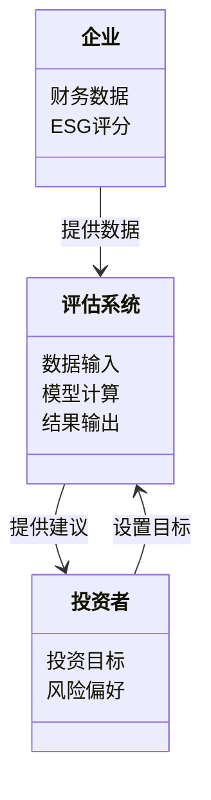
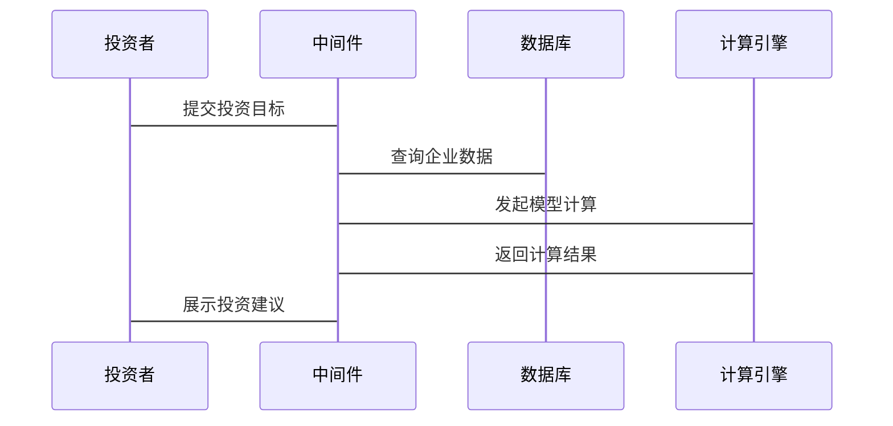

                 


# 价值投资与可持续发展

## 关键词：
- 价值投资
- 可持续发展
- ESG
- 投资策略
- 财务分析

## 摘要：
本文探讨了价值投资与可持续发展之间的深刻联系，分析了如何将可持续发展理念融入价值投资策略中。通过详细阐述价值投资的核心概念、可持续发展的评估指标以及两者结合的数学模型，本文为投资者提供了新的视角和方法。文章还结合实际案例，展示了如何在绿色能源行业应用这些理论，为读者提供了实践指导。

---

# 第一部分: 价值投资与可持续发展的背景与概念

## 第1章: 价值投资的起源与发展

### 1.1 价值投资的核心理念

#### 1.1.1 价值投资的定义
价值投资是一种以基本面分析为基础的投资策略，强调以低于内在价值的价格买入优质资产，追求长期稳健的回报。其核心在于识别市场中的低估机会，关注企业的内在价值而非短期市场波动。

#### 1.1.2 价值投资的核心原则
- **安全边际**：买入价格低于内在价值，确保投资的安全性。
- **长期视角**：关注企业的长期盈利能力，而非短期市场波动。
- **企业基本面**：分析企业的财务状况、行业地位和竞争优势。

#### 1.1.3 价值投资与投机的区别
- 投资：基于基本面分析，追求长期稳定回报。
- 投机：基于市场情绪和短期价格波动，风险较高。

### 1.2 可持续发展的概念与内涵

#### 1.2.1 可持续发展的定义
可持续发展是指在满足当前需求的同时，不损害后代满足其需求的能力。它强调经济、社会和环境的协调发展。

#### 1.2.2 可持续发展的三个核心维度
- **环境（E）**：减少对环境的负面影响，关注碳排放、资源利用效率等。
- **社会（S）**：关注员工权益、社会责任、劳动条件等。
- **治理（G）**：公司治理结构、透明度、高管薪酬等。

#### 1.2.3 可持续发展与经济、社会、环境的关系
可持续发展通过优化资源配置、减少环境破坏和社会不平等，促进经济的长期健康发展。

### 1.3 价值投资与可持续发展的结合

#### 1.3.1 价值投资与可持续发展的契合点
- 价值投资关注企业的长期价值，而可持续发展关注企业的长期社会价值。
- 可持续发展因素（如ESG）可以作为价值投资的重要考量。

#### 1.3.2 可持续发展对投资决策的影响
- 企业ESG表现优秀，通常具有更强的抗风险能力和长期盈利能力。
- ESG因素可以帮助投资者识别潜在风险，如环境诉讼、社会责任缺失等。

#### 1.3.3 价值投资在可持续发展中的作用
- 通过投资优质企业，推动社会和环境的正向发展。
- 价值投资注重长期回报，与可持续发展的长期目标一致。

### 1.4 本章小结
价值投资与可持续发展在长期视角和企业基本面分析上具有契合点。通过将ESG因素纳入投资决策，投资者可以在追求财务回报的同时，促进社会和环境的可持续发展。

---

## 第2章: 价值投资的核心概念与分析框架

### 2.1 价值投资的分析框架

#### 2.1.1 财务分析的核心指标
- **市盈率（P/E）**：股价与每股收益的比率，衡量市场对公司的估值。
- **市净率（P/B）**：股价与每股净资产的比率，衡量资产的重估价值。
- **股息率**：股息与股价的比率，衡量分红能力。

#### 2.1.2 行业分析的关键因素
- **行业周期**：行业的增长阶段和周期性。
- **竞争格局**：行业内的主要竞争对手和市场集中度。
- **政策影响**：政府政策对行业的影响。

#### 2.1.3 公司基本面分析的步骤
1. **财务状况**：分析资产负债表、利润表和现金流量表。
2. **行业地位**：评估公司在行业中的竞争优势和市场占有率。
3. **管理团队**：分析管理层的能力和决策历史。
4. **发展前景**：评估公司的增长潜力和创新能力。

### 2.2 可持续发展的评估指标

#### 2.2.1 环境维度的评估指标
- **碳排放**：单位产品或服务的碳排放量。
- **资源利用效率**：单位产品消耗的能源和资源。
- **环保合规性**：是否遵守环保法规和行业标准。

#### 2.2.2 社会维度的评估指标
- **员工权益**：员工工资、福利和工作条件。
- **社会责任**：公司对社会公益的贡献。
- **劳动条件**：工作环境和劳动强度。

#### 2.2.3 治理维度的评估指标
- **公司治理结构**：董事会结构、独立董事比例。
- **透明度**：信息披露的及时性和完整性。
- **高管薪酬**：高管与普通员工的薪酬差距。

### 2.3 价值投资与可持续发展的综合评估模型

#### 2.3.1 模型的构建逻辑
1. **数据收集**：收集企业的财务数据和ESG评分。
2. **权重分配**：根据投资目标，分配财务指标和ESG指标的权重。
3. **综合评分**：计算企业的综合评分，确定投资价值。

#### 2.3.2 模型的输入变量与输出结果
- **输入变量**：企业财务数据、ESG评分、行业基准。
- **输出结果**：综合评分、投资建议。

#### 2.3.3 模型的应用场景
- **行业比较**：在同一行业中筛选出具有竞争优势的企业。
- **风险评估**：识别潜在的环境和社会风险。

### 2.4 本章小结
价值投资的分析框架需要结合企业的财务状况和ESG表现，通过综合评估模型筛选出具有长期投资价值的企业。

---

## 第3章: 价值投资与可持续发展的数学模型与公式

### 3.1 价值投资的核心公式

#### 3.1.1 内在价值的计算公式
$$ 内在价值 = \frac{CF}{r - g} $$
其中，CF为自由现金流，r为折现率，g为现金流增长率。

#### 3.1.2 投资回报率的计算公式
$$ ROI = \frac{净收益}{初始投资} \times 100\% $$

### 3.2 可持续发展评估的数学模型

#### 3.2.1 ESG评分的计算公式
$$ ESG评分 = \frac{E评分 + S评分 + G评分}{3} $$

#### 3.2.2 可持续发展指数的构建公式
$$ 可持续发展指数 = \sum (权重_i \times 评估指标_i) $$

### 3.3 综合评估模型的数学表达

#### 3.3.1 综合评分公式
$$ 综合评分 = \alpha \times 价值投资评分 + \beta \times ESG评分 $$

#### 3.3.2 投资决策公式
$$ 投资建议 = \begin{cases} 
\text{买入} & \text{if 综合评分 > 70} \\
\text{持有} & \text{if 60 < 综合评分 \leq 70} \\
\text{卖出} & \text{if 综合评分 \leq 60}
\end{cases} $$

### 3.4 本章小结
通过数学模型，投资者可以量化评估企业的内在价值和可持续发展表现，为投资决策提供科学依据。

---

## 第4章: 价值投资与可持续发展的系统分析

### 4.1 问题场景介绍
以绿色能源行业为例，分析企业的ESG表现和财务状况，构建综合评估系统。

### 4.2 系统功能设计

#### 4.2.1 领域模型（mermaid类图）


### 4.3 系统架构设计（mermaid架构图）
```mermaid
architecturalDiagram
    客户端 -->> 中间件: 请求处理
    中间件 -->> 数据库: 数据查询
    中间件 -->> 计算引擎: 模型计算
    计算引擎 -->> 数据库: 数据存储
    中间件 -->> 投资者: 结果展示
```

### 4.4 系统交互设计（mermaid序列图）


### 4.5 本章小结
通过系统架构和交互设计，投资者可以方便地获取企业的综合评估结果，辅助投资决策。

---

## 第5章: 项目实战——绿色能源行业的价值投资与可持续发展分析

### 5.1 环境安装

#### 5.1.1 安装Python环境
使用Anaconda安装Python 3.8及以上版本。

#### 5.1.2 安装依赖库
```bash
pip install numpy pandas scikit-learn matplotlib
```

### 5.2 核心实现源代码

#### 5.2.1 数据预处理
```python
import pandas as pd
import numpy as np

# 加载数据
data = pd.read_csv('green_energy_companies.csv')

# 数据清洗
data.dropna(inplace=True)
data = data[~data['行业'].str.contains('非绿色能源')]
```

#### 5.2.2 ESG评分计算
```python
from sklearn.preprocessing import StandardScaler

# 标准化ESG数据
scaler = StandardScaler()
esg_features = data[['E', 'S', 'G']]
scaled_esg = scaler.fit_transform(esg_features)

# 计算ESG评分
data['ESG评分'] = np.mean(scaled_esg, axis=1)
```

#### 5.2.3 综合评分计算
```python
# 定义价值投资评分
def calculate_value_score(company_data):
    # 假设company_data包含财务数据和ESG评分
    # 计算价值投资评分
    return company_data['价值投资评分']

# 计算综合评分
alpha = 0.6
beta = 0.4
data['综合评分'] = alpha * data['价值投资评分'] + beta * data['ESG评分']
```

### 5.3 案例分析与解读

#### 5.3.1 竞争对手对比
以某绿色能源公司为例，分析其在行业中的综合评分和竞争对手的对比。

#### 5.3.2 投资建议
根据综合评分，建议投资者买入、持有或卖出该公司的股票。

### 5.4 本章小结
通过实际案例分析，展示了如何将价值投资与可持续发展结合，应用于绿色能源行业的投资决策。

---

## 第6章: 最佳实践与小结

### 6.1 小结
价值投资与可持续发展在理论和实践中具有深远的意义。通过综合评估模型和系统分析，投资者可以在追求财务回报的同时，推动社会和环境的可持续发展。

### 6.2 注意事项
- 数据的准确性和及时性是关键。
- 模型的权重需要根据具体行业和投资目标调整。
- 需要定期更新数据和模型，以适应市场变化。

### 6.3 拓展阅读
- 格雷厄姆的《证券分析》
- 纪录片《资本主义的冬天》

---

## 附录
- 附录A: 价值投资与可持续发展相关的学术论文
- 附录B: Python代码实现的详细注释

---

通过本文的系统分析和实际案例，读者可以更好地理解价值投资与可持续发展的结合方式，并在实际投资中应用这些理论和方法。

