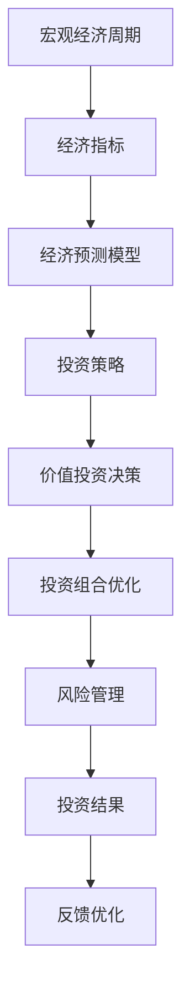
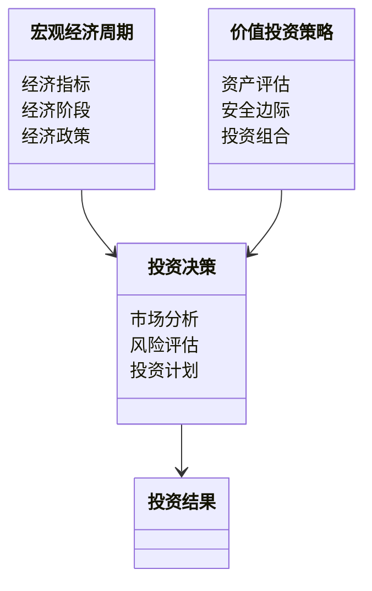

                 


# 价值投资与宏观经济周期的关系

> 关键词：价值投资、宏观经济周期、经济波动、投资策略、风险管理

> 摘要：本文探讨了价值投资与宏观经济周期之间的深刻联系，分析了宏观经济周期对价值投资的影响，以及价值投资在不同经济周期下的表现和策略调整。文章从价值投资的核心理念出发，结合宏观经济周期的基本理论，通过系统分析和实际案例，详细阐述了两者之间的相互作用，并提出了在实际投资中如何利用宏观经济周期进行策略优化的建议。

---

## 目录大纲

### 第一部分: 价值投资与宏观经济周期的背景与基础

#### 第1章: 价值投资的核心理念

##### 1.1 价值投资的定义与核心原则
- 1.1.1 价值投资的定义
- 1.1.2 价值投资的核心原则（买入被低估的资产、长期持有、安全边际）
- 1.1.3 价值投资与基本面分析的关系

##### 1.2 宏观经济周期的基本概念
- 1.2.1 宏观经济周期的定义
- 1.2.2 宏观经济周期的类型（衰退、复苏、过热、滞胀）
- 1.2.3 宏观经济周期对投资的影响

#### 第2章: 价值投资的历史与发展

##### 2.1 价值投资的起源与发展
- 2.1.1 价值投资的起源
- 2.1.2 价值投资的发展历程
- 2.1.3 价值投资在现代金融中的地位

##### 2.2 宏观经济周期的历史案例
- 2.2.1 经典宏观经济周期回顾
- 2.2.2 宏观经济周期对投资策略的影响
- 2.2.3 宏观经济周期的预测与分析

### 第二部分: 价值投资与宏观经济周期的相互作用

#### 第3章: 宏观经济周期对价值投资的影响

##### 3.1 宏观经济周期对资产价格的影响
- 3.1.1 宏观经济周期与股票价格的关系
- 3.1.2 宏观经济周期与债券价格的关系
- 3.1.3 宏观经济周期与商品价格的关系

##### 3.2 宏观经济周期对投资策略的影响
- 3.2.1 不同经济周期下的投资策略调整
- 3.2.2 经济周期波动对投资组合的影响
- 3.2.3 宏观经济周期对风险偏好的影响

#### 第4章: 价值投资对宏观经济周期的反作用

##### 4.1 价值投资在经济周期中的角色
- 4.1.1 价值投资对市场流动性的影响
- 4.1.2 价值投资对市场定价效率的影响
- 4.1.3 价值投资对市场波动性的调节作用

##### 4.2 价值投资者在经济周期中的行为模式
- 4.2.1 价值投资者在经济繁荣期的行为
- 4.2.2 价值投资者在经济衰退期的行为
- 4.2.3 价值投资者在经济复苏期的行为

### 第三部分: 价值投资与宏观经济周期的系统分析

#### 第5章: 价值投资与宏观经济周期的系统

##### 5.1 价值投资与宏观经济周期的系统架构
- 5.1.1 价值投资与宏观经济周期的交互关系
- 5.1.2 系统功能设计（领域模型类图）
- 5.1.3 系统架构设计（系统架构图）
- 5.1.4 系统接口设计
- 5.1.5 系统交互设计（序列图）

##### 5.2 价值投资与宏观经济周期的算法原理
- 5.2.1 宏观经济指标的计算公式
- 5.2.2 价值投资策略的优化算法
- 5.2.3 经济周期预测的数学模型
- 5.2.4 宏观经济与投资策略的关联分析

### 第四部分: 价值投资与宏观经济周期的项目实战

#### 第6章: 价值投资与宏观经济周期的项目实战

##### 6.1 项目背景与目标
- 6.1.1 项目背景
- 6.1.2 项目目标

##### 6.2 项目核心实现
- 6.2.1 环境安装与数据准备
- 6.2.2 价值投资策略的实现代码
- 6.2.3 宏观经济周期预测的实现代码

##### 6.3 项目案例分析
- 6.3.1 经济衰退期的价值投资案例
- 6.3.2 经济复苏期的价值投资案例
- 6.3.3 经济过热期的价值投资案例

##### 6.4 项目小结
- 6.4.1 项目总结
- 6.4.2 项目启示

### 第五部分: 价值投资与宏观经济周期的风险管理与心理

#### 第7章: 投资风险管理与心理

##### 7.1 风险管理策略
- 7.1.1 风险控制的基本原则
- 7.1.2 宏观经济周期下的风险管理策略
- 7.1.3 价值投资中的风险管理工具

##### 7.2 投资心理与行为分析
- 7.2.1 投资者心理与经济周期的关系
- 7.2.2 避免情绪化决策的方法
- 7.2.3 长期投资纪律的重要性

### 第六部分: 价值投资与宏观经济周期的未来展望

#### 第8章: 价值投资与宏观经济周期的未来趋势

##### 8.1 价值投资的未来发展方向
- 8.1.1 数字化与智能化在价值投资中的应用
- 8.1.2 宏观经济周期预测的技术进步
- 8.1.3 全球化背景下的价值投资策略

##### 8.2 宏观经济周期的新挑战与机遇
- 8.2.1 新兴经济对宏观经济周期的影响
- 8.2.2 技术进步对经济周期的改变
- 8.2.3 全球化与逆全球化对投资策略的影响

### 第七部分: 附录

#### 第9章: 工具与资源

##### 9.1 数据源与工具推荐
- 9.1.1 宏观经济数据来源
- 9.1.2 价值投资分析工具
- 9.1.3 代码实现工具

##### 9.2 参考文献与拓展阅读
- 9.2.1 经典书籍推荐
- 9.2.2 学术论文推荐
- 9.2.3 网站与博客推荐

##### 9.3 术语表
- 9.3.1 专业术语解释
- 9.3.2 行业术语定义
- 9.3.3 模型与方法说明

---

### 附录: 价值投资与宏观经济周期的系统架构图



---

### 附录: 价值投资与宏观经济周期的领域模型类图



---

### 附录: 价值投资与宏观经济周期的数学模型

$$
\text{GDP增长} = \alpha \times \text{消费支出} + \beta \times \text{投资支出} + \gamma \times \text{政府支出} + \delta \times \text{净出口}
$$

$$
\text{投资回报率} = \frac{\text{资产价值} - \text{初始成本}}{\text{初始成本}}
$$

---

### 附录: 价值投资与宏观经济周期的代码示例

```python
import numpy as np
import pandas as pd
from sklearn.linear_model import LinearRegression

# 示例数据：宏观经济指标与股票价格
data = {
    'GDP增长率': [2.5, 3.1, 2.8, 3.5, 2.2],
    '失业率': [6.2, 5.8, 6.3, 5.9, 6.1],
    '股票价格': [100, 110, 95, 120, 90]
}

df = pd.DataFrame(data)

# 训练线性回归模型：宏观经济指标对股票价格的影响
model = LinearRegression()
model.fit(df[['GDP增长率', '失业率']], df['股票价格'])

# 预测股票价格
new_data = {'GDP增长率': [3.0], '失业率': [6.0]}
new_df = pd.DataFrame(new_data)
predicted_price = model.predict(new_df)
print(f'预测股票价格：{predicted_price[0]:.2f}')
```

---

### 附录: 价值投资与宏观经济周期的风险管理与心理

#### 风险管理原则

| 原则 | 描述 |
|------|------|
| 分散投资 | 通过多样化投资降低风险 |
| 定位风险承受能力 | 根据自身财务状况确定投资风险等级 |
| 定期评估 | 定期审查和调整投资组合以适应经济变化 |

---

### 附录: 价值投资与宏观经济周期的未来趋势

#### 数字化与智能化在价值投资中的应用

- **大数据分析**：利用大数据技术分析宏观经济指标和市场趋势。
- **人工智能**：通过机器学习算法预测经济周期和优化投资策略。
- **区块链技术**：提高资产交易的透明度和安全性。

#### 全球化与逆全球化对投资策略的影响

- **全球化**：跨国投资机会增加，但风险分散能力增强。
- **逆全球化**：贸易摩擦和地缘政治风险增加，投资者需更加关注宏观经济政策变化。

---

通过以上目录大纲，文章将系统地探讨价值投资与宏观经济周期之间的关系，结合理论分析、实际案例和系统设计，为投资者提供深入的洞察和实用的策略建议。

