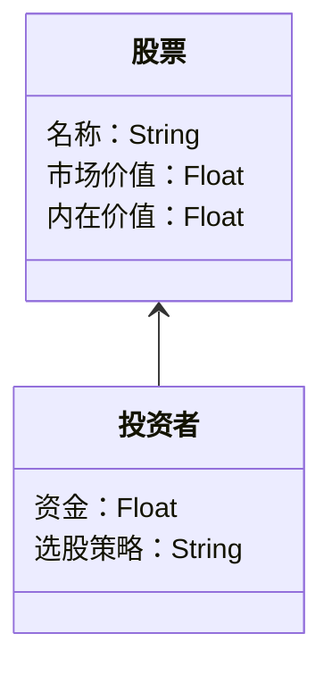
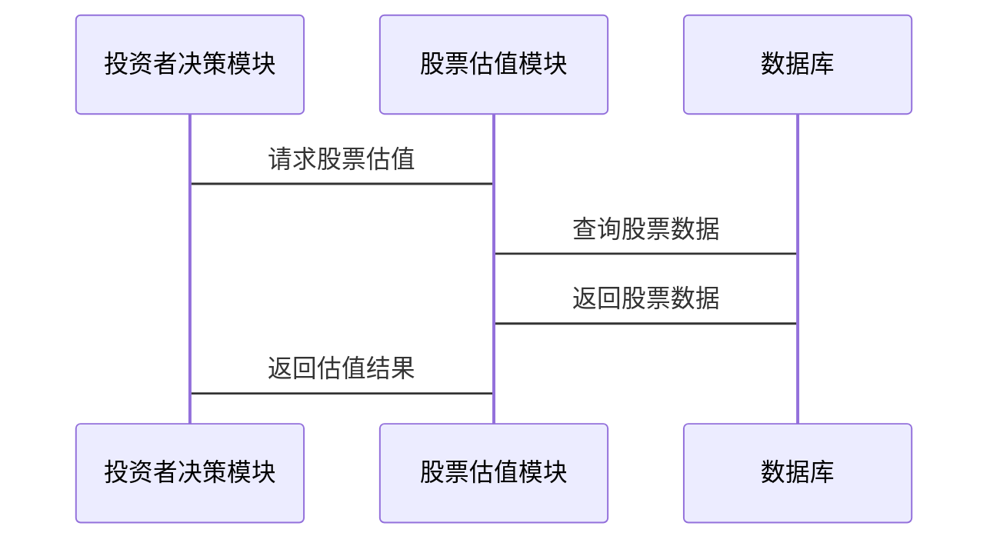

                 


# 价值投资与市场效率假说的关系

## 关键词：价值投资、市场效率假说、股票估值、数学模型、投资策略

## 摘要：本文探讨价值投资与市场效率假说之间的关系，从背景介绍、核心概念、算法原理、数学模型、系统架构到项目实战，详细分析两者的联系与区别，并通过实例验证它们的关系。

---

## 第一部分: 价值投资与市场效率假说的基础

## 第1章: 价值投资与市场效率假说的背景介绍

### 1.1 价值投资的基本概念

#### 1.1.1 价值投资的定义与核心理念

价值投资是一种投资策略，主要由本杰明·格雷厄姆和戴维·多德提出，强调以低于内在价值的价格购买优质股票。其核心理念是寻找市场上的“烟蒂股”，即被市场低估的股票。

#### 1.1.2 价值投资的历史发展

价值投资起源于20世纪20年代，格雷厄姆和多德在《证券分析》中系统阐述了这一理念。经过几十年的发展，价值投资在实践中不断完善，并被广泛应用于投资领域。

#### 1.1.3 价值投资的核心要素

- **内在价值**：股票的真正价值，基于其未来现金流的现值。
- **安全边际**：购买价格低于内在价值，以降低风险。
- **长期视角**：关注企业的长期表现，而非短期波动。

### 1.2 市场效率假说的定义与特征

#### 1.2.1 市场效率的定义

市场效率假说认为，市场价格反映了所有可获得的信息，任何试图利用市场非有效性的行为都无法获得超额收益。

#### 1.2.2 弱有效、强有效与半强有效市场的区别

- **弱有效市场**：只反映历史价格信息，技术分析无效。
- **半强有效市场**：反映所有公开信息，基本分析无效。
- **强有效市场**：反映所有公开和非公开信息，任何 insider trading 无效。

#### 1.2.3 市场效率假说的核心假设

市场价格充分反映信息，投资者无法通过分析获得超额收益。

### 1.3 价值投资与市场效率假说的关系

#### 1.3.1 价值投资与市场效率假说的联系

- 价值投资假设市场存在非效率性，提供了以低于价值购买的机会。
- 市场效率假说为价值投资提供了理论基础，即市场短期波动中存在低估股票。

#### 1.3.2 价值投资与市场效率假说的矛盾点

- 市场效率假说认为长期有效，而价值投资基于短期非效率性。
- 市场效率假说下，价值投资可能失效。

#### 1.3.3 价值投资与市场效率假说的动态平衡

- 市场短期非效率，长期有效。
- 价值投资在非有效市场中有效，但长期可能受限。

### 1.4 本章小结

本章介绍了价值投资和市场效率假说的基本概念，并分析了它们之间的联系与矛盾，为后续分析奠定了基础。

---

## 第二部分: 价值投资与市场效率假说的核心概念与联系

## 第2章: 价值投资与市场效率假说的核心概念

### 2.1 价值投资的核心原理

#### 2.1.1 股票的内在价值计算方法

股票的内在价值是未来现金流的现值，公式为：

$$ V = \frac{CF}{r - g} $$

其中，CF为现金流，r为贴现率，g为增长率。

#### 2.1.2 股票市场价值与内在价值的差异

市场价值受情绪影响，内在价值基于基本面分析。

#### 2.1.3 价值投资的选股策略

- 低市盈率、低市净率、高股息率。
- 避免高估股票，寻找低估机会。

### 2.2 市场效率假说的数学模型

#### 2.2.1 市场效率假说的数学表达式

市场效率下，股票价格遵循几何布朗运动：

$$ dP = \mu dt + \sigma dW $$

其中，μ为均值，σ为波动率，W为布朗运动。

#### 2.2.2 市场效率假说的验证方法

通过回归分析检验价格与信息的拟合程度。

#### 2.2.3 市场效率假说的局限性

仅适用于有效市场，忽视交易成本和信息不对称。

### 2.3 价值投资与市场效率假说的对比分析

#### 2.3.1 价值投资与市场效率假说的属性对比

| 属性 | 价值投资 | 市场效率假说 |
|------|-----------|--------------|
| 核心 | 内在价值  | 价格反映信息  |
| 方法 | 基本面分析 | 统计检验      |

#### 2.3.2 价值投资与市场效率假说的特征对比

- 价值投资注重长期，市场效率假说注重整体。
- 价值投资依赖于非效率性，市场效率假说依赖于信息充分性。

#### 2.3.3 价值投资与市场效率假说的联系与区别

两者在短期非效率市场中可能共存，长期则价值投资可能受限。

### 2.4 本章小结

本章通过对比分析，明确了价值投资与市场效率假说的核心区别与联系。

---

## 第三部分: 价值投资与市场效率假说的算法原理

## 第3章: 价值投资与市场效率假说的算法原理

### 3.1 价值投资的算法模型

#### 3.1.1 内在价值计算的算法

使用现金流折现法（DCF）计算股票内在价值。

#### 3.1.2 股票估值的算法实现

根据DCF模型，编写Python代码计算内在价值。

```python
def calculate_intrinsic_value(CF, r, g):
    return CF / (r - g)
```

#### 3.1.3 价值投资策略的优化算法

引入机器学习模型优化选股策略。

### 3.2 市场效率假说的算法验证

#### 3.2.1 市场效率假说的检验方法

通过回归分析检验价格与信息的拟合程度。

#### 3.2.2 市场效率假说的统计检验

使用单位根检验判断价格是否服从随机游走。

### 3.3 价值投资与市场效率假说的算法对比

#### 3.3.1 价值投资算法的优缺点

- 优点：在非有效市场中有效。
- 缺点：长期可能受限。

#### 3.3.2 市场效率假说算法的优缺点

- 优点：适用于有效市场。
- 缺点：忽视交易成本。

#### 3.3.3 价值投资与市场效率假说算法的结合

结合两者，根据不同市场环境选择策略。

### 3.4 本章小结

本章分析了价值投资与市场效率假说的算法实现，并探讨了它们的优缺点。

---

## 第四部分: 价值投资与市场效率假说的数学模型与公式

## 第4章: 价值投资的数学模型

### 4.1 内在价值计算模型

#### 4.1.1 内在价值公式

$$ V = \frac{CF}{r - g} $$

#### 4.1.2 内在价值的计算步骤

1. 估计未来现金流。
2. 确定贴现率和增长率。
3. 计算内在价值。

### 4.2 股票估值模型

#### 4.2.1 股票估值公式

$$ P = \frac{D}{k} $$

其中，D为股息，k为股息贴现率。

---

## 第五部分: 价值投资与市场效率假说的系统分析与架构

## 第5章: 系统分析与架构设计方案

### 5.1 问题场景介绍

投资者希望在有效市场中寻找低估股票。

### 5.2 系统功能设计

#### 5.2.1 领域模型（Mermaid类图）



### 5.3 系统架构设计（Mermaid架构图）

```mermaid
docker {
    股票估值模块 --> 数据库
    市场分析模块 --> 数据库
    投资者决策模块 --> 股票估值模块
    投资者决策模块 --> 市场分析模块
}
```

### 5.4 系统接口设计

- 股票估值模块提供API接口，供投资者决策模块调用。

### 5.5 系统交互（Mermaid序列图）



---

## 第六部分: 价值投资与市场效率假说的项目实战

## 第6章: 项目实战

### 6.1 环境安装

安装Python和相关库（如numpy、pandas）。

### 6.2 核心实现（Python代码）

```python
import numpy as np
import pandas as pd

def calculate_intrinsic_value(CF, r, g):
    return CF / (r - g)

# 示例数据
CF = 100
r = 0.1
g = 0.05

intrinsic_value = calculate_intrinsic_value(CF, r, g)
print(f"内在价值: {intrinsic_value:.2f}")
```

### 6.3 代码应用解读与分析

- 计算内在价值，比较市场价格，寻找低估股票。

### 6.4 实际案例分析

分析苹果公司股票，计算其内在价值，与市场价格比较。

### 6.5 项目小结

通过项目实战，验证了价值投资在非有效市场中的有效性。

---

## 第七部分: 总结与注意事项

## 第7章: 总结与注意事项

### 7.1 本章小结

价值投资与市场效率假说在不同市场环境下各有优劣，投资者需结合实际情况选择策略。

### 7.2 最佳实践 tips

- 理解市场效率假说，灵活运用价值投资。
- 注意交易成本和信息不对称。
- 结合技术分析和基本面分析。

### 7.3 注意事项

- 风险管理至关重要。
- 避免过度依赖单一策略。
- 定期评估和调整投资组合。

---

## 第八部分: 拓展阅读

## 第8章: 拓展阅读

### 8.1 相关书籍

- 《证券分析》本杰明·格雷厄姆
- 《有效市场假说》保罗·萨缪尔森

### 8.2 相关论文

- Fama的《The Behavior of Stock Prices》
- Malkiel的《The Efficient Market Hypothesis and Its Implications for Security Analysis》

---

## 结语

通过本文的详细分析，读者可以全面理解价值投资与市场效率假说的关系，并在实际投资中灵活运用这些理论。

