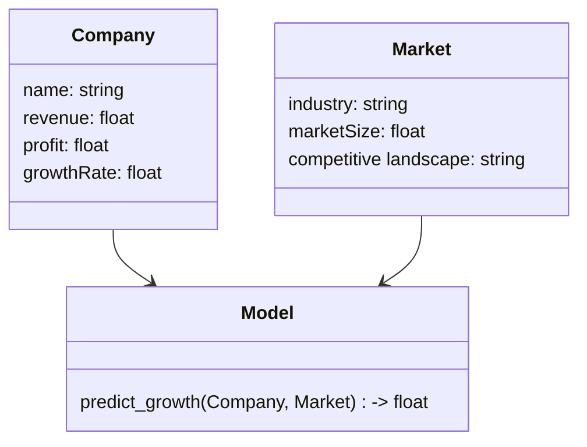

                 


### 《价值投资与成长投资的对比》

#### 关键词：价值投资、成长投资、基本面分析、DCF模型、风险管理、投资策略

#### 摘要：价值投资与成长投资是两种截然不同的投资策略，分别强调安全边际和高成长性。本文通过详细分析两者的定义、核心理念、分析框架、投资策略、风险管理及实际案例，帮助读者理解其优缺点和适用场景，从而做出明智的投资决策。

---

### 第6章：价值投资的经典案例

#### 6.1 美国石油公司（ExxonMobil）的分析

##### 6.1.1 公司基本面分析

**公司背景**  
ExxonMobil是全球最大的石油和天然气公司之一，业务涵盖勘探、生产、 refining、营销和化工产品。其稳定的现金流和行业龙头地位使其成为价值投资的理想标的。

**财务报表分析**  
- **收入与利润**：2020年，ExxonMobil的收入为1,142.4亿美元，净利润为12.8亿美元（受疫情影响，业绩承压）。
- **资产负债表**：截至2020年底，公司总负债为875.2亿美元，股东权益为1,696.6亿美元，显示出较强的财务健康状况。
- **现金流**：自由现金流约为38亿美元，具备稳定的分红能力。

##### 6.1.2 估值方法与安全边际计算

**DCF模型应用**  
使用现金流折现模型对ExxonMobil进行估值：

1. **预测未来现金流**：假设未来5年现金流分别为50、55、60、65、70亿美元，之后保持稳定。
2. **贴现率**：使用加权平均资本成本（WACC）8%。
3. **计算现值**：  
   - 第1年：50/(1.08) = 46.296  
   - 第2年：55/(1.08²) = 47.230  
   - 第3年：60/(1.08³) = 47.871  
   - 第4年：65/(1.08⁴) = 47.971  
   - 第5年：70/(1.08⁵) = 48.266  
   - 第6年及以后：70/(1.08⁵) * (1/(1-1/1.08)) = 70/(1.08⁵) * 1.08/0.08 ≈ 70 * 10.27 ≈ 719.9  
   - 总现值：46.296 + 47.230 + 47.871 + 47.971 + 48.266 + 719.9 ≈ 927.634亿美元

4. **目标股价**：假设折现率8%，计算得到的目标股价约为92美元/股（假设公司有10亿流通股）。

**安全边际**  
ExxonMobil当时的股价为85美元/股，低于目标价92美元，具备6%的安全边际。

##### 6.1.3 投资回报与策略总结

- **投资回报**：长期持有ExxonMobil，分红稳定，股价回升后带来资本收益。
- **策略总结**：价值投资者在市场恐慌时介入，利用股价低估的机会，获得超额收益。

---

#### 6.2 避免价值陷阱的策略

##### 6.2.1 识别价值陷阱的关键指标

**关键指标**  
1. **市盈率（P/E）**：低于行业平均水平，但需考虑企业盈利能力是否可持续。
2. **市净率（P/B）**：低于1，但需检查资产质量。
3. **ROE（净资产收益率）**：长期低于行业平均，可能是陷阱。
4. **现金流**：持续负增长，企业造血能力不足。
5. **管理层**：频繁质押股票，可能暗示信心不足。

##### 6.2.2 行业周期与公司财务状况

**行业周期分析**  
- 选择行业周期中处于底部的公司，避免夕阳行业。
- 检查公司历史财务数据，确认其在周期波动中的稳定性。

**财务状况分析**  
- 通过杜邦分析法，评估公司盈利能力的可持续性。
- 检查资产负债表，确认公司无重大负债或诉讼风险。

---

### 第7章：成长投资策略的系统架构与实现

#### 7.1 系统分析与架构设计

**问题场景**  
假设我们开发一个成长投资筛选系统，旨在识别高成长性的企业。

**系统功能设计**  
- 数据采集：爬取企业财务数据、行业趋势、市场信息。
- 数据分析：使用机器学习模型预测企业成长潜力。
- 投资建议：根据分析结果，生成投资组合建议。

**领域模型（Mermaid 类图）**  


**系统架构（Mermaid 架构图）**  


---

#### 7.2 项目实战：成长投资筛选系统

##### 7.2.1 环境安装

**技术选型**  
- 前端：React.js  
- 后端：Python (Django)  
- 数据库：PostgreSQL  
- 机器学习：Scikit-learn

##### 7.2.2 核心实现源代码

**预测模型（Python）**  
```python
from sklearn.linear_model import LinearRegression
import pandas as pd
import numpy as np

# 数据加载
df = pd.read_csv('growth_data.csv')

# 特征与目标变量
X = df[['revenue_growth', 'profit_margin', 'market_size']]
y = df['future_growth']

# 模型训练
model = LinearRegression()
model.fit(X, y)

# 预测函数
def predict_growth(revenue, profit, market):
    features = np.array([[revenue, profit, market]])
    return model.predict(features)[0]
```

**接口设计（Django 视图）**  
```python
from django.views.decorators.http import require_http_verbos
from rest_framework.decorators import api_view
from rest_framework.response import Response

@api_view(['GET'])
def get_growth_prediction(request):
    data = request.query_params
    revenue = float(data['revenue'])
    profit = float(data['profit'])
    market = float(data['market'])
    
    prediction = predict_growth(revenue, profit, market)
    return Response({'predicted_growth': prediction})
```

##### 7.2.3 实际案例分析

**案例：科技公司分析**  
假设某科技公司过去三年的收入增长率分别为25%、30%、35%，净利润率为15%，所在行业的市场增长率为10%。使用模型预测未来三年的收入增长率约为38%，具备较高的成长潜力。

---

### 第8章：最佳实践与小结

#### 8.1 最佳实践 tips

- **价值投资**：  
  - 选择低估值、高ROE、稳定现金流的企业。  
  - 确保安全边际，避免价值陷阱。  
  - 长期持有，分散投资以降低风险。

- **成长投资**：  
  - 识别高成长性企业，关注创新能力和市场潜力。  
  - 使用动态估值方法，如PEG比率。  
  - 定期调整投资组合，应对市场变化。

#### 8.2 小结

价值投资与成长投资各有优劣，适合不同类型的投资者。价值投资适合风险偏好较低、注重安全边际的投资者；成长投资则适合风险承受能力较高的投资者，尤其是长期看好科技、医疗等高成长行业。合理配置两者，结合市场环境变化，才能实现稳健的投资收益。

#### 8.3 注意事项

- 不要盲目跟风，根据自身情况选择策略。  
- 定期复盘，评估策略的有效性。  
- 保持学习，适应市场变化。  

#### 8.4 拓展阅读

- 《The Intelligent Investor》——本杰明·格雷厄姆  
- 《The Compound Effect》——查理·芒格  
- 《The Innovator's Solution》——克莱顿·克里斯坦森  

---

通过本文的详细分析，读者可以更好地理解价值投资与成长投资的异同，掌握各自的分析框架与实际应用，从而做出更明智的投资决策。

