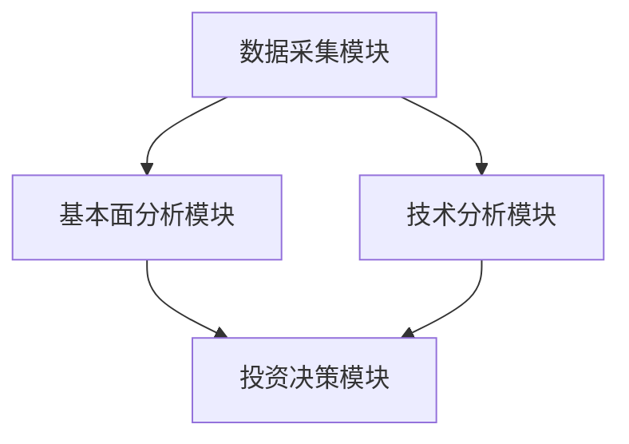
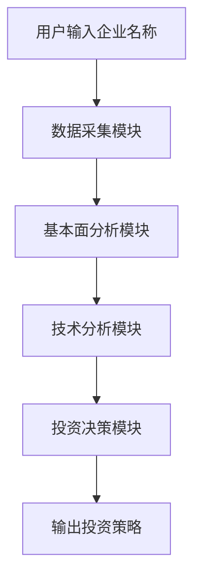
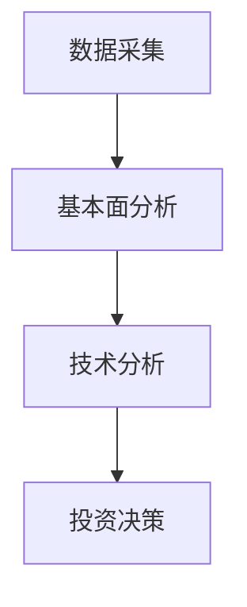

                 


# 价值投资与技术分析的结合

## 关键词：价值投资、技术分析、投资策略、系统架构、项目实战

## 摘要：价值投资与技术分析是两种截然不同的投资方法，但它们的结合可以通过互补的优势提高投资决策的科学性和成功率。本文详细探讨了价值投资和技术分析的核心概念，分析了它们的优缺点，提出了一种结合两者的投资策略，并通过系统架构设计和项目实战展示了如何在实际中应用这种结合。

---

# 第一部分：价值投资与技术分析的核心概念

## 第1章：价值投资的核心概念与特点

### 1.1 价值投资的定义与背景

价值投资是一种长期投资策略，起源于20世纪初，由本杰明·格雷厄姆和戴维·多德提出。其核心理念是寻找市场价格低于其内在价值的股票进行投资。这种策略注重企业的基本面分析，如盈利能力、财务状况和行业地位，旨在通过长期持有优质资产来实现资本增值。

#### 1.1.1 价值投资的起源与发展

价值投资的起源可以追溯到1934年，格雷厄姆和多德出版了《证券分析》一书，系统阐述了价值投资的基本原理。20世纪70年代，彼得·林奇等投资者进一步发展了这一理论，使其更加成熟和广泛应用。

#### 1.1.2 价值投资的核心理念

价值投资的核心理念是“买 cheap, 卖贵”。投资者应关注企业的内在价值，而非市场的短期波动。内在价值可以通过对企业财务报表、行业地位和管理团队的分析来评估。

#### 1.1.3 价值投资与成长投资的区别

价值投资注重低估值的股票，而成长投资则关注高增长潜力的企业。价值投资更注重安全边际，而成长投资更注重未来增长的潜力。

### 1.2 价值投资的特点

- **长期性**：价值投资是一种长期投资策略，注重企业的长期价值。
- **低风险性**：通过寻找低估的股票，降低投资风险。
- **逆向思维**：在市场恐慌时买入，市场疯狂时卖出。

---

## 第2章：技术分析的核心概念与特点

### 2.1 技术分析的定义与背景

技术分析是一种通过分析历史价格和成交量数据，预测未来价格走势的投资方法。它起源于19世纪末，随着技术的发展，逐渐成为一种系统化的投资工具。

#### 2.1.1 技术分析的起源与发展

技术分析起源于19世纪末的棉花交易市场，后来发展成为一门系统化的科学，广泛应用于股票、外汇、期货等市场。

#### 2.1.2 技术分析的核心理念

技术分析认为，市场的价格走势反映了所有相关信息，因此可以通过分析价格走势、成交量和其他技术指标来预测未来的价格变动。

#### 2.1.3 技术分析与基本面分析的区别

技术分析注重价格走势和技术指标，而基本面分析注重企业的财务状况和行业地位。技术分析是一种短期投资工具，而基本面分析是一种长期投资策略。

### 2.2 技术分析的特点

- **短期性**：技术分析适用于短期交易，注重价格走势和市场波动。
- **系统性**：技术分析通过系统化的指标和图表来分析市场走势。
- **灵活性**：技术分析可以根据市场变化迅速调整投资策略。

---

## 第3章：价值投资与技术分析的结合

### 3.1 价值投资与技术分析的优缺点对比

#### 3.1.1 价值投资的优点

- 提供长期稳定的收益
- 降低投资风险
- 注重企业的内在价值

#### 3.1.2 价值投资的缺点

- 需要较高的市场研究能力
- 投资周期长，流动性差
- 市场波动可能影响短期收益

#### 3.1.3 技术分析的优点

- 提供短期市场走势的预测
- 帮助投资者抓住市场机会
- 系统化的分析方法

#### 3.1.4 技术分析的缺点

- 易受市场情绪影响
- 技术分析指标可能存在误导性
- 需要频繁调整投资策略

---

### 3.2 价值投资与技术分析的结合优势

#### 3.2.1 提高投资决策的科学性

通过结合价值投资和技术分析，投资者可以更全面地评估企业的内在价值和市场走势，做出更科学的投资决策。

#### 3.2.2 降低投资风险

价值投资注重低估值，技术分析提供市场趋势的信号，两者结合可以有效降低投资风险。

#### 3.2.3 提高投资收益

通过价值投资选择优质企业，结合技术分析捕捉市场机会，可以提高投资收益。

---

## 第4章：价值投资与技术分析的结合方法

### 4.1 基本面分析与技术分析的结合

#### 4.1.1 基本面分析的步骤

1. **分析企业财务报表**：评估企业的盈利能力、财务状况和成长潜力。
2. **评估行业地位**：分析企业的市场占有率、竞争优势和行业前景。
3. **评估管理团队**：了解企业管理层的背景和能力。

#### 4.1.2 技术分析的步骤

1. **分析价格走势**：通过K线图、趋势线和支撑线等工具分析价格走势。
2. **分析技术指标**：使用移动平均线、相对强弱指数（RSI）和MACD等指标预测市场走势。
3. **分析成交量**：通过成交量分析市场的买卖力量。

#### 4.1.3 两者结合的步骤

1. **选择低估企业**：通过基本面分析选择具有低估潜力的企业。
2. **分析技术信号**：通过技术分析寻找买入或卖出信号。
3. **制定投资策略**：结合基本面和技术分析的信号制定投资策略。

---

### 4.2 技术指标与价值评估的结合

#### 4.2.1 常用技术指标介绍

- **移动平均线（MA）**：用于分析价格趋势。
- **相对强弱指数（RSI）**：用于分析超买超卖信号。
- **MACD**：用于分析价格趋势和动能。

#### 4.2.2 价值评估模型的构建

价值评估模型可以通过以下步骤构建：

1. **确定企业的内在价值**：通过现金流折现法（DCF）或其他估值方法评估企业的内在价值。
2. **分析技术指标**：结合技术指标分析市场的买卖信号。
3. **制定投资策略**：根据企业的内在价值和技术指标的信号制定投资策略。

#### 4.2.3 技术指标与价值评估的结合方法

1. **结合企业估值和市场趋势**：通过企业估值选择低估企业，结合技术指标分析市场趋势。
2. **制定买卖信号**：当技术指标发出买入信号且企业估值低于市场价时，买入股票；当技术指标发出卖出信号且企业估值高于市场价时，卖出股票。

---

## 第5章：系统分析与架构设计方案

### 5.1 价值投资与技术分析结合的系统架构

#### 5.1.1 系统功能模块设计

1. **数据采集模块**：采集企业的财务数据和市场数据。
2. **基本面分析模块**：分析企业的财务报表和行业地位。
3. **技术分析模块**：分析技术指标和市场趋势。
4. **投资决策模块**：结合基本面和技术分析的结果制定投资策略。

#### 5.1.2 系统架构图（Mermaid）



#### 5.1.3 系统接口设计

- 数据采集模块接口：提供数据采集的功能，包括企业财务数据和市场数据。
- 基本面分析模块接口：提供企业财务报表分析和行业地位分析的功能。
- 技术分析模块接口：提供技术指标分析和市场趋势分析的功能。
- 投资决策模块接口：提供投资策略制定的功能。

---

### 5.2 系统交互设计

#### 5.2.1 用户交互流程图（Mermaid）



#### 5.2.2 系统功能流程图（Mermaid）



---

## 第6章：项目实战

### 6.1 环境安装与数据准备

#### 6.1.1 数据源选择

选择一家企业的财务数据和市场数据作为数据源。

#### 6.1.2 数据清洗与预处理

对数据进行清洗和预处理，确保数据的准确性和完整性。

#### 6.1.3 数据存储与管理

将数据存储在数据库中，便于后续的分析和处理。

---

### 6.2 系统核心实现源代码

#### 6.2.1 价值评估模型实现

```python
def calculate_intrinsic_value(company_financials):
    # 使用现金流折现法计算企业内在价值
    # 具体实现代码
    pass
```

#### 6.2.2 技术指标计算实现

```python
def calculate_technical_indicators(prices, periods):
    # 计算移动平均线、RSI等技术指标
    # 具体实现代码
    pass
```

#### 6.2.3 系统交互实现

```python
def main():
    company_name = input("请输入公司名称：")
    # 数据采集模块
    data = get_data(company_name)
    # 基本面分析模块
    financial_analysis = analyze_financials(data)
    # 技术分析模块
    technical_analysis = analyze_technicals(data)
    # 投资决策模块
    investment_strategy = decide_investment(financial_analysis, technical_analysis)
    print("投资策略：", investment_strategy)
```

---

### 6.3 代码应用解读与分析

#### 6.3.1 代码结构分析

1. **数据采集模块**：从数据库或其他数据源获取企业的财务数据和市场数据。
2. **基本面分析模块**：分析企业的财务报表和行业地位，计算企业的内在价值。
3. **技术分析模块**：分析技术指标和市场趋势，预测未来的价格走势。
4. **投资决策模块**：结合基本面和技术分析的结果，制定投资策略。

#### 6.3.2 代码功能解读

- 价值评估模型通过现金流折现法计算企业的内在价值。
- 技术指标计算模块计算移动平均线、RSI等技术指标，分析市场趋势。
- 投资决策模块根据企业的内在价值和技术指标的信号，制定买入或卖出的投资策略。

#### 6.3.3 代码优化建议

- 数据采集模块可以优化数据获取的效率，减少数据获取的时间。
- 基本面分析模块可以引入更多的财务指标，提高分析的准确性。
- 技术分析模块可以引入更多的技术指标，提高预测的准确性。

---

## 第7章：最佳实践与小结

### 7.1 投资策略优化建议

#### 7.1.1 价值投资策略优化

- 定期审查投资组合，调整持仓。
- 选择低估且具有成长潜力的企业。

#### 7.1.2 技术分析策略优化

- 结合多个技术指标，提高预测的准确性。
- 定期回顾交易记录，优化交易策略。

#### 7.1.3 结合策略

- 将价值投资和技术分析结合起来，制定综合性的投资策略。

---

## 结语

价值投资与技术分析的结合是一种创新的投资方法，通过互补的优势，可以帮助投资者做出更科学的投资决策。本文详细探讨了价值投资和技术分析的核心概念，分析了它们的优缺点，提出了一种结合两者的投资策略，并通过系统架构设计和项目实战展示了如何在实际中应用这种结合。希望本文能为投资者提供有价值的参考，帮助他们在复杂多变的市场中获得更好的投资收益。

--- 

**郑重声明：**  
本文仅为技术探讨，不构成投资建议。投资有风险，入市需谨慎。

