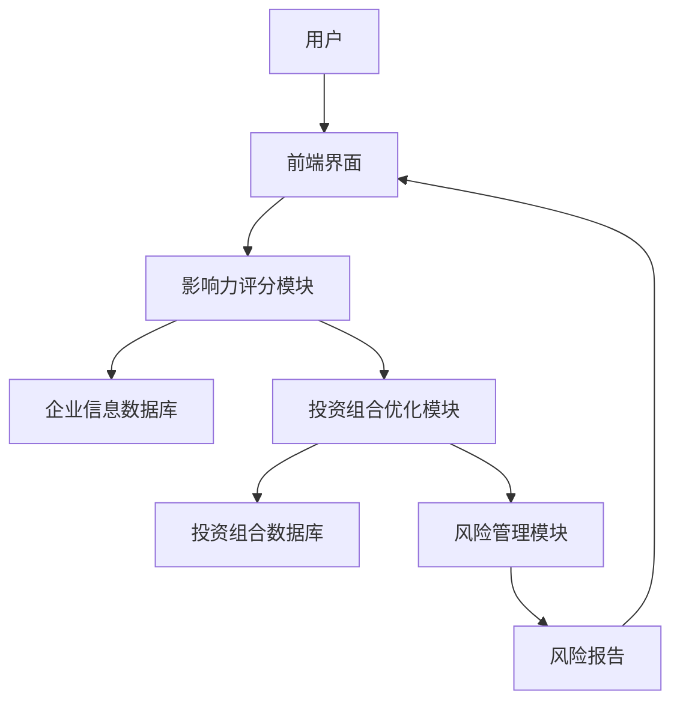
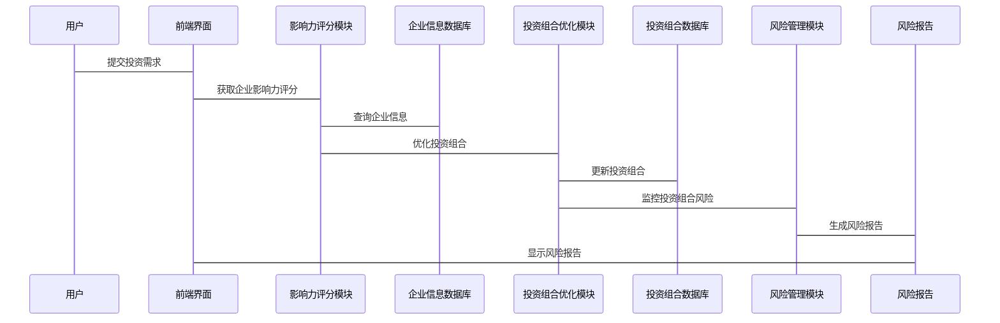

                 


# 价值投资与社会影响力：将使命驱动型企业纳入投资组合

---

## 关键词：价值投资，社会影响力，使命驱动型企业，投资组合，影响力评分模型

---

## 摘要：  
随着全球社会和经济的快速发展，投资不仅仅是追求财务回报，还需要考虑社会影响力。使命驱动型企业以其明确的使命和价值观，在市场上展现出独特的竞争力。本文将探讨如何将使命驱动型企业纳入投资组合，分析其对投资回报和社会价值的双重影响。通过构建影响力评分模型和系统架构，本文为投资者提供了一种全新的投资策略，帮助他们在追求财务回报的同时，实现社会价值的最大化。

---

## 第1章：价值投资的核心概念

### 1.1 价值投资的定义与起源

#### 1.1.1 价值投资的起源与发展  
价值投资是一种以基本面分析为基础的投资策略，起源于20世纪初。本杰明·格雷厄姆和戴维·多德是价值投资的奠基人。他们提出，投资者应以低于内在价值的价格买入股票，以获得长期稳定的收益。

#### 1.1.2 价值投资的核心理念  
价值投资的核心理念是寻找市场低估的股票，关注企业的内在价值，而非市场的短期波动。投资者需要深入分析企业的财务状况、行业地位和竞争优势，以识别具有长期增长潜力的企业。

#### 1.1.3 价值投资与成长投资的对比  
与成长投资相比，价值投资更注重企业的当前价值和安全边际，而非未来的增长潜力。成长投资者倾向于投资高增长企业，而价值投资者则关注被市场低估的企业。

### 1.2 价值投资的背景与重要性

#### 1.2.1 价值投资的背景  
价值投资在经历了多次市场波动后，依然展现出其强大的生命力。特别是在2008年金融危机后，价值投资重新受到投资者的关注，成为一种更为稳健的投资策略。

#### 1.2.2 价值投资的重要性  
价值投资通过深入的基本面分析，帮助投资者在市场波动中保持冷静，避免情绪化决策。这种策略不仅能够分散风险，还能在长期实现稳定的收益。

#### 1.2.3 价值投资的局限性  
价值投资的局限性在于其对市场的依赖性和对管理层的信任度。此外，价值投资需要较长的时间周期，短期内可能无法实现收益。

---

## 第2章：社会影响力投资的兴起

### 2.1 社会影响力投资的定义

#### 2.1.1 社会影响力投资的背景  
随着社会问题的日益突出，影响力投资作为一种新兴的投资方式，逐渐受到关注。它将社会价值与经济回报相结合，旨在通过投资解决社会问题。

#### 2.1.2 社会影响力投资的核心目标  
影响力投资的目标是在追求财务回报的同时，推动社会进步，解决贫困、环保、教育等社会问题。

#### 2.1.3 社会影响力投资与传统投资的区别  
与传统投资相比，影响力投资更加关注企业的社会影响力，注重企业的使命和价值观，而非单纯的财务表现。

### 2.2 社会影响力投资的重要性和必要性

#### 2.2.1 社会影响力投资的全球趋势  
近年来，全球影响力投资规模持续增长，越来越多的投资者开始关注企业的社会影响力。根据相关报告，影响力投资的市场规模已超过1万亿美元。

#### 2.2.2 社会影响力投资对社会和经济的双重价值  
影响力投资不仅能够推动社会进步，还能为企业创造长期价值。通过投资社会影响力项目，投资者可以在实现社会目标的同时，获得稳定的经济回报。

#### 2.2.3 社会影响力投资的未来展望  
随着技术的进步和社会问题的加剧，影响力投资的未来发展潜力巨大。它将成为投资领域的重要趋势，推动全球经济的可持续发展。

---

## 第3章：使命驱动型企业的核心概念与联系

### 3.1 使命驱动型企业的定义与特点

#### 3.1.1 使命驱动型企业的核心要素  
使命驱动型企业以明确的使命为导向，注重企业的社会责任和价值观。它们通常具有清晰的愿景、强烈的价值观和长期的使命感。

#### 3.1.2 使命驱动型企业与传统企业的对比  
与传统企业相比，使命驱动型企业更加注重社会价值，关注企业的长期目标而非短期利益。它们在决策过程中更加注重社会影响和企业的可持续发展。

#### 3.1.3 使命驱动型企业对投资的价值  
使命驱动型企业由于其独特的使命和价值观，往往能够在市场中获得更高的品牌溢价和客户忠诚度。这种企业更有可能实现长期稳定的发展，为投资者带来持续的回报。

### 3.2 使命驱动型企业与投资价值的关系

#### 3.2.1 使命驱动型企业对投资回报的影响  
使命驱动型企业由于其长期稳定的经营策略和强大的品牌影响力，往往能够为投资者带来更高的回报。它们在市场波动中表现更为稳健，具有更强的抗风险能力。

#### 3.2.2 使命驱动型企业对投资风险的降低  
使命驱动型企业注重社会价值和可持续发展，其经营策略更加稳健，风险相对较低。这种企业更有可能在经济危机中保持稳定，为投资者提供安全保障。

#### 3.2.3 使命驱动型企业对社会影响力的投资  
通过投资使命驱动型企业，投资者不仅能够实现财务回报，还能推动社会进步，解决社会问题。这种投资方式不仅符合企业的使命，也符合投资者的社会责任。

---

## 第4章：使命驱动型企业的影响力评分模型

### 4.1 影响力评分模型的定义

#### 4.1.1 影响力评分模型的背景  
为了更好地评估使命驱动型企业的社会影响力，我们需要建立一个科学的评分模型。影响力评分模型通过量化企业的社会影响力，帮助投资者做出更为明智的投资决策。

#### 4.1.2 影响力评分模型的核心原理  
影响力评分模型基于企业的使命、价值观、社会责任和经营绩效，通过量化指标对企业的影响能力进行评估。模型的核心在于将企业的社会影响力转化为可量化的指标，为投资者提供参考依据。

#### 4.1.3 影响力评分模型的数学公式  
影响力评分模型的计算公式如下：  
$$ I = \sum_{i=1}^{n} w_i \cdot s_i $$  
其中，\( I \) 表示影响力评分，\( w_i \) 表示指标 \( i \) 的权重，\( s_i \) 表示指标 \( i \) 的评分。  

---

## 第5章：系统分析与架构设计

### 5.1 系统功能设计

#### 5.1.1 系统功能模块划分  
影响力投资组合管理系统主要包括以下几个功能模块：  
1. 企业信息管理模块：用于存储和管理企业的基本信息。  
2. 影响力评估模块：基于影响力评分模型对企业进行评估。  
3. 投资组合优化模块：根据评估结果优化投资组合。  
4. 风险管理模块：用于监控和管理投资组合中的风险。  

#### 5.1.2 系统功能设计的细节  
每个功能模块的具体功能如下：  
- 企业信息管理模块：包括企业基本信息、财务数据、社会责任报告等。  
- 影响力评估模块：根据影响力评分模型对企业进行评分，生成评估报告。  
- 投资组合优化模块：基于评估结果和投资目标，优化投资组合。  
- 风险管理模块：监控投资组合的风险，及时调整投资策略。  

### 5.2 系统架构设计

#### 5.2.1 系统架构图  
以下是影响力投资组合管理系统的架构图：  


#### 5.2.2 系统交互流程  
以下是系统的交互流程图：  


---

## 第6章：项目实战

### 6.1 环境安装

#### 6.1.1 系统环境要求  
- 操作系统：Windows 10 或更高版本，或 macOS 10.15 或更高版本。  
- 开发工具：Python 3.8 或更高版本，Jupyter Notebook。  
- 数据库：MySQL 或 PostgreSQL。  

#### 6.1.2 依赖库安装  
安装以下依赖库：  
- `pandas`：用于数据处理。  
- `numpy`：用于数值计算。  
- `scikit-learn`：用于机器学习算法。  
- `matplotlib`：用于数据可视化。  

### 6.2 核心代码实现

#### 6.2.1 影响力评分模型的实现  
以下是影响力评分模型的Python代码：  
```python
import pandas as pd
import numpy as np

def calculate_influence_score(data, weights):
    return np.dot(data, weights)

# 示例数据
data = np.array([[0.8, 0.9, 0.7],
                 [0.6, 0.8, 0.5],
                 [0.7, 0.7, 0.6]])
weights = np.array([0.4, 0.3, 0.3])

influence_scores = calculate_influence_score(data, weights)
print("影响力评分：", influence_scores)
```

#### 6.2.2 投资组合优化的实现  
以下是投资组合优化的Python代码：  
```python
import numpy as np

def optimize_portfolio(returns, weights):
    n = len(returns)
    return np.dot(returns, weights)

# 示例数据
returns = np.array([[0.1, 0.2, 0.15],
                    [0.15, 0.1, 0.2],
                    [0.2, 0.15, 0.1]])
weights = np.array([0.3, 0.4, 0.3])

optimized_returns = optimize_portfolio(returns, weights)
print("优化后的回报：", optimized_returns)
```

### 6.3 实际案例分析

#### 6.3.1 案例背景  
假设我们有三个使命驱动型企业，分别是企业A、企业B和企业C。它们的财务数据和社会影响力数据如下：  
- 企业A：财务回报率10%，影响力评分0.8。  
- 企业B：财务回报率15%，影响力评分0.7。  
- 企业C：财务回报率20%，影响力评分0.6。  

#### 6.3.2 案例分析  
使用影响力评分模型对这三个企业进行评估，并优化投资组合。假设权重为财务回报占40%，影响力评分占30%，其他因素占30%。  

### 6.4 项目总结  
通过实际案例分析，我们可以看到，影响力评分模型能够有效地帮助企业评估社会影响力，并优化投资组合。这种投资策略不仅能够实现财务回报，还能推动社会进步。

---

## 第7章：最佳实践

### 7.1 小结

#### 7.1.1 价值投资与社会影响力的关系  
价值投资与社会影响力投资的结合，不仅能够实现财务回报，还能推动社会进步。  

#### 7.1.2 使命驱动型企业的重要性  
使命驱动型企业是影响力投资的核心，它们通过明确的使命和价值观，为企业和社会创造双重价值。  

### 7.2 注意事项

#### 7.2.1 投资风险的控制  
在进行影响力投资时，投资者需要注意投资风险，特别是企业的社会责任和经营稳定性。  

#### 7.2.2 投资组合的优化  
投资者需要根据市场变化和企业绩效，及时优化投资组合，以实现最佳的回报。  

### 7.3 拓展阅读

#### 7.3.1 推荐书籍  
- 《价值投资：原理与实践》  
- 《影响力投资：理论与实践》  

#### 7.3.2 推荐博客与网站  
- 知乎：价值投资与影响力投资相关文章。  
- 《财富》杂志：影响力投资的最新动态。  

---

## 第8章：总结

通过本文的探讨，我们了解到，将使命驱动型企业纳入投资组合，不仅能够实现财务回报，还能推动社会进步。影响力评分模型和投资组合优化方法为我们提供了一种全新的投资策略。未来，随着社会问题的加剧，影响力投资将成为投资领域的重要趋势，推动全球经济的可持续发展。

