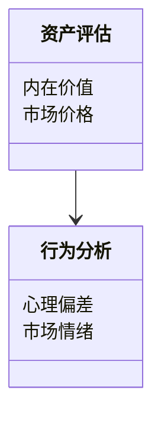

                 


# 价值投资与行为金融学的交叉

## 关键词：价值投资、行为金融学、资产定价、心理偏差、算法优化

## 摘要：
本文探讨了价值投资与行为金融学的交叉应用，结合资产定价模型和投资者心理偏差，优化投资策略。通过分析DCF模型和行为修正算法，构建综合评估系统，提升投资决策的准确性。

---

# 第一部分: 价值投资与行为金融学的背景介绍

## 第1章: 价值投资的核心概念

### 1.1 定义与历史发展
价值投资是由本杰明·格雷厄姆提出，强调购买被市场低估的资产，通过长期持有实现收益。其历史发展经历了格雷厄姆时代、巴菲特时代和现代量化分析阶段。

### 1.2 基本原理与方法
- **基本面分析**：评估资产的内在价值，关注财务指标如市盈率、市净率等。
- **安全边际**：买入价格低于内在价值，以降低风险。

### 1.3 发展现状
价值投资从传统方法向量化和系统化方向发展，结合大数据和人工智能提升效率。

## 第2章: 行为金融学的核心概念

### 2.1 定义与历史发展
行为金融学研究投资者心理偏差对决策的影响，起源于20世纪80年代，阿莫斯·特沃斯基和丹尼尔·卡尼曼是主要推动者。

### 2.2 基本原理与方法
- **认知偏差**：投资者常见的心理偏差如 anchoring、overconfidence。
- **情绪影响**：市场情绪波动对资产定价的影响。

### 2.3 现展现状
行为金融学从理论研究向实际应用扩展，广泛应用于风险管理和投资组合优化。

---

# 第二部分: 价值投资与行为金融学的核心概念与联系

## 第3章: 核心概念的原理与特征

### 3.1 价值投资的原理
- 基于资产的内在价值，强调长期持有和安全边际。

### 3.2 行为金融学的原理
- 分析投资者心理偏差，预测非理性行为。

### 3.3 对比分析
| 特性 | 价值投资 | 行为金融学 |
|------|-----------|-------------|
| 核心 | 内在价值 | 心理偏差 |
| 方法 | 基本面分析 | 行为分析 |
| 目标 | 实现收益 | 优化决策 |

## 第4章: 价值投资与行为金融学的联系与区别

### 4.1 联系
- 价值投资关注内在价值，行为金融学关注价格偏差，两者结合可优化定价模型。

### 4.2 区别
- 价值投资侧重长期策略，行为金融学侧重短期情绪影响。

---

# 第三部分: 价值投资与行为金融学的算法原理

## 第5章: 价值投资的算法原理

### 5.1 基于DCF模型的算法流程
- **步骤1**：预测未来现金流。
- **步骤2**：选择合适的折现率。
- **步骤3**：计算DCF值。

### 5.2 DCF模型的数学公式
$$DCF = \frac{CF}{(r - g)}$$
其中，CF为现金流，r为折现率，g为永续增长率。

## 第6章: 行为金融学的算法原理

### 6.1 基于行为偏差的修正算法
- **步骤1**：计算DCF值。
- **步骤2**：评估投资者心理偏差。
- **步骤3**：调整DCF值。

### 6.2 行为偏差的数学公式
$$Behavior\ Adjustment = \frac{DCF}{(1 + \alpha \times Bias)}$$
其中，α为调整系数，Bias为心理偏差程度。

---

# 第四部分: 价值投资与行为金融学的系统架构设计

## 第7章: 系统功能设计

### 7.1 领域模型设计


### 7.2 系统架构设计


---

# 第五部分: 项目实战

## 第8章: 实战案例分析

### 8.1 环境配置
安装Python和相关库（numpy、pandas、scipy）。

### 8.2 核心代码实现
```python
import numpy as np
import pandas as pd

def discounted_cash_flow(cash_flows, discount_rate, growth_rate):
    return sum(cash_flows / (discount_rate - growth_rate))

def behavior_adjustment(dcf_value, bias_factor):
    return dcf_value / (1 + bias_factor)
```

### 8.3 应用解读
分析某公司的DCF值和行为调整后的价值，展示如何优化定价模型。

---

# 第六部分: 总结与展望

## 第9章: 总结

### 9.1 主要结论
- 价值投资与行为金融学的结合可提升资产定价的准确性。
- DCF模型结合行为修正算法是有效的优化方法。

## 第10章: 展望

### 10.1 未来研究方向
- 开发更复杂的模型，考虑更多心理偏差。
- 应用机器学习优化行为分析。

---

# 第七部分: 最佳实践与小结

## 第11章: 最佳实践 tips

### 11.1 投资者建议
- 结合基本面分析和行为分析，制定策略。
- 定期复盘，调整模型参数。

## 第12章: 小结

### 12.1 文章核心内容回顾
- 价值投资与行为金融学的交叉应用。
- DCF模型与行为修正算法的结合。

### 12.2 注意事项
- 数据质量影响结果，需谨慎处理。
- 模型的应用需结合具体市场环境。

## 第13章: 拓展阅读

### 13.1 推荐书目
- 《价值投资实战策略》
- 《行为金融学入门》

---

通过以上结构和内容，我们系统地探讨了价值投资与行为金融学的交叉应用，结合理论分析和实战案例，为投资者提供了优化的资产定价方法和决策支持。

