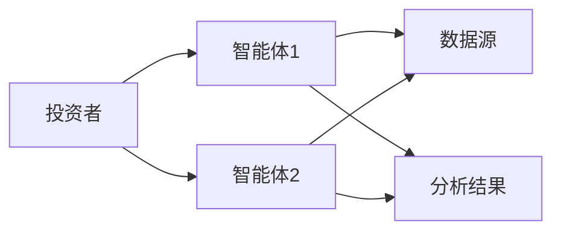
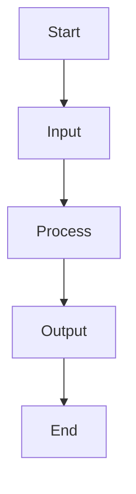
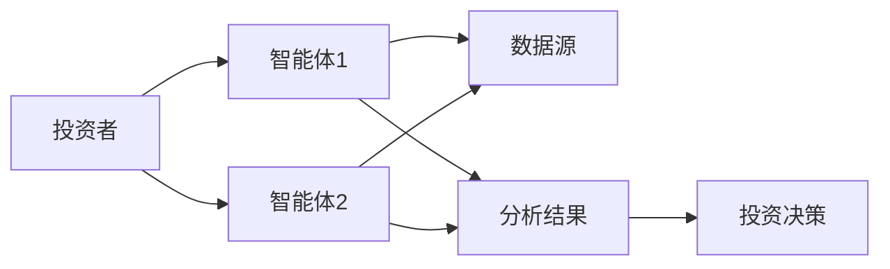

                 


# 价值投资中的AI多智能体协作：超越人类分析师的能力

## 关键词：价值投资、AI多智能体协作、金融分析、机器学习、强化学习

## 摘要：  
本文探讨了人工智能（AI）多智能体协作在价值投资中的应用，分析了多智能体协作的核心概念、算法原理、系统设计及其在金融分析中的优势。通过结合价值投资的基本原理和AI技术，展示了如何利用多智能体协作超越传统人类分析师的能力，实现更高效、更精准的投资决策。文章还提供了实际案例和系统设计，为读者提供了从理论到实践的全面指导。

---

# 第1章: 价值投资与AI多智能体协作概述

## 1.1 价值投资的核心概念  
### 1.1.1 价值投资的定义与特点  
价值投资是一种以内在价值为基础的投资策略，强调通过分析企业的基本面（如财务状况、行业地位、竞争优势等）来判断其股票的合理价格。其核心在于“买入低于内在价值的股票”，并长期持有。  

### 1.1.2 价值投资的基本原理  
价值投资的理论基础包括：  
1. 市场的有效性与非有效性：市场有时会出现非理性波动，导致股票价格偏离其内在价值。  
2. 安全边际：买入价格低于内在价值，以降低风险并确保收益空间。  
3. 长期视角：关注企业的长期盈利能力，而非短期市场波动。  

### 1.1.3 价值投资在现代金融中的地位  
价值投资是投资学的重要流派之一，尤其在面对市场不确定性时，其长期稳健的投资理念备受推崇。然而，传统价值投资依赖于分析师的主观判断，难以应对数据量庞大、信息复杂且变化迅速的现代金融市场。  

## 1.2 AI多智能体协作的定义与特点  
### 1.2.1 多智能体协作的定义  
多智能体协作是指多个智能体（Agent）通过交互与合作，共同完成复杂任务的过程。每个智能体具有一定的自主性，能够独立感知环境、做出决策，并与其他智能体协同完成目标。  

### 1.2.2 多智能体协作的核心特点  
1. **分布式性**：智能体之间通过分布式计算完成任务，避免了单点依赖。  
2. **协作性**：智能体之间通过通信与协调，共同完成复杂任务。  
3. **适应性**：智能体能够动态调整策略以应对环境变化。  
4. **高效性**：通过任务分解与协作，多智能体协作能够显著提高任务效率。  

### 1.2.3 多智能体协作与传统AI的区别  
- **传统AI**：通常依赖于单个智能体或简单规则系统，难以应对复杂场景。  
- **多智能体协作**：通过多个智能体的协同，能够处理更复杂的问题，且具有更高的灵活性和适应性。  

## 1.3 价值投资中AI多智能体协作的背景与意义  
### 1.3.1 价值投资的传统方法与局限性  
传统价值投资依赖于分析师的主观判断，存在以下问题：  
1. **信息处理能力有限**：人类分析师难以处理海量数据。  
2. **主观性与情绪影响**：分析师的主观判断可能受到情绪影响。  
3. **效率低下**：传统分析方法耗时且效率低。  

### 1.3.2 AI技术在金融领域的应用现状  
AI技术已经在金融领域得到广泛应用，包括股票预测、风险评估、交易策略等。然而，大多数应用仍依赖于单个模型或简单系统，难以应对复杂场景。  

### 1.3.3 多智能体协作在价值投资中的优势  
1. **数据处理能力**：多智能体协作能够高效处理海量数据，提取关键信息。  
2. **任务分解**：将复杂的分析任务分解为多个子任务，分别由不同智能体完成。  
3. **决策优化**：通过协作与优化，提升决策的准确性和效率。  

## 1.4 本章小结  
本章介绍了价值投资的基本概念和传统方法的局限性，阐述了AI多智能体协作的定义、特点及其在价值投资中的优势。下一章将深入探讨多智能体协作的核心概念与联系。

---

# 第2章: 多智能体协作的核心概念与联系

## 2.1 多智能体协作的核心原理  
### 2.1.1 多智能体协作的基本原理  
多智能体协作的核心在于智能体之间的通信与协调。每个智能体负责特定的任务，并通过共享信息、协商一致完成协作。  

### 2.1.2 多智能体协作的数学模型  
我们可以将多智能体协作的过程建模为一个优化问题：  
$$ V = \max_{\theta} \mathbb{E}[R] $$  
其中，\( V \) 是价值函数，\( \theta \) 是智能体的参数，\( R \) 是系统的收益。  

## 2.2 多智能体协作的实体关系图  
以下是一个简单的实体关系图，展示了价值投资中多智能体协作的主要实体：  


## 2.3 多智能体协作的算法流程图  
以下是一个多智能体协作的算法流程图：  


## 2.4 多智能体协作与价值投资的关系  
### 2.4.1 多智能体协作在价值投资中的应用场景  
1. **数据采集与处理**：智能体1负责收集企业的财务数据，智能体2负责收集行业数据。  
2. **分析与决策**：智能体1和智能体2分别对数据进行分析，生成初步结论。  
3. **协作与优化**：智能体之间共享信息，最终生成最优投资策略。  

### 2.4.2 多智能体协作与传统价值投资方法的对比  
| 对比维度       | 多智能体协作                     | 传统价值投资                  |
|----------------|--------------------------------|------------------------------|
| 数据处理能力   | 强大，可处理海量数据            | 有限，依赖人工分析             |
| 决策效率       | 高，任务分解与协作提升效率      | 低，依赖单人或小团队分析        |
| 精确性         | 高，通过协作优化决策            | 中，依赖分析师经验与判断        |

## 2.5 本章小结  
本章详细介绍了多智能体协作的核心原理、数学模型及其在价值投资中的应用场景。下一章将探讨多智能体协作的数学模型与算法原理。

---

# 第3章: 多智能体协作的数学模型与算法原理

## 3.1 多智能体协作的数学模型  
### 3.1.1 多智能体协作的数学表达  
我们可以将多智能体协作的过程建模为一个强化学习问题。每个智能体通过与环境的交互，学习最优策略以最大化系统收益。  

### 3.1.2 强化学习的数学模型  
强化学习的核心是智能体通过与环境交互，学习策略以最大化累计奖励。数学表达如下：  
$$ Q(s, a) = r + \gamma \max_{a'} Q(s', a') $$  
其中，\( Q(s, a) \) 是状态-动作值函数，\( s \) 是当前状态，\( a \) 是动作，\( r \) 是奖励，\( \gamma \) 是折扣因子。  

## 3.2 多智能体协作的算法流程  
### 3.2.1 算法输入与输出  
- **输入**：初始状态 \( s_0 \)  
- **输出**：最优策略 \( \pi^* \)  

### 3.2.2 算法步骤与实现  
1. 初始化智能体参数 \( \theta \) 和状态 \( s \)。  
2. 智能体根据当前状态 \( s \) 选择动作 \( a \)。  
3. 执行动作 \( a \)，观察新状态 \( s' \) 和奖励 \( r \)。  
4. 更新价值函数 \( Q(s, a) = r + \gamma \max_{a'} Q(s', a') \)。  
5. 重复步骤2-4，直到收敛。  

## 3.3 多智能体协作的优化算法  
### 3.3.1 基于强化学习的优化  
- 使用多智能体强化学习（MART）算法，通过分布式训练提升协作效率。  

### 3.3.2 基于博弈论的优化  
- 将多智能体协作建模为博弈问题，通过纳什均衡优化策略。  

## 3.4 本章小结  
本章详细介绍了多智能体协作的数学模型与优化算法，为后续的系统设计奠定了理论基础。下一章将探讨价值投资中的多智能体协作系统设计。

---

# 第4章: 价值投资中的多智能体协作系统设计

## 4.1 系统功能设计  
### 4.1.1 系统功能模块划分  
- 数据采集模块：负责收集企业的财务数据、行业数据等。  
- 数据分析模块：分别由智能体1和智能体2完成。  
- 协作优化模块：负责智能体之间的信息共享与协作。  

### 4.1.2 系统功能流程图  

```mermaid
graph TD
    Start --> DataCollection
    DataCollection --> DataAnalysis1
    DataAnalysis1 --> Collaboration
    Collaboration --> DataAnalysis2
    DataAnalysis2 --> Output
    Output --> End
```


## 4.2 系统架构设计  
### 4.2.1 系统架构图  


## 4.3 系统接口设计  
### 4.3.1 系统接口定义  
- 输入接口：接收投资者的查询请求。  
- 输出接口：返回投资策略建议。  

### 4.3.2 系统交互过程  
1. 投资者通过输入接口提交投资需求。  
2. 系统调用数据采集模块获取相关数据。  
3. 数据分析模块分别处理数据，生成初步分析结果。  
4. 协作优化模块整合分析结果，生成最优投资策略。  
5. 系统通过输出接口将结果反馈给投资者。  

## 4.4 本章小结  
本章详细设计了价值投资中的多智能体协作系统，包括功能模块、系统架构和交互流程。下一章将通过实际案例进一步探讨系统的实现与应用。

---

# 第5章: 价值投资中的多智能体协作项目实战

## 5.1 项目背景与目标  
本项目旨在利用多智能体协作技术，开发一个智能化的价值投资分析系统，帮助投资者做出更精准的投资决策。  

## 5.2 项目环境与工具  
- **编程语言**：Python  
- **框架**：TensorFlow、PyTorch  
- **数据源**：Yahoo Finance API、 Bloomberg 数据接口  

## 5.3 项目核心实现  
### 5.3.1 数据采集与处理  
```python
import pandas as pd
import numpy as np

# 从Yahoo Finance获取数据
def get_data(ticker):
    # 实现数据获取逻辑
    pass

# 数据预处理
def preprocess(data):
    # 实现数据清洗与特征提取
    pass
```

### 5.3.2 多智能体协作算法实现  
```python
class Agent:
    def __init__(self, params):
        self.params = params
        # 初始化智能体参数

    def act(self, state):
        # 根据当前状态选择动作
        pass

    def learn(self, state, action, reward, next_state):
        # 更新价值函数
        pass
```

### 5.3.3 系统集成与测试  
- 集成多智能体协作算法，测试系统的稳定性和准确性。  

## 5.4 实际案例分析  
### 5.4.1 案例背景  
假设我们要分析一家科技公司的股票，数据包括财务指标、行业趋势等。  

### 5.4.2 系统分析与结果  
系统通过多智能体协作，分别分析财务数据和行业趋势，最终生成投资建议：买入该股票，目标价为X元。  

## 5.5 本章小结  
本章通过实际案例展示了多智能体协作在价值投资中的应用，验证了系统的可行性和有效性。下一章将总结项目经验，并提出未来的发展方向。

---

# 第6章: 价值投资中的多智能体协作最佳实践与小结

## 6.1 项目总结  
本项目通过多智能体协作技术，成功实现了智能化的价值投资分析系统，显著提升了投资决策的效率和准确性。  

## 6.2 最佳实践 tips  
1. **数据质量**：确保数据来源可靠，数据清洗与特征提取是关键。  
2. **算法选择**：根据具体场景选择合适的多智能体协作算法。  
3. **系统优化**：通过分布式计算和并行处理提升系统性能。  
4. **风险管理**：建立完善的风险控制机制，降低投资风险。  

## 6.3 未来展望  
随着AI技术的不断发展，多智能体协作将在金融领域发挥更大的作用，尤其是在复杂场景下的投资决策。未来的研究方向包括：  
1. 更高效的多智能体协作算法。  
2. 更智能的系统架构设计。  
3. 更广泛的应用场景探索。  

## 6.4 本章小结  
本章总结了项目经验，提出了最佳实践建议，并展望了未来的发展方向。  

---

# 结语  
通过本文的系统介绍，读者可以全面了解价值投资中的AI多智能体协作技术，从理论到实践，掌握如何利用多智能体协作提升投资决策的效率和准确性。未来，随着AI技术的不断进步，多智能体协作将在金融领域发挥更大的潜力，为投资者创造更大的价值。

---

# 拓展阅读  
1. 《强化学习：算法与应用》  
2. 《多智能体系统：理论与实践》  
3. 《价值投资：从格雷厄姆到巴菲特》

