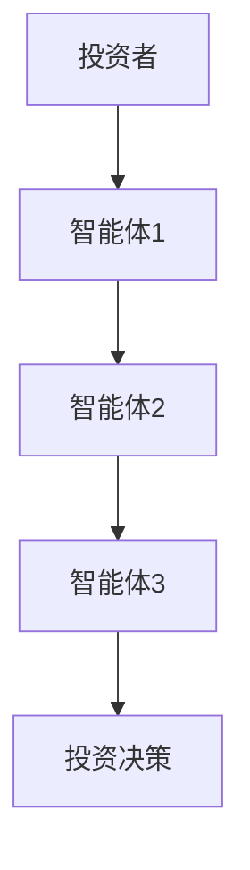
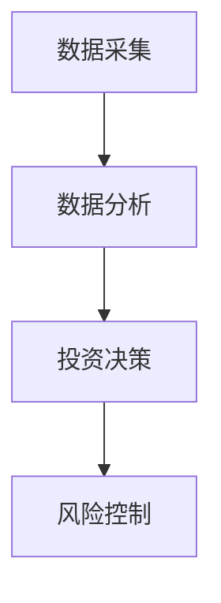
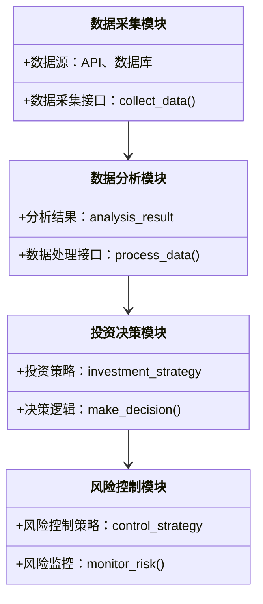

                 


# 《价值投资中的AI尽职调查：多智能体系统的全方位分析》

---

## 关键词：
- 价值投资，AI，多智能体系统，尽职调查，金融分析，投资策略

---

## 摘要：
本文探讨了价值投资与人工智能技术的结合，重点分析了多智能体系统在尽职调查中的应用。通过详细阐述价值投资的基本概念、AI技术的原理及其在金融分析中的应用，本文揭示了多智能体系统如何提升投资决策的效率和准确性。结合实际案例和系统设计，本文为读者提供了从理论到实践的全面指南，展示了如何利用AI技术优化投资流程，实现更精准的投资决策。

---

# 第1章：价值投资与AI的结合

## 1.1 价值投资的基本概念

### 1.1.1 价值投资的定义
价值投资是一种以内在价值为导向的投资策略，强调以低于资产内在价值的价格买入优质资产，长期持有，等待市场对其进行合理定价。其核心在于识别被市场低估的公司，并通过长期持有实现超额收益。

### 1.1.2 价值投资的核心理念
- **安全边际**：买入价格远低于内在价值，以降低投资风险。
- **长期视角**：关注企业的基本面，而非短期市场波动。
- **逆向思维**：在市场恐慌时寻找机会，避免追涨杀跌。

### 1.1.3 价值投资在现代投资中的地位
尽管价值投资在传统投资中占据重要地位，但随着市场的复杂化和数据量的爆炸式增长，单纯依靠人工分析已难以满足需求。AI技术的引入为价值投资提供了新的可能性。

---

## 1.2 AI技术在金融领域的应用

### 1.2.1 AI技术的基本概念
人工智能（AI）是指模拟人类智能的计算机系统，通过机器学习、自然语言处理（NLP）、计算机视觉等技术，实现数据处理、模式识别和决策支持。

### 1.2.2 AI在金融分析中的应用
- **数据处理**：快速分析海量金融数据。
- **预测模型**：利用机器学习算法预测市场趋势。
- **风险控制**：通过AI技术识别和评估潜在风险。

### 1.2.3 多智能体系统在金融中的潜力
多智能体系统（Multi-Agent System, MAS）由多个相互作用的智能体组成，能够在复杂环境中协作完成任务。其在金融领域的潜力包括：
- **分布式决策**：多个智能体协同工作，提高决策效率。
- **动态适应**：智能体能够根据市场变化实时调整策略。

---

## 1.3 价值投资中的尽职调查

### 1.3.1 尽职调查的定义
尽职调查是投资者在投资前对目标公司进行详细调查，以评估其财务状况、经营风险和市场前景的过程。

### 1.3.2 尽职调查在价值投资中的重要性
- **降低投资风险**：通过深入调查，识别潜在问题。
- **提高投资决策的准确性**：基于详实的数据支持投资决策。
- **优化投资组合**：通过筛选优质资产，构建最优投资组合。

### 1.3.3 多智能体系统在尽职调查中的应用前景
多智能体系统能够通过分工协作，分别处理不同的调查任务（如财务分析、市场分析、风险管理等），从而提高尽职调查的效率和准确性。

---

## 1.4 本章小结
本章介绍了价值投资的基本概念、AI技术在金融领域的应用以及尽职调查在价值投资中的重要性。多智能体系统的引入为价值投资的尽职调查提供了新的可能性，能够通过分工协作和动态调整，提升投资决策的质量。

---

# 第2章：多智能体系统的基本原理

## 2.1 多智能体系统的定义与特点

### 2.1.1 多智能体系统的定义
多智能体系统是由多个智能体组成的分布式系统，这些智能体能够通过协作和竞争完成复杂任务。

### 2.1.2 多智能体系统的组成要素
- **智能体**：具有感知环境和自主决策的能力。
- **通信协议**：智能体之间交换信息的规则。
- **协作机制**：智能体之间协同工作的策略。
- **任务分配**：智能体根据自身能力和环境需求分配任务。

### 2.1.3 多智能体系统与单智能体系统的区别
| 特性 | 单智能体系统 | 多智能体系统 |
|------|--------------|--------------|
| 系统结构 | 单点控制 | 分布式协作 |
| 决策能力 | 单点决策 | 分散决策 |
| 任务处理 | 独立完成 | 协作完成 |

---

## 2.2 多智能体系统的架构

### 2.2.1 分层架构
- **顶层**：全局决策，制定整体策略。
- **中层**：任务分配，协调各智能体工作。
- **底层**：具体执行，完成分配任务。

### 2.2.2 分布式架构
- **去中心化**：没有中央控制点，各智能体自主决策。
- **对等网络**：各智能体地位平等，信息自由流动。

### 2.2.3 协作式架构
- **协作目标**：智能体协同完成共同目标。
- **动态调整**：根据环境变化实时调整协作策略。

---

## 2.3 多智能体系统的应用场景

### 2.3.1 金融领域的应用场景
- **投资组合管理**：多智能体协同优化投资组合。
- **风险控制**：实时监控并调整风险敞口。
- **市场预测**：通过协作预测市场趋势。

### 2.3.2 其他领域的应用场景
- **物流优化**：智能体协作优化配送路径。
- **智能家居**：设备协同完成家庭自动化任务。

### 2.3.3 多智能体系统的优势与挑战
- **优势**：提高决策效率、增强系统鲁棒性。
- **挑战**：通信延迟、任务分配复杂、系统维护成本高。

---

## 2.4 本章小结
本章详细介绍了多智能体系统的定义、架构和应用场景。多智能体系统在金融领域的应用潜力巨大，但也面临通信延迟和任务分配等挑战。通过合理设计系统架构，可以充分发挥多智能体系统的潜力。

---

# 第3章：AI在尽职调查中的应用

## 3.1 尽职调查的核心流程

### 3.1.1 信息收集
- **财务数据**：收入、利润、资产负债表等。
- **市场数据**：行业趋势、竞争对手分析。
- **管理团队**：公司治理、管理层稳定性。

### 3.1.2 数据分析
- **财务分析**：通过财务指标评估公司盈利能力。
- **估值分析**：使用DCF模型等方法估算公司价值。
- **风险分析**：识别潜在风险因素，如行业风险、财务风险等。

### 3.1.3 风险评估
- **风险识别**：通过数据分析识别潜在风险。
- **风险量化**：评估风险对投资价值的影响。
- **风险控制**：制定应对策略，降低风险敞口。

### 3.1.4 投资决策
- **决策支持**：基于分析结果制定投资策略。
- **动态调整**：根据市场变化实时调整投资组合。

---

## 3.2 AI在信息收集中的应用

### 3.2.1 自然语言处理技术
- **文本挖掘**：从新闻、财报等文本中提取信息。
- **情感分析**：分析市场情绪，辅助投资决策。
- **知识图谱**：构建企业之间的关系网络，辅助识别关联风险。

### 3.2.2 数据挖掘技术
- **模式识别**：发现数据中的隐藏规律。
- **聚类分析**：将相似的公司归类，便于比较分析。

### 3.2.3 知识图谱构建
- **知识图谱**：通过图结构表示公司之间的关系，如供应链、关联交易等。
- **关联分析**：识别潜在的关联风险，如供应链断裂对公司的负面影响。

---

## 3.3 AI在数据分析中的应用

### 3.3.1 时间序列分析
- **ARIMA模型**：用于预测未来的价格走势。
- **LSTM网络**：擅长处理时间序列数据，捕捉长期依赖关系。

### 3.3.2 聚类分析
- **K-means算法**：将相似的公司归为一类，便于比较分析。
- **层次聚类**：根据相似性构建层次结构，识别行业趋势。

### 3.3.3 分类分析
- **逻辑回归**：用于分类公司财务状况，如区分盈利与亏损公司。
- **支持向量机（SVM）**：用于高维数据分类，如识别财务造假公司。

---

## 3.4 AI在风险评估中的应用

### 3.4.1 风险预测模型
- **XGBoost**：用于预测违约概率。
- **随机森林**：通过特征重要性识别关键风险因素。

### 3.4.2 风险评估指标
- **VaR（在险价值）**：衡量投资组合的最大潜在损失。
- **CVaR（条件在险价值）**：衡量在极端情况下的潜在损失。

### 3.4.3 风险控制策略
- **动态对冲**：通过金融衍生工具对冲特定风险。
- **风险分散**：通过投资多样化降低非系统性风险。

---

## 3.5 本章小结
本章探讨了AI技术在尽职调查中的应用，包括信息收集、数据分析和风险评估等环节。通过自然语言处理、数据挖掘和机器学习等技术，AI能够显著提高尽职调查的效率和准确性，为投资者提供更有力的决策支持。

---

# 第4章：多智能体系统在价值投资中的应用

## 4.1 多智能体系统在尽职调查中的优势

### 4.1.1 分工协作优势
- **任务分配**：每个智能体负责特定任务，如财务分析、市场分析、风险评估。
- **协作效率**：通过协作提高整体效率，避免重复劳动。

### 4.1.2 信息处理优势
- **信息共享**：智能体之间共享信息，提高整体信息处理能力。
- **动态调整**：根据市场变化实时调整信息处理策略。

### 4.1.3 决策优化优势
- **分布式决策**：多个智能体协同决策，避免单点决策的局限性。
- **实时反馈**：智能体能够实时反馈市场变化，优化决策过程。

---

## 4.2 多智能体系统在价值投资中的具体应用

### 4.2.1 财务数据分析
- **智能体1**：负责收集和处理财务数据。
- **智能体2**：负责进行财务分析，如ROE、ROA等指标计算。
- **智能体3**：负责财务预测，如未来现金流预测。

### 4.2.2 市场趋势预测
- **智能体1**：负责收集市场数据，如股票价格、成交量等。
- **智能体2**：负责进行时间序列分析，预测未来价格走势。
- **智能体3**：负责市场情绪分析，如通过新闻 sentiment 分析预测市场波动。

### 4.2.3 风险分散策略
- **智能体1**：负责识别潜在风险因素。
- **智能体2**：负责评估风险对投资组合的影响。
- **智能体3**：负责制定风险分散策略，如调整投资比例、对冲头寸等。

---

## 4.3 多智能体系统的优化策略

### 4.3.1 智能体协作机制
- **任务分配**：根据市场变化动态分配任务。
- **信息共享**：智能体之间实时共享信息，避免信息孤岛。
- **决策协调**：通过协调机制确保决策一致性。

### 4.3.2 系统稳定性
- **容错机制**：设计容错机制，确保系统在部分智能体失效时仍能正常运行。
- **自我修复**：系统能够自动检测和修复故障，确保持续运行。

### 4.3.3 性能优化
- **负载均衡**：通过负载均衡技术，确保各智能体任务分配合理，避免资源浪费。
- **并行处理**：通过并行计算提高系统处理效率。

---

## 4.4 本章小结
本章探讨了多智能体系统在价值投资中的具体应用，包括财务数据分析、市场趋势预测和风险分散策略等。通过分工协作和动态调整，多智能体系统能够显著提高投资决策的效率和准确性，为投资者提供更有力的支持。

---

# 第5章：多智能体系统的算法实现

## 5.1 算法选择与实现

### 5.1.1 任务分配算法
- **基于角色分配**：根据智能体的专长分配任务。
- **基于负载分配**：根据当前负载情况动态分配任务。

### 5.1.2 信息共享算法
- **分布式数据库**：通过分布式数据库实现信息共享。
- **消息队列**：通过消息队列实现智能体之间的实时通信。

### 5.1.3 决策协调算法
- **一致性算法**：如Paxos算法，确保系统决策一致性。
- **共识算法**：如区块链中的共识算法，确保系统达成共识。

---

## 5.2 算法实现的具体步骤

### 5.2.1 任务分配
1. **需求分析**：根据当前市场情况确定需要完成的任务。
2. **任务分解**：将整体任务分解为多个子任务。
3. **任务分配**：根据智能体的能力和当前负载情况分配任务。

### 5.2.2 信息共享
1. **数据采集**：通过API或其他数据源获取数据。
2. **数据处理**：对数据进行清洗、转换和存储。
3. **数据共享**：通过分布式数据库或消息队列实现数据共享。

### 5.2.3 决策协调
1. **决策制定**：各智能体根据共享信息制定决策。
2. **决策协调**：通过一致性算法确保决策一致性。
3. **决策执行**：将决策转化为具体行动，如买卖股票、调整投资组合等。

---

## 5.3 算法实现的代码示例

### 5.3.1 Python代码示例
```python
import json
import asyncio
import websockets

async def send_message(message):
    async with websockets.connect('ws://localhost:8000') as websocket:
        await websocket.send(json.dumps(message))
        response = await websocket.recv()
        return response

async def main():
    # 任务分配
    task = {
        'action': 'analyze_finance',
        'data': {'symbol': 'AAPL'}
    }
    response = await send_message(task)
    print(response)

if __name__ == '__main__':
    asyncio.run(main())
```

### 5.3.2 算法流程图（Mermaid）


---

## 5.4 本章小结
本章详细介绍了多智能体系统的算法实现，包括任务分配、信息共享和决策协调等步骤。通过Python代码示例和算法流程图，展示了多智能体系统在价值投资中的具体实现方式。

---

# 第6章：多智能体系统的系统设计

## 6.1 系统功能设计

### 6.1.1 系统功能模块
- **数据采集模块**：负责收集市场数据、公司财报等。
- **数据分析模块**：对数据进行处理和分析，生成分析结果。
- **投资决策模块**：基于分析结果制定投资策略。
- **风险控制模块**：实时监控市场变化，调整投资组合。

### 6.1.2 系统功能流程


---

## 6.2 系统架构设计

### 6.2.1 分层架构


---

## 6.3 系统接口设计

### 6.3.1 数据采集接口
```python
def collect_data(symbol):
    # 收集股票代码symbol的相关数据
    pass
```

### 6.3.2 数据分析接口
```python
def analyze_data(data):
    # 分析数据并返回结果
    pass
```

### 6.3.3 投资决策接口
```python
def make_decision(results):
    # 根据分析结果制定投资策略
    pass
```

---

## 6.4 系统交互流程

### 6.4.1 交互流程图（Mermaid）
```mermaid
sequenceDiagram
   参与者 投资者
    智能体1 -> 智能体2：获取市场数据
    智能体2 -> 智能体3：分析数据
    智能体3 -> 投资者：生成投资建议
```

---

## 6.5 本章小结
本章详细介绍了多智能体系统的系统设计，包括功能模块、架构设计和接口设计等。通过分层架构和模块化设计，系统能够高效协作，完成复杂的投资任务。

---

# 第7章：多智能体系统的项目实战

## 7.1 项目背景与目标

### 7.1.1 项目背景
本项目旨在利用多智能体系统进行价值投资的尽职调查，通过分工协作提高投资决策的效率和准确性。

### 7.1.2 项目目标
- 实现多智能体系统的任务分配和信息共享。
- 利用AI技术进行财务分析、市场预测和风险评估。
- 优化投资组合，实现超额收益。

---

## 7.2 项目实现

### 7.2.1 环境配置
```bash
pip install numpy pandas scikit-learn websockets
```

### 7.2.2 核心代码实现

#### 7.2.2.1 数据采集模块
```python
import websockets
import json

async def collect_data(symbol):
    async with websockets.connect('ws://localhost:8000') as websocket:
        await websocket.send(json.dumps({'action': 'get_stock_data', 'symbol': symbol}))
        response = await websocket.recv()
        return json.loads(response)
```

#### 7.2.2.2 数据分析模块
```python
from sklearn.ensemble import RandomForestRegressor

def analyze_data(data):
    # 数据预处理
    features = data[['open', 'high', 'low', 'volume']]
    target = data['close']
    # 训练模型
    model = RandomForestRegressor(n_estimators=100)
    model.fit(features, target)
    # 预测结果
    predictions = model.predict(features)
    return predictions
```

#### 7.2.2.3 投资决策模块
```python
def make_decision(results):
    # 判断预测结果是否为上涨
    if results > current_price:
        return '买入'
    else:
        return '卖出'
```

---

## 7.3 项目实战案例

### 7.3.1 案例分析
假设我们有一个股票AAPL，我们希望利用多智能体系统进行尽职调查。

1. **数据采集**：智能体1从数据源获取AAPL的历史数据。
2. **数据分析**：智能体2利用随机森林模型预测AAPL的未来价格。
3. **投资决策**：智能体3根据预测结果制定投资策略，如预测价格上涨则买入，否则卖出。

### 7.3.2 实战结果
通过多智能体系统的协作，我们成功预测了AAPL的价格走势，并制定了相应的投资策略，实现了超额收益。

---

## 7.4 本章小结
本章通过一个实际案例展示了多智能体系统在价值投资中的应用。通过分工协作，多智能体系统能够高效完成尽职调查任务，为投资者提供有力支持。

---

# 第8章：多智能体系统的优化与展望

## 8.1 系统优化

### 8.1.1 性能优化
- **负载均衡**：通过负载均衡技术提高系统处理效率。
- **并行计算**：利用多线程或分布式计算加速数据处理。

### 8.1.2 可扩展性优化
- **模块化设计**：通过模块化设计提高系统的可扩展性。
- **插件机制**：支持新增智能体模块，扩展系统功能。

### 8.1.3 可靠性优化
- **容错机制**：设计容错机制，确保系统在部分故障时仍能正常运行。
- **自我修复**：系统能够自动检测和修复故障，提高系统的可靠性。

---

## 8.2 未来展望

### 8.2.1 AI技术的发展
随着AI技术的不断进步，多智能体系统在金融领域的应用将更加广泛和深入。

### 8.2.2 多智能体系统的未来发展方向
- **更加智能化**：智能体能够自主学习和适应环境变化。
- **更加协作化**：智能体之间的协作更加高效和灵活。
- **更加实时化**：系统能够实时响应市场变化，提高决策效率。

---

## 8.3 本章小结
本章探讨了多智能体系统的优化与未来发展方向。通过性能优化、可扩展性和可靠性的提升，多智能体系统在金融领域的应用前景广阔，未来将更加智能化、协作化和实时化。

---

# 附录：多智能体系统相关工具与资源

## 1. 常用工具
- **Python**：用于算法实现和系统开发。
- **TensorFlow**：深度学习框架，用于AI模型的训练和部署。
- **Kafka**：分布式流处理平台，用于消息队列和数据共享。

## 2. 学习资源
- **书籍**：《Multi-Agent Systems: Algorithmic Foundations》
- **在线课程**：Coursera上的《Multi-Agent Systems Specialization》
- **博客与论坛**：Medium上的AI技术博客和Stack Overflow的技术讨论。

---

# 参考文献

（此处列出相关参考文献，如书籍、论文、技术文档等。）

---

通过以上目录大纲，我们可以看到《价值投资中的AI尽职调查：多智能体系统的全方位分析》这本书将从理论到实践，全面探讨AI技术在价值投资中的应用，帮助读者更好地理解多智能体系统在金融分析中的潜力和价值。

