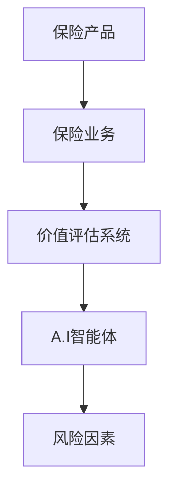
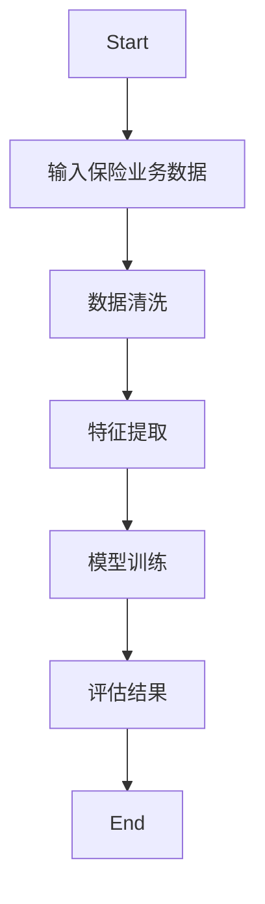
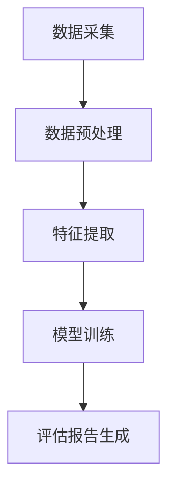
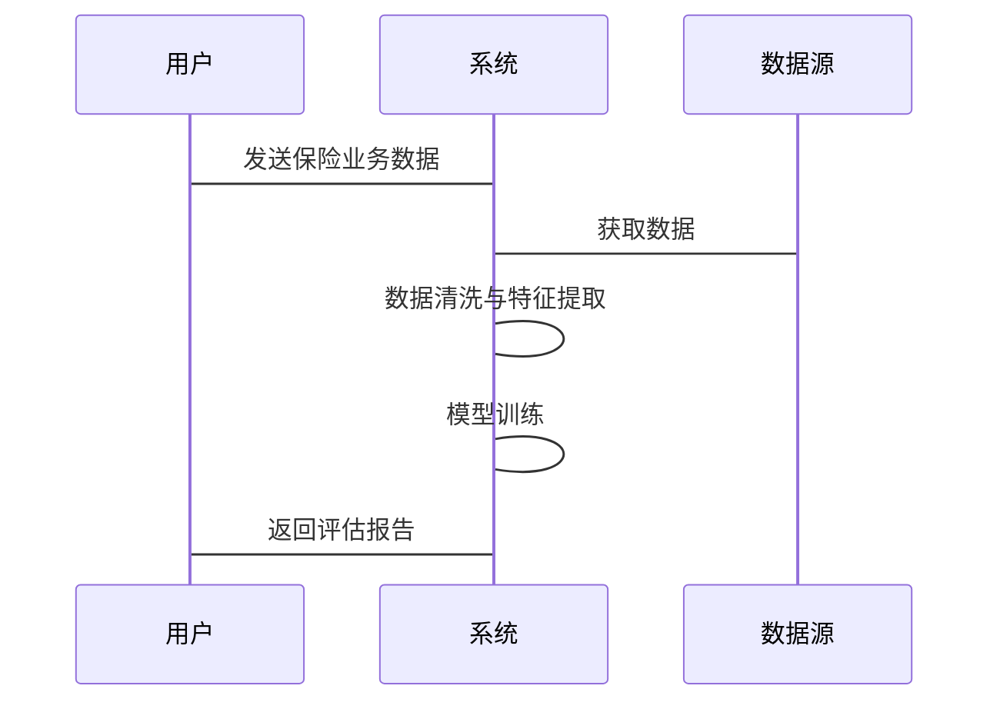

                 


# 《价值投资中的AI智能体保险业务价值评估系统》

---

## 关键词：
价值投资、AI智能体、保险业务、价值评估系统、算法原理、系统架构、项目实战

---

## 摘要：
本文探讨了如何利用AI智能体构建保险业务价值评估系统，结合价值投资理论，通过算法和系统设计，实现保险产品的智能化评估。文章详细介绍了系统的核心概念、算法原理、系统架构，并通过项目实战展示了系统的实现与应用。

---

# 第一部分：背景介绍与核心概念

## 第1章：价值投资与保险业务概述

### 1.1 价值投资的基本概念
价值投资是一种以低于公平价值的价格购买优质资产的投资策略。其核心在于识别市场低估的资产，长期持有以实现超额收益。在保险业务中，价值投资同样适用，通过评估保险产品的内在价值，选择具有投资潜力的产品。

### 1.2 AI智能体在保险业务中的应用
AI智能体通过自动化数据处理和分析，为保险业务提供智能化支持。其在风险评估、产品推荐和客户服务中的应用，显著提升了业务效率和精准度。在价值评估系统中，AI智能体用于数据清洗、特征提取和模型训练，确保评估结果的准确性和高效性。

### 1.3 保险业务价值评估的重要性
准确评估保险产品的价值是优化投资决策的关键。通过价值评估系统，投资者能够识别高潜力产品，降低投资风险，提升投资回报。同时，系统化的评估流程为保险业务的持续优化提供了数据支持。

## 第2章：价值评估系统的核心概念与联系

### 2.1 核心概念原理
价值评估系统基于价值投资理论，结合AI技术，构建保险产品的评估模型。通过数据清洗、特征提取和模型训练，系统能够准确预测保险产品的市场价值和内在价值。

### 2.2 核心概念属性特征对比
保险产品评估涉及多个指标，如保费收入、赔付率和利润率。AI智能体通过特征工程，识别关键指标，构建评估模型，实现精准预测。

### 2.3 ER实体关系图架构


## 第3章：价值评估系统中的算法原理

### 3.1 算法原理概述
价值评估系统采用线性回归模型，通过特征工程提取关键指标，构建预测模型。AI智能体负责数据清洗和特征提取，确保模型输入的准确性和完整性。

### 3.2 算法流程图


### 3.3 线性回归数学模型
线性回归模型用于预测保险产品的市场价值：
$$ y = \beta_0 + \beta_1x_1 + \beta_2x_2 + ... + \beta_nx_n + \epsilon $$
其中，$y$是预测值，$\beta$是系数，$x$是特征变量，$\epsilon$是误差项。

### 3.4 算法实现
以下是Python代码实现：
```python
import pandas as pd
from sklearn.linear_model import LinearRegression
from sklearn.metrics import mean_squared_error

# 数据加载与预处理
data = pd.read_csv('insurance_data.csv')
X = data[['保费收入', '赔付率', '利润率']]
y = data['市场价值']

# 模型训练
model = LinearRegression()
model.fit(X, y)

# 预测与评估
y_pred = model.predict(X)
mse = mean_squared_error(y, y_pred)
print(f'MSE: {mse}')
print(f'R²: {model.score(X, y)}')
```

---

# 第二部分：系统分析与架构设计

## 第4章：系统分析与架构设计

### 4.1 系统应用场景
价值评估系统应用于保险产品的定价、风险评估和投资决策。通过实时数据分析，系统能够快速响应市场变化，提供精准评估结果。

### 4.2 系统功能设计
系统功能模块包括数据采集、特征提取、模型训练和评估报告生成。每个模块相互协作，确保评估结果的准确性和高效性。

### 4.3 系统架构设计


### 4.4 系统接口设计
系统提供API接口，支持第三方调用评估结果。通过RESTful API实现数据交互，确保系统的可扩展性和灵活性。

### 4.5 系统交互流程图


---

# 第三部分：项目实战

## 第5章：项目实战

### 5.1 环境安装
安装必要的Python库：
```bash
pip install pandas scikit-learn matplotlib
```

### 5.2 核心代码实现
```python
import pandas as pd
from sklearn.linear_model import LinearRegression
from sklearn.metrics import mean_squared_error

# 数据加载与预处理
data = pd.read_csv('insurance_data.csv')
X = data[['保费收入', '赔付率', '利润率']]
y = data['市场价值']

# 模型训练
model = LinearRegression()
model.fit(X, y)

# 预测与评估
y_pred = model.predict(X)
mse = mean_squared_error(y, y_pred)
print(f'MSE: {mse}')
print(f'R²: {model.score(X, y)}')
```

### 5.3 实际案例分析
以具体保险产品为例，展示系统的评估过程。通过数据分析和模型训练，系统生成评估报告，指导投资决策。

### 5.4 项目小结
项目实现了保险产品的智能化评估，验证了算法的有效性，为实际应用提供了参考。

---

## 第四部分：最佳实践与总结

## 第6章：最佳实践与总结

### 6.1 最佳实践
1. 数据预处理：确保数据质量和完整性。
2. 特征选择：选择对评估结果影响较大的特征。
3. 模型优化：通过调参和交叉验证提升模型性能。

### 6.2 小结
本文详细介绍了价值投资中的AI智能体保险业务价值评估系统，从背景、算法到系统设计，为实际应用提供了理论和实践指导。

### 6.3 注意事项
1. 数据隐私：确保数据安全和合规性。
2. 模型解释性：选择可解释性较强的模型，便于结果分析。
3. 持续优化：定期更新模型，适应市场变化。

### 6.4 拓展阅读
建议阅读《机器学习实战》和《投资学基础》，深入了解算法和价值投资理论。

---

通过以上结构，本文系统地介绍了AI智能体在保险业务价值评估中的应用，结合理论与实践，为读者提供了全面的知识框架。

