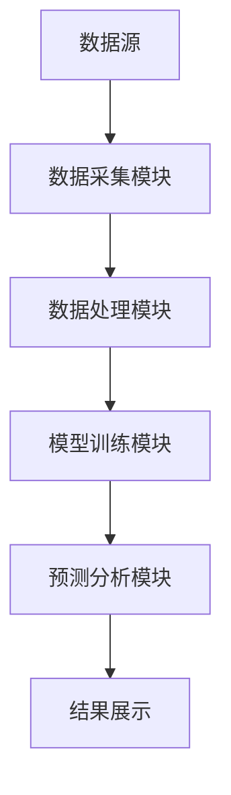
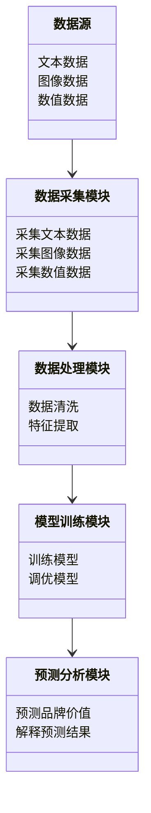
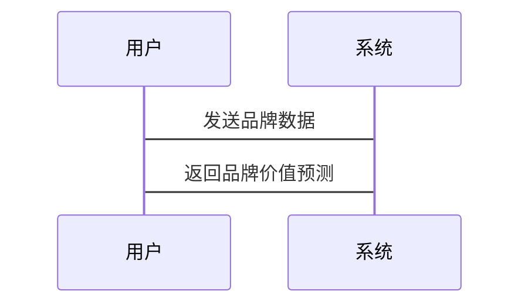

                 


# 《价值投资中的AI智能体品牌权益分析系统》

> 关键词：价值投资，AI智能体，品牌权益分析，算法原理，系统架构，项目实战

> 摘要：本文详细探讨了如何利用AI智能体技术在价值投资中进行品牌权益分析。通过分析品牌权益的核心概念、AI智能体的基本原理以及两者结合的实际应用场景，本文提出了一个基于AI的智能体品牌权益分析系统。该系统从数据采集、特征提取、模型训练到结果预测，详细阐述了其算法原理和系统架构。同时，本文通过实际案例展示了该系统的应用场景和效果，为投资者提供了全新的视角和工具。

---

## 第1章: 价值投资与AI智能体的结合

### 1.1 价值投资的核心理念

#### 1.1.1 价值投资的基本定义
- 价值投资是一种长期投资策略，旨在通过分析企业的内在价值来选择被低估的投资标的。
- 核心理念：寻找市场价格低于内在价值的企业。

#### 1.1.2 价值投资的核心原则
- 长期主义：关注企业的长期价值，而非短期价格波动。
- 安全边际：买入价格低于内在价值，以降低风险。
- 股东思维：将自己视为企业的部分所有者，关注企业的基本面。

#### 1.1.3 价值投资与现代投资理论的联系
- 现代投资组合理论（MPT）：通过分散投资降低风险。
- 市场有效假说：价值投资的有效性取决于市场是否无效或部分无效。

### 1.2 AI智能体的基本概念

#### 1.2.1 AI智能体的定义
- AI智能体是指能够感知环境并采取行动以实现目标的智能系统。
- 典型特征：自主性、反应性、目标导向。

#### 1.2.2 AI智能体的核心特征
| 特征 | 描述 |
|------|------|
| 自主性 | 能够独立决策，无需人工干预。 |
| 反应性 | 能够根据环境变化实时调整行为。 |
| 目标导向 | 通过行动实现特定目标。 |

#### 1.2.3 AI智能体与传统数据分析的区别
| 方面 | 传统数据分析 | AI智能体 |
|------|------------|----------|
| 数据处理 | 离线分析，依赖人工规则 | 实时分析，自适应学习 |
| 决策方式 | 基于固定规则 | 基于模型预测和优化 |

### 1.3 品牌权益分析的定义与重要性

#### 1.3.1 品牌权益的定义
- 品牌权益是指品牌在市场中所积累的无形资产，包括品牌知名度、美誉度和忠诚度。
- 核心指标：品牌价值、品牌强度、品牌增长率。

#### 1.3.2 品牌权益分析的必要性
- 帮助企业评估品牌市场表现。
- 为投资者提供品牌价值评估依据。
- 识别品牌风险和机会。

#### 1.3.3 品牌权益分析在价值投资中的作用
- 通过分析品牌价值，识别被低估的企业。
- 帮助投资者评估企业的长期盈利能力。
- 提供市场趋势和竞争格局的洞察。

### 1.4 本章小结
- 价值投资的核心是寻找被低估的企业。
- AI智能体通过实时数据分析和自适应学习，为品牌权益分析提供了新的工具。
- 品牌权益分析在价值投资中的应用，能够帮助投资者更精准地评估企业的内在价值。

---

## 第2章: 品牌权益分析的理论基础

### 2.1 品牌权益的构成要素

#### 2.1.1 品牌知名度
- 定义：品牌在市场中的认知程度。
- 测量方法：市场调研、品牌曝光率分析。

#### 2.1.2 品牌美誉度
- 定义：消费者对品牌的整体评价。
- 测量方法：满意度调查、口碑分析。

#### 2.1.3 品牌忠诚度
- 定义：消费者对品牌的忠诚程度。
- 测量方法：重复购买率、品牌偏好度。

### 2.2 品牌权益分析的模型

#### 2.2.1 常见的品牌权益分析模型
- AIO模型：基于资产、信息和机会的分析框架。
- BrandZ模型：通过消费者数据评估品牌价值。
- KEI模型：品牌资产关键指标分析。

#### 2.2.2 各种模型的优缺点对比
| 模型 | 优点 | 缺点 |
|------|------|------|
| AIO模型 | 综合考虑多维度因素 | 计算复杂度高 |
| BrandZ模型 | 数据来源广泛 | 数据依赖性强 |
| KEI模型 | 简单易用 | 适用于单一指标分析 |

### 2.3 数据来源与处理

#### 2.3.1 品牌数据的来源渠道
- 数据来源：市场调研数据、社交媒体数据、行业报告、新闻媒体。
- 数据类型：文本数据（如新闻、评论）、数值数据（如销售数据）、图像数据（如品牌Logo）。

#### 2.3.2 数据清洗与预处理
- 数据清洗：去除噪声数据、处理缺失值。
- 数据标准化：统一数据格式和单位。

#### 2.3.3 数据特征提取
- 文本特征提取：关键词提取、情感分析。
- 图像特征提取：颜色分析、形状识别。

### 2.4 本章小结
- 品牌权益分析需要综合考虑知名度、美誉度和忠诚度。
- 各种模型各有优缺点，选择合适的模型取决于具体应用场景。
- 数据处理是品牌权益分析的基础，特征提取是关键步骤。

---

## 第3章: AI智能体在品牌权益分析中的应用

### 3.1 AI智能体在品牌数据处理中的作用

#### 3.1.1 自然语言处理在品牌文本分析中的应用
- 语义理解：通过NLP技术分析品牌相关的文本数据。
- 情感分析：识别消费者对品牌的正面或负面评价。
- 实体识别：提取品牌名称、产品名称等关键实体。

#### 3.1.2 计算机视觉在品牌图像分析中的应用
- 图像识别：识别品牌Logo、产品图片。
- 图像分割：提取品牌相关的图像特征。

### 3.2 基于AI智能体的品牌权益预测模型

#### 3.2.1 模型训练
- 数据准备：清洗、特征提取。
- 模型选择：决策树、随机森林、神经网络。
- 模型训练：使用品牌历史数据训练模型。

#### 3.2.2 模型优化
- 超参数调整：通过网格搜索优化模型性能。
- 模型评估：使用交叉验证评估模型的准确率、召回率。

#### 3.2.3 预测与解释
- 品牌价值预测：基于模型预测品牌未来的价值趋势。
- 预测解释：通过特征重要性分析解释模型的预测结果。

### 3.3 本章小结
- AI智能体通过NLP和计算机视觉技术，能够高效处理品牌相关的文本和图像数据。
- 基于AI的预测模型能够帮助投资者更准确地评估品牌价值和市场趋势。
- 模型优化和解释是提高预测准确性的关键步骤。

---

## 第4章: AI智能体品牌权益分析系统的算法原理

### 4.1 算法概述

#### 4.1.1 算法目标
- 输入：品牌相关数据（文本、图像、数值）。
- 输出：品牌价值评估结果。

#### 4.1.2 算法流程
1. 数据预处理：清洗、特征提取。
2. 特征选择：筛选关键特征。
3. 模型训练：基于选择的算法训练模型。
4. 模型预测：对新数据进行预测。
5. 结果解释：分析模型预测结果。

### 4.2 特征提取与选择

#### 4.2.1 特征提取方法
- 文本特征：TF-IDF、Word2Vec。
- 图像特征：CNN、PCA。
- 数值特征：标准化、主成分分析。

#### 4.2.2 特征选择策略
- 基于统计的方法：卡方检验、相关系数。
- 基于模型的方法：LASSO回归、随机森林特征重要性。

### 4.3 模型训练与优化

#### 4.3.1 常用算法
- 线性回归：用于预测连续型变量。
- 支持向量机：用于分类和回归。
- 神经网络：用于复杂非线性关系的建模。

#### 4.3.2 模型优化
- 超参数调优：网格搜索、随机搜索。
- 模型集成：投票法、堆叠模型。

### 4.4 本章小结
- 特征提取和选择是模型训练的基础。
- 不同算法适用于不同的数据类型和业务场景。
- 模型优化能够显著提高预测准确率。

---

## 第5章: 系统架构与设计

### 5.1 系统架构设计

#### 5.1.1 系统功能模块
1. 数据采集模块：采集品牌相关数据。
2. 数据处理模块：清洗、特征提取。
3. 模型训练模块：训练预测模型。
4. 预测分析模块：生成预测结果并解释。

#### 5.1.2 系统架构图


### 5.2 系统功能设计

#### 5.2.1 领域模型设计


### 5.3 系统接口设计

#### 5.3.1 API接口
- 输入接口：接收品牌相关数据。
- 输出接口：返回品牌价值预测结果。

#### 5.3.2 接口交互流程


### 5.4 本章小结
- 系统架构设计明确了各功能模块的职责。
- 领域模型和接口设计为系统的实现提供了清晰的指导。
- 系统架构图和序列图帮助理解系统的整体流程。

---

## 第6章: 项目实战

### 6.1 环境配置

#### 6.1.1 开发环境
- 操作系统：Linux/MacOS/Windows。
- 开发工具：Python、Jupyter Notebook。
- 依赖管理：pip、virtualenv。

#### 6.1.2 数据集准备
- 数据来源：公开数据集（如Kaggle）、爬取数据。
- 数据格式：CSV、Excel、JSON。

### 6.2 核心实现

#### 6.2.1 数据处理代码
```python
import pandas as pd
from sklearn.preprocessing import StandardScaler

# 读取数据
data = pd.read_csv('brand_data.csv')

# 数据清洗
data.dropna(inplace=True)

# 特征提取
from sklearn.feature_extraction.text import TfidfVectorizer
tfidf = TfidfVectorizer()
text_features = tfidf.fit_transform(data['text'])
```

#### 6.2.2 模型训练代码
```python
from sklearn.ensemble import RandomForestRegressor
from sklearn.model_selection import GridSearchCV

# 参数调优
param_grid = {'n_estimators': [100, 200], 'max_depth': [None, 10]}
grid_search = GridSearchCV(RandomForestRegressor(), param_grid, cv=5)
grid_search.fit(X_train, y_train)
best_model = grid_search.best_estimator_
```

### 6.3 实例分析

#### 6.3.1 案例分析
- 数据背景：某品牌的历史销售数据和社交媒体评论。
- 分析过程：数据清洗、特征提取、模型训练、结果预测。
- 结果解读：品牌价值预测结果及影响因素分析。

### 6.4 本章小结
- 项目实战展示了系统的实际应用。
- 代码实现为读者提供了可参考的操作步骤。
- 案例分析帮助读者更好地理解系统的实际效果。

---

## 第7章: 案例分析与效果评估

### 7.1 案例背景

#### 7.1.1 案例目标
- 使用AI智能体品牌权益分析系统评估某品牌的价值。
- 分析品牌价值的变化趋势。

#### 7.1.2 数据来源
- 历史销售数据。
- 社交媒体评论。
- 新闻报道。

### 7.2 案例分析

#### 7.2.1 数据处理
- 文本数据清洗和特征提取。
- 图像数据识别和特征提取。

#### 7.2.2 模型预测
- 使用训练好的模型预测品牌价值。
- 分析预测结果的准确性。

### 7.3 效果评估

#### 7.3.1 模型性能指标
- 准确率、召回率、F1分数。
- 比较不同模型的预测效果。

#### 7.3.2 实际应用效果
- 品牌价值预测的准确性和稳定性。
- 对投资决策的实际影响。

### 7.4 本章小结
- 案例分析展示了系统的实际应用场景。
- 模型预测效果评估为系统的优化提供了方向。
- 实际应用效果证明了系统的实用性和有效性。

---

## 第8章: 总结与展望

### 8.1 全文总结
- 本文提出了基于AI智能体的品牌权益分析系统。
- 详细阐述了系统的算法原理和系统架构。
- 展示了系统的实际应用案例。

### 8.2 展望
- 拓展研究：结合更多数据源，提升模型预测精度。
- 应用领域：探索在更多行业的应用潜力。
- 技术发展：研究更先进的AI算法，如深度学习、强化学习。

### 8.3 注意事项
- 数据隐私保护：确保数据处理符合相关法律法规。
- 模型解释性：提高模型的可解释性，便于投资者理解。
- 实时性：优化系统的实时性，满足动态市场的需求。

### 8.4 拓展阅读
- 推荐书籍：《投资学》、《机器学习实战》。
- 推荐论文：相关领域的最新研究论文。

### 8.5 本章小结
- 本文为价值投资中的品牌权益分析提供了新的思路和工具。
- 未来的研究和应用将更加注重数据的多样性和模型的可解释性。
- 投资者和数据科学家需要共同努力，推动该领域的进一步发展。

---

通过以上目录和内容安排，您可以开始撰写完整的文章。每章的内容需要根据实际需求进一步扩展，但上述结构已经为您的写作提供了清晰的方向和框架。

