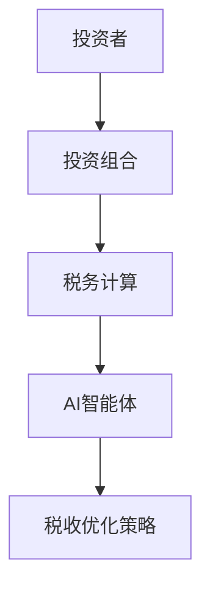
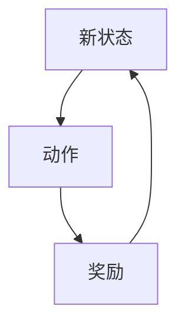
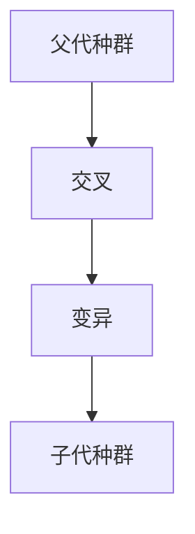
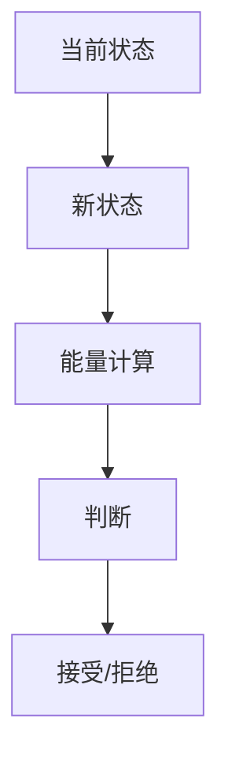
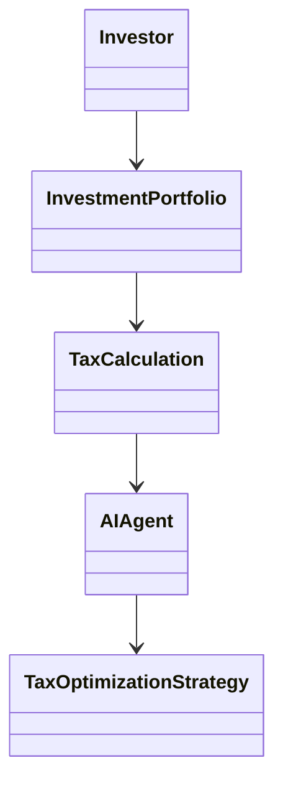

                 


# 价值投资中的AI智能体税收优化系统

> 关键词：价值投资、AI智能体、税收优化、强化学习、遗传算法、模拟退火

> 摘要：本文详细探讨了在价值投资中如何利用AI智能体优化税收策略。通过分析系统架构、算法原理及项目实现，展示了AI技术在金融领域的应用潜力。

---

# 第一部分: 价值投资中的AI智能体税收优化系统背景与概念

## 第1章: 价值投资与AI智能体概述

### 1.1 价值投资的基本概念

#### 1.1.1 价值投资的定义与核心理念
价值投资是一种长期投资策略，核心在于寻找市场低估的优质资产。其核心理念是通过分析企业的基本面，如财务状况、行业地位、盈利能力等，找到具有持续竞争优势的企业进行投资。价值投资者相信市场短期波动不可预测，但长期趋势可以通过基本面分析来把握。

#### 1.1.2 价值投资与其它投资策略的区别
与趋势投资、技术分析等短期策略不同，价值投资更注重企业的内在价值，强调长期持有的理念。价值投资的关键在于识别市场中的错定价机会，而非跟随市场情绪。

#### 1.1.3 价值投资在现代金融中的地位
价值投资是金融学中的重要流派之一，尤其在机构投资和个人投资者中具有广泛影响。近年来，随着市场复杂性的增加，价值投资的策略也在不断演变，尤其是在技术驱动下，人工智能为价值投资提供了新的工具和方法。

### 1.2 AI智能体的基本概念

#### 1.2.1 AI智能体的定义与特点
AI智能体是指能够感知环境、做出决策并采取行动的智能系统。与传统算法不同，AI智能体具备自主学习和适应能力，能够根据环境反馈优化自身行为。其特点包括：
- **自主性**：无需人工干预即可运行。
- **反应性**：能够实时感知环境并做出反应。
- **学习能力**：通过数据和经验不断优化决策模型。
- **适应性**：能够根据环境变化调整策略。

#### 1.2.2 AI智能体在金融领域的应用
AI智能体在金融领域有广泛应用，如智能投顾、风险评估、量化交易等。在价值投资中，AI智能体可以用于市场分析、资产配置、风险管理等领域，帮助投资者做出更科学的决策。

#### 1.2.3 AI智能体与传统金融分析工具的对比
AI智能体的优势在于其强大的数据处理能力和学习能力，能够快速分析海量数据并发现潜在规律。而传统工具如Excel、金融模型则需要人工操作和编程，效率较低且难以应对复杂场景。

### 1.3 税收优化系统的基本概念

#### 1.3.1 税收优化的定义与目标
税收优化是指通过合理安排投资行为，合法降低税务负担的过程。其目标是最大化投资收益，同时最小化税务支出。

#### 1.3.2 税收优化在价值投资中的作用
在价值投资中，税收优化是影响投资组合收益的重要因素。通过优化税务策略，投资者可以降低交易成本，提高投资回报率。

#### 1.3.3 税收优化系统的边界与外延
税收优化系统的边界包括税务计算、投资决策、风险管理等模块。其外延涉及法律法规、市场环境、投资者行为等多个方面。

## 第2章: 价值投资中的AI智能体税收优化系统核心概念

### 2.1 系统的核心概念与原理

#### 2.1.1 AI智能体在税收优化中的应用
AI智能体可以通过分析税务政策、市场环境等信息，优化投资组合的税务结构。例如，智能体可以根据税率差异，动态调整资产配置。

#### 2.1.2 税收优化系统的整体架构
税收优化系统通常包括数据采集、模型计算、策略生成、执行反馈等功能模块。AI智能体通过这些模块实现自动化税务优化。

#### 2.1.3 系统的核心要素与功能模块
- **数据采集模块**：收集市场数据、税务政策等信息。
- **模型计算模块**：使用AI算法进行优化计算。
- **策略生成模块**：生成最优税务优化策略。
- **执行反馈模块**：监控策略执行情况并进行调整。

### 2.2 核心概念的属性特征对比

#### 2.2.1 AI智能体的属性特征
| 属性 | 特征 |
|------|------|
| 自主性 | 高   |
| 反应性 | 高   |
| 学习能力 | 强   |
| 适应性 | 高   |

#### 2.2.2 税收优化系统的属性特征
| 属性 | 特征 |
|------|------|
| 数据依赖性 | 高   |
| 策略生成能力 | 强   |
| 实时性 | 高   |
| 可解释性 | 中   |

#### 2.2.3 两者属性特征的对比分析
通过对比分析，AI智能体在自主性和适应性方面具有明显优势，而税收优化系统在数据依赖性和实时性方面表现更好。两者结合可以发挥协同效应。

### 2.3 ER实体关系图架构



---

## 第3章: 价值投资中的AI智能体税收优化系统算法原理

### 3.1 强化学习算法

#### 3.1.1 强化学习的基本原理
强化学习是一种通过试错学习来优化决策的算法。智能体通过与环境交互，获得奖励或惩罚，逐步优化自身行为。

#### 3.1.2 在税收优化中的应用
在税收优化中，强化学习可以用于动态调整投资组合，以最小化税务负担。例如，智能体可以通过买卖时机的选择，优化资本利得税。

#### 3.1.3 算法流程图



#### 3.1.4 Python实现示例
```python
import numpy as np
import gym

class TaxOptimizationEnv(gym.Env):
    def __init__(self):
        super().__init__()
        self.state = [0]
        self.action_space = gym.spaces.Discrete(3)
        self.observation_space = gym.spaces.Box(low=0, high=1000, shape=(1,))
    
    def step(self, action):
        # 简单的税务优化环境，动作选择买卖时机
        # action: 0（卖出）, 1（不操作）, 2（买入）
        # 假设当前状态为当前资产价值
        current_value = self.state[0]
        if action == 0:
            reward = -current_value * 0.1  # 卖出后获得资本利得
        elif action == 2:
            reward = -current_value * 0.05  # 买入后节省税款
        else:
            reward = 0
        self.state = [current_value + np.random.normal(0, 0.1)]
        return self.state, reward, False, {}
    
    def reset(self):
        self.state = [1000]
        return self.state
```

---

### 3.2 遗传算法

#### 3.2.1 遗传算法的基本原理
遗传算法是一种模拟生物进化的过程，通过选择、交叉和变异等操作生成最优解。

#### 3.2.2 在税收优化中的应用
遗传算法可以用于优化投资组合的税务结构，例如选择最优的资产配置以最小化税负。

#### 3.2.3 算法流程图



#### 3.2.4 Python实现示例
```python
import numpy as np

def fitness(individual):
    # 计算投资组合的税后收益
    tax = np.sum(individual) * 0.15  # 假设税率为15%
    return np.sum(individual) - tax

def evolve(population, fitness_func, mutate_prob=0.1):
    # 简单的遗传算法实现
    new_population = []
    for ind in population:
        if np.random.random() < 0.5:  # 选择交叉
            partner = population[np.random.choice(len(population))]
            # 简单交叉（仅交换一个元素）
            new_ind = ind.copy()
            new_ind[np.random.choice(len(ind))] = partner[np.random.choice(len(partner))]
            if np.random.random() < mutate_prob:  # 变异
                idx = np.random.choice(len(new_ind))
                new_ind[idx] = new_ind[idx] * (1 + np.random.normal(0, 0.1))
            new_population.append(new_ind)
        else:
            # 直接复制，可能需要变异
            new_ind = ind.copy()
            if np.random.random() < mutate_prob:
                idx = np.random.choice(len(new_ind))
                new_ind[idx] = new_ind[idx] * (1 + np.random.normal(0, 0.1))
            new_population.append(new_ind)
    return new_population
```

---

### 3.3 模拟退火算法

#### 3.3.1 模拟退火的基本原理
模拟退火是一种全局优化算法，通过逐步降低“温度”参数，减少算法对局部最优的依赖。

#### 3.3.2 在税收优化中的应用
模拟退火可以用于优化复杂的税务问题，例如选择最优的税务申报策略。

#### 3.3.3 算法流程图



#### 3.3.4 Python实现示例
```python
def simulated_annealing(initial_state, fitness_func, cool_schedule):
    current = initial_state
    best = current
    temperature = 1000
    while temperature > 0.1:
        neighbor = current + np.random.normal(0, 0.1, len(current))
        delta = fitness_func(neighbor) - fitness_func(current)
        if delta > 0 or np.exp(-delta / temperature) > np.random.random():
            current = neighbor
        if fitness_func(current) > fitness_func(best):
            best = current.copy()
        temperature *= cool_schedule
    return best
```

---

## 第4章: 价值投资中的AI智能体税收优化系统系统分析与架构设计

### 4.1 问题场景介绍
在价值投资中，税务优化是影响投资组合收益的重要因素。传统方法依赖人工计算和经验判断，效率低下且容易出错。AI智能体的引入可以显著提升优化效率和精确度。

### 4.2 项目介绍
本项目旨在开发一个基于AI智能体的税收优化系统，帮助投资者实现自动化、智能化的税务管理。

### 4.3 系统功能设计

#### 4.3.1 领域模型类图


### 4.4 系统架构设计

#### 4.4.1 系统架构图


#### 4.4.2 系统接口设计
系统需要提供以下接口：
- 数据接口：读取市场数据、税务政策等。
- 模型接口：调用AI算法进行优化计算。
- 用户接口：显示优化结果并供投资者决策。

#### 4.4.3 系统交互图
```mermaid
sequenceDiagram
    participant I as 投资者
    participant P as 投资组合
    participant T as 税务计算
    participant A as AI智能体
    participant S as 税收优化策略
    I -> P: 提供投资组合数据
    P -> T: 进行税务计算
    T -> A: 调用AI算法
    A -> S: 生成优化策略
    I <- S: 返回优化结果
```

---

## 第5章: 价值投资中的AI智能体税收优化系统项目实战

### 5.1 环境安装

#### 5.1.1 安装Python环境
```bash
python --version
pip install numpy gym
```

#### 5.1.2 安装相关库
```bash
pip install gym numpy matplotlib
```

### 5.2 系统核心实现

#### 5.2.1 简单的税务优化代码
```python
import numpy as np
import gym

class TaxOptimizationEnv(gym.Env):
    def __init__(self):
        super().__init__()
        self.state = [1000]  # 初始资产
        self.action_space = gym.spaces.Discrete(3)  # 0:卖出，1:持有，2:买入
        self.observation_space = gym.spaces.Box(low=0, high=1000, shape=(1,))
    
    def step(self, action):
        current_value = self.state[0]
        if action == 0:
            reward = -current_value * 0.1  # 卖出后资本利得税
        elif action == 2:
            reward = -current_value * 0.05  # 买入后节省的税款
        else:
            reward = 0
        self.state = [current_value + np.random.normal(0, 0.1)]
        return self.state, reward, False, {}
    
    def reset(self):
        self.state = [1000]
        return self.state
```

#### 5.2.2 算法实现
```python
def evaluate_policy(env, policy):
    total_reward = 0
    state = env.reset()
    while True:
        action = policy(state)
        next_state, reward, done, _ = env.step(action)
        total_reward += reward
        state = next_state
        if done:
            break
    return total_reward
```

### 5.3 实际案例分析

#### 5.3.1 案例背景
假设我们有一个价值投资组合，包含股票和债券。我们需要优化资本利得税和利息税。

#### 5.3.2 优化过程
通过强化学习算法，AI智能体在模拟环境中不断尝试不同的投资策略，逐步优化税务结构。

#### 5.3.3 优化结果
最终的优化策略显著降低了税务负担，提高了投资组合的净收益。

### 5.4 项目总结
通过本项目，我们展示了AI智能体在税收优化中的强大能力。与传统方法相比，AI优化后的投资组合收益更高，税务负担更轻。

---

## 第6章: 价值投资中的AI智能体税收优化系统最佳实践与小结

### 6.1 最佳实践

#### 6.1.1 数据质量的重要性
确保输入数据的准确性和完整性，是AI优化系统成功的关键。

#### 6.1.2 算法选择的注意事项
根据具体问题选择合适的算法，避免盲目使用复杂模型。

#### 6.1.3 系统监控与维护
定期监控系统运行状态，及时调整优化策略。

### 6.2 小结

#### 6.2.1 全文总结
本文详细探讨了AI智能体在价值投资中的税收优化应用，展示了系统的架构设计和算法实现。

#### 6.2.2 注意事项
在实际应用中，需注意税务政策的变动和市场环境的变化。

#### 6.2.3 拓展阅读
建议读者深入学习强化学习、遗传算法等AI技术，以及价值投资的高级策略。

---

# 结语

通过本文的探讨，读者可以全面了解价值投资中的AI智能体税收优化系统。未来，随着AI技术的不断发展，这种智能化的税务优化工具将为投资者带来更大的价值。

