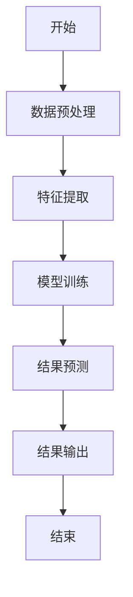
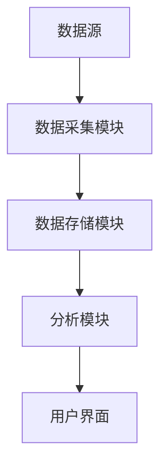
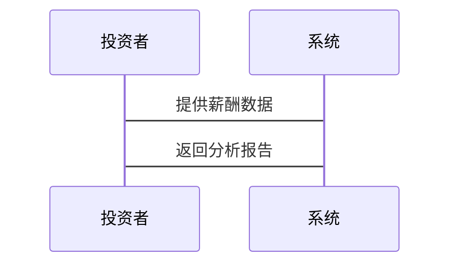

                 


# 价值投资中的AI智能体管理层薪酬结构分析系统

> **关键词**：价值投资，AI智能体，管理层薪酬，数据分析，投资策略  
> **摘要**：本文探讨了如何利用AI技术分析公司管理层的薪酬结构，以辅助价值投资决策。通过构建AI智能体，分析管理层的激励机制、绩效目标和薪酬构成，帮助投资者识别公司治理中的潜在问题和投资机会。

---

## 第一部分：价值投资中的AI智能体管理层薪酬结构分析系统概述

### 第1章：背景介绍

#### 1.1 问题背景
- **价值投资的核心概念**：价值投资强调以低于内在价值的价格购买优质资产。管理层的行为直接影响公司价值，因此分析其薪酬结构至关重要。
- **管理层薪酬结构的重要性**：合理的薪酬激励机制能提升管理效率，反之可能引发代理问题，影响公司长期发展。
- **AI技术在金融分析中的潜力**：AI能够处理大量数据，识别复杂模式，帮助投资者发现传统方法难以察觉的规律。

#### 1.2 问题描述
- **管理层薪酬结构的复杂性**：包括固定薪资、股票期权、绩效奖金等多种形式，分析难度大。
- **传统分析方法的局限性**：依赖人工经验，难以系统化和量化。
- **AI技术的应用价值**：通过机器学习模型，自动分析和预测薪酬结构对公司价值的影响。

#### 1.3 问题解决
- **AI智能体的作用**：构建AI系统，自动收集、分析薪酬数据，评估其对公司价值的影响。
- **数据驱动的分析方法**：利用大数据技术，提取关键指标，生成投资建议。
- **结合价值投资策略**：将AI分析结果与价值投资策略相结合，优化投资决策。

#### 1.4 边界与外延
- **系统边界**：专注于管理层薪酬结构分析，不涉及公司财务数据以外的领域。
- **相关领域外延**：与公司治理、人力资源管理、股票估值等密切相关。
- **与其他系统区别**：专注于特定领域，结合AI技术提供深度分析。

#### 1.5 核心概念结构
- **核心要素**：薪酬数据、绩效指标、公司治理结构。
- **系统模块**：数据采集、分析模块、结果展示。
- **功能目标**：提供量化分析，辅助投资决策。

---

### 第2章：核心概念与联系

#### 2.1 核心概念原理
- **管理层薪酬结构**：包括固定薪资、奖金、股票期权等，反映管理层的激励机制。
- **AI智能体的工作原理**：通过机器学习模型，分析数据，识别模式，生成预测结果。
- **价值投资策略**：寻找被市场低估的优质资产，长期持有。

#### 2.2 概念属性特征对比
| 概念       | 属性                     | 特征对比                 |
|------------|--------------------------|--------------------------|
| 薪酬结构   | 类型（固定、绩效、股票） | 复杂性高，影响公司治理   |
| AI智能体   | 数据处理能力             | 高效、自动化             |
| 价值投资   | 投资策略                 | 长期导向，注重内在价值   |

#### 2.3 ER实体关系图
```mermaid
erDiagram
    actor 投资者 {
        <属性> 资金需求
        <属性> 投资目标
    }
    actor 管理层 {
        <属性> 薪酬结构
        <属性> 绩效目标
    }
    entity 薪酬数据 {
        <主键> 数据ID
        <外键> 管理层ID
        <属性> 薪酬类型
        <属性> 薪酬金额
        <属性> 时间范围
    }
    entity 价值评估 {
        <主键> 评估ID
        <外键> 投资者ID
        <属性> 评估指标
        <属性> 评估结果
    }
    管理层 --> 薪酬数据: 管理
    投资者 --> 价值评估: 评估
    薪酬数据 --> 价值评估: 分析
```

---

### 第3章：算法原理讲解

#### 3.1 算法流程图


#### 3.2 算法实现代码
```python
# 数据预处理
import pandas as pd

data = pd.read_csv('salary.csv')
data = data.dropna()
data = pd.get_dummies(data, columns=['salary_type'])

# 特征提取
from sklearn.preprocessing import StandardScaler
scaler = StandardScaler()
X_scaled = scaler.fit_transform(data[['salary_amount', 'bonus']])

# 模型训练
from sklearn.ensemble import RandomForestRegressor
model = RandomForestRegressor(n_estimators=100)
model.fit(X_scaled, data['performance_score'])

# 结果预测
import numpy as np
new_data = np.array([[50000, 20000]])
new_data_scaled = scaler.transform(new_data)
predicted_score = model.predict(new_data_scaled)
print(predicted_score)
```

#### 3.3 数学公式
- **回归模型**：用于预测绩效得分
  $$ y = \beta_0 + \beta_1x_1 + \beta_2x_2 + \epsilon $$
- **评价指标**：如准确率、召回率
  $$ \text{准确率} = \frac{\text{正确预测数}}{\text{总样本数}} $$

---

### 第4章：系统分析与架构设计

#### 4.1 系统功能设计
- **数据采集模块**：收集公司财报、薪酬数据。
- **分析模块**：处理数据，生成分析报告。
- **用户界面**：展示分析结果，辅助投资决策。

#### 4.2 系统架构设计


#### 4.3 系统接口设计
- **输入接口**：接收薪酬数据。
- **输出接口**：提供分析结果和投资建议。

#### 4.4 系统交互流程图


---

### 第5章：项目实战

#### 5.1 环境安装
```bash
pip install pandas scikit-learn mermaid
```

#### 5.2 核心代码实现
```python
# 数据预处理和特征工程
import pandas as pd
from sklearn.model_selection import train_test_split
from sklearn.ensemble import RandomForestClassifier

data = pd.read_csv('salary.csv')
X = data.drop('target', axis=1)
y = data['target']

X_train, X_test, y_train, y_test = train_test_split(X, y, test_size=0.2)

model = RandomForestClassifier(n_estimators=100)
model.fit(X_train, y_train)
score = model.score(X_test, y_test)
print(score)
```

#### 5.3 案例分析
- **案例背景**：某公司管理层薪酬结构分析。
- **分析过程**：数据清洗、特征提取、模型训练、结果解读。
- **结果解读**：预测公司绩效，评估投资价值。

#### 5.4 项目总结
- **优势**：高效、准确。
- **不足**：数据质量和模型准确性受限制。

---

### 第6章：最佳实践

#### 6.1 小结
- AI技术为价值投资提供了新工具，帮助分析管理层薪酬结构，优化投资决策。

#### 6.2 注意事项
- 数据质量影响结果。
- 模型需定期更新。

#### 6.3 拓展阅读
- 推荐书籍和论文，深入学习AI在金融领域的应用。

---

**结论**：通过构建AI智能体分析管理层薪酬结构，投资者可以更科学地进行价值投资，实现长期收益。

