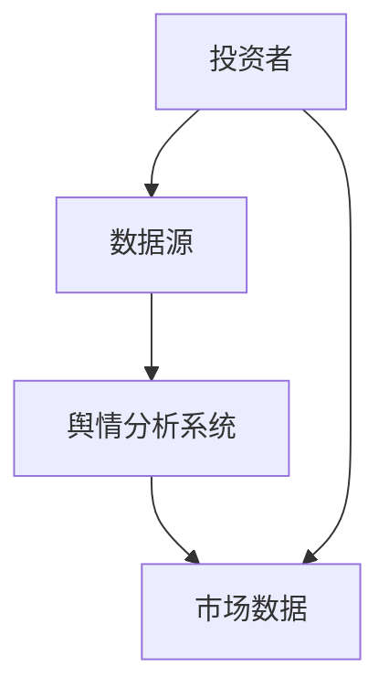
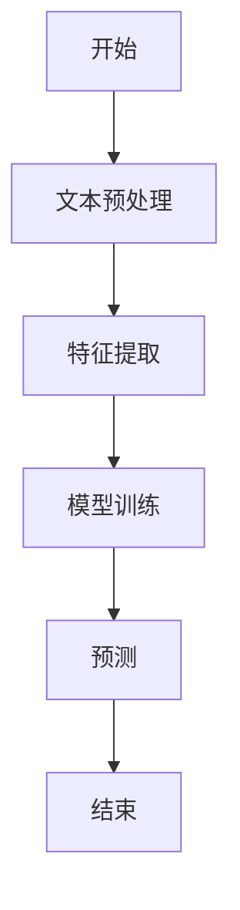
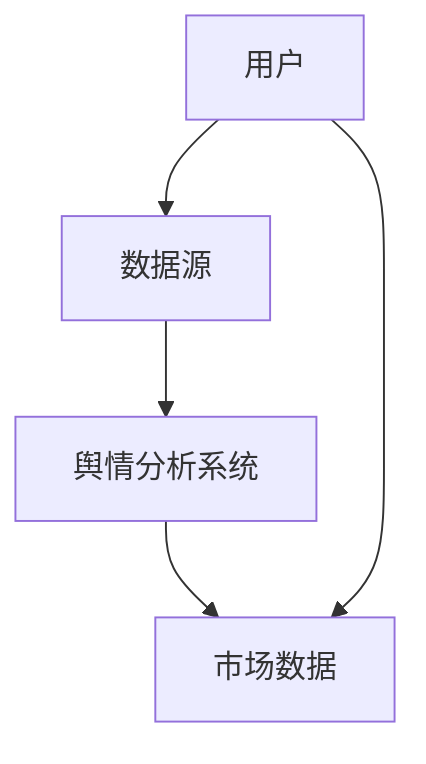

                 


# 价值投资中的AI智能体舆情监测与分析系统

> 关键词：价值投资，AI智能体，舆情监测，自然语言处理，情感分析，实体识别，深度学习

> 摘要：本文详细探讨了在价值投资中如何利用AI智能体进行舆情监测与分析，从背景、核心概念到算法原理、系统架构设计、项目实战，最后总结最佳实践。通过NLP技术、情感分析模型、实体识别等方法，结合实际案例，展示了如何构建一个高效的舆情监测与分析系统，辅助投资者做出明智决策。

---

# 第一部分: 背景介绍与核心概念

## 第1章: 背景介绍与核心概念

### 1.1 问题背景与价值投资的结合

#### 1.1.1 传统价值投资的核心理念
价值投资是一种长期投资策略，强调购买被市场低估的资产，长期持有，等待其价值的实现。核心在于分析公司的基本面，如财务状况、盈利能力、行业地位等。

#### 1.1.2 舆情分析在投资决策中的作用
市场情绪对股价波动有显著影响。投资者的情绪变化往往会影响市场的买卖决策，从而影响资产价格。因此，分析市场情绪（舆情）是投资决策的重要辅助工具。

#### 1.1.3 AI技术如何赋能价值投资
人工智能（AI）技术在处理海量数据、识别模式和预测趋势方面具有显著优势。通过自然语言处理（NLP）分析新闻、社交媒体和行业报告，AI可以帮助投资者更快速、准确地捕捉市场情绪和潜在机会。

---

### 1.2 问题描述与目标

#### 1.2.1 舆情监测与分析的定义
舆情监测是指通过收集和分析媒体、社交平台等渠道的文本数据，了解公众对某个话题、公司或市场的看法和情绪。舆情分析则是对这些数据进行处理，提取有用的信息，如情感倾向、关键词和事件。

#### 1.2.2 价值投资中的关键问题
在价值投资中，投资者需要关注市场情绪、行业趋势和公司基本面。然而，传统方法依赖于人工分析，耗时且难以捕捉实时信息。因此，如何利用AI技术快速、准确地分析舆情成为关键。

#### 1.2.3 系统目标与预期成果
本系统的目标是构建一个AI智能体，实时监测和分析市场舆情，提供情感倾向、关键词提取和事件识别，辅助投资者做出更明智的投资决策。

---

### 1.3 核心概念与系统架构

#### 1.3.1 AI智能体的定义与特征
AI智能体是一种能够感知环境、执行任务并做出决策的智能系统。在本系统中，AI智能体负责数据采集、处理和分析，提供实时舆情信息。

#### 1.3.2 舆情监测与分析的系统组成
- **数据采集模块**：从新闻网站、社交媒体和行业报告中收集文本数据。
- **数据预处理模块**：清洗、分词和去除停用词。
- **模型训练与推理模块**：使用NLP算法进行情感分析、实体识别和事件抽取。
- **结果可视化模块**：将分析结果以图表形式展示，便于投资者理解。

#### 1.3.3 价值投资中的关键数据流
- **市场情绪**：整体市场的乐观或悲观情绪。
- **公司舆情**：特定公司或行业的新闻和评论。
- **行业趋势**：行业内的最新动态和潜在机会。

---

## 1.4 本章小结
本章介绍了价值投资和舆情分析的基本概念，探讨了AI技术在其中的作用，并提出了系统的组成和目标。通过理解这些核心概念，我们可以为后续的系统设计和实现打下基础。

---

# 第二部分: 核心概念与系统架构

## 第2章: 舆情监测与分析系统的核心原理

### 2.1 舆情监测的核心算法

#### 2.1.1 自然语言处理（NLP）基础
NLP是AI技术的核心，用于处理和理解人类语言。常用技术包括分词、句法分析和语义理解。

#### 2.1.2 情感分析算法
情感分析旨在判断文本的情感倾向（正面、负面或中性）。常用算法包括基于词袋模型的逻辑回归和基于深度学习的LSTM网络。

#### 2.1.3 实体识别与事件抽取
实体识别是识别文本中的关键实体（如人名、地名、组织名），事件抽取则是识别文本中的事件（如并购、发布新产品）。

---

### 2.2 舆情分析的系统架构

#### 2.2.1 数据采集模块
数据采集模块负责从多个来源（如新闻网站、社交媒体）收集文本数据。常用工具包括BeautifulSoup、Scrapy和API接口。

#### 2.2.2 数据预处理模块
预处理包括分词、去除停用词和数据清洗。例如，使用jieba进行中文分词。

#### 2.2.3 模型训练与推理模块
使用训练好的NLP模型进行情感分析和实体识别。例如，使用BERT模型进行文本分类。

---

### 2.3 价值投资中的数据关联

#### 2.3.1 舆情数据与股价波动的关系
市场情绪与股价波动密切相关。例如，正面舆情可能引发股价上涨，负面舆情可能导致股价下跌。

#### 2.3.2 市场情绪与投资决策的关联
通过分析市场情绪，投资者可以更好地判断市场的买卖信号，做出更明智的投资决策。

#### 2.3.3 数据特征的选择与优化
选择具有代表性的舆情特征（如情感强度、关键词频率）进行分析，优化模型的准确性和鲁棒性。

---

## 2.4 核心概念的ER实体关系图



---

# 第三部分: 算法原理与数学模型

## 第3章: 舆情分析的算法实现

### 3.1 情感分析的算法流程



---

### 3.2 基于深度学习的情感分析模型

#### 3.2.1 LSTM网络结构
LSTM是一种循环神经网络，擅长处理序列数据。其结构包括输入门、遗忘门和输出门。

#### 3.2.2 Transformer模型的优势
Transformer模型通过自注意力机制，可以更好地捕捉文本中的长距离依赖关系。

#### 3.2.3 模型训练的数学公式
损失函数：
$$ \text{损失函数} = -\frac{1}{N}\sum_{i=1}^{N} \text{log}(p(y_i|x_i)) $$

---

### 3.3 实体识别与事件抽取的实现

#### 3.3.1 基于CRF的命名实体识别
CRF是一种条件随机场模型，常用于序列标注任务，如实体识别。

#### 3.3.2 事件抽取的规则引擎
通过预定义的规则和模式匹配，从文本中提取事件信息。

#### 3.3.3 算法实现的Python代码示例
```python
import spacy
nlp = spacy.load("en_core_web_sm")
doc = nlp("Apple introduces new product")
for ent in doc.ents:
    print(ent.text, ent.label_)
```

---

## 3.4 本章小结
本章详细介绍了舆情分析的核心算法，包括情感分析和实体识别的实现方法。通过这些算法，我们可以从文本中提取有价值的信息，为投资决策提供支持。

---

# 第四部分: 系统分析与架构设计

## 第4章: 系统架构设计方案

### 4.1 问题场景与项目介绍

#### 4.1.1 投资者面临的舆情挑战
投资者需要处理海量的舆情数据，难以快速准确地捕捉市场情绪。

#### 4.1.2 项目目标与范围
构建一个AI智能体，实时监测和分析市场舆情，提供情感倾向和事件识别。

#### 4.1.3 系统的核心价值
帮助投资者快速理解市场情绪，优化投资决策，降低投资风险。

---

### 4.2 系统功能设计

#### 4.2.1 数据采集模块
从多个来源采集舆情数据，包括新闻网站、社交媒体和行业报告。

#### 4.2.2 数据预处理模块
对采集的数据进行清洗、分词和去重，确保数据质量。

#### 4.2.3 模型训练与推理模块
使用预训练的NLP模型进行情感分析和实体识别。

#### 4.2.4 结果可视化模块
将分析结果以图表形式展示，便于投资者理解。

---

### 4.3 系统架构设计

#### 4.3.1 系统架构图



---

### 4.4 系统交互设计

#### 4.4.1 用户与系统交互流程

```mermaid
graph TD
    用户 --> 数据源
    数据源 --> 数据预处理模块
    数据预处理模块 --> 模型训练模块
    模型训练模块 --> 结果可视化模块
    用户 <-- 结果可视化模块
```

---

## 4.5 本章小结
本章详细设计了系统的架构，包括模块功能和交互流程。通过合理的架构设计，我们可以高效地实现舆情监测与分析功能。

---

# 第五部分: 项目实战与案例分析

## 第5章: 项目实战

### 5.1 环境安装与配置

#### 5.1.1 安装Python和相关库
安装Python和必要的库，如TensorFlow、Keras和spaCy。

#### 5.1.2 下载预训练模型
下载预训练的NLP模型，如BERT或GPT。

#### 5.1.3 数据采集与清洗
使用BeautifulSoup或Scrapy采集数据，并进行清洗和预处理。

---

### 5.2 系统核心实现

#### 5.2.1 情感分析模块实现
```python
from tensorflow.keras import layers
import numpy as np

model = tf.keras.Sequential()
model.add(layers.Embedding(vocabulary_size, embedding_dim))
model.add(layers.LSTM(units=64))
model.add(layers.Dense(3, activation='softmax'))
model.compile(optimizer='adam', loss='sparse_categorical_crossentropy', metrics=['accuracy'])
model.fit(X_train, y_train, epochs=10, batch_size=32)
```

#### 5.2.2 实体识别模块实现
```python
import spacy

nlp = spacy.load("en_core_web_sm")
doc = nlp("Apple introduces new product")
ents = [(ent.text, ent.label_) for ent in doc.ents]
print(ents)
```

---

### 5.3 案例分析与结果解读

#### 5.3.1 实际案例分析
假设我们分析某科技公司的新闻报道，提取情感倾向和关键词。

#### 5.3.2 模型性能分析
评估模型的准确率、召回率和F1值，优化模型参数。

#### 5.3.3 投资决策建议
基于模型分析结果，给出投资建议，如买入、持有或卖出。

---

## 5.4 本章小结
本章通过实际案例展示了系统的实现过程，从环境配置到模型训练，再到结果解读，帮助读者更好地理解系统的应用。

---

# 第六部分: 总结与展望

## 第6章: 总结与展望

### 6.1 最佳实践 tips

#### 6.1.1 数据来源的选择
选择可靠的舆情数据源，确保数据质量和相关性。

#### 6.1.2 模型的优化
定期更新模型，适应市场的变化和新的数据。

#### 6.1.3 结果的解读
结合市场背景和公司基本面，综合分析模型结果。

---

### 6.2 小结

通过构建AI智能体舆情监测与分析系统，我们可以高效地获取市场情绪和潜在机会，辅助投资者做出更明智的投资决策。

---

### 6.3 展望

未来，随着AI技术的进步，舆情分析将更加智能化和精准化。我们可以进一步优化模型，引入更多的数据源，提升系统的实时性和准确性。

---

# 结语

价值投资中的AI智能体舆情监测与分析系统是一个结合了NLP、深度学习和投资决策的复杂系统。通过系统的构建和应用，投资者可以更好地理解市场情绪，优化投资策略，降低投资风险。

---

# 参考文献

（此处列出相关的书籍、论文和技术文档）

---

希望这篇文章能够为您提供有价值的见解，并帮助您更好地理解AI在价值投资中的应用。

