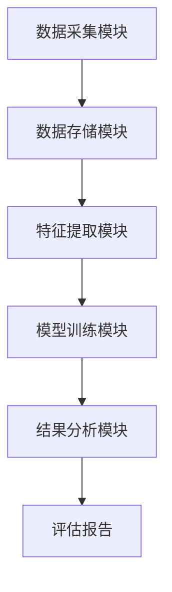
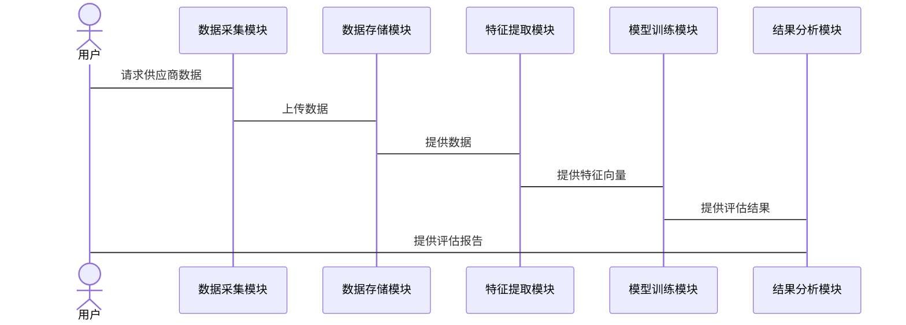

                 


# 价值投资中的AI驱动供应商关系评估：多智能体协作

## 关键词：价值投资，AI技术，供应商关系评估，多智能体协作，算法模型，系统架构，项目实战

## 摘要：  
本文深入探讨了在价值投资中利用AI技术进行供应商关系评估的创新方法，重点介绍了多智能体协作在这一过程中的应用。通过分析供应商关系评估的核心概念、AI算法模型、系统架构设计以及实际项目案例，本文为读者提供了从理论到实践的全面指导。文章不仅解释了多智能体协作的基本原理，还详细阐述了其在金融领域的实际应用，展示了如何通过AI技术提升供应商关系评估的准确性和效率。

---

# 第一章: 引言

## 1.1 背景与目标
### 1.1.1 价值投资的背景
价值投资是一种以基本面分析为基础的投资策略，旨在通过识别被市场低估的优质资产来实现长期收益。随着金融市场的复杂化，传统的人工分析方法逐渐暴露出效率低下、信息处理能力有限等问题。  
**问题背景**：  
- 传统供应商关系评估方法依赖人工经验，难以高效处理海量数据。  
- 供应商关系的动态变化（如市场波动、供应链调整）对投资决策的影响未能及时捕捉。  
- 不同数据源（如财务数据、新闻舆情、社交网络数据）的整合分析需求迫切。  

### 1.1.2 AI技术在金融领域的应用
人工智能技术（AI）在金融领域的应用日益广泛，尤其是在数据处理、模式识别和预测分析方面。AI能够通过机器学习模型快速处理海量数据，发现潜在的规律和趋势，为投资决策提供支持。  

### 1.1.3 供应商关系评估的重要性
供应商关系是企业运营的核心要素之一。在价值投资中，供应商的稳定性、议价能力以及合作关系直接影响企业的盈利能力和抗风险能力。因此，如何通过AI技术对供应商关系进行动态评估，成为提升投资决策效率的关键。  

## 1.2 问题描述
- **传统供应商关系评估的局限性**：  
  传统方法依赖主观判断，缺乏量化分析，难以捕捉供应商关系的动态变化。  
- **AI驱动供应商关系评估的必要性**：  
  利用AI技术可以从多维度数据中提取关键特征，构建量化评估模型。  
- **多智能体协作的核心问题**：  
  多个AI模型协同工作，如何实现数据共享、任务分配和结果整合，是当前研究的重点。  

## 1.3 本书结构与目标读者
- **内容概述**：  
  本书从价值投资的背景出发，结合AI技术，详细讲解供应商关系评估的核心概念、算法模型、系统架构以及实际案例。  
- **目标读者**：  
  本书适合金融从业者、数据科学家、技术管理者以及对价值投资和AI技术感兴趣的读者。  
- **学习收益**：  
  读者可以通过本书掌握AI驱动的供应商关系评估方法，了解多智能体协作的实现原理，并能够将相关技术应用于实际投资场景中。

---

# 第二章: 价值投资与AI技术基础

## 2.1 价值投资概述
### 2.1.1 价值投资的定义与核心理念
价值投资是一种以低于市场公允价值的价格买入优质资产的投资策略，核心理念是寻找市场误判的优质企业。  
**核心理念**：  
1. 企业内在价值是投资决策的核心依据。  
2. 长期持有优质资产，避免短期市场波动的干扰。  

### 2.1.2 价值投资的关键要素
- **企业基本面分析**：包括财务状况、盈利能力、成长能力等。  
- **行业地位分析**：企业在行业中的竞争地位和市场影响力。  
- **管理团队分析**：管理层的背景、能力和战略规划。  

### 2.1.3 价值投资与供应商关系的关联
供应商是企业供应链的重要组成部分，供应商关系的好坏直接影响企业的运营效率和成本控制。因此，在价值投资中，评估供应商关系的稳定性、合作深度和议价能力是关键。  

## 2.2 AI技术基础
### 2.2.1 人工智能的定义与分类
- **定义**：人工智能（AI）是指通过计算机模拟人类智能的技术，包括学习、推理、识别和自然语言处理等功能。  
- **分类**：  
  - **狭义AI**：专注于特定任务（如图像识别、语音识别）。  
  - **广义AI**：具备通用智能，能够处理多种任务。  

### 2.2.2 机器学习的核心概念
- **监督学习**：通过标签数据训练模型，用于分类和回归任务。  
- **无监督学习**：通过数据内在结构发现规律，用于聚类和降维任务。  
- **深度学习**：基于神经网络的机器学习方法，适合处理复杂数据。  

### 2.2.3 自然语言处理与知识图谱
- **自然语言处理（NLP）**：用于文本数据的分析和理解，如情感分析、实体识别。  
- **知识图谱**：构建结构化的知识网络，用于数据关联和推理。  

## 2.3 价值投资与AI技术的结合
### 2.3.1 AI在金融分析中的应用
- **股票价格预测**：通过时间序列分析预测股票价格波动。  
- **风险评估**：利用机器学习模型评估投资组合的风险。  
- **新闻情感分析**：通过NLP技术分析新闻对市场情绪的影响。  

### 2.3.2 供应商关系评估中的AI技术
- **数据整合**：将财务数据、新闻舆情、供应链数据等多源数据整合分析。  
- **特征提取**：通过机器学习模型提取供应商关系的关键特征（如合作年限、交易频率、违约记录）。  
- **预测与优化**：基于历史数据预测供应商关系的变化趋势，并优化供应链策略。  

### 2.3.3 多智能体协作的优势
- **数据共享**：多个AI模型协同工作，实现数据的高效共享和分析。  
- **任务分配**：根据模型擅长的任务进行分工，提高整体效率。  
- **结果整合**：通过多模型的结果整合，提升评估的准确性和全面性。  

---

# 第三章: 供应商关系评估的核心概念

## 3.1 供应商关系评估的定义与模型
### 3.1.1 供应商关系评估的定义
供应商关系评估是指通过分析供应商的历史表现、合作潜力和风险因素，对供应商的综合能力进行量化评估的过程。  

### 3.1.2 常见的供应商关系评估模型
- **层次分析法（AHP）**：通过构建层次结构，综合考虑多个评估维度。  
- **模糊综合评价法**：适用于评估指标模糊、不易量化的场景。  
- **机器学习模型**：基于历史数据训练模型，预测供应商的未来表现。  

### 3.1.3 多智能体协作在评估中的作用
多智能体协作可以通过分工合作，分别处理不同的评估任务，如数据清洗、特征提取和模型训练，从而提高评估效率和准确性。  

## 3.2 多智能体协作的原理与机制
### 3.2.1 多智能体协作的定义
多智能体协作是指多个智能体（AI模型）协同工作，共同完成复杂任务的过程。  

### 3.2.2 多智能体协作的核心机制
- **任务分配**：根据智能体的能力和任务需求，动态分配任务。  
- **数据共享**：智能体之间共享必要的数据和信息，避免重复计算。  
- **结果整合**：将各智能体的输出结果进行整合，形成最终的评估结论。  

### 3.2.3 多智能体协作的实现方式
- **基于规则的协作**：通过预定义的规则进行任务分配和数据共享。  
- **基于学习的协作**：通过强化学习等方法，动态优化协作策略。  

## 3.3 供应商关系评估与多智能体协作的结合
### 3.3.1 供应商关系评估中的多智能体协作场景
- **数据清洗与预处理**：多个智能体分别处理不同来源的数据，确保数据的完整性和一致性。  
- **特征提取与建模**：不同智能体负责提取不同类型的特征，并分别训练模型。  
- **结果整合与优化**：将各模型的输出结果整合，优化最终的评估结果。  

### 3.3.2 多智能体协作对供应商关系评估的提升
- **提高效率**：通过分工合作，缩短评估时间。  
- **增强准确性**：多模型协作能够从多个维度捕捉供应商关系的特征，提高评估的准确性。  
- **灵活性与扩展性**：可以根据任务需求动态调整协作方式，适应不同的评估场景。  

---

# 第四章: 多智能体协作的算法与数学模型

## 4.1 协作过滤算法
### 4.1.1 协作过滤的定义与原理
协作过滤是一种基于用户或物品相似性推荐相关内容的技术，广泛应用于推荐系统中。  

### 4.1.2 基于用户的协作过滤
- **原理**：通过计算用户之间的相似性，推荐与相似用户行为一致的内容。  
- **公式**：  
  $$ sim(u_i, u_j) = \frac{\sum_{k \in N(u_i) \cap N(u_j)} (r_{u_i,k} - \bar{r}_{u_i})(r_{u_j,k} - \bar{r}_{u_j})}{\sqrt{\sum_{k \in N(u_i)} (r_{u_i,k} - \bar{r}_{u_i})^2} \cdot \sqrt{\sum_{k \in N(u_j)} (r_{u_j,k} - \bar{r}_{u_j})^2}}$$  
  其中，$sim(u_i, u_j)$ 表示用户 $u_i$ 和 $u_j$ 之间的相似性，$N(u_i)$ 表示用户 $u_i$ 的邻居集合，$\bar{r}_{u_i}$ 表示用户 $u_i$ 的平均评分。  

### 4.1.3 基于物品的协作过滤
- **原理**：通过计算物品之间的相似性，推荐与当前物品相似的其他物品。  
- **公式**：  
  $$ sim(i_j, i_k) = \frac{\sum_{u \in N(i_j) \cap N(i_k)} (r_{u,i_j} - \bar{r}_{i_j})(r_{u,i_k} - \bar{r}_{i_k})}{\sqrt{\sum_{u \in N(i_j)} (r_{u,i_j} - \bar{r}_{i_j})^2} \cdot \sqrt{\sum_{u \in N(i_k)} (r_{u,i_k} - \bar{r}_{i_k})^2}}$$  
  其中，$sim(i_j, i_k)$ 表示物品 $i_j$ 和 $i_k$ 之间的相似性，$N(i_j)$ 表示与物品 $i_j$ 相关的用户集合，$\bar{r}_{i_j}$ 表示物品 $i_j$ 的平均评分。  

### 4.1.4 协作过滤在供应商关系评估中的应用
协作过滤算法可以用于供应商之间的相似性分析，帮助识别具有相似合作模式的供应商，从而优化供应商组合。  

## 4.2 聚类分析算法
### 4.2.1 聚类分析的定义与原理
聚类分析是一种无监督学习方法，旨在将数据点分成若干簇，使得簇内数据点的相似性较高，簇间数据点的相似性较低。  

### 4.2.2 K-means聚类算法
- **原理**：通过迭代优化，将数据点划分为K个簇，使得簇内平方误差最小。  
- **公式**：  
  $$ \text{目标函数} = \sum_{i=1}^{K} \sum_{j=1}^{N_i} (x_j - \mu_i)^2 $$  
  其中，$K$ 表示簇的数量，$N_i$ 表示第$i$个簇中的数据点数量，$\mu_i$ 表示第$i$个簇的中心点。  

### 4.2.3 聚类分析在供应商关系评估中的应用
聚类分析可以用于供应商的分组分析，识别具有相似特征的供应商群体，从而制定差异化的供应链策略。  

## 4.3 多智能体协作算法
### 4.3.1 多智能体协作的算法框架
- **任务分配**：基于智能体的能力和任务需求，动态分配任务。  
- **数据共享**：通过消息传递机制，智能体之间共享必要的数据和信息。  
- **结果整合**：将各智能体的输出结果进行加权融合，形成最终的评估结果。  

### 4.3.2 多智能体协作的数学模型
- **模型定义**：  
  设有 $n$ 个智能体，每个智能体负责不同的任务，最终评估结果为各任务输出的加权和：  
  $$ f_{\text{total}} = \sum_{i=1}^{n} w_i f_i $$  
  其中，$w_i$ 表示第$i$个智能体的权重，$f_i$ 表示第$i$个智能体的输出结果。  

### 4.3.3 多智能体协作的实现步骤
1. **任务分配**：根据智能体的能力和任务需求，动态分配任务。  
2. **数据共享**：通过消息传递机制，智能体之间共享必要的数据和信息。  
3. **模型训练**：各智能体分别训练自己的模型，并输出结果。  
4. **结果整合**：将各智能体的输出结果进行加权融合，形成最终的评估结果。  

---

# 第五章: 系统分析与架构设计

## 5.1 系统功能设计
### 5.1.1 数据采集模块
- **功能**：从多种数据源（如数据库、API接口）采集供应商相关数据。  
- **输入**：供应商的基本信息、交易记录、舆情数据等。  
- **输出**：清洗后的供应商数据集。  

### 5.1.2 特征提取模块
- **功能**：从供应商数据中提取关键特征（如合作年限、交易频率、违约记录）。  
- **输入**：清洗后的供应商数据集。  
- **输出**：供应商特征向量。  

### 5.1.3 模型训练模块
- **功能**：基于供应商特征向量，训练供应商关系评估模型。  
- **输入**：供应商特征向量、标签数据。  
- **输出**：训练好的供应商关系评估模型。  

### 5.1.4 结果分析模块
- **功能**：对模型输出结果进行分析和解读，生成评估报告。  
- **输入**：模型输出结果。  
- **输出**：供应商关系评估报告。  

## 5.2 系统架构设计
### 5.2.1 系统架构图


### 5.2.2 系统接口设计
- **数据采集接口**：用于从外部数据源获取供应商数据。  
- **模型训练接口**：用于训练和部署供应商关系评估模型。  
- **结果分析接口**：用于生成和输出供应商关系评估报告。  

### 5.2.3 系统交互流程


---

# 第六章: 项目实战

## 6.1 环境安装与配置
### 6.1.1 安装Python环境
- 使用Anaconda安装Python 3.8及以上版本。  
- 安装必要的Python库（如Pandas、Scikit-learn、NLTK）。  

### 6.1.2 数据集准备
- 数据来源：公开的供应商数据集（如Kaggle平台）。  
- 数据格式：CSV格式，包含供应商的基本信息、交易记录、舆情数据等。  

## 6.2 系统核心实现
### 6.2.1 数据采集模块
```python
import pandas as pd

def fetch_supplier_data(api_key):
    # 从API接口获取供应商数据
    response = requests.get(f'https://api.supplierdata.com/?api_key={api_key}')
    data = response.json()
    df = pd.DataFrame(data)
    return df
```

### 6.2.2 特征提取模块
```python
from sklearn.feature_extraction.text import TfidfVectorizer

def extract_features(text_data):
    vectorizer = TfidfVectorizer(max_features=100)
    feature_matrix = vectorizer.fit_transform(text_data)
    return feature_matrix
```

### 6.2.3 模型训练模块
```python
from sklearn.model

