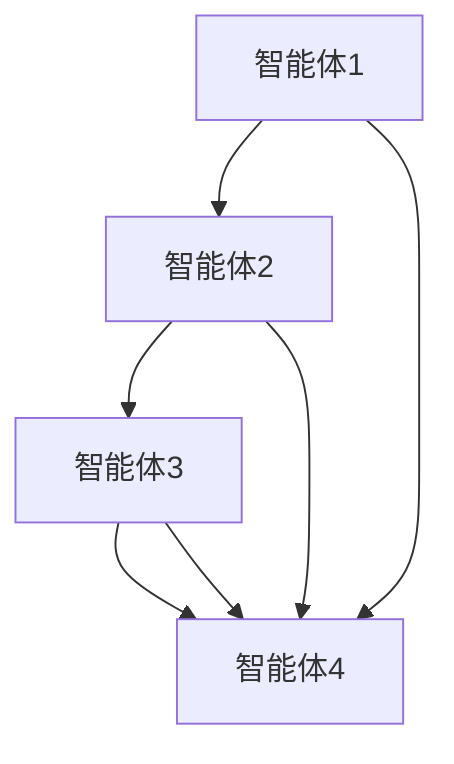
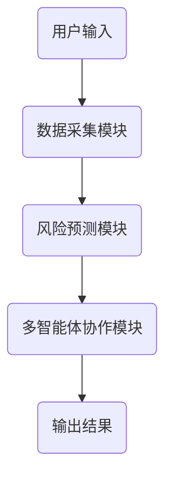

                 


# 价值投资中的AI驱动供应链韧性评估：多智能体协作

---

## 关键词  
- 价值投资  
- AI驱动  
- 供应链韧性评估  
- 多智能体协作  
- 供应链管理  
- 人工智能算法  
- 系统架构设计  

---

## 摘要  
在现代商业环境中，供应链韧性已成为企业价值评估的重要组成部分。随着人工智能技术的快速发展，基于AI的供应链韧性评估方法逐渐成为学术界和工业界的焦点。本文从价值投资的角度出发，系统性地探讨了如何利用多智能体协作技术来提升供应链韧性评估的准确性和效率。文章首先介绍了供应链韧性的基本概念及其与企业价值的关系，然后深入分析了AI驱动的供应链韧性评估的核心理论和算法原理，接着通过实际案例展示了多智能体协作在供应链管理中的应用场景。最后，本文总结了AI驱动供应链韧性评估的优势，并提出了未来研究的方向。

---

# 第一章: 价值投资与供应链韧性评估概述

## 1.1 价值投资的基本概念  
### 1.1.1 价值投资的定义与核心理念  
价值投资是一种以企业内在价值为导向的投资策略，强调通过分析企业的基本面（如财务状况、盈利能力、行业地位等）来判断其股票的合理价格。其核心理念是“买入并持有”，即选择那些被市场低估的企业进行长期投资。  

### 1.1.2 供应链在企业价值中的作用  
供应链是企业运营的核心组成部分，它涵盖了从原材料采购到产品交付的整个过程。一个高效、稳定的供应链能够显著提升企业的运营效率，降低成本，并增强企业的市场竞争力。因此，供应链的稳定性和韧性直接关系到企业的长期价值。  

### 1.1.3 供应链韧性与企业价值的关系  
供应链韧性是指在面对外部干扰（如自然灾害、疫情、供应链中断等）时，企业供应链的适应能力和恢复能力。供应链韧性越强，企业抵御风险的能力越强，企业的整体价值也越高。  

---

## 1.2 供应链韧性评估的重要性  
### 1.2.1 供应链断裂对企业价值的影响  
供应链中断可能导致生产延误、库存积压、客户满意度下降等问题，进而影响企业的财务表现和市场声誉。因此，评估和提升供应链韧性是企业价值管理的重要环节。  

### 1.2.2 全球化背景下供应链风险的加剧  
全球化使得供应链的高度依赖性问题更加突出。例如，新冠疫情暴露了许多企业在全球供应链上的脆弱性，许多企业因供应链中断而遭受重大损失。  

### 1.2.3 提升供应链韧性的关键策略  
为了应对供应链风险，企业需要采取多种策略，包括多元化供应链布局、增强供应链可视性、建立应急储备等。  

---

## 1.3 AI驱动供应链韧性评估的必要性  
### 1.3.1 传统供应链评估方法的局限性  
传统供应链评估方法通常基于静态数据分析，难以捕捉动态风险因素（如市场需求波动、供应链中断等）。此外，传统方法往往依赖于人工判断，效率低且容易出错。  

### 1.3.2 AI技术在供应链管理中的应用优势  
人工智能技术可以通过大数据分析、预测模型和自动化决策等手段，帮助企业更准确地识别和应对供应链风险。例如，AI可以通过分析历史数据预测供应链中断的可能性，并提前制定应对策略。  

### 1.3.3 多智能体协作在供应链韧性评估中的价值  
多智能体协作是指多个智能体通过协同工作来完成复杂任务。在供应链韧性评估中，多智能体可以分别负责不同的环节（如采购、生产、物流等），并通过实时信息共享和协作优化供应链的整体表现。  

---

# 第二章: 供应链韧性评估的核心理论  

## 2.1 供应链韧性评估的理论基础  
### 2.1.1 供应链韧性的定义与维度  
供应链韧性是一个多维度的概念，主要包括以下维度：  
1. **恢复力**：在供应链中断后快速恢复的能力。  
2. **适应力**：根据外部环境变化调整供应链的能力。  
3. **抗风险能力**：抵抗供应链中断风险的能力。  

### 2.1.2 供应链韧性评估的指标体系  
供应链韧性评估的指标体系通常包括以下内容：  
1. **供应商多样性**：供应商的数量和地理分布。  
2. **库存水平**：安全库存和缓冲库存的设置。  
3. **物流网络的冗余性**：物流网络的多样性和备用性。  

### 2.1.3 供应链韧性与企业价值的关系  
供应链韧性越强，企业的抗风险能力越强，企业的市场价值和股价表现也越稳定。  

---

## 2.2 多智能体协作的理论基础  
### 2.2.1 多智能体系统的定义与特点  
多智能体系统是由多个具有自主决策能力的智能体组成的系统。这些智能体通过协作完成复杂任务，同时保持各自的独立性和灵活性。  

### 2.2.2 多智能体协作在供应链管理中的应用场景  
1. **供应链网络优化**：通过多智能体协作优化供应链网络的布局和资源配置。  
2. **风险预测与应对**：通过多智能体协作预测供应链中断风险并制定应对策略。  

### 2.2.3 多智能体协作与供应链韧性的关系  
多智能体协作能够通过分布式决策和实时信息共享，显著提升供应链的适应力和恢复力，从而增强供应链韧性。  

---

## 2.3 AI驱动供应链韧性评估的理论框架  
### 2.3.1 AI在供应链管理中的应用领域  
1. **需求预测**：通过机器学习模型预测市场需求。  
2. **供应商选择**：通过AI算法优化供应商选择过程。  
3. **库存管理**：通过动态优化算法实现库存管理的智能化。  

### 2.3.2 多智能体协作在AI驱动供应链韧性评估中的作用  
多智能体协作能够将供应链中的各个环节（如采购、生产、物流）作为一个整体进行优化，从而提升供应链的整体韧性。  

---

# 第三章: AI驱动供应链韧性评估的算法原理  

## 3.1 供应链韧性评估的AI算法  
### 3.1.1 基于机器学习的供应链风险预测  
通过训练机器学习模型，可以预测供应链中断的可能性。常用的算法包括随机森林、支持向量机（SVM）和神经网络等。  

### 3.1.2 多智能体协作的算法流程  
1. **任务分配**：将供应链管理任务分配给不同的智能体。  
2. **信息共享**：智能体之间共享实时信息（如库存水平、物流状态等）。  
3. **协作决策**：智能体基于共享信息进行协作决策，优化供应链的整体表现。  

---

## 3.2 算法实现与代码示例  
### 3.2.1 供应链风险预测的Python代码示例  
```python
import pandas as pd
from sklearn.ensemble import RandomForestClassifier
from sklearn.metrics import accuracy_score

# 加载数据
data = pd.read_csv('supply_chain_risk.csv')

# 特征与目标分离
X = data.drop('risk_flag', axis=1)
y = data['risk_flag']

# 训练模型
model = RandomForestClassifier(n_estimators=100)
model.fit(X, y)

# 预测与评估
y_pred = model.predict(X)
print("准确率:", accuracy_score(y, y_pred))
```

### 3.2.2 多智能体协作的算法流程图  


---

# 第四章: 供应链韧性评估的系统架构设计  

## 4.1 系统功能设计  
### 4.1.1 系统整体功能模块  
1. **数据采集模块**：采集供应链相关数据（如库存、物流、销售等）。  
2. **风险预测模块**：基于AI算法预测供应链中断风险。  
3. **多智能体协作模块**：实现多智能体的协作决策。  

### 4.1.2 系统功能流程图  


## 4.2 系统架构设计  
### 4.2.1 系统架构图  


---

# 第五章: 项目实战与案例分析  

## 5.1 项目实战  
### 5.1.1 环境安装  
1. 安装Python和相关库（如Pandas、Scikit-learn）。  
2. 配置开发环境（如Jupyter Notebook）。  

### 5.1.2 系统核心实现源代码  
```python
import pandas as pd
from sklearn.ensemble import RandomForestClassifier
from sklearn.metrics import accuracy_score

# 加载数据
data = pd.read_csv('supply_chain_risk.csv')

# 特征与目标分离
X = data.drop('risk_flag', axis=1)
y = data['risk_flag']

# 训练模型
model = RandomForestClassifier(n_estimators=100)
model.fit(X, y)

# 预测与评估
y_pred = model.predict(X)
print("准确率:", accuracy_score(y, y_pred))
```

### 5.1.3 代码应用解读与分析  
上述代码展示了如何利用随机森林算法进行供应链风险预测。通过训练模型，可以预测供应链中断的可能性，并评估模型的准确率。  

---

## 5.2 实际案例分析  
### 5.2.1 案例背景  
某跨国企业因供应链中断导致生产延误，希望通过AI驱动的供应链韧性评估方法优化供应链管理。  

### 5.2.2 案例分析与解读  
通过AI算法和多智能体协作，该企业成功预测了供应链中断风险，并优化了供应链网络布局，显著提升了供应链韧性。  

---

# 第六章: 总结与展望  

## 6.1 最佳实践  
1. 在供应链管理中引入AI技术，提升供应链韧性的评估效率。  
2. 通过多智能体协作优化供应链的整体表现。  

## 6.2 小结  
本文从价值投资的角度出发，探讨了AI驱动的供应链韧性评估方法，并通过实际案例展示了多智能体协作在供应链管理中的应用。  

## 6.3 注意事项  
企业在实施AI驱动的供应链韧性评估时，应注重数据质量和模型的可解释性。  

## 6.4 拓展阅读  
1. 《供应链管理：原理与实践》  
2. 《人工智能在供应链管理中的应用》  

---

# 结语  
AI驱动的供应链韧性评估是价值投资的重要组成部分。通过多智能体协作，企业可以更高效地应对供应链风险，提升企业的整体价值。未来，随着AI技术的不断发展，供应链韧性评估将更加智能化和精准化。

