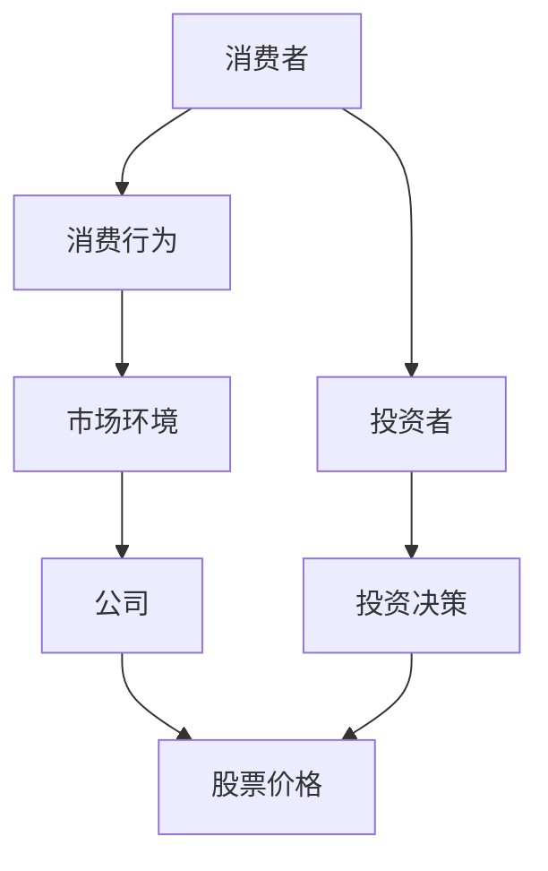
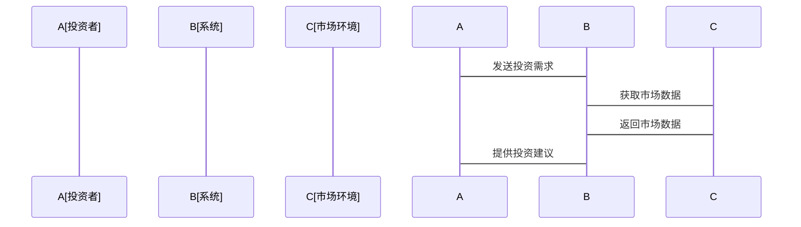

                 


# 价值投资中的AI驱动消费者行为分析：多智能体系统

## 关键词：价值投资、AI驱动、消费者行为分析、多智能体系统、强化学习、系统架构、算法实现

## 摘要：本文探讨了在价值投资中利用AI技术进行消费者行为分析的潜力，重点介绍了基于多智能体系统的分析方法。通过分析消费者行为数据，多智能体系统能够帮助投资者更准确地评估公司价值，优化投资决策。文章从多智能体系统的原理、算法实现、系统架构设计等多个方面展开，结合实际案例，详细解读了如何利用AI技术提升价值投资的科学性和效率性。

---

# 第1章: 价值投资与消费者行为分析概述

## 1.1 价值投资的基本概念

### 1.1.1 价值投资的定义与核心理念
价值投资是一种以基本面分析为基础的投资策略，强调以低于内在价值的价格购买优质资产。其核心理念是寻找市场中被低估的投资标的，长期持有，等待其价值回归。价值投资的关键在于对公司的财务状况、行业地位、竞争优势等进行全面评估。

### 1.1.2 投资者行为与市场决策的关系
投资者的行为直接影响市场的价格波动。理性投资者基于基本面分析做出决策，而情绪化投资者则容易受到市场情绪的影响。理解投资者行为可以帮助我们更好地预测市场走势，优化投资策略。

### 1.1.3 消费者行为在投资分析中的重要性
消费者行为分析是研究投资者决策的重要工具。通过分析投资者的消费习惯、偏好和行为模式，可以揭示市场的潜在需求和趋势，帮助投资者做出更明智的投资决策。

---

## 1.2 AI驱动的消费者行为分析

### 1.2.1 AI技术在金融领域的应用现状
人工智能技术在金融领域的应用日益广泛，包括股票预测、风险评估、交易自动化等。AI技术能够处理海量数据，发现传统方法难以察觉的模式和趋势，为投资决策提供有力支持。

### 1.2.2 消费者行为数据的来源与类型
消费者行为数据主要来源于交易记录、社交媒体、市场调研等。不同类型的数据（如文本数据、时间序列数据）需要结合使用，以全面分析消费者行为。

### 1.2.3 多智能体系统在消费者行为分析中的优势
多智能体系统能够模拟多个投资者的行为，分析他们的互动和协作，帮助我们更好地理解市场动态。通过多智能体系统，可以模拟不同投资者的决策过程，预测市场走势。

---

## 1.3 价值投资中的消费者行为分析

### 1.3.1 消费者行为对投资决策的影响
投资者的消费行为直接影响其投资选择。通过分析消费者行为，可以预测市场的供需变化，帮助投资者做出更准确的投资决策。

### 1.3.2 基于消费者行为的股票估值方法
结合消费者行为分析，可以开发新的股票估值模型，将消费者行为数据与公司基本面数据相结合，提高估值的准确性。

### 1.3.3 多智能体系统在价值投资中的应用前景
多智能体系统能够模拟多个投资者的行为，帮助投资者理解市场动态，优化投资组合。通过模拟不同市场环境下的投资者行为，可以制定更具前瞻性的投资策略。

---

# 第2章: 多智能体系统与消费者行为分析的核心概念

## 2.1 多智能体系统的基本原理

### 2.1.1 多智能体系统的定义与特点
多智能体系统是由多个相互作用的智能体组成的系统，每个智能体都有自己的目标和决策机制。多智能体系统能够模拟复杂的市场环境，分析不同投资者的行为。

### 2.1.2 多智能体系统与传统单智能体系统的对比
与单智能体系统相比，多智能体系统能够更好地模拟真实市场的复杂性，分析投资者之间的互动和协作。多智能体系统在处理大规模数据时更具优势。

### 2.1.3 多智能体系统在金融领域的应用潜力
多智能体系统在金融领域的应用潜力巨大，特别是在模拟市场动态、预测价格走势等方面。通过多智能体系统，可以更准确地分析投资者行为，优化投资策略。

---

## 2.2 消费者行为分析的多智能体建模

### 2.2.1 消费者行为的多维度分析
消费者行为分析需要考虑多个维度，包括消费习惯、消费偏好、消费能力等。多智能体系统能够综合分析这些维度，提供全面的消费者行为分析。

### 2.2.2 多智能体系统在消费者行为建模中的优势
多智能体系统能够模拟多个消费者的决策过程，分析他们的互动和协作。通过多智能体系统，可以更准确地预测消费者行为，帮助投资者制定更有效的策略。

### 2.2.3 多智能体系统的实体关系图（ER图）



---

## 2.3 多智能体系统的算法原理

### 2.3.1 基于强化学习的多智能体协作算法
强化学习是一种通过试错过程来优化决策的算法。在多智能体系统中，每个智能体通过强化学习不断优化自己的决策策略，实现协作。

### 2.3.2 多智能体系统中的博弈论模型
多智能体系统中的博弈论模型可以帮助我们分析投资者之间的互动和竞争。通过博弈论模型，可以预测不同市场环境下的投资者行为。

### 2.3.3 多智能体系统的数学模型与公式

$$
V(s) = \max_a \sum_{i=1}^n V(s_i)
$$

其中，\( V(s) \) 表示状态 \( s \) 的价值，\( a \) 表示动作，\( V(s_i) \) 表示子智能体 \( i \) 的状态价值。

---

# 第3章: 多智能体系统在消费者行为分析中的算法实现

## 3.1 强化学习算法在多智能体系统中的应用

### 3.1.1 强化学习的基本原理
强化学习是一种通过试错过程来优化决策的算法。智能体通过与环境交互，不断优化自己的策略，以获得最大的累计奖励。

### 3.1.2 多智能体强化学习的挑战与解决方案
多智能体强化学习面临通信开销大、策略协调困难等挑战。通过分布式计算和策略协作机制，可以有效解决这些问题。

### 3.1.3 基于强化学习的消费者行为预测算法
通过强化学习算法，可以预测消费者的决策行为，帮助投资者优化投资策略。

---

## 3.2 多智能体系统的数学模型与公式

$$
Q(s, a) = Q(s, a) + \alpha (r + \gamma \max_{a'} Q(s', a') - Q(s, a))
$$

其中，\( Q(s, a) \) 表示状态 \( s \) 下动作 \( a \) 的价值，\( \alpha \) 表示学习率，\( r \) 表示奖励，\( \gamma \) 表示折扣因子。

---

## 3.3 算法实现与代码解析

### 3.3.1 环境安装与配置
需要安装Python、TensorFlow、OpenAI Gym等依赖库。

### 3.3.2 多智能体强化学习算法的Python实现

```python
import gym
import numpy as np

env = gym.make('Multi-armed-bandit-nArms-5-v0')
env.reset()

for _ in range(1000):
    action = env.action_space.sample()
    observation, reward, done, info = env.step(action)
    print(f'Reward: {reward}')
```

### 3.3.3 算法代码的详细解读与分析
以上代码展示了如何在OpenAI Gym环境中实现多智能体强化学习算法。通过不断采样动作并获取奖励，智能体可以逐步优化自己的决策策略。

---

# 第4章: 基于多智能体系统的消费者行为分析系统架构设计

## 4.1 系统功能设计

### 4.1.1 系统的功能模块划分
系统主要包括数据采集模块、数据处理模块、模型训练模块和结果分析模块。

### 4.1.2 系统的输入输出设计
输入包括消费者行为数据和市场环境数据，输出包括投资者行为预测和投资建议。

### 4.1.3 系统的性能指标与约束条件
系统需要处理大规模数据，要求高效的数据处理能力和强大的计算能力。

---

## 4.2 系统架构设计

### 4.2.1 系统架构的分层设计
系统架构分为数据层、算法层和应用层。数据层负责数据采集和存储，算法层负责模型训练和预测，应用层负责结果展示和应用。

### 4.2.2 多智能体系统的通信机制设计
通过分布式计算和消息队列机制，实现多智能体之间的高效通信和协作。

### 4.2.3 系统的扩展性与可维护性设计
系统设计需要考虑可扩展性和可维护性，确保未来可以方便地添加新功能和优化性能。

---

## 4.3 系统接口与交互设计

### 4.3.1 系统接口的设计规范
系统接口需要遵循RESTful API设计规范，确保与其他系统的兼容性。

### 4.3.2 系统交互的序列图设计



### 4.3.3 系统接口的实现与测试
通过单元测试和集成测试，确保系统接口的正确性和稳定性。

---

## 4.4 项目实战

### 4.4.1 环境安装与配置
需要安装Python、TensorFlow、Keras等依赖库。

### 4.4.2 系统核心实现源代码

```python
import numpy as np
from tensorflow.keras import layers

model = keras.Sequential([
    layers.Dense(64, activation='relu'),
    layers.Dense(1)
])

model.compile(optimizer='adam', loss='mean_squared_error')

model.fit(x_train, y_train, epochs=100, batch_size=32)
```

### 4.4.3 代码应用解读与分析
上述代码展示了如何使用深度学习模型进行消费者行为分析。通过训练模型，可以预测消费者的决策行为，帮助投资者优化投资策略。

---

## 4.5 案例分析与详细解读

### 4.5.1 案例背景
假设我们有一个股票市场数据集，包含消费者的交易记录和市场环境数据。

### 4.5.2 数据处理与分析
通过数据清洗和特征提取，准备模型训练所需的数据。

### 4.5.3 模型训练与优化
使用训练好的模型，预测消费者的决策行为，优化投资策略。

### 4.5.4 结果分析与总结
通过分析模型预测结果，总结多智能体系统在消费者行为分析中的优势和不足。

---

## 4.6 项目小结

### 4.6.1 项目总结
通过本项目，我们展示了如何利用多智能体系统进行消费者行为分析，帮助投资者优化投资策略。

### 4.6.2 项目经验
在项目实施过程中，我们积累了一些宝贵的经验，包括数据处理、模型训练和系统设计等方面。

### 4.6.3 项目改进建议
未来可以进一步优化模型，引入更多的数据源，提高分析的准确性。

---

## 4.7 最佳实践 tips

### 4.7.1 项目管理 tips
在项目管理中，建议采用敏捷开发模式，确保项目按时完成。

### 4.7.2 技术实现 tips
在技术实现中，建议采用模块化设计，确保代码的可维护性和可扩展性。

### 4.7.3 系统优化 tips
在系统优化中，建议采用分布式计算和缓存技术，提高系统的性能和响应速度。

---

## 4.8 小结

通过本文的介绍，我们详细探讨了多智能体系统在消费者行为分析中的应用。通过实际案例分析，我们展示了如何利用多智能体系统优化投资策略，帮助投资者做出更明智的投资决策。

---

## 4.9 注意事项

### 4.9.1 数据隐私与安全
在处理消费者数据时，需要遵守相关法律法规，确保数据隐私和安全。

### 4.9.2 系统稳定性和可靠性
在系统设计中，需要考虑系统的稳定性和可靠性，确保系统的正常运行。

### 4.9.3 技术选型与优化
在技术选型中，需要充分考虑系统的可扩展性和可维护性，确保系统的长期发展。

---

## 4.10 拓展阅读

### 4.10.1 推荐书籍
1. 《强化学习》
2. 《多智能体系统》
3. 《价值投资实战》

### 4.10.2 推荐论文
1. "Multi-Agent Reinforcement Learning: A Survey"
2. "Deep Learning for Consumer Behavior Analysis"
3. "Value Investing in the Age of AI"

---

通过以上内容，我们详细探讨了价值投资中的AI驱动消费者行为分析：多智能体系统的各个方面，从理论到实践，从算法实现到系统设计，为读者提供了全面的指导和参考。希望本文能够帮助投资者更好地利用AI技术，优化投资策略，实现长期稳健的投资收益。

