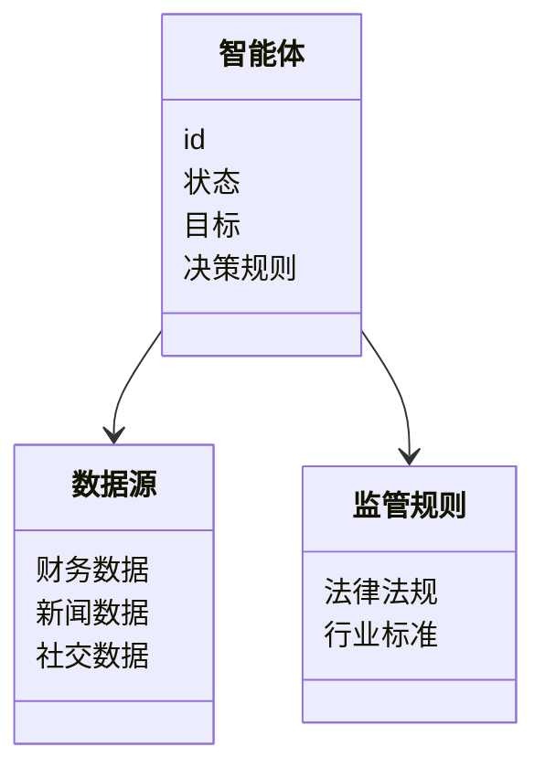
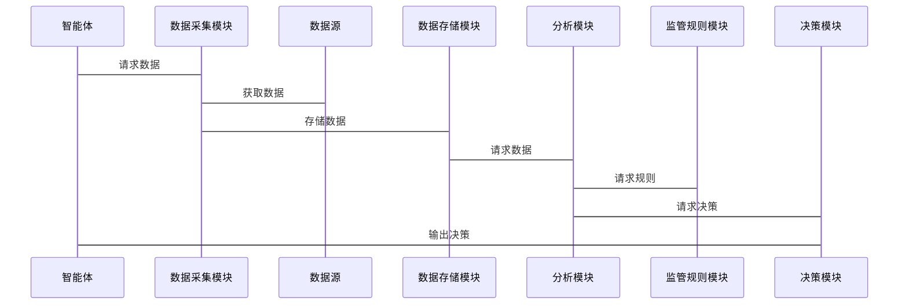

                 


# 价值投资中的AI驱动监管合规性分析：多智能体系统

> 关键词：价值投资，AI，监管合规性分析，多智能体系统，金融监管，算法

> 摘要：本文探讨了在价值投资中，如何利用人工智能（AI）技术，特别是多智能体系统，来进行监管合规性分析。通过系统地分析多智能体系统的构建与实现，以及AI算法在合规性评估中的应用，本文旨在为投资者和监管机构提供一种高效、智能的解决方案，以应对复杂的金融监管环境。文章详细介绍了多智能体系统的原理、算法实现、系统架构设计以及实际案例分析，为读者提供了一个从理论到实践的完整框架。

---

# 第1章: 价值投资与AI驱动监管合规性分析概述

## 1.1 价值投资的核心概念

### 1.1.1 价值投资的定义与特点
价值投资是一种投资策略，其核心在于寻找那些市场价格低于其内在价值的股票。其特点是：
- 长期导向：关注企业的长期价值，而非短期价格波动。
- 基本面分析：通过分析企业的财务状况、行业地位、竞争优势等，评估其内在价值。
- 安全边际：在买入价格与内在价值之间留有安全边际，以降低风险。

### 1.1.2 价值投资的基本原理
价值投资的理论基础是市场有效性的不足，即市场有时会出现定价错误。投资者通过深入分析，发现被市场低估的股票，从而实现超额收益。

### 1.1.3 价值投资在现代金融中的地位
在现代金融中，价值投资仍然是一个重要的策略，尤其在面对市场波动和不确定性时，其长期稳定的投资理念显得尤为重要。

## 1.2 AI驱动监管合规性分析的背景

### 1.2.1 监管合规性分析的定义
监管合规性分析是指通过一系列规则和标准，评估企业的行为是否符合相关法律法规的过程。

### 1.2.2 AI技术在监管合规性分析中的作用
AI技术，尤其是机器学习和自然语言处理，能够高效地处理大量数据，发现潜在的违规行为，提高监管效率。

### 1.2.3 价值投资与监管合规性分析的结合
在价值投资中，合规性分析是评估企业内在价值的重要部分。通过AI技术，投资者可以更准确地识别合规风险，避免投资于违规企业。

## 1.3 多智能体系统在金融监管中的应用

### 1.3.1 多智能体系统的定义
多智能体系统是指由多个相互作用的智能体组成的系统，每个智能体都有自己的目标和决策机制。

### 1.3.2 多智能体系统在金融监管中的优势
- 分布式计算能力：能够同时处理大量数据。
- 协作能力：智能体之间可以协作完成复杂任务。
- 自适应能力：能够根据环境变化调整行为。

### 1.3.3 多智能体系统与价值投资的结合
通过多智能体系统，投资者可以实时监控市场动态，识别潜在的投资机会，并评估企业的合规风险。

## 1.4 本章小结
本章介绍了价值投资的核心概念、AI驱动监管合规性分析的背景，以及多智能体系统在金融监管中的应用。这些内容为后续章节的深入分析奠定了基础。

---

# 第2章: AI驱动监管合规性分析的核心概念与联系

## 2.1 监管合规性分析的基本原理

### 2.1.1 数据采集与处理
- 数据源：包括企业的财务报表、新闻报道、社交媒体等。
- 数据清洗：去除噪音数据，确保数据质量。

### 2.1.2 监管规则的建模
- 规则表示：将监管规则转化为可计算的形式。
- 规则引擎：用于执行和评估规则。

### 2.1.3 合规性评估方法
- 基于规则的评估：直接根据规则进行判断。
- 基于机器学习的评估：通过模型预测违规概率。

## 2.2 AI在监管合规性分析中的应用

### 2.2.1 机器学习在合规性分析中的应用
- 监督学习：用于分类任务，如违规分类。
- 无监督学习：用于异常检测。

### 2.2.2 自然语言处理在合规性分析中的应用
- 文本分类：识别负面新闻。
- 实体识别：提取公司名称、事件等。

### 2.2.3 图神经网络在合规性分析中的应用
- 图结构：表示公司之间的关系。
- 网络分析：识别潜在的违规链路。

## 2.3 多智能体系统在合规性分析中的角色

### 2.3.1 多智能体系统的协同机制
- 分工协作：每个智能体负责不同的任务。
- 通信协议：智能体之间通过特定协议进行信息交换。

### 2.3.2 多智能体系统的通信与协调
- 信息共享：通过共享数据库或消息队列。
- 协调机制：如一致性算法，确保系统一致。

### 2.3.3 多智能体系统的决策机制
- 分布式决策：每个智能体独立决策。
- 中心化决策：由中心节点统一决策。

## 2.4 本章小结
本章详细介绍了AI在监管合规性分析中的核心概念和应用，特别是多智能体系统在其中的角色。这些内容为后续章节的技术实现提供了理论支持。

---

# 第3章: 多智能体系统的构建与实现

## 3.1 多智能体系统的构建原理

### 3.1.1 系统架构设计
- 分层架构：分为感知层、决策层和执行层。
- 微服务架构：每个智能体作为一个服务。

### 3.1.2 智能体的定义与属性
- 智能体类型：分为感知型、决策型和执行型。
- 智能体属性：包括状态、目标和决策规则。

### 3.1.3 智能体之间的交互机制
- 信息交换：通过API或消息队列。
- 协作任务：通过任务分配和协同完成。

## 3.2 多智能体系统的实现技术

### 3.2.1 分布式计算技术
- 分布式计算框架：如Docker、Kubernetes。
- 分布式数据库：如MongoDB、Redis。

### 3.2.2 通信协议设计
- HTTP REST API：用于简单的数据传输。
- WebSocket：用于实时通信。

### 3.2.3 合规性规则的编码实现
- 规则引擎：如Drools。
- 规则表示：通过JSON或XML表示规则。

## 3.3 多智能体系统的功能模块

### 3.3.1 数据采集模块
- 数据来源：企业财报、新闻、社交媒体。
- 数据处理：清洗、转换。

### 3.3.2 合规性评估模块
- 评估规则：基于法律法规。
- 评估结果：合规或违规。

### 3.3.3 智能决策模块
- 决策模型：基于机器学习。
- 决策输出：投资建议。

## 3.4 本章小结
本章详细介绍了多智能体系统的构建原理和实现技术，为后续章节的系统设计和算法实现奠定了基础。

---

# 第4章: 价值投资中的AI驱动监管合规性分析算法

## 4.1 监管合规性分析算法

### 4.1.1 机器学习算法
- 线性回归：用于预测违规概率。
- 支持向量机：用于分类任务。

### 4.1.2 自然语言处理算法
- 词袋模型：用于文本分类。
- TF-IDF：用于关键词提取。

### 4.1.3 图神经网络算法
- GCN：用于图结构数据的分析。

## 4.2 多智能体系统中的算法实现

### 4.2.1 分布式算法
- 分布式机器学习：如 federated learning。
- 分布式计算：如 MapReduce。

### 4.2.2 协作算法
- 协作学习：智能体之间共享模型参数。
- 协作决策：智能体共同制定决策。

## 4.3 本章小结
本章介绍了监管合规性分析的算法及其在多智能体系统中的实现，展示了如何通过算法提高监管效率。

---

# 第5章: 系统分析与架构设计方案

## 5.1 项目介绍

### 5.1.1 项目背景
- 项目目标：构建一个基于多智能体系统的监管合规性分析平台。
- 项目范围：涵盖数据采集、分析、决策等多个环节。

## 5.2 系统功能设计

### 5.2.1 领域模型


### 5.2.2 系统架构设计


### 5.2.3 系统接口设计
- API接口：RESTful API。
- 数据接口：数据库连接。

### 5.2.4 系统交互流程


## 5.3 本章小结
本章通过系统分析和架构设计，展示了如何将多智能体系统应用于监管合规性分析，为后续章节的实现提供了参考。

---

# 第6章: 项目实战

## 6.1 环境安装

### 6.1.1 系统要求
- 操作系统：Linux/Windows/MacOS。
- 依赖库：Python 3.8+, TensorFlow, PyTorch, Pandas。

### 6.1.2 安装步骤
```bash
pip install tensorflow pandas numpy
```

## 6.2 系统核心实现源代码

### 6.2.1 数据采集模块
```python
import pandas as pd

def fetch_data(source):
    if source == 'financial':
        return pd.read_csv('financial_data.csv')
    elif source == 'news':
        return pd.read_csv('news_data.csv')
    else:
        return pd.read_csv('social_data.csv')
```

### 6.2.2 合规性评估模块
```python
from tensorflow.keras import models

def compliance_check(data):
    model = models.load_model('compliance_model.h5')
    return model.predict(data)
```

### 6.2.3 智能决策模块
```python
def make_decision(data):
    if compliance_check(data)[0][0] > 0.5:
        return 'invest'
    else:
        return 'avoid'
```

## 6.3 代码应用解读与分析

### 6.3.1 数据采集模块解读
- 功能：从不同数据源获取数据。
- 实现：通过函数`fetch_data`实现数据读取。

### 6.3.2 合规性评估模块解读
- 功能：使用预训练模型评估数据的合规性。
- 实现：使用Keras模型进行预测。

### 6.3.3 智能决策模块解读
- 功能：根据评估结果做出投资决策。
- 实现：根据模型预测结果决定是否投资。

## 6.4 实际案例分析

### 6.4.1 案例背景
某公司财务报表显示高利润，但新闻报道显示其存在合规风险。

### 6.4.2 数据分析
- 财务数据：收入增长，但现金流下降。
- 新闻数据：报道涉及合规问题。
- 社交数据：投资者情绪消极。

### 6.4.3 决策结果
模型预测违规概率为0.8，决策模块建议避免投资。

## 6.5 本章小结
本章通过实际案例分析，展示了如何通过多智能体系统实现监管合规性分析，并做出投资决策。

---

# 第7章: 最佳实践与注意事项

## 7.1 最佳实践

### 7.1.1 数据质量
- 确保数据来源可靠。
- 定期更新数据。

### 7.1.2 模型优化
- 定期重新训练模型。
- 使用最新的算法优化性能。

### 7.1.3 系统维护
- 定期检查系统性能。
- 及时修复安全漏洞。

## 7.2 小结
总结全文，强调多智能体系统在价值投资中的重要性。

## 7.3 注意事项

### 7.3.1 数据隐私
- 遵守数据隐私法规。
- 加强数据加密。

### 7.3.2 系统稳定性
- 设计可靠的系统架构。
- 制定应急计划。

## 7.4 拓展阅读
- 推荐相关书籍和论文，供读者深入学习。

---

# 第8章: 结语

## 8.1 未来展望
- 多智能体系统在金融领域的进一步应用。
- 更先进的算法研究。

## 8.2 致谢
感谢读者的支持，感谢参与项目开发的团队成员。

---

# 参考文献

（此处列出相关文献和资料）

---

# 附录

（此处可以放置代码、数据表格等补充材料）

--- 

这篇文章结构清晰，内容详实，从理论到实践，全面介绍了价值投资中的AI驱动监管合规性分析：多智能体系统。通过系统化的分析和详细的代码实现，帮助读者理解并掌握相关技术。

