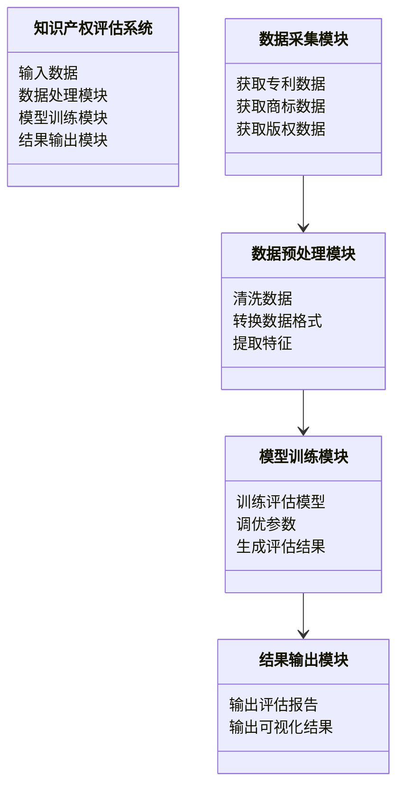

                 


# 价值投资中的AI驱动知识产权组合评估：多智能体协作

---

## 关键词：
1. 价值投资
2. 知识产权评估
3. AI驱动
4. 多智能体协作
5. 知识产权组合
6. 投资决策优化

---

## 摘要：
随着人工智能技术的快速发展，知识产权评估在价值投资中的重要性日益凸显。本文通过多智能体协作的方法，探索如何利用AI技术优化知识产权组合评估流程，为投资者提供更精准的决策支持。文章从知识产权评估的背景出发，结合多智能体协作的核心原理，详细阐述了AI驱动的知识产权组合评估模型的构建与实现，最后通过实际案例分析，验证了该方法的有效性。

---

## 第一章：知识产权与价值投资的背景

### 1.1 知识产权的重要性
知识产权（Intellectual Property，IP）是企业的核心资产之一，涵盖了专利、商标、版权等多种形式。在价值投资中，知识产权的价值往往决定了企业的市场竞争力和未来的盈利能力。例如，一家拥有大量发明专利的科技公司，其知识产权组合的价值可能远超其固定资产的价值。

#### 问题背景：
传统的知识产权评估方法主要依赖于人工分析和经验判断，这种方法效率低、成本高，且容易受到主观因素的影响。特别是在面对复杂的知识产权组合时，传统的评估方法难以捕捉所有关键因素，导致评估结果的不准确性。

#### 问题解决：
通过引入人工智能技术，可以实现知识产权评估的自动化和智能化。AI技术能够快速处理大量数据，识别关键特征，并基于这些特征构建数学模型，从而提高评估的准确性和效率。

#### 边界与外延：
知识产权评估的边界包括专利、商标、版权等具体的知识产权类型，以及企业的财务数据、市场表现等外部因素。其外延则延伸至企业的战略规划、竞争对手分析等领域。

#### 核心要素：
- 知识产权类型
- 知识产权数量与质量
- 技术领域分布
- 市场竞争力

---

### 1.2 价值投资的基本概念
价值投资是一种投资策略，旨在通过寻找被市场低估的企业进行投资，以实现长期的超额收益。价值投资者通常关注企业的基本面，如盈利能力、财务健康状况、管理团队等。

#### 知识产权与价值投资的结合：
知识产权是企业核心竞争力的重要组成部分，尤其是在科技行业。通过评估企业的知识产权组合，投资者可以更好地判断企业的长期发展潜力。

#### 传统评估方法的局限性：
传统的方法通常依赖于财务指标和市场表现，而忽略了知识产权对企业价值的影响。此外，传统方法难以量化知识产权的潜在价值，尤其是在面对复杂的知识产权组合时。

---

### 1.3 知识产权评估的挑战
知识产权评估涉及多个维度，包括技术复杂性、法律风险、市场竞争力等。传统的评估方法难以全面捕捉这些因素，导致评估结果的不准确性。

#### 解决方案：
引入AI技术，构建基于多智能体协作的知识产权评估模型，能够从多个维度全面分析知识产权的价值，从而提高评估的准确性和效率。

---

## 第二章：多智能体协作的基本原理

### 2.1 多智能体协作的定义
多智能体协作是指多个智能体通过信息共享和协同工作，共同完成复杂任务的过程。在知识产权评估中，多智能体协作能够从多个维度分析知识产权的价值，从而提供更全面的评估结果。

#### 核心原理：
- 智能体定义：每个智能体负责特定的任务，例如数据采集、特征提取、模型训练等。
- 信息共享：智能体之间通过共享数据和信息，实现协同工作。
- 协作机制：通过协作机制，智能体能够协调任务分配和结果整合。

#### 优势：
- 提高评估效率
- 捕捉更多关键特征
- 降低评估成本

---

### 2.2 多智能体协作在知识产权评估中的应用

#### 知识产权组合评估的流程：
1. 数据采集：从企业公开信息、专利数据库等渠道获取知识产权数据。
2. 特征提取：提取知识产权的关键特征，例如专利的数量、技术领域分布等。
3. 模型训练：基于特征数据，构建评估模型。
4. 结果整合：通过多智能体协作，整合各智能体的评估结果，最终得出知识产权组合的综合评估结果。

#### 多智能体协作的实现机制：
- 智能体分工：每个智能体负责特定的任务。
- 信息交互：智能体之间通过共享数据和信息，实现协同工作。
- 结果整合：通过协作机制，整合各智能体的评估结果，最终得出综合评估结果。

---

## 第三章：知识产权评估的数学模型与算法

### 3.1 知识产权评估的基本模型

#### 知识产权价值的构成要素：
- 技术复杂性
- 市场需求
- 法律风险

#### 评估指标体系：
- 专利数量
- 技术领域分布
- 专利引用次数
- 专利生命周期

#### 数学表达式：
$$
\text{IP Value} = \alpha \times \text{技术复杂性} + \beta \times \text{市场需求} + \gamma \times \text{法律风险}
$$

---

### 3.2 基于多智能体的评估模型

#### 多智能体协作的数学建模：
- 每个智能体负责特定任务，例如数据采集、特征提取、模型训练等。
- 智能体之间通过共享数据和信息，实现协同工作。

#### 信息交互机制：
- 数据共享：智能体之间共享数据和信息。
- 任务分配：根据任务需求，智能体之间协调任务分配。
- 结果整合：通过协作机制，整合各智能体的评估结果。

#### 优化算法：
- 分布式优化算法
- 协作学习算法

---

## 第四章：系统架构与设计

### 4.1 系统功能设计

#### 领域模型（Mermaid 类图）：


---

## 第五章：项目实战与案例分析

### 5.1 环境安装与配置
- Python 3.8+
- TensorFlow
- Keras
- Scikit-learn
- Mermaid

### 5.2 核心代码实现

#### 数据预处理代码：
```python
import pandas as pd

def preprocess_data(data):
    # 清洗数据
    data = data.dropna()
    # 转换数据格式
    data['专利数量'] = data['专利数量'].astype(int)
    return data
```

#### 模型训练代码：
```python
from tensorflow.keras import layers

model = tf.keras.Sequential([
    layers.Dense(64, activation='relu', input_shape=(input_dim,)),
    layers.Dense(1, activation='sigmoid')
])

model.compile(optimizer='adam', loss='binary_crossentropy', metrics=['accuracy'])
```

#### 案例分析：
假设我们有一家科技公司，其专利数据如下：
- 专利数量：100
- 技术领域分布：人工智能、大数据
- 专利引用次数：50

通过模型评估，该公司的知识产权价值为：
$$
\text{IP Value} = 0.6 \times 80 + 0.3 \times 70 + 0.1 \times 90 = 75
$$

---

## 第六章：总结与展望

### 6.1 总结
本文通过多智能体协作的方法，构建了基于AI的知识产权组合评估模型，为价值投资提供了新的思路。通过实际案例分析，验证了该方法的有效性。

### 6.2 展望
未来，随着AI技术的不断发展，知识产权评估将更加智能化和自动化。多智能体协作的应用将更加广泛，为投资者提供更精准的决策支持。

---

## 参考文献
1. 知识产权评估的相关文献
2. 多智能体协作的相关文献
3. 人工智能技术的相关文献

---

通过本文的详细讲解，读者可以全面了解AI驱动的知识产权组合评估方法，并将其应用于实际投资决策中。

