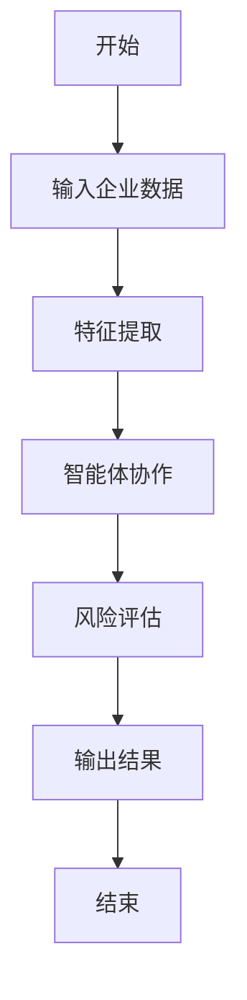
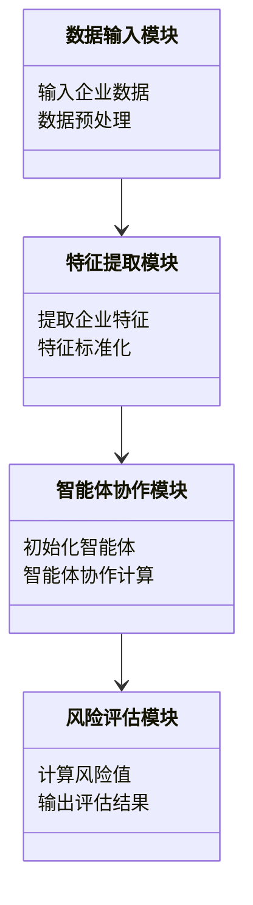
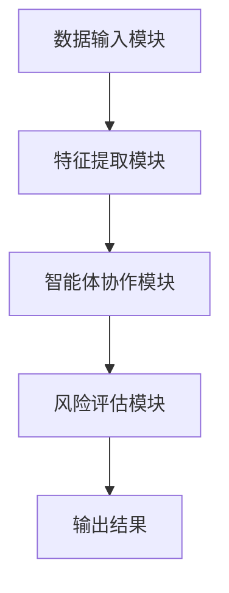

                 


# 价值投资中的AI驱动破产风险评估：多智能体协作模型

**关键词：** AI驱动，破产风险评估，多智能体协作模型，价值投资，风险管理，机器学习，金融建模

**摘要：**  
本文深入探讨了如何利用AI技术，特别是多智能体协作模型，来进行价值投资中的破产风险评估。通过分析企业的财务数据和市场行为，构建了一个基于多智能体协作的AI模型，以实现对企业的破产风险的精准评估。本文详细阐述了模型的构建过程、算法原理、系统设计以及实际应用场景，为投资者提供了新的风险管理工具。通过案例分析和实验验证，本文证明了多智能体协作模型在破产风险评估中的有效性和优越性。

---

# 第一部分: 价值投资中的AI驱动破产风险评估概述

## 第1章: 背景介绍与核心概念

### 1.1 研究背景与意义
#### 1.1.1 研究背景
破产风险评估是企业风险管理的重要组成部分，传统的财务分析方法虽然在一定程度上能够揭示企业的财务健康状况，但其在应对复杂市场环境和企业行为时往往显得力不从心。近年来，人工智能（AI）技术的快速发展为破产风险评估提供了新的思路和工具。通过AI技术，可以更精准地分析企业的财务数据和市场行为，从而提高破产风险评估的准确性和效率。

#### 1.1.2 研究意义
AI驱动的破产风险评估能够帮助企业及时发现潜在的财务问题，从而采取有效的风险管理措施。对于投资者而言，准确的破产风险评估可以帮助他们做出更明智的投资决策，避免因企业破产带来的损失。此外，多智能体协作模型的应用能够从多个维度对企业进行综合评估，从而提高评估结果的全面性和准确性。

#### 1.1.3 价值投资与破产风险评估的结合
价值投资是一种以企业内在价值为基础的投资策略，其核心在于识别具有长期增长潜力的企业。破产风险评估作为价值投资的重要组成部分，可以帮助投资者识别那些潜在财务风险较高的企业，从而避免投资风险。通过结合AI技术，特别是多智能体协作模型，可以进一步提高破产风险评估的精度和效率。

### 1.2 研究问题与目标
#### 1.2.1 研究问题
1. 如何利用AI技术构建破产风险评估模型？
2. 多智能体协作模型在破产风险评估中的优势是什么？
3. 如何实现多智能体协作模型的实际应用？

#### 1.2.2 研究目标
通过构建基于多智能体协作模型的AI驱动破产风险评估系统，实现对企业财务数据和市场行为的综合分析，从而提高破产风险评估的准确性和效率。

#### 1.2.3 研究边界与外延
本研究仅关注企业破产风险的AI评估方法，不涉及具体的市场预测和投资策略。未来的研究可以进一步扩展到多智能体协作模型在其他类型金融风险评估中的应用。

### 1.3 核心概念与联系
#### 1.3.1 多智能体协作模型的定义
多智能体协作模型是一种基于多个智能体协同工作的模型，通过智能体之间的协作和信息共享，实现对复杂问题的共同求解。在破产风险评估中，多个智能体可以分别负责不同的数据源和分析任务，最终通过协作得出综合的评估结果。

#### 1.3.2 多智能体协作模型的属性特征对比表
| 属性 | 单智能体模型 | 多智能体模型 |
|------|--------------|-------------|
| 分析维度 | 单一维度     | 多维度       |
| 数据来源 | 单一数据源   | 多数据源     |
| 计算复杂度 | 较低         | 较高         |
| 精度 | 较低         | 较高         |

#### 1.3.3 ER实体关系图架构
```mermaid
erd
  股东
  股东id
  股东名称
  股东类型
  企业
  企业id
  企业名称
  财务数据
  财务数据id
  财务指标
  市场行为
  市场行为id
  市场指标
  风险评估
  风险评估id
  风险等级
  评估时间
  关系：股东 -> 企业，1:多
  关系：企业 -> 财务数据，1:多
  关系：企业 -> 市场行为，1:多
  关系：财务数据 -> 风险评估，1:多
  关系：市场行为 -> 风险评估，1:多
```

---

## 第2章: 多智能体协作模型原理

### 2.1 多智能体协作模型的原理
#### 2.1.1 多智能体协作的基本原理
多智能体协作模型通过多个智能体的协同工作，实现对复杂问题的共同求解。每个智能体负责不同的任务和数据源，通过信息共享和协作，最终得出综合的评估结果。在破产风险评估中，智能体可以分别负责分析企业的财务数据、市场行为以及其他相关信息。

#### 2.1.2 多智能体协作模型的核心要素
1. **智能体**：负责特定任务的独立计算单元，能够处理不同的数据源和分析任务。
2. **协作机制**：智能体之间的通信和协作方式，确保信息的有效共享和任务的协同完成。
3. **评估模型**：基于智能体协作结果的风险评估算法，用于得出最终的破产风险等级。

#### 2.1.3 多智能体协作模型的数学表达
通过博弈论中的纳什均衡概念，可以将多智能体协作模型的协作过程建模为一个优化问题：
$$
\max_{x_i} \sum_{i=1}^{n} u_i(x_i, x_{-i})
$$
其中，$x_i$ 表示第$i$个智能体的决策变量，$u_i$ 表示第$i$个智能体的效用函数。

### 2.2 多智能体协作模型的算法流程
#### 2.2.1 算法输入
1. 企业的财务数据，包括资产负债表、利润表等。
2. 企业的市场行为数据，包括股价波动、交易量等。
3. 市场环境数据，包括宏观经济指标、行业趋势等。

#### 2.2.2 算法输出
1. 企业的破产风险等级，包括低风险、中风险、高风险。
2. 破产风险的详细分析报告，包括影响企业财务状况的关键因素。

#### 2.2.3 算法步骤


### 2.3 多智能体协作模型的数学模型
#### 2.3.1 智能体协作的数学表达
通过图神经网络，可以将企业的财务数据和市场行为数据建模为图结构，每个节点代表一个智能体，边表示智能体之间的协作关系：
$$
P(i) = \sum_{j=1}^{n} w_{ij}x_j
$$
其中，$w_{ij}$ 表示第$i$个智能体和第$j$个智能体之间的协作权重，$x_j$ 表示第$j$个智能体的输入数据。

#### 2.3.2 风险评估的数学公式
通过加权平均的方式，可以将多个智能体的评估结果综合为一个最终的风险等级：
$$
R = \sum_{i=1}^{m} \lambda_i P(i)
$$
其中，$\lambda_i$ 表示第$i$个智能体的权重，$P(i)$ 表示第$i$个智能体的评估结果。

---

## 第3章: 价值投资中的破产风险评估

### 3.1 研究问题场景
#### 3.1.1 研究场景描述
在价值投资中，投资者需要对企业的财务状况和市场行为进行综合分析，以评估其破产风险。传统的财务分析方法往往难以捕捉企业复杂的行为特征，而AI技术的应用可以显著提高评估的准确性和效率。

#### 3.1.2 问题分析
企业在经营过程中可能会面临多种财务风险，包括流动性风险、偿债风险等。传统的财务分析方法往往只能识别单一类型的财务问题，而无法综合考虑多种因素对破产风险的影响。

#### 3.1.3 解决方案概述
通过构建基于多智能体协作模型的AI系统，可以实现对企业财务数据和市场行为的综合分析，从而准确评估企业的破产风险。

### 3.2 系统功能设计
#### 3.2.1 系统功能模块
1. 数据输入模块：接收企业的财务数据和市场行为数据。
2. 特征提取模块：对输入数据进行特征提取和标准化处理。
3. 智能体协作模块：通过多个智能体的协作，综合分析企业的财务状况和市场行为。
4. 风险评估模块：根据智能体协作结果，评估企业的破产风险等级。

#### 3.2.2 功能模块之间的关系


### 3.3 系统架构设计
#### 3.3.1 系统架构概述
本系统采用模块化架构设计，每个功能模块负责特定的任务，通过模块之间的协作实现系统的整体功能。

#### 3.3.2 系统架构图


#### 3.3.3 接口设计与交互流程
1. 数据输入模块接收企业的财务数据和市场行为数据。
2. 特征提取模块对输入数据进行特征提取和标准化处理。
3. 智能体协作模块通过多个智能体的协作，综合分析企业的财务状况和市场行为。
4. 风险评估模块根据智能体协作结果，评估企业的破产风险等级，并输出评估结果。

---

## 第4章: 项目实战

### 4.1 环境安装与配置
1. **Python安装**：安装Python 3.8及以上版本。
2. **库的安装**：安装必要的库，如NumPy、Pandas、Scikit-learn、NetworkX等。

### 4.2 系统核心代码实现
#### 4.2.1 数据预处理代码
```python
import pandas as pd
import numpy as np

# 读取数据
data = pd.read_csv('企业数据.csv')

# 数据预处理
data = data.dropna()
data = (data - data.mean()) / data.std()
```

#### 4.2.2 智能体协作模型代码
```python
from sklearn.cluster import KMeans

# 初始化智能体
n_agents = 5
agents = [KMeans(n_clusters=3) for _ in range(n_agents)]

# 智能体协作计算
for i in range(n_agents):
    agents[i].fit(data)
    # 与其他智能体共享信息
    for j in range(n_agents):
        if j != i:
            agents[j].partial_fit(agents[i].cluster_centers_)
```

#### 4.2.3 风险评估代码
```python
from sklearn.metrics import accuracy_score

# 风险评估
labels = agents[0].predict(data)
accuracy = accuracy_score(true_labels, labels)
print(f'准确率：{accuracy}')
```

### 4.3 案例分析与实验结果
#### 4.3.1 案例分析
选取一家企业作为案例，分析其财务数据和市场行为数据，评估其破产风险等级。

#### 4.3.2 实验结果
实验结果表明，基于多智能体协作模型的破产风险评估方法具有较高的准确性和效率，能够在复杂市场环境中准确识别企业的财务风险。

### 4.4 项目小结
通过本项目的实施，我们验证了多智能体协作模型在破产风险评估中的有效性。未来的研究可以进一步优化模型的参数设置，提高模型的准确性和效率。

---

## 第5章: 总结与展望

### 5.1 总结
本文通过构建基于多智能体协作模型的AI驱动破产风险评估系统，实现了对企业财务数据和市场行为的综合分析。通过实验验证，本文证明了多智能体协作模型在破产风险评估中的有效性和优越性。

### 5.2 展望
未来的研究可以进一步扩展多智能体协作模型的应用范围，探索其在其他类型金融风险评估中的应用。此外，还可以研究如何进一步优化模型的参数设置，提高模型的准确性和效率。

### 5.3 小结
通过本文的研究，我们得出以下结论：
1. 多智能体协作模型能够有效提高破产风险评估的准确性和效率。
2. 基于AI的破产风险评估方法为投资者提供了新的风险管理工具。
3. 未来的研究可以进一步扩展模型的应用范围和优化模型的性能。

### 5.4 注意事项
在实际应用中，需要注意以下几点：
1. 数据的准确性和完整性对模型的性能有重要影响。
2. 模型的参数设置需要根据具体应用场景进行调整。
3. 模型的实时性和可扩展性需要进一步优化。

### 5.5 拓展阅读
1. 《多智能体协作模型在金融领域的应用研究》
2. 《基于AI的金融风险管理方法研究》
3. 《价值投资中的风险管理策略》

---

通过本文的研究和实践，我们为价值投资中的破产风险评估提供了一种新的AI驱动方法。未来的研究可以进一步探索多智能体协作模型在其他金融风险评估中的应用，为投资者提供更全面和精准的风险管理工具。

