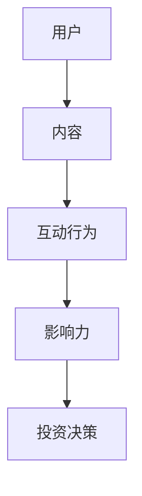
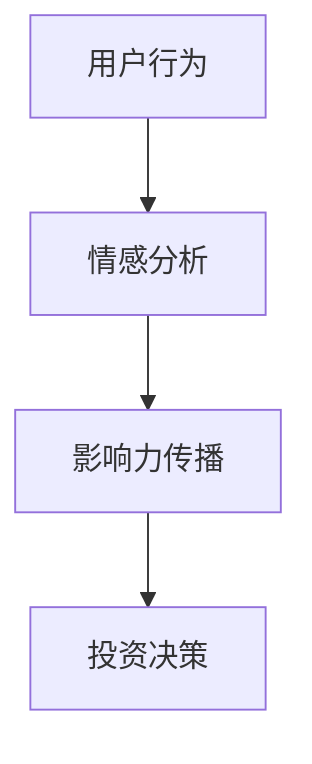

                 


# 价值投资中的AI驱动社交媒体影响力分析：多智能体系统

**关键词：**价值投资，社交媒体影响力，AI驱动，多智能体系统，情感分析，投资决策，影响力传播

**摘要：**  
本文探讨了在价值投资中利用人工智能（AI）驱动的社交媒体影响力分析，特别是基于多智能体系统的应用。通过分析社交媒体数据，结合多智能体系统的优势，本文提出了一种创新的方法来评估市场情绪、用户影响力和内容传播效果，从而为投资决策提供更精准的支持。文章详细阐述了多智能体系统的原理、算法设计、系统架构以及实际应用案例，为投资者和AI技术研究者提供了重要的参考。

---

# 第1章 价值投资与社交媒体影响力分析概述

## 1.1 价值投资的基本概念  
价值投资是一种以低于市场公允价值的价格买入优质资产的投资策略。其核心在于识别市场中的低估机会，并长期持有这些资产，等待其价值回归。传统价值投资依赖于财务分析、行业研究和市场趋势判断，而现代技术的进步使得社交媒体数据成为新的信息源。  

### 1.1.1 价值投资的定义与核心理念  
- **定义：** 价值投资是由本杰明·格雷厄姆提出的一种投资策略，强调以低于内在价值的价格买入股票。  
- **核心理念：**  
  1. 市场情绪的非理性导致价格波动。  
  2. 长期持有的优质资产最终会反映其真实价值。  
  3. 投资者应关注企业的基本面，而非短期市场波动。  

### 1.1.2 社会媒体在现代投资中的作用  
社交媒体已成为投资者获取信息的重要渠道，尤其是社交媒体上的用户评论、新闻传播和市场情绪分析，为价值投资提供了新的视角。  

### 1.1.3 多智能体系统在投资分析中的潜力  
多智能体系统（Multi-Agent System, MAS）通过多个智能体的协作，能够更高效地处理复杂数据，捕捉市场中的微观信息。例如，通过分析社交媒体上的用户行为，可以构建用户影响力模型，帮助投资者识别市场趋势。  

---

## 1.2 社交媒体影响力分析的背景  

### 1.2.1 社交媒体数据的可挖掘性  
社交媒体平台（如Twitter、Reddit、Facebook）产生的海量数据，包括用户评论、点赞、转发等行为，为市场情绪分析提供了丰富的素材。  

### 1.2.2 投资者情绪与市场波动的关系  
投资者情绪直接影响市场波动。例如，恐慌性抛售或过度乐观会导致资产价格偏离其真实价值。社交媒体上的情绪传播可以被建模和预测，从而帮助投资者做出更明智的决策。  

### 1.2.3 传统分析方法的局限性  
传统价值投资依赖于财务报表分析和市场趋势预测，但忽视了社交媒体等新兴数据源的潜力。通过结合社交媒体数据，可以更全面地评估企业的市场地位和用户影响力。  

---

## 1.3 多智能体系统的概念与特点  

### 1.3.1 多智能体系统的定义  
多智能体系统是指由多个相互作用的智能体组成的系统，每个智能体都能独立感知环境、做出决策并采取行动。  

### 1.3.2 多智能体系统的核心特点  
- **分布式性：** 每个智能体独立运行，通过通信协作完成任务。  
- **自主性：** 智能体能够自主决策，无需外部干预。  
- **协作性：** 智能体之间通过协作提高整体系统的智能水平。  
- **动态性：** 系统能够适应环境的变化，实时调整策略。  

### 1.3.3 多智能体系统与传统AI的区别  
| 属性 | 多智能体系统 | 传统AI系统 |  
|------|--------------|------------|  
| 结构 | 分布式，多个智能体协作 | 单一智能体 |  
| 决策 | 去中心化，局部决策 | 中央决策 |  
| 适应性 | 高度动态，实时调整 | 较低动态 |  

---

## 1.4 本章小结  
本章介绍了价值投资的核心理念、社交媒体在投资分析中的重要性，以及多智能体系统的特点和优势。通过结合社交媒体数据和多智能体系统，可以更高效地分析市场情绪，捕捉投资机会。

---

# 第2章 多智能体系统与社交媒体影响力分析的核心概念  

## 2.1 多智能体系统的原理  

### 2.1.1 多智能体系统的组成要素  
- **智能体：** 具备感知、决策和行动能力的个体。  
- **环境：** 智能体所处的外部世界，包括用户、内容和市场数据。  
- **通信机制：** 智能体之间的信息传递方式。  
- **协作任务：** 智能体共同完成的目标，如市场情绪分析。  

### 2.1.2 多智能体系统的通信机制  
通信机制是多智能体系统的核心，常见的通信方式包括：  
1. **直接通信：** 智能体之间直接交换信息。  
2. **间接通信：** 通过共享数据库或中间媒介传递信息。  

### 2.1.3 多智能体系统的协作与竞争  
- **协作：** 智能体通过分工合作完成复杂任务。  
- **竞争：** 智能体之间存在资源争夺，需通过机制平衡竞争。  

---

## 2.2 社交媒体影响力分析的模型  

### 2.2.1 用户影响力分析模型  
用户影响力反映了用户在社交媒体上的影响力，通常基于用户的关注数、互动频率和内容传播效果来衡量。  

### 2.2.2 内容影响力分析模型  
内容影响力分析模型用于评估特定内容对市场情绪的影响，例如新闻、评论或社交媒体帖子。  

### 2.2.3 网络影响力传播模型  
网络影响力传播模型描述了影响力在社交网络中的传播路径和速度。  

---

## 2.3 多智能体系统与社交媒体影响力分析的结合  

### 2.3.1 多智能体系统在社交媒体分析中的优势  
- **分布式计算：** 多智能体系统能够高效处理海量数据。  
- **实时响应：** 系统能够实时分析用户行为和市场情绪。  
- **动态适应：** 系统能够根据市场变化调整分析策略。  

### 2.3.2 多智能体系统的模块化设计  
- **数据采集智能体：** 负责收集社交媒体数据。  
- **情感分析智能体：** 负责分析用户评论的情感倾向。  
- **影响力传播智能体：** 负责计算影响力传播路径。  

### 2.3.3 多智能体系统的动态适应性  
多智能体系统能够根据市场变化动态调整策略，例如根据用户行为变化实时更新影响力模型。  

---

## 2.4 核心概念对比表格  
| 概念 | 属性 | 描述 |  
|------|------|------|  
| 多智能体系统 | 组件 | 独立智能体 |  
| 社交媒体影响力分析 | 数据来源 | 用户行为、内容互动 |  
| 价值投资 | 目标 | 发现被低估的投资机会 |  

---

## 2.5 ER实体关系图  


---

## 2.6 本章小结  
本章详细介绍了多智能体系统的核心概念及其在社交媒体影响力分析中的应用。通过模块化设计和动态适应性，多智能体系统能够高效处理社交媒体数据，为价值投资提供支持。

---

# 第3章 多智能体系统与社交媒体影响力分析的算法原理  

## 3.1 多智能体系统的通信与协作算法  

### 3.1.1 通信协议的设计  
- **同步通信：** 智能体之间按顺序交换信息。  
- **异步通信：** 智能体可以随时发送和接收信息。  

### 3.1.2 协作任务的分配  
- **任务分解：** 将整体任务分解为多个子任务，分配给不同的智能体。  
- **任务协调：** 通过通信机制确保任务协调完成。  

### 3.1.3 冲突解决机制  
- **优先级规则：** 根据任务优先级解决冲突。  
- **协商机制：** 智能体之间通过协商达成一致。  

---

## 3.2 基于情感分析的影响力传播算法  

### 3.2.1 情感分析模型的构建  
情感分析模型用于判断用户评论的情感倾向（正面、中性、负面）。  

### 3.2.2 基于情感传播的影响力计算  
影响力传播算法通过计算情感在社交网络中的传播路径，评估用户或内容的影响力。  

### 3.2.3 算法流程图  


---

## 3.3 网络影响力的数学模型  

### 3.3.1 网络影响力传播模型  
网络影响力传播模型描述了影响力在社交网络中的传播过程。  

### 3.3.2 数学公式  
$$ I_i(t+1) = \alpha \cdot \sum_{j} I_j(t) + (1-\alpha) \cdot w_i $$  
其中，$I_i(t)$ 表示节点 $i$ 在时间 $t$ 的影响力，$\alpha$ 是传播系数，$w_i$ 是初始影响力。  

---

## 3.4 本章小结  
本章详细介绍了多智能体系统在社交媒体影响力分析中的算法原理，包括通信与协作算法、情感分析模型和影响力传播模型。这些算法为投资决策提供了重要的数据支持。

---

# 第4章 系统分析与架构设计  

## 4.1 问题场景介绍  
系统需要分析社交媒体数据，评估用户影响力和内容传播效果，为投资者提供实时市场情绪分析和投资建议。  

---

## 4.2 项目介绍  

### 4.2.1 项目目标  
- 实时采集社交媒体数据。  
- 分析用户影响力和内容传播效果。  
- 提供基于多智能体系统的投资建议。  

### 4.2.2 系统功能设计  
- **数据采集模块：** 采集社交媒体数据。  
- **情感分析模块：** 分析用户评论的情感倾向。  
- **影响力传播模块：** 计算影响力传播路径。  
- **投资决策模块：** 提供基于影响力分析的投资建议。  

### 4.2.3 系统架构设计  


---

## 4.3 系统接口设计  
- **输入接口：** 接收社交媒体数据。  
- **输出接口：** 提供投资建议和影响力分析结果。  

---

## 4.4 系统交互序列图  


---

## 4.5 本章小结  
本章详细描述了系统的架构设计和接口设计，为后续的实现奠定了基础。

---

# 第5章 项目实战  

## 5.1 环境安装  

### 5.1.1 安装Python  
- 安装Python 3.8或更高版本。  

### 5.1.2 安装依赖库  
- `pandas`：数据处理库。  
- `networkx`：网络分析库。  
- `sentiment-analyzer`：情感分析库。  

---

## 5.2 系统核心实现源代码  

### 5.2.1 数据采集模块  
```python
import pandas as pd
import requests

def fetch_data(api_key):
    url = f"https://api.socialmedia.com/v1/data?api_key={api_key}"
    response = requests.get(url)
    return pd.DataFrame(response.json())
```

---

### 5.2.2 情感分析模块  
```python
from sentiment_analyzer import SentimentAnalyzer

def analyze_sentiment(text):
    sa = SentimentAnalyzer()
    return sa.analyze(text)
```

---

### 5.2.3 投资决策模块  
```python
def generate_investment_recommendation(influence_score):
    if influence_score > 0.8:
        return "买入"
    elif influence_score > 0.6:
        return "观望"
    else:
        return "卖出"
```

---

## 5.3 代码应用解读与分析  
- **数据采集模块：** 从社交媒体API获取数据。  
- **情感分析模块：** 分析用户评论的情感倾向。  
- **投资决策模块：** 根据影响力评分生成投资建议。  

---

## 5.4 实际案例分析  
假设某社交媒体平台上关于某公司的评论中，大部分用户表达了正面情绪，且影响力传播路径广泛。系统分析后，生成“买入”的投资建议。  

---

## 5.5 项目小结  
本章通过实际案例展示了系统的实现过程，验证了多智能体系统在社交媒体影响力分析中的有效性。

---

# 第6章 最佳实践与总结  

## 6.1 小结  
本文详细探讨了多智能体系统在社交媒体影响力分析中的应用，提出了基于情感分析和影响力传播的投资决策方法。  

---

## 6.2 注意事项  
- 数据质量对分析结果有直接影响，需确保数据的准确性和完整性。  
- 系统的实时性和动态适应性是实现高效投资决策的关键。  

---

## 6.3 拓展阅读  
- 《Multi-Agent Systems: Complexity, Decentralized Knowledge, and the Challenges of Software Engineering》  
- 《Social Network Analysis: Methods and Applications》  

---

# 第7章 未来展望  

## 7.1 未来发展方向  
- **强化学习：** 在多智能体系统中引入强化学习，提高系统的自主决策能力。  
- **实时分析：** 提升系统的实时数据处理能力，支持高频交易。  
- **跨平台集成：** 实现多平台数据的协同分析，提供更全面的市场情绪分析。  

---

## 7.2 结语  
随着AI技术的不断发展，多智能体系统在社交媒体影响力分析中的应用将更加广泛，为价值投资提供更强大的支持。

---

# 附录  
附录包括完整的系统代码、数据集说明以及参考文献。

