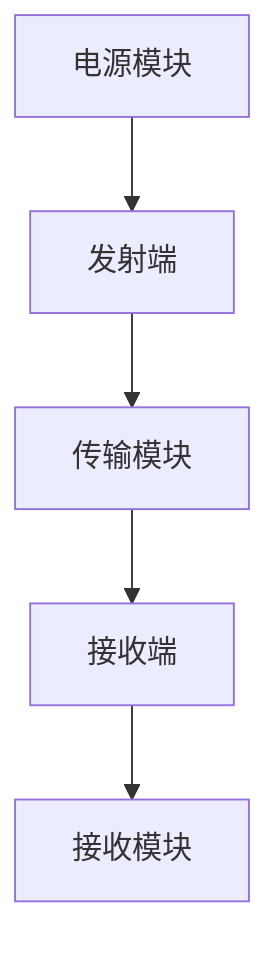

                 

# 价值投资中的下一代无线能量传输技术前景

## 关键词：价值投资，无线能量传输，技术前景，投资策略，技术分析，市场潜力，无线充电技术

## 摘要：  
本文探讨了无线能量传输技术在投资领域的潜力和前景，分析了其核心技术路径、数学模型、系统架构以及投资策略。通过详细的技术分析和实际案例，本文揭示了无线能量传输技术的市场潜力和投资价值，为投资者提供了科学的决策依据。文章还展望了无线能量传输技术的未来发展趋势，为价值投资者提供了新的投资方向和机会。

---

## 第1章：无线能量传输技术的发展历程

### 1.1 无线能量传输的基本概念

#### 1.1.1 无线能量传输的定义与特点

无线能量传输是一种通过电磁波、电磁感应或磁共振等技术，将能量从发射端传递到接收端的新兴技术。其特点是无需物理连接，能够在一定距离内实现能量的无线传输。这种技术的应用范围广泛，包括无线充电、医疗设备供电、物联网设备能量补给等领域。

#### 1.1.2 无线能量传输的历史发展

无线能量传输的概念可以追溯到19世纪末，特斯拉的无线电力传输实验是这一领域的里程碑。随着技术的进步，无线能量传输在20世纪末逐渐进入实际应用阶段，特别是无线充电技术的商业化。近年来，随着5G、物联网和新能源汽车的快速发展，无线能量传输技术得到了进一步的推动。

#### 1.1.3 当前无线能量传输的技术瓶颈与未来方向

尽管无线能量传输技术取得了显著进展，但其仍面临一些技术瓶颈，如能量传输效率低、传输距离有限、安全性等问题。未来的发展方向包括提高能量传输效率、延长传输距离、降低技术成本以及提升安全性。

### 1.2 价值投资的基本概念

#### 1.2.1 价值投资的定义与核心理念

价值投资是一种投资策略，强调以低于内在价值的价格买入优质资产。其核心理念是通过深入分析企业的基本面，寻找被市场低估的投资机会。价值投资强调长期持有的策略，注重企业的盈利能力和成长潜力。

#### 1.2.2 价值投资在科技领域的应用

科技领域的价值投资需要关注技术创新、市场前景、竞争优势和财务状况等因素。投资者需要深入分析科技企业的核心技术、产品竞争力、市场占有率以及盈利能力，寻找具有长期增长潜力的企业。

#### 1.2.3 无线能量传输技术的市场潜力与投资价值

无线能量传输技术的应用前景广阔，尤其是在物联网、新能源汽车、消费电子等领域具有巨大的市场潜力。随着技术的不断进步和成本的下降，无线能量传输技术将逐步取代传统充电方式，成为未来能源传输的重要方式。

### 1.3 无线能量传输技术与价值投资的结合

#### 1.3.1 无线能量传输技术的商业化前景

无线能量传输技术正在逐步实现商业化，特别是在无线充电领域。随着技术的成熟和成本的降低，其应用范围将不断扩大，市场需求将快速增长。

#### 1.3.2 价值投资视角下的技术评估

从价值投资的角度来看，投资者需要评估无线能量传输技术的市场潜力、技术门槛、竞争优势以及企业的财务状况。重点关注那些具有核心技术优势、市场占有率高、盈利能力强的企业。

#### 1.3.3 无线能量传输技术的未来发展趋势

未来，无线能量传输技术将朝着更高效率、更远距离、更低能耗的方向发展。同时，随着技术的成熟，其应用领域将进一步扩展，市场需求将大幅增长。

---

## 第2章：无线能量传输技术的核心原理与数学模型

### 2.1 无线能量传输的主要技术路径

#### 2.1.1 电磁感应原理

电磁感应是一种通过变化的磁场产生电流的技术。在无线充电中，发射线圈和接收线圈通过电磁感应实现能量的传递。其基本原理是法拉第电磁感应定律：

$$
\mathcal{E} = -\frac{d\phi}{dt}
$$

其中，$\mathcal{E}$是感应电动势，$\phi$是磁通量，$t$是时间。

#### 2.1.2 无线电波传输

无线电波传输是通过发射无线电波，利用天线接收并转化为电能的技术。其传输效率与距离、频率、设备效率等因素有关。无线电波的传播损耗可以用菲涅尔公式计算：

$$
P_{\text{loss}} = 10 \log_{10} \left( \frac{4\pi d}{\lambda} \right)
$$

其中，$d$是距离，$\lambda$是波长。

#### 2.1.3 磁共振技术

磁共振技术通过发射端和接收端的谐振线圈实现能量的高效传输。其谐振频率由下式决定：

$$
f = \frac{1}{2\pi \sqrt{LC}}
$$

其中，$L$是电感，$C$是电容。

### 2.2 各种技术路径的优缺点对比

| 技术路径      | 优点                     | 缺点                     |
|---------------|--------------------------|--------------------------|
| 电磁感应       | 成本低，技术成熟         | 传输距离短，效率低       |
| 无线电波       | 传输距离远，灵活性高     | 效率低，损耗大           |
| 磁共振         | 传输效率高，距离适中     | 技术复杂，成本高         |

### 2.3 无线能量传输的数学模型与公式

#### 2.3.1 电磁感应模型的数学表达

在电磁感应模型中，发射线圈和接收线圈的互感系数$M$决定了能量的传递效率。能量传输效率$η$可以表示为：

$$
η = \frac{M^2}{L_1 L_2}
$$

其中，$L_1$和$L_2$分别是发射线圈和接收线圈的自感。

#### 2.3.2 无线电波传输的功率损耗公式

无线电波传输的功率损耗与距离$d$和频率$f$有关。损耗可以用功率损耗指数$N$表示：

$$
P_{\text{loss}} = P_{\text{transmitted}} \times 10^{-N/10}
$$

其中，$N$是路径损耗指数。

#### 2.3.3 磁共振技术的谐振频率计算公式

磁共振技术的谐振频率由发射端和接收端的谐振频率一致时实现。谐振频率由下式决定：

$$
f = \frac{1}{2\pi \sqrt{LC}}
$$

其中，$L$是电感，$C$是电容。

---

## 第3章：无线能量传输技术的系统架构与投资分析

### 3.1 系统功能模块划分

无线能量传输系统主要由电源模块、传输模块和接收模块组成。电源模块负责提供能量，传输模块负责能量的无线传输，接收模块负责接收并转换能量。

### 3.2 系统架构设计

#### 3.2.1 系统架构图（Mermaid）

### 3.3 系统接口设计

#### 3.3.1 硬件接口

硬件接口包括发射端和接收端的电路接口，如发射线圈、接收线圈、控制芯片等。

#### 3.3.2 软件接口

软件接口包括控制模块和通信模块，负责协调能量传输和设备管理。

---

## 第4章：无线能量传输技术的投资策略与案例分析

### 4.1 市场分析与投资机会

#### 4.1.1 市场潜力

随着物联网、新能源汽车和消费电子的发展，无线能量传输技术的市场需求将快速增长。预计到2030年，全球无线充电市场规模将达到数百亿美元。

#### 4.1.2 投资价值

无线能量传输技术具有较高的技术门槛和市场潜力，尤其是那些拥有核心技术优势的企业更具投资价值。投资者应关注企业的研发能力、市场占有率和盈利能力。

### 4.2 投资策略

#### 4.2.1 技术评估

投资者需要评估企业的核心技术，如电磁感应、无线电波和磁共振技术的成熟度和市场竞争力。

#### 4.2.2 市场定位

分析企业的市场定位，包括目标市场、竞争对手和市场前景。

#### 4.2.3 竞争分析

研究行业内的竞争格局，评估企业的竞争优势和劣势。

#### 4.2.4 投资组合优化

根据风险偏好和收益预期，构建多元化投资组合，分散投资风险。

### 4.3 成功案例分析

#### 4.3.1 美国某公司的技术突破案例

以美国某无线充电技术公司为例，该公司通过技术创新实现了高效的无线充电技术，市场表现优异，股价表现良好。

---

## 第5章：无线能量传输技术的未来展望

### 5.1 技术发展趋势

#### 5.1.1 空间传输

未来的无线能量传输技术将朝着更远距离和更高效率的方向发展，空间传输技术将成为研究重点。

#### 5.1.2 动态谐振

动态谐振技术将提高能量传输的灵活性和适应性，适用于更多的应用场景。

#### 5.1.3 智能分配

智能分配技术将通过人工智能和大数据分析，实现能量的智能分配和优化。

### 5.2 价值投资的未来机会

#### 5.2.1 新兴技术的应用

随着新技术的不断涌现，价值投资者应关注那些能够快速适应市场变化、具备技术创新能力的企业。

#### 5.2.2 新兴市场的开拓

新兴市场的无线能量传输技术需求巨大，投资者应关注这些地区的市场潜力。

---

## 第6章：总结与展望

### 6.1 全文总结

本文详细分析了无线能量传输技术的发展历程、核心原理、系统架构以及投资策略。通过技术分析和案例研究，揭示了无线能量传输技术的市场潜力和投资价值。

### 6.2 未来展望

无线能量传输技术的未来发展前景广阔，随着技术的进步和市场的扩展，其应用领域将进一步扩大。对于价值投资者而言，无线能量传输技术将提供丰富的投资机会，成为科技投资的重要方向。

---

以上是《价值投资中的下一代无线能量传输技术前景》的完整思考过程，涵盖文章的结构、内容和关键点。

