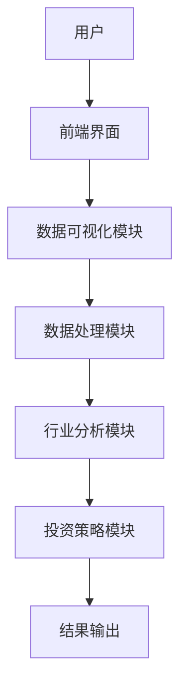
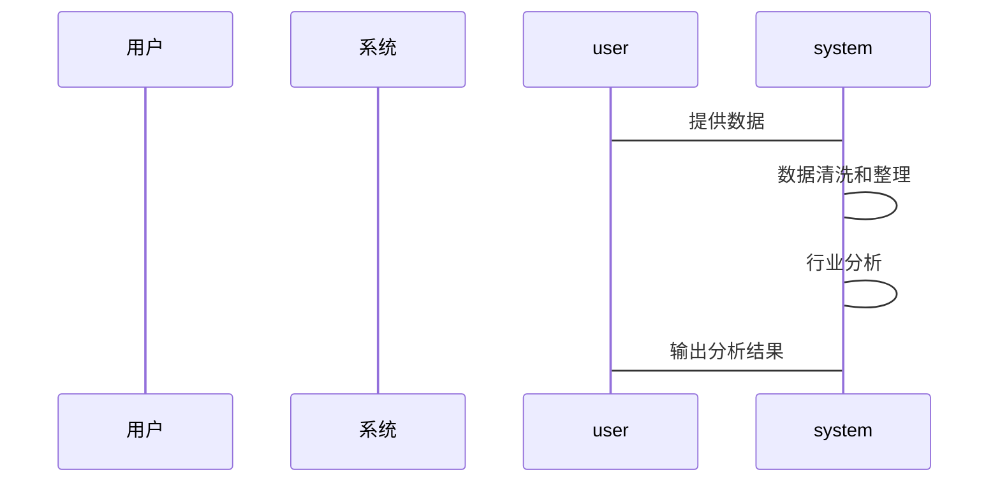

                 


```markdown
# 价值投资中的周期性行业分析：把握行业起落

> 关键词：价值投资，周期性行业，经济周期，行业分析，投资策略

> 摘要：本文深入探讨了价值投资中周期性行业的分析方法，从行业定义、经济周期影响、分析框架到具体投资策略，结合实际案例和系统设计，帮助投资者更好地把握行业波动，制定科学的投资决策。

---

## 第一章: 价值投资与周期性行业概述

### 1.1 价值投资的基本概念

#### 1.1.1 价值投资的定义与核心理念
价值投资是一种以基本面分析为核心的长期投资策略，强调以低于内在价值的价格购买优质资产。其核心理念包括：
- 购买具有内在价值的资产
- 长期持有的投资策略
- 独立思考和安全边际的重要性

#### 1.1.2 周期性行业的特点与分类
周期性行业是指其需求和利润会随着经济周期波动而变化的行业。主要分类包括：
- **强周期性行业**：如房地产、汽车、钢铁、能源等行业，其需求与经济周期高度相关。
- **弱周期性行业**：如公用事业、医疗、教育等行业，其需求受经济波动影响较小。

#### 1.1.3 价值投资与周期性行业的关联
- 经济周期波动为价值投资者提供了低位买入的机会。
- 周期性行业的波动性为投资者提供了超额收益的可能性。
- 需要结合宏观经济分析和行业基本面分析来选择投资标的。

### 1.2 周期性行业的经济影响

#### 1.2.1 经济周期与行业波动的关系
经济周期分为衰退、复苏、过热和滞胀四个阶段，不同阶段对周期性行业的影响各异：
- **衰退阶段**：需求下降，企业盈利减少。
- **复苏阶段**：需求逐步恢复，企业盈利开始回升。
- **过热阶段**：需求激增，企业盈利达到顶峰。
- **滞胀阶段**：需求疲软，企业盈利下降。

#### 1.2.2 周期性行业的典型特征
- **需求弹性大**：需求受经济周期影响显著。
- **供给弹性高**：供给能力能够快速调整以适应需求变化。
- **波动性高**：市场价格波动较大，短期内可能大幅波动。

#### 1.2.3 周期性行业对投资决策的影响
- 投资者需要关注行业周期所处阶段。
- 在周期底部寻找低估的投资标的。
- 在周期顶部警惕风险，避免高位买入。

### 1.3 价值投资中的周期性行业分析方法

#### 1.3.1 行业分析的基本框架
- **行业背景分析**：了解行业的发展历史、市场结构、竞争格局。
- **行业现状分析**：分析当前的市场需求、供给能力、价格水平。
- **行业未来趋势分析**：预测行业的发展方向、增长潜力、风险因素。

#### 1.3.2 周期性行业的核心指标
- **市盈率（P/E）**：衡量股价与盈利的关系。
- **市净率（P/B）**：衡量股价与资产净值的关系。
- **ROE（净资产收益率）**：衡量企业的盈利能力。
- **毛利率**：衡量企业的成本控制能力。

#### 1.3.3 行业周期的判断与预测
- **宏观经济指标分析**：通过GDP增长率、利率、通货膨胀率等指标判断经济周期。
- **行业供需分析**：通过供给和需求的变化预测行业周期。
- **历史数据分析**：通过历史周期数据寻找规律，预测未来周期走势。

### 1.4 本章小结
本章介绍了价值投资的基本概念，周期性行业的特点与分类，以及经济周期对行业波动的影响。同时，提出了周期性行业分析的基本框架和核心指标，为后续的深入分析奠定了基础。

---

## 第二章: 周期性行业的经济周期分析

### 2.1 经济周期的定义与阶段划分

#### 2.1.1 经济周期的四个阶段
- **衰退阶段**：经济增长放缓，企业盈利下降。
- **复苏阶段**：经济开始恢复，企业盈利逐步回升。
- **过热阶段**：经济增长过快，企业盈利达到顶峰。
- **滞胀阶段**：经济增长停滞，通胀上升，企业盈利下降。

#### 2.1.2 各阶段对周期性行业的影响
- **衰退阶段**：需求下降，价格下跌，企业盈利减少。
- **复苏阶段**：需求逐步恢复，价格企稳，企业盈利开始回升。
- **过热阶段**：需求激增，价格上升，企业盈利达到顶峰。
- **滞胀阶段**：需求疲软，价格下跌，企业盈利下降。

#### 2.1.3 经济周期与行业波动的关联性
- 经济周期直接影响行业的供需关系。
- 行业波动与经济周期高度相关，投资者需要结合宏观经济分析行业周期。

### 2.2 周期性行业的供需分析

#### 2.2.1 行业供需的基本模型
- **供给曲线**：供给量与价格的关系曲线。
- **需求曲线**：需求量与价格的关系曲线。
- **均衡点**：供给与需求达到平衡的价格和数量。

#### 2.2.2 供需变化对行业周期的影响
- **供给增加**：可能导致价格下降，企业盈利减少。
- **需求增加**：可能导致价格上升，企业盈利增加。

#### 2.2.3 供需分析在投资中的应用
- 通过分析供需变化预测行业周期。
- 在供需失衡时寻找投资机会。

### 2.3 周期性行业的价格波动分析

#### 2.3.1 行业价格的形成机制
- **市场供求关系**：价格由供给和需求决定。
- **成本因素**：生产成本影响价格水平。
- **竞争格局**：行业竞争状况影响价格走势。

#### 2.3.2 价格波动与行业周期的关系
- 价格波动是行业周期变化的直观反映。
- 价格波动幅度与行业周期波动程度相关。

#### 2.3.3 价格分析在投资中的作用
- 通过价格走势判断行业周期阶段。
- 在价格底部寻找买入机会。

### 2.4 本章小结
本章分析了经济周期对周期性行业供需和价格波动的影响，提出了通过供需分析和价格分析预测行业周期的方法，为投资者提供了实操指导。

---

## 第三章: 周期性行业分析的方法论

### 3.1 行业分析的基本框架

#### 3.1.1 行业背景分析
- **行业发展历史**：了解行业的演变过程。
- **市场结构**：分析行业的竞争格局。
- **政策环境**：研究行业的政策支持或限制。

#### 3.1.2 行业现状分析
- **市场需求**：分析当前的市场需求量和需求结构。
- **供给能力**：评估行业的生产能力和服务能力。
- **价格水平**：分析当前的价格走势和价格波动。

#### 3.1.3 行业未来趋势分析
- **市场增长潜力**：预测行业的未来增长空间。
- **技术进步**：分析技术进步对行业的影响。
- **风险因素**：识别行业的潜在风险。

### 3.2 分析工具与方法

#### 3.2.1 财务指标分析
- **盈利能力**：ROE、净利润率等。
- **营运能力**：存货周转率、应收账款周转率等。
- **偿债能力**：资产负债率、流动比率等。

#### 3.2.2 行业比较分析
- **同行业比较**：分析行业内各公司的财务指标。
- **行业平均水平**：对比行业平均指标，判断公司的相对位置。

#### 3.2.3 宏观经济指标分析
- **GDP增长率**：反映整体经济状况。
- **利率水平**：影响企业的融资成本和投资行为。
- **通货膨胀率**：影响企业的成本和价格。

### 3.3 数据收集与处理

#### 3.3.1 数据来源与可靠性
- **公开数据**：上市公司财报、行业报告等。
- **第三方数据**：如wind、 Bloomberg等金融数据平台。
- **政府统计数据**：如国家统计局数据。

#### 3.3.2 数据清洗与整理
- **数据清洗**：去除异常值、填补缺失值。
- **数据整理**：对数据进行分类、排序、汇总。

#### 3.3.3 数据可视化与分析
- **数据可视化**：通过图表展示数据趋势和波动。
- **数据分析**：使用统计方法分析数据之间的关系。

### 3.4 本章小结
本章详细介绍了周期性行业分析的基本框架、分析工具与方法，以及数据收集与处理的步骤，为投资者提供了系统化的分析方法。

---

## 第四章: 重点周期性行业的分析与投资策略

### 4.1 房地产行业分析

#### 4.1.1 房地产行业的特点
- **高杠杆**：房地产行业通常需要较高的初始资本投入。
- **周期性明显**：房地产行业受经济周期影响较大。

#### 4.1.2 房地产行业的周期性分析
- **衰退阶段**：需求下降，房价下跌，企业盈利减少。
- **复苏阶段**：需求逐步恢复，房价企稳，企业盈利开始回升。

#### 4.1.3 投资策略
- **在周期底部布局**：寻找价格洼地。
- **关注政策变化**：及时调整投资策略。

### 4.2 汽车行业分析

#### 4.2.1 汽车行业的特点
- **技术密集**：汽车行业的技术更新换代快。
- **竞争激烈**：行业内竞争者众多。

#### 4.2.2 汽车行业的周期性分析
- **衰退阶段**：需求下降，销量减少，企业盈利减少。
- **复苏阶段**：需求逐步恢复，销量回升，企业盈利开始回升。

#### 4.2.3 投资策略
- **关注行业龙头**：选择市场份额高的公司。
- **关注技术创新**：投资具有技术优势的企业。

### 4.3 钢铁行业分析

#### 4.3.1 钢铁行业的特点
- **产能过剩**：钢铁行业通常存在产能过剩的问题。
- **周期性明显**：钢铁行业受经济周期影响较大。

#### 4.3.2 钢铁行业的周期性分析
- **衰退阶段**：需求下降，钢价下跌，企业盈利减少。
- **复苏阶段**：需求逐步恢复，钢价企稳，企业盈利开始回升。

#### 4.3.3 投资策略
- **关注成本控制**：选择成本优势明显的公司。
- **关注行业整合**：投资于行业整合中的龙头企业。

### 4.4 能源行业分析

#### 4.4.1 能源行业的特点
- **资源依赖性高**：能源行业依赖于资源储备。
- **政策影响大**：能源行业受政策影响较大。

#### 4.4.2 能源行业的周期性分析
- **衰退阶段**：需求下降，能源价格下跌，企业盈利减少。
- **复苏阶段**：需求逐步恢复，能源价格企稳，企业盈利开始回升。

#### 4.4.3 投资策略
- **关注能源转型**：投资于新能源领域的企业。
- **关注政策变化**：及时调整投资策略。

### 4.5 本章小结
本章通过分析房地产、汽车、钢铁和能源等重点周期性行业，提出了具体的行业分析方法和投资策略，为投资者提供了实操指导。

---

## 第五章: 系统分析与架构设计

### 5.1 问题场景介绍
- **背景**：投资者需要一个系统化的工具来分析周期性行业。
- **目标**：构建一个周期性行业分析系统，帮助投资者进行行业分析和投资决策。

### 5.2 系统功能设计

#### 5.2.1 领域模型


#### 5.2.2 系统架构设计


#### 5.2.3 系统接口设计
- **数据接口**：与第三方数据源对接，获取经济指标、行业数据和公司数据。
- **用户接口**：提供友好的用户界面，方便用户输入和输出。

#### 5.2.4 系统交互设计


### 5.3 本章小结
本章通过系统化的分析，提出了周期性行业分析系统的功能设计、架构设计和交互设计，为投资者提供了一个系统化的工具。

---

## 第六章: 项目实战与案例分析

### 6.1 项目环境安装
- **工具安装**：安装Python、Pandas、Matplotlib、Seaborn等工具。
- **数据获取**：从公开数据源获取行业数据。

### 6.2 核心实现源代码
```python
import pandas as pd
import matplotlib.pyplot as plt

# 数据获取与处理
data = pd.read_csv('industry_data.csv')
data = data.dropna()
data['date'] = pd.to_datetime(data['date'])

# 数据可视化
plt.figure(figsize=(10,6))
plt.plot(data['date'], data['price'], label='行业价格')
plt.title('行业价格走势')
plt.xlabel('时间')
plt.ylabel('价格')
plt.legend()
plt.show()
```

### 6.3 实际案例分析

#### 6.3.1 案例背景
- **行业**：房地产行业
- **时间范围**：2010年-2020年

#### 6.3.2 数据分析与建模
- **数据清洗**：去除缺失值和异常值。
- **数据建模**：使用ARIMA模型预测行业价格走势。

#### 6.3.3 投资策略制定
- **在周期底部布局**：选择价格底部区域进行投资。
- **关注政策变化**：及时调整投资策略。

### 6.4 本章小结
本章通过实际案例分析，展示了如何将理论应用于实践，帮助投资者制定科学的投资策略。

---

## 第七章: 总结与展望

### 7.1 总结
- **核心观点**：周期性行业的波动性为投资者提供了超额收益的机会，但也带来了较高的风险。
- **方法总结**：通过宏观经济分析、行业供需分析和财务指标分析，投资者可以更好地把握行业周期，制定科学的投资策略。

### 7.2 投资策略注意事项
- **分散投资**：避免过度集中于单一行业或标的。
- **风险控制**：设置止损点，控制投资风险。
- **持续学习**：关注行业动态和宏观经济变化，及时调整投资策略。

### 7.3 未来研究方向
- **多因子模型**：研究多个因子对行业周期的影响。
- **机器学习应用**：利用机器学习技术进行行业预测和投资决策。
- **国际比较**：研究不同国家和地区的周期性行业差异。

### 7.4 本章小结
本章总结了全文的核心观点，提出了投资策略的注意事项，并展望了未来的研究方向，为投资者提供了长期的学习和研究方向。

---

## 第八章: 最佳实践与投资技巧

### 8.1 投资技巧
- **逆向思维**：在行业低谷时寻找投资机会。
- **价值评估**：通过基本面分析寻找低估的投资标的。
- **分散投资**：降低投资风险。

### 8.2 风险管理
- **设定止损点**：避免重大损失。
- **动态调整**：根据市场变化及时调整投资组合。
- **心理控制**：避免情绪化投资。

### 8.3 本章小结
本章总结了最佳投资实践和风险管理技巧，帮助投资者在实际操作中避免常见错误，提高投资成功率。

---

## 第九章: 结语

### 9.1 重要性回顾
- 价值投资中的周期性行业分析是投资者不可忽视的重要部分。
- 通过系统化的分析和实践，投资者可以更好地把握行业起落，实现长期稳定收益。

### 9.2 鼓励与建议
- 鼓励投资者不断学习和实践，提升自身的行业分析能力。
- 建议投资者结合宏观经济分析和行业基本面分析，制定科学的投资策略。

### 9.3 结语
周期性行业的波动为投资者提供了丰富的投资机会，但也带来了较高的投资风险。通过本文的系统化分析和实践，投资者可以更好地把握行业起落，实现价值投资的目标。

---

## 参考文献

（此处列出相关书籍、论文、网站等参考资料）

---

## 附录

### 附录A: 代码示例
```python
# 附录A: 行业数据可视化代码
import pandas as pd
import matplotlib.pyplot as plt

# 数据获取
data = pd.read_csv('industry_data.csv')
data = data.set_index('date')

# 数据可视化
data['price'].plot(kind='line', title='行业价格走势')
plt.xlabel('时间')
plt.ylabel('价格')
plt.show()
```

### 附录B: 模型实现
```python
# 附录B: ARIMA模型实现
from statsmodels.tsa.arima_model import ARIMA

# 数据准备
data = pd.read_csv('industry_data.csv')
data = data.set_index('date')

# 模型训练
model = ARIMA(data['price'], order=(5,1,0))
model_fit = model.fit()

# 预测未来价格
future_forecast = model_fit.forecast(steps=10)
print(future_forecast)
```

### 附录C: 图表展示
（此处插入相关图表，如行业周期分析图、供需分析图等）

---

## 感谢
感谢读者的耐心阅读，希望本文能为价值投资者在周期性行业分析方面提供有价值的参考和指导。
```

