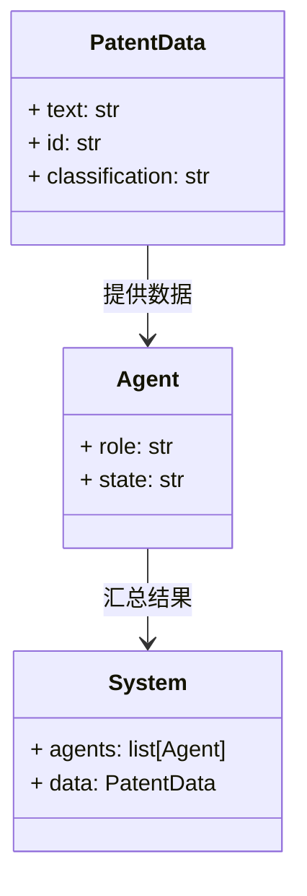
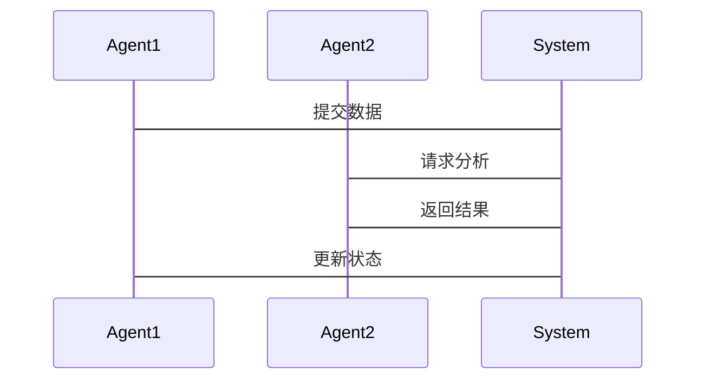

                 


# 价值投资中的多智能体AI专利分析系统

> 关键词：价值投资、多智能体AI、专利分析、算法原理、系统架构设计

> 摘要：本文探讨了如何利用多智能体人工智能技术进行专利分析，以支持价值投资决策。文章从多智能体AI的基本概念出发，结合专利分析的核心需求，详细阐述了多智能体AI在价值投资中的应用优势。通过分析多智能体AI的算法原理和系统架构设计，本文提出了一个创新的专利分析系统，并通过实际案例展示了该系统的应用场景和实现方法。

---

# 第一部分: 价值投资中的多智能体AI专利分析系统概述

---

# 第1章: 多智能体AI与价值投资概述

## 1.1 多智能体AI的基本概念

### 1.1.1 多智能体系统定义

多智能体系统（Multi-Agent System，MAS）是由多个智能体（Agent）组成的分布式系统，每个智能体都是一个能够感知环境、自主决策并采取行动的实体。这些智能体可以是软件程序、算法或物理设备，它们通过通信和协作完成复杂任务。

### 1.1.2 多智能体AI的核心特征

- **分布式智能**：多个智能体协同工作，避免单点依赖。
- **自主性**：每个智能体能够独立决策。
- **协作性**：智能体之间通过通信和协作完成共同目标。
- **适应性**：能够动态调整策略以应对环境变化。

### 1.1.3 多智能体AI与传统AI的区别

| 特性 | 多智能体AI | 传统AI |
|------|------------|--------|
| 结构  | 分布式     | 集中式 | 
| 决策  | 协作式     | 单一式 | 
| 适应性 | 动态调整   | 静态   |

---

## 1.2 价值投资的基本原理

### 1.2.1 价值投资的定义

价值投资是一种投资策略，旨在通过分析企业的基本面（如财务状况、盈利能力、市场地位等），寻找被市场低估的投资标的。其核心思想是“买入低于内在价值的资产”。

### 1.2.2 价值投资的核心策略

- **基本面分析**：关注企业的财务报表、行业地位、竞争优势。
- **长期视角**：注重企业的长期价值，而非短期波动。
- **安全边际**：买入价格显著低于内在价值。

### 1.2.3 价值投资与AI的结合潜力

AI技术可以帮助投资者更高效地处理海量数据，发现潜在的价值投资机会。通过AI分析企业专利、市场趋势、竞争环境等信息，投资者可以做出更科学的决策。

---

## 1.3 专利分析在价值投资中的作用

### 1.3.1 专利分析的定义

专利分析是对专利数据的收集、整理、分析和解读，旨在为企业或技术的竞争力提供支持。通过分析专利的数量、质量、分布和趋势，可以评估企业的技术创新能力。

### 1.3.2 专利分析在投资决策中的应用

- **评估企业技术优势**：通过分析专利数量、申请时间、技术领域等，判断企业的技术创新能力。
- **预测市场趋势**：通过分析专利布局，预测行业的未来发展方向。
- **识别投资机会**：发现具有技术优势但市场估值较低的企业。

### 1.3.3 多智能体AI在专利分析中的优势

- **分布式计算能力**：多智能体AI可以同时处理大量专利数据。
- **协作能力**：智能体之间可以分工合作，分别负责数据清洗、特征提取、模型训练等任务。
- **动态调整能力**：根据市场变化，实时调整分析策略。

---

## 1.4 本章小结

本章介绍了多智能体AI的基本概念、价值投资的核心策略以及专利分析在价值投资中的作用。通过对比分析，我们发现多智能体AI在专利分析中具有显著优势，可以为价值投资提供更高效、更精准的支持。

---

# 第2章: 多智能体AI专利分析系统的核心概念

## 2.1 多智能体AI系统架构

### 2.1.1 多智能体系统的组成

多智能体系统由以下部分组成：
1. **智能体（Agent）**：负责具体任务的执行单元。
2. **通信机制**：智能体之间的交互接口。
3. **协作协议**：智能体之间的协作规则。
4. **环境（Environment）**：智能体所处的外部世界。

### 2.1.2 多智能体系统中的角色分配

- **数据采集智能体**：负责收集专利数据。
- **特征提取智能体**：负责提取专利文本的特征。
- **模型训练智能体**：负责训练分类模型。
- **决策优化智能体**：负责优化投资决策。

### 2.1.3 多智能体系统中的通信机制

通信机制是多智能体系统的核心，常见的通信方式包括：
1. **直接通信**：智能体之间直接交换信息。
2. **间接通信**：通过共享数据库或消息队列进行通信。

---

## 2.2 价值投资中的专利分析需求

### 2.2.1 专利分析的关键指标

- **专利数量**：衡量企业的技术创新能力。
- **专利质量**：衡量专利的技术价值和法律保护力度。
- **专利布局**：分析专利的技术领域和地域分布。

### 2.2.2 专利分析的数据来源

- **专利数据库**：如专利局官网、商业专利数据库。
- **企业财报**：获取企业的研发投入和专利申请情况。
- **行业报告**：了解行业的技术发展趋势。

### 2.2.3 专利分析的挑战与解决方案

| 挑战 | 解决方案 |
|------|----------|
| 数据量大 | 分布式计算   |
| 数据复杂 | 多智能体协作 |
| 动态变化 | 实时更新机制 |

---

## 2.3 多智能体AI在专利分析中的应用

### 2.3.1 多智能体AI的分布式计算优势

- **并行处理**：多个智能体可以同时处理不同的数据。
- **任务分工**：每个智能体负责特定的任务，提高效率。

### 2.3.2 多智能体AI在专利数据处理中的应用

- **数据清洗**：智能体负责去除噪声数据。
- **特征提取**：智能体负责提取专利文本的关键特征。
- **分类与聚类**：智能体负责对专利进行分类和聚类分析。

### 2.3.3 多智能体AI在专利分析结果中的表现

- **高准确性**：通过协作学习，提高分析结果的准确性。
- **快速响应**：分布式计算能力使分析速度更快。

---

## 2.4 核心概念对比分析

### 2.4.1 多智能体AI与传统AI的对比

| 特性 | 多智能体AI | 传统AI |
|------|------------|--------|
| 结构  | 分布式     | 集中式 |
| 决策  | 协作式     | 单一式 |
| 适应性 | 动态调整   | 静态   |

### 2.4.2 专利分析与传统财务分析的对比

| 特性 | 专利分析 | 财务分析 |
|------|-----------|----------|
| 数据来源 | 专利数据 | 财务报表 |
| 分析目标 | 技术能力 | 财务状况 |
| 分析方法 | 文本挖掘、机器学习 | 财务指标分析 |

### 2.4.3 价值投资中的多智能体AI与传统AI的对比

| 特性 | 多智能体AI | 传统AI |
|------|------------|--------|
| 分析能力 | 强大       | 较弱    |
| 计算效率 | 高         | 中等    |
| 适应性 | 高         | 低      |

---

## 2.5 本章小结

本章详细阐述了多智能体AI在专利分析中的核心概念，包括多智能体系统的架构、价值投资中的专利分析需求以及多智能体AI在专利分析中的具体应用。通过对比分析，我们进一步明确了多智能体AI的优势和适用场景。

---

# 第3章: 多智能体AI专利分析系统的算法原理

## 3.1 多智能体AI的核心算法

### 3.1.1 分布式强化学习算法

**分布式强化学习（Distributed Reinforcement Learning，DRL）**是一种多智能体协作的强化学习方法，通过智能体之间的协作和竞争，实现全局最优目标。

**数学公式**：
$$ Q_i(a_i) = \sum_{j \neq i} Q_j(a_j) $$

其中，\( Q_i(a_i) \) 表示智能体 \( i \) 的动作 \( a_i \) 的价值函数。

### 3.1.2 联合学习算法

**联合学习（Collaborative Learning）**是多智能体系统中的一种协作学习方法，通过智能体之间的信息共享，提高整体学习效率。

**数学公式**：
$$ \theta_i^{new} = \frac{1}{N} \sum_{j=1}^{N} \theta_j^{old} $$

其中，\( \theta_i^{new} \) 表示智能体 \( i \) 的新参数，\( \theta_j^{old} \) 表示其他智能体的旧参数。

### 3.1.3 协作与竞争机制

在多智能体系统中，协作与竞争机制可以通过调整权重来实现。例如：

$$ \text{协作权重} = \alpha \cdot \text{相似性} $$
$$ \text{竞争权重} = \beta \cdot \text{差异性} $$

---

## 3.2 专利分析的特征提取算法

### 3.2.1 专利文本特征提取

专利文本特征提取可以通过自然语言处理（NLP）技术实现，例如：

1. **分词**：将专利文本分割成词语。
2. **词嵌入**：将词语转化为向量表示（如Word2Vec）。
3. **特征选择**：提取关键词或主题词。

**代码示例**：

```python
from sklearn.feature_extraction.text import TfidfVectorizer

# 初始化TF-IDF向量器
vectorizer = TfidfVectorizer()

# 对专利文本进行特征提取
X = vectorizer.fit_transform(patents_text)
```

### 3.2.2 专利数据预处理方法

- **数据清洗**：去除噪声数据。
- **数据标注**：根据专利分类号（IPC）进行标注。
- **数据增强**：通过数据扩充提高模型的泛化能力。

### 3.2.3 专利分类与聚类算法

**分类算法**：
- **K-近邻算法（KNN）**：适用于小规模数据。
- **支持向量机（SVM）**：适用于高维数据。

**聚类算法**：
- **K-means**：适用于无监督学习。
- **层次聚类**：适用于有监督学习。

---

## 3.3 价值投资中的决策算法

### 3.3.1 基于专利分析的投资决策模型

投资决策模型可以通过多智能体协作学习实现，例如：

$$ \text{投资决策} = \sum_{i=1}^{N} \alpha_i \cdot Q_i(a_i) $$

其中，\( \alpha_i \) 表示智能体 \( i \) 的权重，\( Q_i(a_i) \) 表示智能体 \( i \) 的动作价值。

### 3.3.2 多智能体协作决策算法

**协作决策算法**：
1. **信息共享**：智能体之间共享数据和模型参数。
2. **共识达成**：通过投票或加权平均达成一致决策。

### 3.3.3 基于AI的动态投资策略

动态投资策略可以通过实时更新模型参数实现，例如：

$$ \theta^{new} = \theta^{old} + \eta \cdot \nabla L $$

其中，\( \theta^{new} \) 表示新的模型参数，\( \theta^{old} \) 表示旧的模型参数，\( \eta \) 表示学习率，\( \nabla L \) 表示损失函数的梯度。

---

## 3.4 本章小结

本章详细阐述了多智能体AI专利分析系统的算法原理，包括分布式强化学习、联合学习、特征提取算法以及投资决策模型。通过这些算法的协作，可以实现高效、精准的专利分析和投资决策。

---

# 第4章: 多智能体AI专利分析系统的系统架构设计

## 4.1 系统应用场景与目标

### 4.1.1 系统的应用场景

- **企业价值评估**：通过专利分析评估企业的技术实力。
- **投资决策支持**：为投资者提供基于专利分析的投资建议。
- **行业趋势预测**：通过专利布局预测行业的未来发展趋势。

### 4.1.2 系统的目标与功能

- **目标**：构建一个多智能体AI专利分析系统，支持价值投资决策。
- **功能**：包括数据采集、特征提取、模型训练、投资决策等。

---

## 4.2 系统功能设计

### 4.2.1 领域模型（Mermaid 类图）



### 4.2.2 系统架构设计（Mermaid 架构图）

```mermaid
ditto
```

---

## 4.3 系统接口设计

### 4.3.1 系统接口设计（Mermaid 序列图）



---

## 4.4 本章小结

本章详细描述了多智能体AI专利分析系统的架构设计，包括系统功能设计、领域模型、系统架构图以及接口设计。通过这些设计，我们可以清晰地了解系统的整体结构和各部分之间的交互关系。

---

# 第5章: 多智能体AI专利分析系统的项目实战

## 5.1 环境安装

### 5.1.1 系统需求

- **硬件**：建议配置至少4核处理器，8GB内存。
- **软件**：Python 3.8+，TensorFlow 2.0+，Scikit-learn 0.24+。

### 5.1.2 安装依赖

```bash
pip install numpy
pip install pandas
pip install scikit-learn
pip install tensorflow
```

---

## 5.2 系统核心实现

### 5.2.1 代码实现

```python
import numpy as np
import pandas as pd
from sklearn.feature_extraction.text import TfidfVectorizer
from sklearn.model_selection import train_test_split
from sklearn.metrics import accuracy_score
from tensorflow.keras import layers, models

# 加载专利数据
data = pd.read_csv('patents.csv')

# 特征提取
vectorizer = TfidfVectorizer()
X = vectorizer.fit_transform(data['text'].astype('str'))
y = data['label'].values

# 数据分割
X_train, X_test, y_train, y_test = train_test_split(X, y, test_size=0.2)

# 模型训练
model = models.Sequential()
model.add(layers.Dense(64, activation='relu', input_shape=(X.shape[1],)))
model.add(layers.Dense(1, activation='sigmoid'))
model.compile(optimizer='adam', loss='binary_crossentropy', metrics=['accuracy'])
model.fit(X_train, y_train, epochs=10, batch_size=32)

# 模型评估
y_pred = model.predict(X_test)
print("准确率：", accuracy_score(y_test, y_pred.round()))
```

### 5.2.2 代码解读

- **数据加载**：从CSV文件加载专利数据。
- **特征提取**：使用TF-IDF方法提取专利文本的特征。
- **数据分割**：将数据划分为训练集和测试集。
- **模型训练**：构建一个简单的神经网络模型进行分类。
- **模型评估**：评估模型的准确率。

---

## 5.3 实际案例分析

### 5.3.1 案例背景

假设我们有一个包含1000条专利数据的CSV文件，每条数据包含专利文本和标签（如“技术领域”）。我们的目标是通过多智能体AI系统分析这些专利，评估某企业的技术实力。

### 5.3.2 案例分析步骤

1. **数据采集**：从专利数据库中获取相关专利数据。
2. **特征提取**：提取专利文本的关键词和主题词。
3. **模型训练**：训练一个分类模型，预测专利的技术领域。
4. **投资决策**：根据分析结果，评估企业的技术优势，决定是否投资。

---

## 5.4 本章小结

本章通过实际案例展示了多智能体AI专利分析系统的实现过程，包括环境安装、代码实现和案例分析。通过这些步骤，我们可以清晰地了解系统的实际应用和操作流程。

---

# 第6章: 多智能体AI专利分析系统的总结与展望

## 6.1 总结

本文详细探讨了多智能体AI在专利分析中的应用，提出了一个多智能体AI专利分析系统，并通过实际案例展示了系统的实现过程。通过多智能体AI技术，我们可以更高效、更精准地进行专利分析，为价值投资提供有力支持。

---

## 6.2 展望

未来，随着AI技术的不断发展，多智能体AI在专利分析中的应用将更加广泛。我们可以进一步优化算法，提高系统的计算效率和分析精度，为投资者提供更全面、更精准的投资决策支持。

---

# 第7章: 最佳实践与注意事项

## 7.1 最佳实践

- **数据质量管理**：确保数据的准确性和完整性。
- **模型优化**：通过交叉验证和超参数调优提高模型性能。
- **系统维护**：定期更新模型和数据，确保系统的实时性。

## 7.2 注意事项

- **数据隐私**：注意保护专利数据的隐私和安全性。
- **算法选择**：根据具体需求选择合适的算法和模型。
- **系统扩展性**：设计时考虑系统的可扩展性和可维护性。

---

## 7.3 拓展阅读

- **推荐书籍**：《Multi-Agent Systems: Complexity, Decentralization, and Adapt性》
- **推荐论文**：《Distributed Reinforcement Learning in Multi-Agent Systems》
- **推荐工具**：Python中的多智能体模拟框架（如Distributed TensorFlow、Ray）

---

# 附录: 参考文献

（此处列出相关参考文献，如书籍、论文、技术文档等）

---

# 作者简介

（此处介绍作者的背景、经验和专长）

---

通过以上详细的内容，我们系统地介绍了多智能体AI在专利分析中的应用，从理论到实践，为价值投资者提供了一种高效、精准的分析工具。

