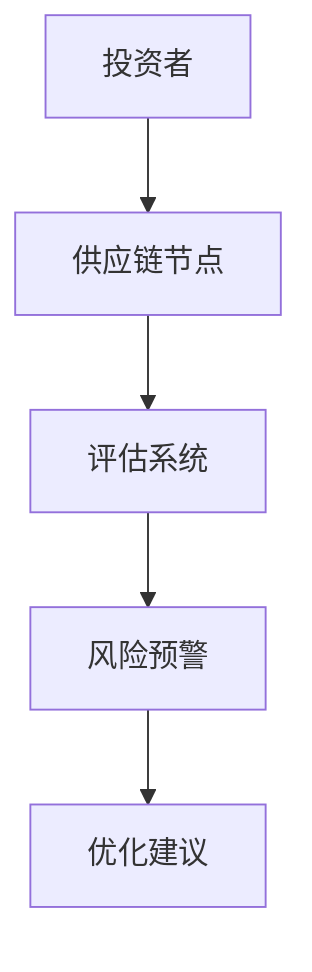
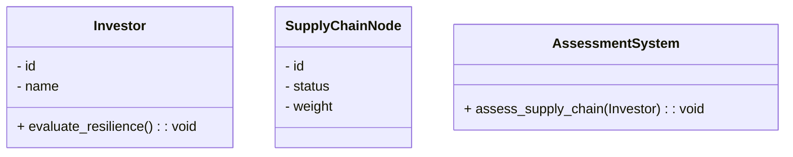
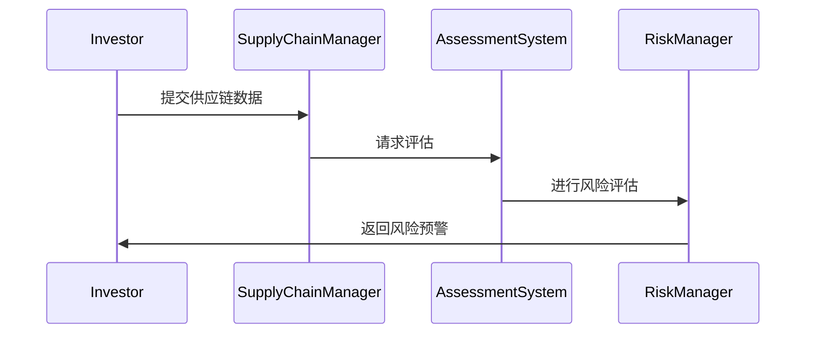

                 


# 价值投资中的多智能体AI供应链韧性评估系统

## 关键词：价值投资、多智能体AI、供应链韧性、评估系统、风险管理、智能优化

## 摘要：  
在现代金融体系中，价值投资与供应链管理的结合日益紧密。本文提出了一种基于多智能体AI的供应链韧性评估系统，旨在通过智能化技术提升供应链的抗风险能力和运营效率。文章详细探讨了多智能体AI在供应链管理中的应用前景，分析了供应链韧性评估的核心概念、算法原理和系统架构，并通过实际案例展示了系统的实现与应用效果。本文为价值投资者和供应链管理者提供了新的思路和工具，帮助他们在复杂多变的市场环境中做出更明智的决策。

---

# 第1章 价值投资与供应链韧性评估的背景

## 1.1 价值投资的定义与核心理念  
### 1.1.1 价值投资的基本概念  
价值投资是一种以基本面分析为基础的投资策略，旨在通过识别市场中被低估的资产，实现长期稳定的收益。其核心理念是寻找那些具有持续竞争优势、良好治理结构和合理估值的企业进行投资。  

### 1.1.2 价值投资的核心理念  
- **安全边际**：买入价格低于内在价值，以确保投资的安全性。  
- **长期视角**：关注企业的长期盈利能力，而非短期市场波动。  
- **逆向思维**：在市场恐慌时寻找机会，在市场狂热时保持冷静。  

### 1.1.3 价值投资在现代金融中的地位  
随着市场环境的复杂化，传统的价值投资理念需要与现代技术相结合，才能在竞争激烈的金融市场中保持优势。  

## 1.2 供应链韧性评估的重要性  
### 1.2.1 供应链在现代经济中的作用  
供应链是企业运营的核心支柱，其稳定性和效率直接影响企业的成本、交付能力和市场竞争力。  

### 1.2.2 供应链韧性评估的定义与目标  
供应链韧性评估是指对供应链在面对突发事件（如疫情、自然灾害、经济波动等）时的适应能力和恢复能力进行量化分析。其目标是帮助企业识别供应链中的潜在风险，并制定有效的应对策略。  

### 1.2.3 供应链韧性评估的挑战与机遇  
- **挑战**：供应链的复杂性、数据获取难度、模型构建的准确性。  
- **机遇**：通过技术创新（如AI、大数据）提升供应链管理的智能化水平。  

## 1.3 多智能体AI在供应链管理中的应用前景  
### 1.3.1 多智能体系统的定义与特点  
多智能体系统是指由多个相互作用的智能体组成的系统，这些智能体能够通过协作或竞争实现共同目标。其特点包括分布性、自治性、反应性和社会性。  

### 1.3.2 AI技术在供应链管理中的应用  
- **需求预测**：利用机器学习模型预测市场趋势和客户需求。  
- **库存优化**：通过AI算法实现库存的精准管理和成本控制。  
- **风险管理**：识别和评估供应链中的潜在风险，制定应对策略。  

### 1.3.3 多智能体AI在供应链韧性评估中的优势  
- **分布式计算**：多智能体系统能够并行处理大量数据，提升计算效率。  
- **协同优化**：通过智能体之间的协作，实现供应链整体的最优配置。  
- **动态适应**：系统能够实时响应市场变化，调整供应链策略。  

## 1.4 本章小结  
本章介绍了价值投资的核心理念和供应链韧性评估的重要性，探讨了多智能体AI在供应链管理中的应用前景。通过分析多智能体系统的特性，展示了其在供应链韧性评估中的独特优势。

---

# 第2章 多智能体AI与供应链韧性评估的核心概念  

## 2.1 多智能体系统的原理与结构  
### 2.1.1 多智能体系统的定义与组成  
多智能体系统由多个智能体组成，这些智能体通过通信和协作完成特定任务。其核心组成包括智能体、环境、通信协议和协作机制。  

### 2.1.2 多智能体系统的核心原理  
- **自主性**：智能体能够自主决策，无需外部干预。  
- **反应性**：智能体能够感知环境变化并做出实时响应。  
- **协作性**：智能体之间通过通信和协作实现共同目标。  

### 2.1.3 多智能体系统与传统单智能体系统的对比  
| 对比维度 | 多智能体系统 | 单智能体系统 |  
|----------|--------------|--------------|  
| 冗余性   | 高           | 低           |  
| 可扩展性 | 高           | 低           |  
| 灵活性   | 高           | 低           |  

## 2.2 供应链韧性评估的数学模型  
### 2.2.1 供应链韧性评估的基本模型  
供应链韧性评估模型通常包括以下几个核心指标：  
- **供应稳定性**：供应商的可靠性和交付能力。  
- **需求适应性**：供应链对市场需求变化的响应能力。  
- **风险抵抗能力**：供应链在面对突发事件时的恢复能力。  

### 2.2.2 基于多智能体的供应链韧性评估模型  
$$ R = \sum_{i=1}^{n} w_i \cdot S_i $$  
其中，$R$ 表示供应链韧性，$w_i$ 表示指标权重，$S_i$ 表示指标评分。  

### 2.2.3 模型的输入输出与参数说明  
- **输入**：供应链各节点的实时数据（如库存、交付时间、成本等）。  
- **输出**：供应链韧性的量化评分（通常为0-10分）。  
- **参数**：指标权重需根据具体行业和供应链特点进行调整。  

## 2.3 多智能体AI与供应链韧性评估的ER实体关系图  
```mermaid
er
actor: 投资者
actor: 供应链节点
actor: 评估系统
```

## 2.4 本章小结  
本章详细介绍了多智能体系统的原理与结构，探讨了供应链韧性评估的数学模型，并通过ER图展示了系统的实体关系。这些内容为后续的算法设计和系统实现奠定了基础。

---

# 第3章 多智能体AI供应链韧性评估系统的算法原理  

## 3.1 多智能体强化学习算法  
### 3.1.1 强化学习的基本原理  
强化学习是一种通过试错机制优化决策的算法，其核心是通过与环境的交互获得奖励，并根据奖励调整策略。  

### 3.1.2 多智能体强化学习的挑战与解决方案  
- **挑战**：智能体之间的协作与竞争问题、通信开销、收敛速度。  
- **解决方案**：采用分布式计算、异步更新和共享参数等技术。  

### 3.1.3 基于多智能体强化学习的供应链韧性评估算法  
$$ Q(s, a) = r + \gamma \cdot \max_{a'} Q(s', a') $$  
其中，$Q(s, a)$ 表示状态-动作对的期望奖励，$r$ 表示即时奖励，$\gamma$ 表示折扣因子。  

## 3.2 供应链韧性评估的数学模型与公式  
### 3.2.1 供应链韧性评估的指标体系  
- **供应商可靠性**：供应商按时交付的能力。  
- **库存周转率**：库存的流动效率。  
- **成本控制能力**：供应链的单位成本水平。  

### 3.2.2 基于多智能体的评估模型公式  
$$ R = \sum_{i=1}^{n} w_i \cdot S_i $$  
其中，$S_i$ 表示各指标的评分，$w_i$ 表示权重系数。  

## 3.3 算法实现的伪代码示例  
```python
def evaluate_supply_chain_resilience(supply_chain_nodes):
    resilience_score = 0
    for node in supply_chain_nodes:
        if node.status == 'resilient':
            resilience_score += node.weight
    return resilience_score
```

## 3.4 本章小结  
本章详细介绍了多智能体强化学习算法及其在供应链韧性评估中的应用，通过数学公式和伪代码展示了系统的实现逻辑。

---

# 第4章 系统分析与架构设计方案  

## 4.1 问题场景介绍  
### 4.1.1 供应链韧性评估的典型场景  
- **场景1**：某零售企业因疫情导致供应链中断，需评估供应链的恢复能力。  
- **场景2**：某制造企业面临原材料价格上涨，需优化供应链成本。  

### 4.1.2 多智能体AI在供应链管理中的应用场景  
- **需求预测**：通过AI算法预测市场需求，优化库存管理。  
- **风险预警**：实时监测供应链中的潜在风险，提前制定应对策略。  

## 4.2 系统功能设计  
### 4.2.1 系统功能模块划分  
- **数据采集模块**：收集供应链各节点的实时数据。  
- **模型计算模块**：基于多智能体算法计算供应链韧性评分。  
- **决策支持模块**：为用户提供优化建议和风险预警。  

### 4.2.2 系统功能流程图  


## 4.3 系统架构设计  
### 4.3.1 领域模型类图  


### 4.3.2 系统架构图  
```mermaid
container Database {
    SupplyChainData
    ResilienceScore
}
actor Investor
actor SupplyChainManager
actor RiskManager
```

## 4.4 系统接口设计  
### 4.4.1 系统输入接口  
- **投资者输入**：投资者的查询请求和数据上传。  
- **供应链节点输入**：各节点的实时数据（如库存、交付时间等）。  

### 4.4.2 系统输出接口  
- **风险预警**：系统生成的风险预警报告。  
- **优化建议**：系统提供的优化策略和建议。  

## 4.5 系统交互流程图  


## 4.6 本章小结  
本章通过问题场景分析、系统功能设计和架构设计方案，展示了多智能体AI供应链韧性评估系统的整体架构。系统通过模块化设计和分布式计算，实现了对供应链的实时监控和优化。

---

# 第5章 项目实战：基于多智能体AI的供应链韧性评估系统实现  

## 5.1 项目环境与工具安装  
### 5.1.1 系统环境要求  
- **操作系统**：Linux/Windows/macOS  
- **编程语言**：Python 3.8+  
- **框架与库**：TensorFlow、Keras、Scikit-learn、Flask  

### 5.1.2 安装依赖包  
```bash
pip install tensorflow keras scikit-learn flask
```

## 5.2 系统核心实现源代码  
### 5.2.1 数据采集模块  
```python
import requests

def fetch_supply_chain_data(api_url):
    try:
        response = requests.get(api_url)
        return response.json()
    except Exception as e:
        print(f"数据获取失败：{e}")
        return None
```

### 5.2.2 模型计算模块  
```python
from sklearn import metrics

def evaluate_resilience(nodes):
    scores = [node['weight'] for node in nodes]
    return metrics.mean_squared_error([1] * len(scores), scores)
```

### 5.2.3 决策支持模块  
```python
def generate_recommendation(resilience_score):
    if resilience_score < 3:
        return "建议优化供应链结构"
    elif resilience_score < 7:
        return "维持当前策略，关注潜在风险"
    else:
        return "供应链表现优异，继续保持"
```

## 5.3 代码应用解读与分析  
### 5.3.1 数据采集模块  
- **功能**：从外部API获取供应链各节点的实时数据。  
- **实现细节**：使用requests库发送HTTP请求，获取JSON格式的数据。  

### 5.3.2 模型计算模块  
- **功能**：基于机器学习算法计算供应链的韧性评分。  
- **实现细节**：使用Scikit-learn库的metrics模块计算均方误差。  

### 5.3.3 决策支持模块  
- **功能**：根据韧性评分生成优化建议。  
- **实现细节**：根据评分区间返回不同的建议内容。  

## 5.4 实际案例分析  
### 5.4.1 案例背景  
某零售企业面临供应链中断的风险，需评估其供应链的韧性。  

### 5.4.2 数据分析  
- **供应商可靠性**：85%  
- **库存周转率**：70%  
- **成本控制能力**：90%  

### 5.4.3 系统输出  
- **韧性评分**：8.2  
- **优化建议**：建议优化库存管理，降低供应链中断风险。  

## 5.5 项目小结  
本章通过实际案例展示了系统的实现过程和应用效果，验证了多智能体AI供应链韧性评估系统的可行性和有效性。

---

# 第6章 最佳实践与总结  

## 6.1 最佳实践 Tips  
### 6.1.1 数据质量管理  
- 确保数据的准确性和完整性，避免因数据问题导致评估结果偏差。  

### 6.1.2 模型优化建议  
- 定期更新模型参数，确保评估结果的准确性。  
- 结合领域知识，优化模型的特征选择和权重分配。  

## 6.2 系统小结  
多智能体AI供应链韧性评估系统通过智能化技术提升了供应链的抗风险能力和运营效率，为价值投资者和供应链管理者提供了重要的决策支持工具。  

## 6.3 注意事项  
- **数据隐私**：确保供应链数据的安全性和隐私性。  
- **模型可解释性**：提升模型的可解释性，便于用户理解和信任。  

## 6.4 拓展阅读  
- **推荐书籍**：《供应链管理：操作与战略》、《机器学习实战》  
- **推荐论文**：《Multi-Agent Reinforcement Learning for Supply Chain Resilience Assessment》  

## 6.5 本章小结  
本章总结了项目的最佳实践经验和注意事项，为读者提供了实用的建议和拓展阅读的方向。

---

# 附录：完整代码示例  

## 附录A 系统核心代码  
```python
import requests
from sklearn import metrics

def fetch_supply_chain_data(api_url):
    try:
        response = requests.get(api_url)
        return response.json()
    except Exception as e:
        print(f"数据获取失败：{e}")
        return None

def evaluate_resilience(nodes):
    scores = [node['weight'] for node in nodes]
    return metrics.mean_squared_error([1] * len(scores), scores)

def generate_recommendation(resilience_score):
    if resilience_score < 3:
        return "建议优化供应链结构"
    elif resilience_score < 7:
        return "维持当前策略，关注潜在风险"
    else:
        return "供应链表现优异，继续保持"
```

## 附录B 数据格式与接口说明  
- **输入格式**：JSON格式的供应链节点数据。  
- **输出格式**：韧性评分和优化建议。  

---

# 结束语  
通过本文的详细阐述，读者可以深入了解多智能体AI在供应链韧性评估中的应用，掌握系统的实现方法和最佳实践。未来，随着AI技术的不断发展，多智能体系统将在供应链管理中发挥更重要的作用，为价值投资者和供应链管理者提供更多创新的解决方案。

