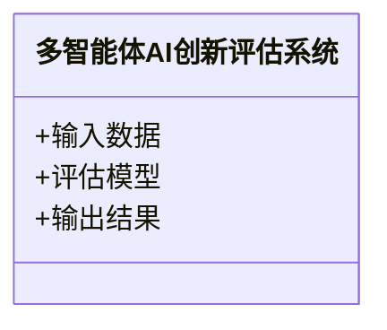
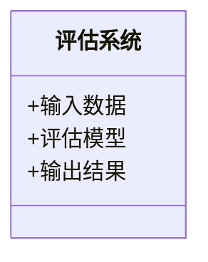
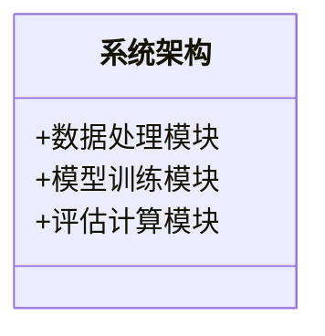
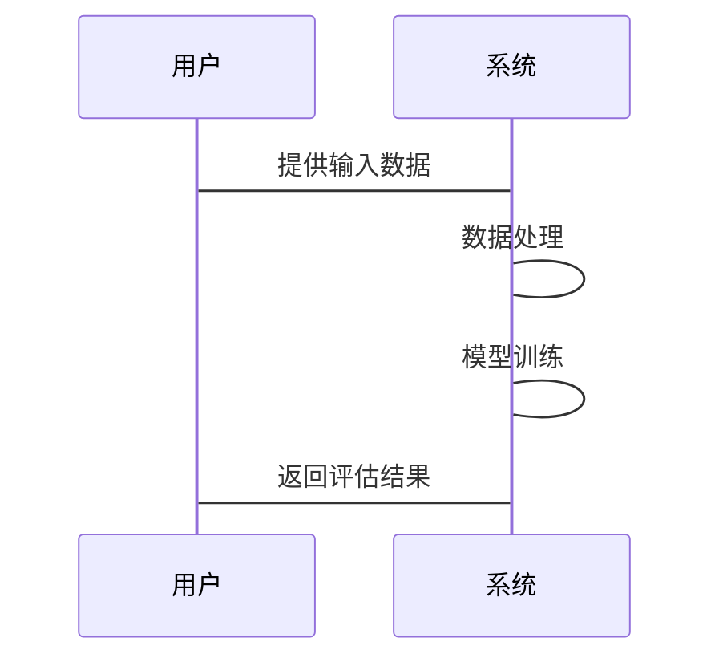

                 


# 《价值投资中的多智能体AI创新评估系统》

## 关键词：
- 价值投资
- 多智能体AI
- 创新评估
- 系统设计
- 金融应用

## 摘要：
本文将详细探讨如何利用多智能体AI技术构建创新评估系统，以辅助价值投资决策。通过结合多智能体AI的核心原理和价值投资的评估需求，提出了一种全新的创新评估系统设计，涵盖了系统的数学模型、算法实现、系统架构和实际案例分析。本文不仅为金融从业者提供了理论支持，也为技术开发者提供了实践指导。

---

# 第一部分: 价值投资与多智能体AI的结合

## 第1章: 价值投资的定义与核心理念

### 1.1 价值投资的基本概念
- 价值投资的定义
- 价值投资的核心理念
- 价值投资在现代金融中的应用

### 1.2 多智能体AI的基本概念
- 多智能体系统的基本定义
- 多智能体AI的核心特点
- 多智能体AI与传统AI的区别

### 1.3 多智能体AI在金融领域的应用前景
- 金融领域的多智能体AI应用现状
- 多智能体AI在价值投资中的潜在价值
- 多智能体AI应用的挑战与机遇

## 第2章: 价值投资中的创新评估问题

### 2.1 价值投资中的创新评估需求
- 价值投资中的创新评估目标
- 价值投资中的创新评估挑战
- 价值投资中的创新评估边界与外延

### 2.2 多智能体AI在创新评估中的应用
- 多智能体AI在创新评估中的核心作用
- 多智能体AI在创新评估中的优势
- 多智能体AI在创新评估中的实现路径

---

# 第二部分: 多智能体AI创新评估系统的数学模型与算法原理

## 第3章: 多智能体AI创新评估系统的数学模型

### 3.1 创新评估系统的数学模型构建
- 创新评估系统的变量定义
- 创新评估系统的方程构建
- 创新评估系统的模型验证

### 3.2 多智能体AI创新评估系统的算法原理
- 多智能体AI算法的基本原理
- 多智能体AI算法的核心步骤
- 多智能体AI算法的数学公式
  $$ f(x) = \sum_{i=1}^{n} w_i x_i $$

---

# 第三部分: 多智能体AI创新评估系统的系统设计与实现

## 第4章: 多智能体AI创新评估系统的系统架构

### 4.1 系统架构设计
- 系统功能模块划分
- 系统功能模块之间的关系
- 系统功能模块的实现方式

### 4.2 系统架构的mermaid图


## 第5章: 多智能体AI创新评估系统的项目实战

### 5.1 环境安装
- 系统运行环境的安装与配置
- 依赖库的安装与管理
- 开发工具的配置与使用

### 5.2 系统核心实现源代码
```python
def evaluate_innovation(输入数据):
    # 算法实现代码
    评估结果 = 0
    for i in range(len(输入数据)):
        评估结果 += 输入数据[i] * 权重[i]
    return 评估结果
```

### 5.3 代码应用解读与分析
- 代码功能的详细解读
- 代码实现的关键点分析
- 代码优化与改进方向

### 5.4 实际案例分析
- 案例背景介绍
- 案例分析与数据输入
- 案例评估结果展示
- 案例小结与经验总结

### 5.5 本章小结

---

# 第四部分: 多智能体AI创新评估系统的系统分析与架构设计方案

## 第6章: 问题场景介绍

### 6.1 问题背景介绍
- 价值投资中的创新评估问题
- 多智能体AI在创新评估中的应用需求

### 6.2 项目介绍
- 项目目标
- 项目范围
- 项目交付成果

## 第7章: 系统功能设计

### 7.1 领域模型mermaid类图


### 7.2 系统架构设计mermaid图


### 7.3 系统接口设计
- 系统接口定义
- 系统接口实现
- 系统接口测试

### 7.4 系统交互mermaid序列图


---

# 第五部分: 项目实战与最佳实践

## 第8章: 环境安装与系统实现

### 8.1 环境安装
- 系统运行环境的安装与配置
- 依赖库的安装与管理
- 开发工具的配置与使用

### 8.2 系统核心实现源代码
```python
def evaluate_innovation(输入数据):
    评估结果 = 0
    for i in range(len(输入数据)):
        评估结果 += 输入数据[i] * 权重[i]
    return 评估结果
```

### 8.3 代码应用解读与分析
- 代码功能的详细解读
- 代码实现的关键点分析
- 代码优化与改进方向

## 第9章: 实际案例分析

### 9.1 案例背景介绍
- 案例背景
- 案例目标
- 案例数据准备

### 9.2 案例分析与数据输入
- 数据输入
- 数据处理
- 数据分析

### 9.3 案例评估结果展示
- 评估结果展示
- 结果分析
- 结果可视化

### 9.4 案例小结与经验总结
- 案例小结
- 经验总结
- 改进建议

## 第10章: 最佳实践 tips

### 10.1 小结
- 系统设计总结
- 实现过程总结
- 应用总结

### 10.2 注意事项
- 系统运行注意事项
- 代码维护注意事项
- 使用中的注意事项

### 10.3 拓展阅读
- 相关领域文献推荐
- 技术发展趋势分析
- 未来研究方向展望

---

# 《价值投资中的多智能体AI创新评估系统》

通过以上目录结构，本文将从价值投资的基本概念出发，逐步深入探讨多智能体AI在创新评估中的应用，最终实现一个完整的创新评估系统，并通过实际案例进行验证和优化。希望本文能够为价值投资者和技术开发者提供有价值的参考和指导。

