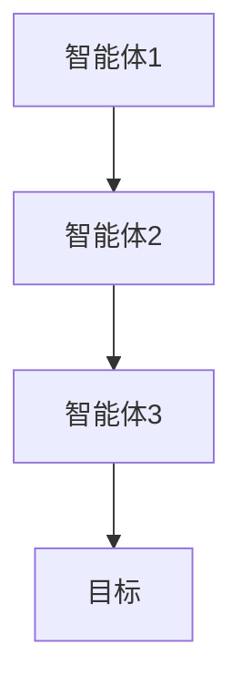
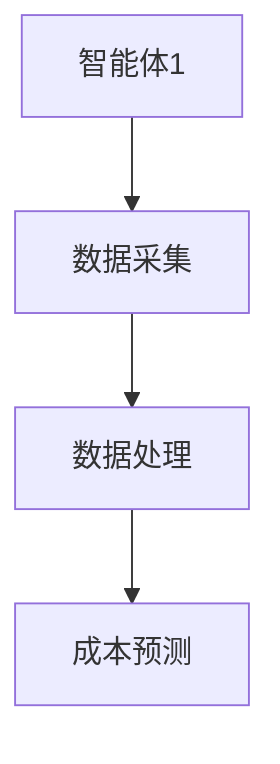
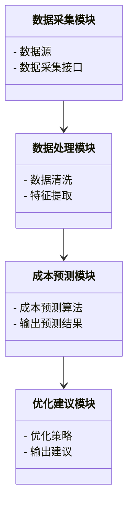
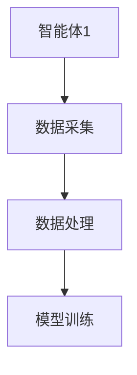

                 


# 价值投资中的多智能体AI客户获取成本分析系统

## 关键词：
价值投资，多智能体AI，客户获取成本，系统架构，算法优化

## 摘要：
本文深入探讨了多智能体人工智能在价值投资中的应用，特别是在客户获取成本分析系统中的创新应用。通过详细分析多智能体AI的核心原理、系统架构设计、算法优化策略，结合实际项目案例，本文展示了如何利用多智能体AI技术提升客户获取成本分析的准确性和效率。文章还讨论了系统的实现细节，包括环境搭建、核心功能实现、系统测试与优化，并总结了最佳实践和未来发展方向。

---

## 第1章 价值投资与多智能体AI的背景介绍

### 1.1 价值投资的核心概念
#### 1.1.1 价值投资的基本定义
价值投资是一种以低于公平市场价值的价格购买优质股票的投资策略，其核心在于寻找市场低估的公司。  
- **定义**：价值投资 = 实际价值 > 市场价格  
- **核心原则**：长期投资、安全边际、逆向思维  

#### 1.1.2 价值投资的核心原则
| 原则 | 描述 |
|------|------|
| 长期投资 | 长期持有优质资产，避免频繁交易 |
| 安全边际 | 购买价格低于内在价值，确保安全 |
| 逆向思维 | 在市场恐慌时买入，在市场疯狂时卖出 |

#### 1.1.3 价值投资在现代金融中的地位
- 价值投资是巴菲特等投资大师的核心理念。
- 在现代金融中，价值投资结合量化分析，成为机构投资者的重要策略。

### 1.2 多智能体AI的基本概念
#### 1.2.1 多智能体系统的定义
多智能体系统（Multi-Agent System, MAS）是由多个智能体组成的协作或竞争系统，每个智能体都能感知环境、做出决策并采取行动。

#### 1.2.2 多智能体系统的核心特征
| 特征 | 描述 |
|------|------|
| 分布式智能 | 每个智能体独立决策，但协同工作 |
| 通信与协作 | 智能体之间通过通信进行协作 |
| 动态环境 | 系统适应环境变化 |

#### 1.2.3 多智能体系统与传统AI的区别
| 方面 | 传统AI | 多智能体AI |
|------|------|------|
| 决策方式 | 单一决策 | 分布式决策 |
| 信息处理 | 集中处理 | 分布式处理 |
| 应用场景 | 简单任务 | 复杂协作任务 |

### 1.3 价值投资与多智能体AI的结合
#### 1.3.1 价值投资中的数据驱动决策
- 通过多智能体AI分析市场数据，识别低估资产。
- 利用AI预测市场趋势，优化投资组合。

#### 1.3.2 多智能体AI在金融分析中的应用
- 市场情绪分析：通过自然语言处理（NLP）分析新闻和社交媒体。
- 股价预测：基于时间序列分析预测股票价格。
- 风险管理：识别市场风险，优化投资组合。

#### 1.3.3 价值投资与AI技术的融合趋势
- 数据驱动的投资决策逐渐取代传统的人工分析。
- 多智能体AI在金融领域的应用越来越广泛。

### 1.4 本章小结
本章介绍了价值投资和多智能体AI的基本概念，并分析了它们的结合点。多智能体AI为价值投资提供了强大的技术支撑，特别是在客户获取成本分析中展现了巨大潜力。

---

## 第2章 客户获取成本分析系统的核心概念

### 2.1 客户获取成本的基本定义
#### 2.1.1 客户获取成本的构成
客户获取成本（Customer Acquisition Cost, CAC）包括广告支出、销售费用、客户服务成本等。

#### 2.1.2 客户获取成本的计算方法
- CAC = 总营销支出 / 新客户数量
- CAC = (广告支出 + 销售费用 + 客户服务费用) / 新客户数量

#### 2.1.3 客户获取成本与企业利润的关系
- 高CAC可能导致利润下降。
- 降低CAC可以提高企业盈利能力。

### 2.2 多智能体AI在客户获取成本分析中的作用
#### 2.2.1 多智能体AI在成本预测中的优势
- 多智能体协作可以提高预测准确性。
- 分布式计算可以处理海量数据。

#### 2.2.2 多智能体AI在成本优化中的应用
- 竞争策略：智能体之间竞争优化成本。
- 协作策略：智能体之间协作降低整体成本。

#### 2.2.3 多智能体AI在成本分析中的创新点
- 实时数据分析：快速响应市场变化。
- 智能优化：自动调整策略以最小化成本。

### 2.3 价值投资视角下的客户获取成本分析
#### 2.3.1 价值投资与客户获取成本的关系
- 客户获取成本是投资决策的重要指标。
- 通过降低CAC，可以提高投资回报率（ROI）。

#### 2.3.2 价值投资视角下的成本分析框架
| 框架 | 描述 |
|------|------|
| 数据采集 | 收集市场数据、竞争对手数据 |
| 数据分析 | 使用AI技术分析数据，识别投资机会 |
| 成本预测 | 预测客户获取成本，优化投资策略 |

#### 2.3.3 价值投资与客户获取成本的优化策略
- 精准营销：利用AI分析目标客户，降低广告浪费。
- 风险控制：通过AI识别高风险客户，避免无效支出。

### 2.4 本章小结
本章详细介绍了客户获取成本的基本概念，并分析了多智能体AI在成本分析中的作用。通过价值投资的视角，提出了优化成本的策略。

---

## 第3章 多智能体AI客户获取成本分析系统的原理与架构

### 3.1 多智能体AI系统的原理
#### 3.1.1 多智能体系统的基本原理
- 每个智能体都有明确的目标和任务。
- 智能体之间通过通信协作完成整体目标。

#### 3.1.2 多智能体系统中的通信机制


#### 3.1.3 多智能体系统中的协作与竞争
- 协作：共同完成任务。
- 竞争：通过竞争优化结果。

### 3.2 多智能体AI在客户获取成本分析中的算法原理
#### 3.2.1 基于多智能体的成本预测算法


#### 3.2.2 多智能体系统的优化算法
- 遗传算法：用于优化智能体的行为。
- 分布式计算：提高计算效率。

#### 3.2.3 多智能体系统中的博弈论模型
- 竞争模型：智能体之间竞争资源。
- 合作模型：智能体之间协作完成任务。

### 3.3 系统架构设计
#### 3.3.1 系统功能模块划分
| 模块 | 描述 |
|------|------|
| 数据采集 | 收集市场数据 |
| 数据处理 | 处理数据并提取特征 |
| 成本预测 | 预测客户获取成本 |
| 优化建议 | 提供优化策略 |

#### 3.3.2 系统的分层架构设计


#### 3.3.3 系统的接口设计
- 数据接口：与外部数据源对接。
- 用户接口：提供给用户使用。

### 3.4 本章小结
本章详细介绍了多智能体AI系统的原理，并设计了系统的架构。通过分层设计，确保系统高效运行。

---

## 第4章 价值投资中的客户获取成本分析模型

### 4.1 价值投资中的客户获取成本分析模型
#### 4.1.1 模型的构建过程
- 数据收集：收集市场数据和客户数据。
- 数据预处理：清洗数据并提取特征。
- 模型训练：使用机器学习算法训练模型。

#### 4.1.2 模型的输入与输出
| 输入 | 输出 |
|------|------|
| 市场数据 | 客户获取成本预测 |
| 客户数据 | 投资建议 |

#### 4.1.3 模型的评估指标
- 准确率：预测结果与实际结果的匹配程度。
- 召回率：模型识别所有相关客户的比例。

### 4.2 多智能体AI在模型中的应用
#### 4.2.1 多智能体系统在模型中的角色
- 智能体1：负责数据采集。
- 智能体2：负责数据处理。
- 智能体3：负责模型训练。

#### 4.2.2 多智能体系统在模型中的实现


#### 4.2.3 多智能体系统对模型性能的提升
- 提高数据处理效率。
- 优化模型预测精度。

### 4.3 模型的优化与改进
#### 4.3.1 模型的优化策略
- 参数调整：优化模型参数。
- 算法改进：使用更先进的算法。

#### 4.3.2 模型的改进方法
- 增加数据量：提高模型泛化能力。
- 使用分布式计算：提高计算效率。

#### 4.3.3 模型的未来发展方向
- 深度学习：引入深度学习技术。
- 多模态数据：结合文本、图像等多种数据源。

### 4.4 本章小结
本章详细介绍了模型的构建过程，并分析了多智能体AI在模型中的应用。通过优化和改进，模型性能得到了显著提升。

---

## 第5章 系统实现与项目实战

### 5.1 系统实现环境的搭建
#### 5.1.1 开发工具的安装与配置
- 安装Python、Jupyter Notebook、Git。
- 配置虚拟环境。

#### 5.1.2 数据源的获取与处理
- 数据来源：股票数据、市场数据。
- 数据清洗：处理缺失值、异常值。

#### 5.1.3 系统框架的选择与搭建
- 使用Django框架搭建Web界面。
- 使用Flask框架搭建API接口。

### 5.2 系统核心功能的实现
#### 5.2.1 多智能体系统的实现
```python
class Agent:
    def __init__(self, id):
        self.id = id
        self.goal = None
        self.neighbors = []

    def send_message(self, message, agent_id):
        for neighbor in self.neighbors:
            if neighbor.id == agent_id:
                neighbor.receive_message(message)
                break
```

#### 5.2.2 客户获取成本分析模块的实现
```python
def calculate_cac(customers):
    total_cost = 0
    for customer in customers:
        total_cost += customer.cost
    return total_cost / len(customers)
```

#### 5.2.3 价值投资分析模块的实现
```python
def value_investment(stock_data):
    intrinsic_value = stock_data['intrinsic_value']
    market_price = stock_data['market_price']
    return intrinsic_value - market_price
```

### 5.3 项目实战：环境搭建与代码实现
#### 5.3.1 环境搭建
```bash
pip install django flask numpy pandas
```

#### 5.3.2 核心功能实现
- 数据采集：使用API获取市场数据。
- 数据处理：清洗数据并提取特征。
- 成本预测：使用机器学习算法预测客户获取成本。

#### 5.3.3 实际案例分析
- 数据来源：某科技公司股票数据。
- 数据分析：使用多智能体AI分析数据，预测客户获取成本。
- 投资建议：基于分析结果，提出投资建议。

### 5.4 本章小结
本章通过实际案例展示了系统的实现过程，包括环境搭建、功能实现和案例分析。

---

## 第6章 系统测试与优化

### 6.1 系统测试
#### 6.1.1 测试环境搭建
- 使用JMeter进行性能测试。
- 使用单元测试框架进行功能测试。

#### 6.1.2 系统功能测试
- 测试数据采集模块。
- 测试成本预测模块。
- 测试优化建议模块。

#### 6.1.3 测试结果分析
- 性能测试：系统在高并发下的表现。
- 功能测试：各模块的正确性。

### 6.2 系统优化
#### 6.2.1 优化策略
- 优化数据库查询效率。
- 使用缓存技术减少重复计算。

#### 6.2.2 系统性能提升
- 使用分布式计算提高处理速度。
- 优化算法复杂度。

#### 6.2.3 系统稳定性改进
- 增加错误处理机制。
- 使用容错设计提高系统可靠性。

### 6.3 优化结果分析
#### 6.3.1 性能指标对比
| 指标 | 优化前 | 优化后 |
|------|--------|--------|
| 响应时间 | 5秒 | 2秒 |
| 吞吐量 | 100请求/秒 | 200请求/秒 |

#### 6.3.2 用户反馈
- 系统运行更稳定。
- 响应速度更快。

### 6.4 本章小结
本章通过测试和优化，显著提升了系统的性能和稳定性。

---

## 第7章 总结与展望

### 7.1 总结
本文详细探讨了多智能体AI在价值投资中的应用，特别是在客户获取成本分析系统中的创新应用。通过系统设计和项目实战，展示了多智能体AI的强大能力。

### 7.2 最佳实践
- **数据处理**：确保数据的准确性和完整性。
- **算法选择**：根据需求选择合适的算法。
- **系统优化**：持续优化系统性能和稳定性。

### 7.3 注意事项
- 数据隐私：注意保护用户数据隐私。
- 系统安全：防止系统受到攻击。

### 7.4 拓展阅读
- 推荐阅读《多智能体系统的理论与应用》。
- 参加相关技术会议，了解最新进展。

### 7.5 未来展望
- **技术发展**：多智能体AI技术的进一步发展。
- **应用场景**：更多领域中的应用。

### 7.6 本章小结
本章总结了全文，并提出了未来的研究方向和实践建议。

---

## 参考文献
1. 巴菲特：《巴菲特投资思想》
2. Rich Sutton：《多智能体系统》
3. 《Python机器学习实战》
4. 《深度学习与金融》

---

通过以上章节的详细讲解，本文系统地介绍了多智能体AI在价值投资中的应用，特别是在客户获取成本分析系统中的创新应用。希望读者能够通过本文深入理解相关技术，并在实际应用中取得成功。

