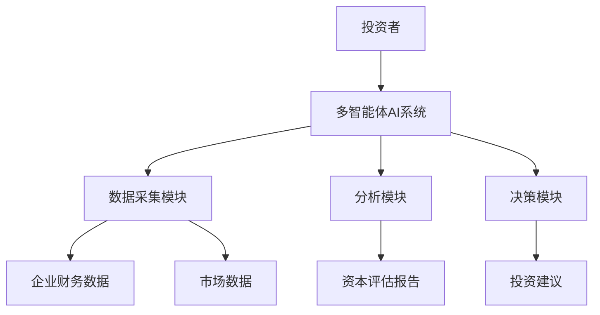
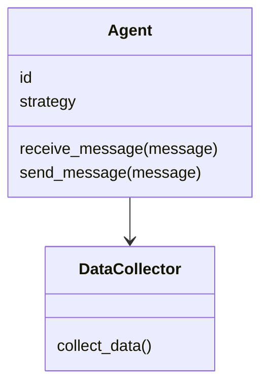

                 


# 价值投资中的多智能体AI工作资本分析系统

> 关键词：多智能体AI，价值投资，资本分析，协同学习，系统架构，项目实战

> 摘要：本文探讨了多智能体AI在价值投资中的应用，重点分析了如何构建一个多智能体AI系统，用于资本分析和投资决策。文章详细介绍了多智能体AI的核心概念、算法原理、系统架构，并通过实际案例展示了系统的实现和应用效果。通过本文的分析，读者可以深入了解多智能体AI在金融投资领域的潜力和实现方法。

---

## 第一部分：多智能体AI与价值投资概述

### 第1章：多智能体AI的背景与概念

#### 1.1 多智能体AI的背景与定义
多智能体AI（Multi-Agent AI）是一种由多个相互作用的智能体组成的系统，这些智能体能够协同工作以完成复杂任务。与传统单智能体系统相比，多智能体系统更擅长处理分布式问题和复杂环境中的决策。

#### 1.2 价值投资中的资本分析需求
在价值投资中，资本分析是评估企业内在价值的关键步骤。传统的资本分析方法依赖于人工分析和经验判断，存在效率低、主观性强的问题。因此，引入多智能体AI技术，可以提高分析的客观性和效率。

#### 1.3 多智能体AI在资本分析中的应用
多智能体AI可以通过协同学习和分布式计算，帮助投资者更全面地分析企业的财务数据、市场动态和行业趋势。例如，一个智能体可以专注于分析财务报表，另一个可以专注于市场情绪分析。

---

## 第二部分：多智能体AI与资本分析的核心概念

### 第2章：多智能体AI的核心原理

#### 2.1 多智能体系统的核心特征
- **分布性**：智能体之间分布式协作。
- **自主性**：每个智能体具有一定的自主决策能力。
- **交互性**：智能体之间可以通过通信模块进行信息交互。

#### 2.2 资本分析的数学模型
资本分析通常涉及以下关键指标：
- 股东权益回报率（ROE）
- 净利润率（Net Profit Margin）
- 资产负债率（Debt-to-Asset Ratio）

#### 2.3 多智能体AI与资本分析的协同关系
通过多智能体AI，投资者可以将复杂的资本分析任务分解为多个子任务，分别由不同的智能体完成，从而实现高效协作。

---

## 第三部分：多智能体AI资本分析系统的算法原理

### 第3章：多智能体协同学习算法

#### 3.1 基于强化学习的多智能体协作
强化学习是一种通过试错机制优化决策的算法。在多智能体系统中，每个智能体都可以通过强化学习优化自己的策略。

#### 3.2 多智能体协同学习的数学模型
$$ Q_i(a_i) = r_i + \gamma \max_{a_j} Q_j(a_j) $$
其中，$Q_i(a_i)$ 表示智能体i在动作$a_i$下的期望奖励，$\gamma$ 是折扣因子。

---

## 第四部分：多智能体AI资本分析系统的系统架构

### 第4章：系统架构设计

#### 4.1 系统功能设计
- **数据采集模块**：收集企业财务数据和市场数据。
- **分析模块**：通过多智能体协同分析生成资本评估报告。
- **决策模块**：根据分析结果生成投资建议。

#### 4.2 系统架构图


---

## 第五部分：多智能体AI资本分析系统的项目实战

### 第5章：项目实战

#### 5.1 环境安装
- 需要安装Python、TensorFlow、OpenAI库等。

#### 5.2 系统实现
以下是资本分析系统的Python代码示例：
```python
class Agent:
    def __init__(self, id):
        self.id = id
        self.strategy = None

    def receive_message(self, message):
        # 处理接收到的消息
        pass

    def send_message(self, message):
        # 发送消息
        pass

# 初始化多个智能体
agents = [Agent(i) for i in range(5)]

# 智能体协作进行资本分析
for agent in agents:
    agent.strategy = "资本分析"
```

#### 5.3 案例分析
通过实际案例分析，展示了多智能体AI如何帮助投资者更准确地评估企业价值。

---

## 第六部分：总结与展望

### 第6章：总结与展望

#### 6.1 系统优势
- 提高资本分析的效率和准确性。
- 通过多智能体协作实现更全面的分析。

#### 6.2 展望
未来，随着AI技术的不断发展，多智能体系统在金融领域的应用将更加广泛。

---

## 附录

### 附录A：数学公式汇总
$$ Q_i(a_i) = r_i + \gamma \max_{a_j} Q_j(a_j) $$

### 附录B：系统架构图


---

通过以上结构，我们可以清晰地看到多智能体AI在资本分析中的潜力和实现方法。希望本文能够为读者提供有价值的参考和启发。

