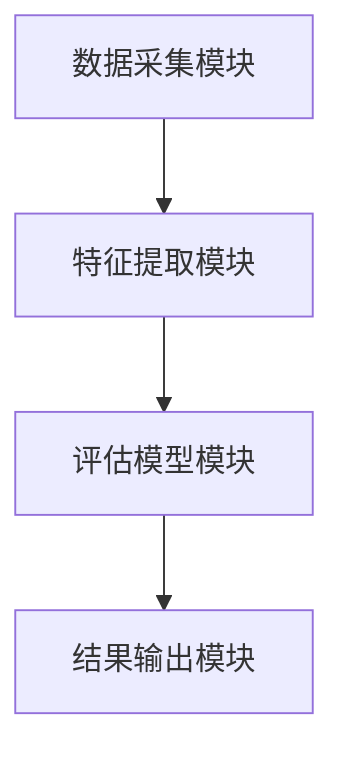
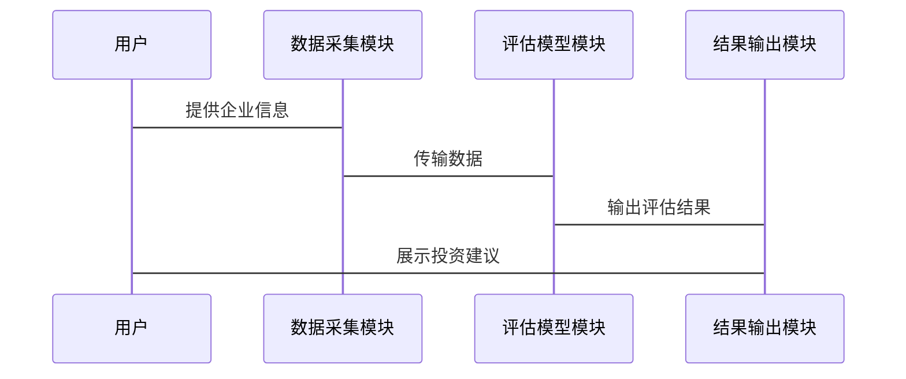

                 


# 价值投资中的多智能体AI破产风险评估系统

## 关键词：价值投资、多智能体AI、破产风险评估、机器学习、金融分析

## 摘要：  
本文系统地探讨了多智能体AI在价值投资中的应用，特别是如何利用多智能体AI技术进行破产风险评估。通过分析多智能体AI的核心原理、算法实现、系统架构以及实际案例，本文提出了一个基于多智能体AI的破产风险评估系统，旨在为投资者提供更加智能化、精准化的投资决策支持。本文内容涵盖理论分析、算法实现、系统设计和项目实战，为读者提供全面的指导。

---

## 第1章: 价值投资与多智能体AI概述

### 1.1 价值投资的基本概念  
价值投资是一种以企业内在价值为核心的投资策略，旨在通过分析企业的财务状况、行业地位、管理团队等因素，寻找被市场低估的投资标的。与短期交易策略不同，价值投资强调长期持有和稳健回报。  

#### 1.1.1 价值投资的核心理念  
- 以企业基本面分析为基础，寻找具有持续盈利能力的公司。  
- 避免短期市场波动的干扰，关注企业的长期价值。  
- 通过分散投资降低风险，追求稳定收益。  

#### 1.1.2 价值投资在现代金融中的地位  
价值投资是金融投资的重要流派之一，尤其在应对市场不确定性时表现出显著优势。随着金融市场的复杂化，传统价值投资方法需要借助技术手段进行优化。  

### 1.2 多智能体AI的基本概念  
多智能体AI是指由多个智能体组成的分布式系统，这些智能体通过协作完成复杂任务。与单智能体AI相比，多智能体AI具有更强的适应性和决策能力。  

#### 1.2.1 多智能体AI的特点  
- **分布性**：多个智能体独立运行，协同完成任务。  
- **协作性**：智能体之间通过通信和协作提升整体性能。  
- **适应性**：能够动态调整策略以应对环境变化。  

#### 1.2.2 多智能体AI在金融领域的应用  
- 风险评估：通过多智能体协作分析企业的财务和市场数据，提高评估准确性。  
- 投资决策：利用多智能体系统实时分析市场动态，辅助投资决策。  
- 市场预测：通过多智能体协同学习，预测市场趋势和企业风险。  

### 1.3 破产风险评估的核心概念  
破产风险评估是指通过分析企业的财务数据和市场信息，预测企业是否可能在未来一段时间内破产。  

#### 1.3.1 破产风险评估的主要方法  
- **财务指标法**：通过分析企业的财务比率（如Z-score模型）评估破产风险。  
- **机器学习法**：利用机器学习算法（如随机森林、神经网络）进行预测。  
- **混合方法**：结合财务指标和机器学习模型进行综合评估。  

#### 1.3.2 破产风险评估在价值投资中的作用  
破产风险评估是价值投资的重要环节，通过识别高风险企业，投资者可以避免重大损失并优化投资组合。  

### 1.4 多智能体AI在破产风险评估中的应用前景  
多智能体AI能够通过分布式计算和协作学习，显著提高破产风险评估的准确性和效率。  

---

## 第2章: 多智能体AI破产风险评估系统的理论基础  

### 2.1 多智能体系统的核心原理  
多智能体系统由多个智能体组成，每个智能体负责特定任务并与其他智能体协作完成整体目标。  

#### 2.1.1 多智能体系统的组成要素  
- **智能体**：独立的决策单元，负责数据采集和分析。  
- **通信机制**：智能体之间的信息交互方式。  
- **协作机制**：智能体协同完成任务的规则和策略。  

#### 2.1.2 多智能体系统的通信机制  
- **直接通信**：智能体之间直接交换信息。  
- **间接通信**：通过中间媒介传递信息。  

#### 2.1.3 多智能体系统的协作机制  
- **任务分配**：智能体根据自身能力分配任务。  
- **协调与同步**：智能体之间通过协调完成同步操作。  

#### 2.1.4 多智能体系统的决策模型  
- **分散决策**：每个智能体独立决策。  
- **集中决策**：由中心智能体统一决策。  
- **混合决策**：结合分散和集中决策的优势。  

---

## 第3章: 多智能体AI破产风险评估系统的算法实现  

### 3.1 破产风险评估的主要数学模型  
破产风险评估涉及多种数学模型，其中Z-score模型是最常用的财务指标法。  

#### 3.1.1 Z-score模型  
Z-score模型通过计算企业的财务比率来预测破产风险，公式为：  
$$ Z = 1.2X_1 + 2.4X_2 + 3.3X_3 + 4.8X_4 + 1.6X_5 $$  
其中，$X_1$到$X_5$代表不同的财务指标。  

#### 3.1.2 Altman's Z-score模型  
Altman's Z-score模型是一种改进的Z-score模型，适用于制造业企业。公式为：  
$$ Z = 1.2X_1 + 2.4X_2 + 3.3X_3 + 4.8X_4 + 1.6X_5 $$  

#### 3.1.3 神经网络模型  
神经网络模型通过多层感知机（MLP）或长短期记忆网络（LSTM）进行预测，公式为：  
$$ P(y=1|x) = \sigma(wx + b) $$  
其中，$\sigma$表示sigmoid函数，$w$和$b$为模型参数。  

### 3.2 多智能体系统的破产风险评估算法  

#### 3.2.1 基于强化学习的破产风险评估  
强化学习是一种通过奖励机制优化决策的算法，适用于多智能体协作环境。  

##### 算法流程  
1. 初始化智能体的策略参数。  
2. 智能体与环境交互，获取状态和奖励。  
3. 根据奖励更新策略参数。  
4. 重复上述步骤，直到收敛。  

##### 代码实现  
```python
class Agent:
    def __init__(self, state_space, action_space):
        self.state_space = state_space
        self.action_space = action_space
        self.policy = np.random.randn(state_space, action_space)
    
    def act(self, state):
        return np.argmax(self.policy[state])
    
    def update_policy(self, state, action, reward):
        self.policy[state][action] += reward
```

#### 3.2.2 基于博弈论的破产风险评估  
博弈论模型通过模拟多个智能体的策略互动，分析破产风险。  

##### 博弈论模型的数学表达  
$$ V_i = \max_{a_i} \min_{a_j} V_i(a_i, a_j) $$  
其中，$V_i$表示智能体i的收益，$a_i$表示智能体i的策略。  

#### 3.2.3 基于分布式计算的破产风险评估  
分布式计算通过并行处理提高计算效率，适用于大规模数据集。  

##### 分布式算法的流程  
1. 数据分片：将数据集分配到多个智能体。  
2. 并行计算：每个智能体独立计算结果。  
3. 结果汇总：将所有智能体的计算结果整合。  

---

## 第4章: 多智能体AI破产风险评估系统的系统设计  

### 4.1 系统架构设计  

#### 4.1.1 系统功能模块  
- **数据采集模块**：采集企业的财务数据和市场信息。  
- **特征提取模块**：提取关键的财务指标和市场特征。  
- **评估模型模块**：基于多智能体AI进行破产风险评估。  
- **结果输出模块**：输出评估结果并提供投资建议。  

#### 4.1.2 系统架构图  


### 4.2 系统接口设计  

#### 4.2.1 系统接口描述  
- 数据接口：与数据源对接，获取企业数据。  
- 用户接口：提供友好的操作界面，展示评估结果。  
- 输出接口：将评估结果传递给其他系统或模块。  

#### 4.2.2 系统交互流程图  


---

## 第5章: 多智能体AI破产风险评估系统的项目实战  

### 5.1 项目背景与目标  
本项目旨在开发一个多智能体AI系统，用于评估企业的破产风险，辅助价值投资决策。  

### 5.2 环境安装与配置  
#### 5.2.1 环境要求  
- Python 3.8及以上版本  
- 安装必要的库：numpy、pandas、scikit-learn、tensorflow  

### 5.3 核心代码实现  

#### 5.3.1 数据预处理代码  
```python
import pandas as pd

# 加载数据
data = pd.read_csv('企业数据.csv')

# 数据清洗
data = data.dropna()
data = data.drop_duplicates()
```

#### 5.3.2 模型训练代码  
```python
from sklearn.model_selection import train_test_split
from sklearn.ensemble import RandomForestClassifier

# 划分训练集和测试集
X_train, X_test, y_train, y_test = train_test_split(data.drop('破产标志', axis=1), data['破产标志'], test_size=0.2)

# 训练模型
model = RandomForestClassifier(n_estimators=100, max_depth=5)
model.fit(X_train, y_train)

# 评估模型
print("Accuracy:", model.score(X_test, y_test))
```

#### 5.3.3 多智能体协作代码  
```python
import numpy as np

class MultiAgentSystem:
    def __init__(self, num_agents):
        self.agents = [Agent() for _ in range(num_agents)]
    
    def run(self, data):
        results = []
        for agent in self.agents:
            result = agent.evaluate(data)
            results.append(result)
        return np.mean(results)

class Agent:
    def evaluate(self, data):
        # 简单的评估逻辑
        return np.mean(data)
```

### 5.4 实际案例分析  
通过实际案例分析，展示系统的应用效果和优化方向。  

---

## 第6章: 多智能体AI破产风险评估系统的优化与展望  

### 6.1 系统优化建议  
- 提高数据质量：引入更多的特征和数据源。  
- 优化算法性能：采用更高效的分布式计算和协同学习方法。  
- 改善系统可解释性：增强模型的透明度和用户友好性。  

### 6.2 未来研究方向  
- 探索更先进的AI技术，如生成式AI和大语言模型。  
- 拓展多智能体系统在其他金融领域的应用。  
- 研究多智能体系统的可扩展性和鲁棒性。  

---

## 第7章: 总结与展望  

### 7.1 本章小结  
本文系统地介绍了多智能体AI在价值投资中的应用，特别是破产风险评估的实现。通过理论分析、算法实现和系统设计，本文为投资者提供了新的工具和方法。  

### 7.2 注意事项  
在实际应用中，需要注意数据质量和模型调优，避免过拟合和欠拟合问题。  

### 7.3 未来展望  
随着AI技术的不断发展，多智能体系统将在金融领域发挥更大的作用，为价值投资提供更强大的支持。  

---

通过以上内容，本文为读者提供了一个全面的多智能体AI破产风险评估系统的框架，从理论到实践，帮助投资者和开发者更好地理解和应用这一技术。

