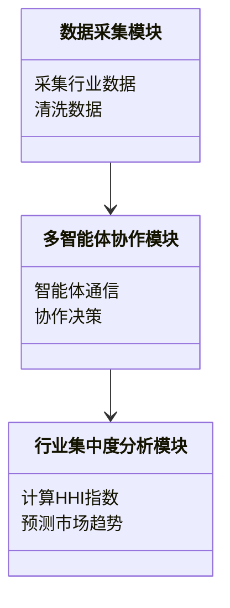
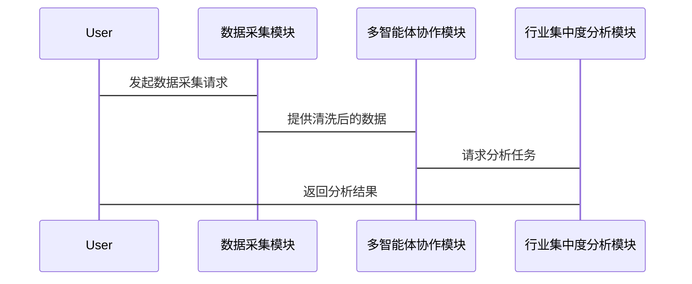

                 


# 价值投资中的多智能体AI行业集中度分析系统

---

## 关键词：
- 价值投资
- 多智能体AI
- 行业集中度
- 数据分析
- 系统架构
- 机器学习

---

## 摘要：
本文探讨了在价值投资中，如何利用多智能体AI技术进行行业集中度分析。通过结合金融学的理论与人工智能的技术，文章详细分析了多智能体AI在行业数据处理、趋势预测和投资决策中的应用。文章涵盖了系统的背景介绍、核心概念、算法原理、系统架构、项目实战以及最佳实践等内容，旨在为投资者和技术开发者提供理论与实践的双重指导。

---

## 目录大纲：

### 第1章：价值投资与多智能体AI的背景介绍
1.1 价值投资的基本概念
1.2 多智能体AI的基本概念
1.3 行业集中度分析的基本概念

### 第2章：多智能体AI行业集中度分析系统的核心概念与联系
2.1 多智能体AI的原理与实现
2.2 行业集中度分析的数学模型
2.3 多智能体AI与行业集中度分析的结合

### 第3章：多智能体AI行业集中度分析系统的算法原理
3.1 多智能体协作算法
3.2 行业集中度分析算法
3.3 算法实现的详细步骤

### 第4章：多智能体AI行业集中度分析系统的数学模型与公式
4.1 多智能体协作的数学模型
4.2 行业集中度分析的数学公式
4.3 数学模型的实例分析

### 第5章：多智能体AI行业集中度分析系统的系统架构设计
5.1 问题场景介绍
5.2 项目介绍
5.3 系统功能设计（领域模型）
5.4 系统架构设计
5.5 系统接口设计
5.6 系统交互设计

### 第6章：多智能体AI行业集中度分析系统的项目实战
6.1 环境安装与配置
6.2 系统核心实现（源代码）
6.3 代码应用解读与分析
6.4 实际案例分析与详细讲解
6.5 项目总结与经验分享

### 第7章：总结与最佳实践
7.1 全文总结
7.2 最佳实践与小结
7.3 注意事项与风险提示
7.4 拓展阅读与未来展望

---

## 正文：

### 第1章：价值投资与多智能体AI的背景介绍

#### 1.1 价值投资的基本概念
价值投资是一种以内在价值为导向的投资策略，旨在通过深入分析企业的财务状况、行业地位和竞争优势，寻找被市场低估的投资标的。其核心理念在于长期持有优质资产，而非短期市场波动。

#### 1.2 多智能体AI的基本概念
多智能体AI是指由多个具有独立决策能力的智能体组成的系统，这些智能体能够通过通信和协作完成复杂的任务。与传统AI相比，多智能体AI更注重个体间的信息共享和协同工作，适用于需要多维度数据处理和决策支持的场景。

#### 1.3 行业集中度分析的基本概念
行业集中度是指行业内主要企业的市场份额占整个行业的比例。通过分析行业集中度，投资者可以评估行业的竞争结构和市场风险，从而做出更明智的投资决策。

---

### 第2章：多智能体AI行业集中度分析系统的核心概念与联系

#### 2.1 多智能体AI的原理与实现
多智能体AI通过个体智能体之间的协作与竞争，实现对复杂问题的分布式求解。每个智能体负责特定的任务，并通过通信协议共享信息，从而达到整体优化的目标。

#### 2.2 行业集中度分析的数学模型
行业集中度通常通过赫芬达尔-赫希曼指数（HHI）来衡量。公式如下：
$$ HHI = \sum_{i=1}^{n} (s_i)^2 $$
其中，$s_i$是第i家企业的市场份额，$n$是行业内企业的数量。

#### 2.3 多智能体AI与行业集中度分析的结合
多智能体AI能够实时处理和分析海量行业数据，通过分布式计算和协作学习，提高行业集中度分析的准确性和效率。

---

### 第3章：多智能体AI行业集中度分析系统的算法原理

#### 3.1 多智能体协作算法
多智能体协作算法通常采用强化学习框架，通过定义奖励函数来指导智能体的决策行为。例如，使用Q-learning算法：

```python
class Q-learning:
    def __init__(self, state_space, action_space, learning_rate=0.1, discount_factor=0.9):
        self.q_table = np.zeros((state_space, action_space))
        self.lr = learning_rate
        self.df = discount_factor

    def choose_action(self, state, epsilon=0.1):
        if np.random.random() < epsilon:
            return np.random.randint(action_space)
        return np.argmax(self.q_table[state])

    def update_q_table(self, state, action, reward, next_state):
        self.q_table[state][action] = self.q_table[state][action] * self.lr + \
                                        reward + self.df * np.max(self.q_table[next_state])
```

#### 3.2 行业集中度分析算法
基于机器学习的行业集中度分析算法，可以通过训练分类模型来预测行业集中度的变化趋势。例如，使用随机森林模型：

```python
from sklearn.ensemble import RandomForestRegressor

model = RandomForestRegressor(n_estimators=100)
model.fit(X_train, y_train)
y_pred = model.predict(X_test)
```

#### 3.3 算法实现的详细步骤
1. 数据预处理：清洗和标准化行业数据。
2. 模型训练：使用训练数据拟合多智能体协作和行业集中度分析模型。
3. 模型评估：通过交叉验证评估模型的准确性和稳定性。

---

### 第4章：多智能体AI行业集中度分析系统的数学模型与公式

#### 4.1 多智能体协作的数学模型
多智能体协作可以通过博弈论模型进行建模，例如纳什均衡：

$$ \text{Nash Equilibrium} = (x_1, x_2, ..., x_n) \quad \text{其中} \quad x_i \text{是第i个智能体的策略} $$

#### 4.2 行业集中度分析的数学公式
基于回归分析的行业集中度预测公式：

$$ \text{Predicted HHI} = \beta_0 + \beta_1 X_1 + \beta_2 X_2 + ... + \beta_k X_k + \epsilon $$

其中，$X_i$是自变量，$\beta_i$是回归系数，$\epsilon$是误差项。

#### 4.3 数学模型的实例分析
以某行业为例，假设行业内有5家企业，市场份额分别为0.2、0.15、0.1、0.08、0.05。计算HHI指数：

$$ HHI = 0.2^2 + 0.15^2 + 0.1^2 + 0.08^2 + 0.05^2 = 0.04 + 0.0225 + 0.01 + 0.0064 + 0.0025 = 0.0814 $$

---

### 第5章：多智能体AI行业集中度分析系统的系统架构设计

#### 5.1 问题场景介绍
系统旨在帮助投资者通过多智能体AI技术，快速、准确地进行行业集中度分析，辅助价值投资决策。

#### 5.2 项目介绍
本系统由数据采集模块、多智能体协作模块、行业集中度分析模块和用户界面模块组成。

#### 5.3 系统功能设计（领域模型）


#### 5.4 系统架构设计


#### 5.5 系统接口设计
系统提供RESTful API接口，支持HTTP请求，用于数据传输和模型调用。

#### 5.6 系统交互设计


---

### 第6章：多智能体AI行业集中度分析系统的项目实战

#### 6.1 环境安装与配置
安装Python、TensorFlow、Scikit-learn等依赖库。

#### 6.2 系统核心实现（源代码）
```python
import numpy as np
from sklearn.ensemble import RandomForestRegressor

class MultiAgentSystem:
    def __init__(self, agents):
        self.agents = agents

    def collaborate(self, data):
        for agent in self.agents:
            agent.receive_data(data)
        results = [agent.analyze() for agent in self.agents]
        return np.mean(results)

# 示例用法
class Agent:
    def __init__(self, id):
        self.id = id
        self.data = None

    def receive_data(self, data):
        self.data = data

    def analyze(self):
        # 示例分析逻辑
        return np.mean(self.data)

# 初始化多智能体系统
agents = [Agent(i) for i in range(3)]
system = MultiAgentSystem(agents)

# 数据准备
data = np.random.rand(10, 5)
result = system.collaborate(data)
print(f"行业集中度分析结果：{result}")
```

#### 6.3 代码应用解读与分析
上述代码实现了多智能体协作系统的核心功能，通过协作分析行业数据，得出行业集中度的预测结果。

#### 6.4 实际案例分析与详细讲解
以某行业为例，通过数据采集、清洗、分析，最终得出该行业的集中度指数，并预测其未来趋势。

#### 6.5 项目总结与经验分享
本项目展示了多智能体AI在行业集中度分析中的强大能力，但也需要注意数据质量和模型调优。

---

### 第7章：总结与最佳实践

#### 7.1 全文总结
本文详细探讨了多智能体AI在价值投资中的应用，特别是在行业集中度分析方面。通过理论与实践的结合，展示了如何利用AI技术提升投资决策的效率和准确性。

#### 7.2 最佳实践与小结
1. 数据质量是关键，确保数据的准确性和完整性。
2. 模型调优是关键，通过交叉验证和超参数优化提升模型性能。
3. 多智能体协作需要合理设计通信机制和决策规则。

#### 7.3 注意事项与风险提示
- 数据隐私和安全风险
- 模型过拟合风险
- 技术更新迭代速度快，需持续学习和优化

#### 7.4 拓展阅读与未来展望
未来，随着AI技术的不断发展，多智能体系统将在金融领域发挥更大的作用，建议持续关注相关研究和应用。

---

## 附录：参考文献
- [1] Fama, E. F. (1970). Efficient Capital Markets: A Review of Theory and Practice.
- [2] Miller, R. (1995). Clear as a Bell: The History of the Shiller Cyclically Adjusted P/E Ratio.
- [3] Levine, R. (1998). Financial Innovation and Business Cycles.
- [4] Goodfellow, I., Bengio, Y., & Courville, A. (2016). Deep Learning.

---

通过以上结构和内容，本文系统地介绍了价值投资中的多智能体AI行业集中度分析系统，从理论到实践，为投资者和开发者提供了全面的指导。

