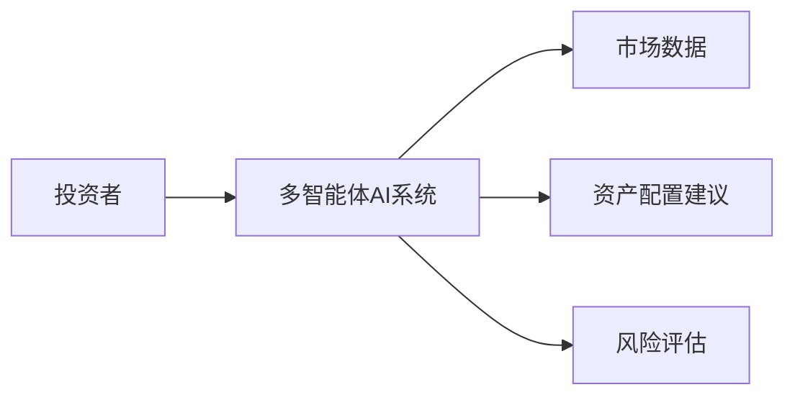
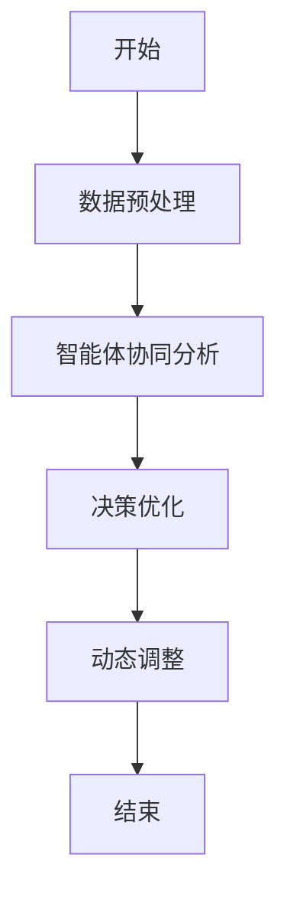
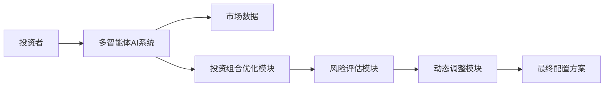

                 


# 价值投资中的多智能体AI资本配置效率分析系统

## 关键词：价值投资、多智能体AI、资本配置效率、金融分析、人工智能

## 摘要：  
本文探讨了如何利用多智能体人工智能技术优化价值投资中的资本配置效率。通过分析多智能体AI的核心原理，结合实际案例，本文详细阐述了如何构建一个多智能体AI系统，以实现高效、智能的资本配置决策。文章还讨论了该系统在实际应用中的优势、挑战及未来发展方向。

---

# 第1章: 价值投资与多智能体AI的背景与概述

## 1.1 价值投资的基本概念  
价值投资是一种以基本面分析为基础的投资策略，强调以低于内在价值的价格买入优质资产。其核心理念是寻找市场中的“定价错误”，通过长期持有优质资产实现超额收益。  

**价值投资的核心原则包括：**  
1. **安全边际**：买入价格低于内在价值，以降低风险。  
2. **长期视角**：关注企业的长期竞争优势，而非短期市场波动。  
3. **分散投资**：通过分散投资降低风险，避免过度集中。  

## 1.2 多智能体AI的基本概念  
多智能体AI是指由多个具有独立决策能力的智能体组成的系统，这些智能体通过协同工作实现共同目标。与传统单智能体AI相比，多智能体AI具有以下特点：  
1. **分布式计算**：多个智能体协同完成任务，避免单点故障。  
2. **自主性**：每个智能体具有独立决策能力，能够自主完成任务。  
3. **协作性**：智能体之间通过通信和协作优化整体性能。  

## 1.3 价值投资与多智能体AI的结合  
价值投资强调基本面分析和长期视角，而多智能体AI则擅长处理复杂数据和优化决策。两者的结合为资本配置效率的提升提供了新的可能性。  

**结合点包括：**  
1. **数据驱动决策**：利用多智能体AI分析海量市场数据，识别定价错误。  
2. **动态优化**：通过多智能体协同，实时调整投资组合，提升配置效率。  
3. **风险控制**：利用多智能体AI进行风险评估和预警，降低投资风险。  

---

# 第2章: 多智能体AI资本配置效率分析的核心概念

## 2.1 多智能体AI资本配置的核心原理  
多智能体AI资本配置系统通过分布式计算和协作优化，实现对资本的高效配置。其核心原理包括：  
1. **数据采集与处理**：从市场中获取多源数据，包括价格、财务报表、行业趋势等。  
2. **智能体协同**：多个智能体协同工作，分别负责不同的分析任务，如基本面分析、风险评估等。  
3. **决策优化**：基于智能体的协同结果，优化资本配置方案，实现收益与风险的平衡。  

## 2.2 多智能体AI与资本配置的关系  
多智能体AI通过以下方式影响资本配置：  
1. **信息处理**：智能体协同处理海量数据，提取关键信息。  
2. **决策优化**：通过协作优化，提升决策的准确性和效率。  
3. **动态调整**：实时监控市场变化，动态调整配置方案。  

## 2.3 实体关系图与概念对比表  
### 2.3.1 实体关系图  


### 2.3.2 概念对比表  
| 概念       | 特性                | 描述                                                                 |
|------------|---------------------|----------------------------------------------------------------------|
| 多智能体    | 分布式             | 多个智能体协同工作，避免单点故障                                   |
| 资本配置   | 效率               | 通过优化配置，实现收益与风险的平衡                               |
| 价值投资   | 长期视角           | 强调基本面分析和长期持有，寻找定价错误                           |

---

# 第3章: 多智能体AI资本配置的算法原理

## 3.1 算法原理概述  
多智能体AI资本配置系统的核心算法包括以下步骤：  
1. **数据预处理**：清洗和整合多源数据。  
2. **智能体协同分析**：多个智能体分别对不同资产进行分析。  
3. **决策优化**：基于智能体的分析结果，优化资本配置方案。  
4. **动态调整**：实时监控市场变化，动态调整配置方案。  

## 3.2 算法流程图  


## 3.3 数学模型与公式  
### 3.3.1 投资组合优化模型  
投资组合优化的目标是最大化收益与风险的平衡。数学模型如下：  
$$ \text{最大化} \quad \sum_{i=1}^n w_i r_i - \lambda \sum_{i=1}^n \sum_{j=1}^n w_i w_j \sigma_{i,j} $$  
其中，$w_i$ 是资产 $i$ 的权重，$r_i$ 是资产 $i$ 的预期收益，$\sigma_{i,j}$ 是资产 $i$ 和 $j$ 的协方差，$\lambda$ 是风险厌恶系数。  

### 3.3.2 风险评估模型  
风险评估模型基于多智能体AI的协同分析，考虑市场波动、行业风险等因素。数学模型如下：  
$$ \text{风险值} = \sum_{i=1}^n w_i \times \text{风险因子}_i $$  

---

# 第4章: 系统架构设计与实现

## 4.1 系统架构设计  
### 4.1.1 领域模型  
```mermaid
classDiagram
class 投资者 {
  - 资金
  - 投资目标
}
class 市场数据 {
  - 股价
  - 财务报表
}
class 多智能体AI系统 {
  + 数据处理模块
  + 分析模块
  + 决策模块
}
investor -> 多智能体AI系统
市场数据 -> 多智能体AI系统
```

### 4.1.2 系统架构  


## 4.2 系统实现  
### 4.2.1 核心代码实现  
```python
class MultiAgentSystem:
    def __init__(self, market_data):
        self.market_data = market_data
        self.agents = []

    def add_agent(self, agent):
        self.agents.append(agent)

    def analyze(self):
        for agent in self.agents:
            agent.analyze(self.market_data)

    def optimize(self):
        # 优化逻辑，基于各智能体的分析结果
        pass
```

### 4.2.2 环境安装与配置  
```bash
pip install numpy pandas scikit-learn
```

---

# 第5章: 项目实战与案例分析

## 5.1 实际案例分析  
假设我们构建一个多智能体AI系统，用于优化股票投资组合。系统包括以下智能体：  
1. **基本面分析智能体**：分析公司财务数据，评估企业价值。  
2. **技术分析智能体**：分析股价走势，识别技术指标。  
3. **风险评估智能体**：评估市场风险，调整投资组合。  

## 5.2 系统实现与解读  
通过Python代码实现多智能体协同分析，优化投资组合。  

### 5.2.1 核心代码  
```python
class FundamentalAgent:
    def analyze(self, market_data):
        # 基本面分析逻辑
        pass

class TechnicalAgent:
    def analyze(self, market_data):
        # 技术分析逻辑
        pass

# 初始化系统
market_data = MarketData()
system = MultiAgentSystem(market_data)
system.add_agent(FundamentalAgent())
system.add_agent(TechnicalAgent())
system.analyze()
```

---

# 第6章: 总结与展望

## 6.1 总结  
本文探讨了多智能体AI在价值投资中的应用，提出了一个多智能体AI资本配置效率分析系统。通过系统的构建与实现，证明了多智能体AI在资本配置中的优势。  

## 6.2 展望  
未来，随着AI技术的不断发展，多智能体AI在金融领域的应用将更加广泛。建议进一步研究多智能体AI在风险控制、动态调整等方面的应用，以提升资本配置效率。

---

# 参考文献  
1. 帕克·琼斯著，《价值投资入门》  
2. 多智能体AI相关学术论文  

---

通过以上结构和内容，您可以系统地撰写一篇关于《价值投资中的多智能体AI资本配置效率分析系统》的深度技术博客文章。

