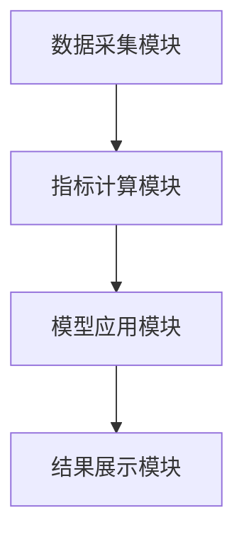

                 


# 价值投资中的宏观经济因素考虑

## 关键词：价值投资，宏观经济，GDP，利率，通货膨胀，投资策略，股票估值

## 摘要：  
本文探讨了在价值投资中考虑宏观经济因素的重要性。通过分析宏观经济指标如GDP、利率、通货膨胀等，揭示了这些因素如何影响市场定价和企业盈利能力。文章详细介绍了宏观经济驱动的股票估值模型，并通过案例分析展示了如何在实际投资中应用这些因素，帮助投资者制定更有效的投资策略。

---

# 第一部分：价值投资与宏观经济概述

## 第1章：价值投资的背景与概念

### 1.1 价值投资的定义与核心理念

#### 1.1.1 价值投资的起源与发展  
价值投资是一种长期投资策略，起源于20世纪初，由本杰明·格雷厄姆和戴维·多德提出。其核心理念是寻找市场估值低于其内在价值的股票，长期持有以获得超额收益。  

#### 1.1.2 价值投资的核心理念  
- **安全边际**：买入价格低于内在价值，以减少市场波动带来的风险。  
- **市场情绪**：市场短期波动，但长期趋向反映经济基本面。  
- **长期视角**：关注企业的长期盈利能力，而非短期市场波动。  

#### 1.1.3 价值投资与宏观经济的关系  
宏观经济环境决定了市场的整体表现和企业的经营环境。例如，低利率环境可能推高资产估值，而高通胀可能侵蚀企业利润。  

---

## 第2章：宏观经济指标与投资决策

### 2.1 主要宏观经济指标对投资的影响

#### 2.1.1 国内生产总值（GDP）与投资周期  
GDP是衡量经济整体表现的重要指标。高增长的GDP可能预示着企业盈利提升，反之则可能引发市场担忧。  

| 宏观经济指标 | 对投资的影响 |  
|--------------|---------------|  
| GDP增长率    | 高增长 → 企业盈利上升，股价上涨 |  
| 低增长 → 市场信心下降，股价下跌 |  

#### 2.1.2 利率与资本成本  
利率是影响企业融资成本的关键因素。低利率环境通常有利于企业扩张，从而推高股价。  

$$ 利率下降 \Rightarrow 资本成本降低 \Rightarrow 企业盈利增加 \Rightarrow 股价上涨 $$  

#### 2.1.3 通货膨胀与购买力  
通货膨胀会侵蚀购买力，影响企业的实际利润。如果通胀率高于名义利率，实际利率为负，可能导致资产价格上涨。  

#### 2.1.4 失业率与市场情绪  
低失业率通常意味着经济强劲，市场情绪乐观，反之则可能导致市场恐慌。  

---

## 第3章：宏观经济周期与资产定价

### 3.1 经济周期的定义与阶段  
经济周期分为复苏、繁荣、衰退和萧条四个阶段。不同阶段下，资产表现差异显著。  

- **复苏阶段**：企业利润回升，股价上涨。  
- **繁荣阶段**：市场过热，可能出现泡沫。  
- **衰退阶段**：企业利润下降，股价下跌。  
- **萧条阶段**：市场低迷，寻找价值机会。  

### 3.2 不同经济周期下的投资策略  
- **繁荣期**：关注高增长行业，如科技和消费。  
- **衰退期**：寻找低估值的防御性行业，如公用事业和医疗。  

---

## 第4章：宏观经济政策对市场的影响

### 4.1 货币政策与财政政策

#### 4.1.1 货币政策的定义与影响  
货币政策由中央银行通过调整利率和货币供应量影响经济。  

- **降息**：降低资本成本，刺激投资。  
- **加息**：抑制通胀，冷却市场。  

#### 4.1.2 财政政策的定义与影响  
财政政策通过政府支出和税收调整经济。  

- **扩张性财政政策**：增加政府支出，刺激经济增长。  
- **紧缩性财政政策**：减少政府支出，抑制通胀。  

---

## 第5章：构建宏观经济驱动的股票估值模型

### 5.1 数据收集与整理  
收集宏观经济指标（GDP、利率、通胀率）和股票数据，进行清洗和标准化处理。  

### 5.2 指标权重的确定  
通过回归分析确定各宏观经济指标对股价的影响权重。  

### 5.3 模型构建与验证  
建立多元回归模型，公式如下：  

$$ 股价 = \beta_0 + \beta_1 \times GDP + \beta_2 \times 利率 + \beta_3 \times 通胀率 + \epsilon $$  

### 5.4 模型应用与优化  
根据回测结果优化模型，调整权重和参数，确保其在不同经济周期下的适用性。  

---

## 第6章：系统架构与项目实战

### 6.1 系统架构设计  
设计一个完整的投资系统，包括数据采集、指标计算、模型应用和结果展示。  



### 6.2 项目实战：案例分析  
以某行业为例，分析宏观经济因素对该行业的影响，应用上述模型进行估值，并对比实际股价走势验证模型的有效性。  

### 6.3 代码实现  

```python
import pandas as pd
import numpy as np
from sklearn.linear_model import LinearRegression

# 数据准备
data = pd.read_csv('macro_data.csv')
X = data[['GDP', '利率', '通胀率']]
y = data['股价']

# 模型训练
model = LinearRegression()
model.fit(X, y)

# 模型预测
predictions = model.predict(X)
print('预测股价:', predictions)
```

---

## 第7章：最佳实践与小结

### 7.1 关键点总结  
- 宏观经济因素对价值投资至关重要。  
- 不同经济周期下，投资策略应灵活调整。  

### 7.2 注意事项  
- 宏观经济模型需结合行业特性。  
- 模型结果仅供参考，需结合其他因素综合判断。  

### 7.3 拓展阅读  
推荐阅读《证券分析》（格雷厄姆）、《投资学原理》（巴菲特）等书籍，深入理解宏观经济与投资的关系。

---

通过以上分析和实战，我们可以看到，宏观经济因素在价值投资中扮演着重要角色。投资者需结合宏观经济指标和政策动向，制定科学的投资策略，以实现长期稳定的收益。

