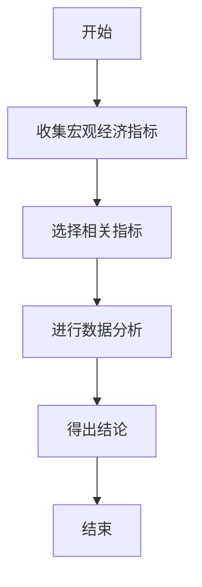

                 


# 价值投资中的宏观经济因素：大局观的重要性

---

## 关键词
价值投资、宏观经济、经济指标、投资策略、市场分析

---

## 摘要
本文探讨了宏观经济因素在价值投资中的重要性，分析了如何通过宏观经济指标和大局观来制定有效的投资策略。文章详细讲解了GDP、利率、通货膨胀等宏观经济指标对市场和企业的影响，结合数学模型和实际案例，展示了如何将宏观经济分析融入价值投资决策中。

---

## 第1章: 宏观经济因素与价值投资概述

### 1.1 宏观经济因素的定义与重要性
#### 1.1.1 宏观经济的基本概念
宏观经济研究的是整个经济体系的运行，包括GDP、失业率、通货膨胀率等关键指标。这些指标反映了经济的整体状况，对市场和企业有着深远的影响。

#### 1.1.2 宏观经济因素在价值投资中的作用
价值投资强调以低于内在价值的价格购买优质资产。宏观经济因素直接影响企业的盈利能力、行业趋势和市场整体走势，因此在价值投资中占据重要地位。

#### 1.1.3 大局观的重要性
投资者需要关注宏观经济趋势，如经济周期、政策变化等，这些因素能够帮助投资者更好地把握市场的长期趋势，避免短期波动的干扰。

### 1.2 价值投资的核心原则
#### 1.2.1 价值投资的定义
价值投资是一种投资策略，强调以低于市场价购买具有内在价值的资产。其核心在于识别被市场低估的企业，长期持有以实现收益。

#### 1.2.2 价值投资的关键要素
- **安全边际**：购买价格低于内在价值，以降低风险。
- **长期视角**：关注企业的长期盈利能力，而非短期波动。
- **基本面分析**：通过分析企业的财务状况、行业地位等来评估其内在价值。

#### 1.2.3 宏观经济与价值投资的关系
宏观经济环境直接影响企业的经营环境和盈利潜力。例如，低利率环境可能推动股价上涨，而高通胀可能侵蚀企业利润。

### 1.3 宏观经济因素对投资决策的影响
#### 1.3.1 宏观经济环境对企业价值的影响
- 经济增长：GDP增长通常意味着企业盈利增加。
- 利率变化：低利率降低了企业的融资成本，可能提升盈利能力。
- 通货膨胀：高通胀可能导致企业成本上升，影响利润。

#### 1.3.2 宏观经济周期与资产定价
经济周期分为衰退、复苏、增长和顶峰四个阶段，每个阶段的资产定价规律不同。例如，在衰退期，股票可能被低估，而在增长期，股票可能被高估。

#### 1.3.3 宏观经济风险的管理
投资者需要通过 diversification（分散投资）和风险评估来管理宏观经济风险，避免过度集中在单一经济因素上。

### 1.4 本章小结
本章介绍了宏观经济因素在价值投资中的重要性，强调了大局观在投资决策中的关键作用。通过理解宏观经济指标和经济周期，投资者可以更好地把握市场趋势，制定更有效的投资策略。

---

## 第2章: 宏观经济指标与市场分析

### 2.1 主要宏观经济指标分析
#### 2.1.1 国内生产总值（GDP）
GDP是衡量经济整体表现的重要指标，反映了国家的经济规模和增长速度。GDP增长通常意味着企业盈利增加，可能推高股价。

#### 2.1.2 失业率
低失业率通常意味着经济强劲，消费者信心高，企业盈利较好。高失业率可能导致企业盈利下降，股价下跌。

#### 2.1.3 通货膨胀率
通货膨胀会影响企业的成本和利润。适度的通胀有助于经济增长，但过高的通胀可能导致企业成本上升，利润被侵蚀。

#### 2.1.4 利率
利率影响企业的融资成本和投资决策。低利率通常会刺激投资和消费，推高股价；高利率可能抑制投资，导致股价下跌。

#### 2.1.5 汇率
汇率变化影响出口企业的竞争力和外国投资者的行为。例如，本币贬值可能提高出口企业的竞争力，但可能增加进口成本。

### 2.2 宏观经济指标与投资决策的关联
#### 2.2.1 经济周期与资产配置
在不同的经济周期阶段，投资者应调整资产配置。例如，在衰退期，债券可能比股票更安全；在增长期，股票可能表现更好。

#### 2.2.2 行业选择与宏观经济因素
不同行业对宏观经济因素的敏感度不同。例如，能源行业受油价影响较大，而科技行业受利率影响较大。

### 2.3 宏观经济指标的量化分析
#### 2.3.1 经济指标的数学模型
可以通过回归分析等统计方法，将宏观经济指标与股票收益进行相关性分析，找到影响最大的指标。

#### 2.3.2 示例：回归分析
假设我们用GDP增长率（x）和股票收益（y）进行回归分析，得到方程：
$$y = \beta_0 + \beta_1x + \epsilon$$
其中，$\beta_1$表示GDP增长率对股票收益的影响程度。

#### 2.3.3 流程图：宏观经济指标分析流程


### 2.4 本章小结
本章详细分析了主要宏观经济指标对市场和企业的影响，并通过数学模型和流程图展示了如何将这些指标应用于投资决策中。

---

## 第3章: 宏观经济因素对价值投资策略的影响

### 3.1 经济周期与投资策略
#### 3.1.1 不同经济周期的投资策略
- **衰退期**：寻找估值低、分红稳定的股票。
- **复苏期**：关注受益于经济复苏的行业，如制造业。
- **增长期**：投资于高增长行业，如科技和消费。
- **顶峰期**：警惕市场泡沫，考虑减仓。

#### 3.1.2 经济周期对行业选择的影响
在衰退期，防御性行业（如公用事业、医疗）可能表现更好；在增长期，周期性行业（如材料、工业）可能表现更好。

### 3.2 利率环境与投资策略
#### 3.2.1 利率上升的影响
- 利率上升会增加企业的融资成本，可能影响利润。
- 债券收益率上升，可能吸引资金从股票转向债券，导致股价下跌。

#### 3.2.2 利率下降的影响
- 利率下降会降低企业的融资成本，可能提升利润。
- 债券收益率下降，可能吸引资金从债券转向股票，推高股价。

### 3.3 通货膨胀与投资策略
#### 3.3.1 通货膨胀上升的影响
- 高通胀可能导致企业成本上升，利润减少。
- 实物资产（如房地产）可能成为较好的投资标的。

#### 3.3.2 通货膨胀下降的影响
- 低通胀环境下，企业的成本压力较小，利润可能提升。
- 股票和债券都可能表现较好，但债券可能更受青睐。

### 3.4 宏观经济因素的综合影响
#### 3.4.1 综合分析
投资者需要综合考虑多个宏观经济指标，评估其对不同行业和资产的影响，制定多元化的投资策略。

#### 3.4.2 示例：综合指标分析
假设当前GDP增长放缓，但通胀上升，可能意味着经济处于滞胀状态。此时，投资者可能需要减少股票配置，增加抗通胀资产如黄金。

### 3.5 本章小结
本章分析了宏观经济因素对投资策略的影响，强调了根据经济环境调整投资组合的重要性。

---

## 第4章: 宏观经济驱动的价值投资模型

### 4.1 模型构建背景
价值投资模型需要考虑宏观经济因素对资产价格的影响，通过量化分析找到具有投资价值的标的。

### 4.2 模型设计
#### 4.2.1 数据收集
收集历史宏观经济指标和股票数据，分析它们之间的相关性。

#### 4.2.2 指标筛选
选择对股票收益影响较大的指标，如GDP增长率、利率、通胀率等。

#### 4.2.3 模型构建
使用回归分析等方法，建立宏观经济指标与股票收益的关系模型。

#### 4.2.4 模型验证
通过历史数据验证模型的准确性，并进行回测。

### 4.3 系统架构设计
#### 4.3.1 系统功能模块
- 数据采集模块：收集宏观经济指标和股票数据。
- 数据处理模块：清洗和预处理数据。
- 模型构建模块：建立并训练回归模型。
- 结果展示模块：输出分析结果和投资建议。

#### 4.3.2 系统架构图


### 4.4 模型实现
#### 4.4.1 Python代码实现
```python
import pandas as pd
import numpy as np
from sklearn.linear_model import LinearRegression
from sklearn.metrics import r2_score

# 数据处理
data = pd.read_csv('macroeconomic.csv')
X = data[['gdp_growth', 'inflation', 'interest_rate']]
y = data['stock_return']

# 模型训练
model = LinearRegression()
model.fit(X, y)

# 模型评估
predictions = model.predict(X)
r2 = r2_score(y, predictions)
print(f'R² = {r2}')
```

#### 4.4.2 模型解读
模型输出的系数表示每个宏观经济指标对股票收益的影响程度。例如，如果gdp增长率的系数为0.5，表示gdp每增长1%，股票收益可能增加0.5%。

### 4.5 本章小结
本章通过构建宏观经济驱动的价值投资模型，展示了如何将宏观经济分析应用于实际投资决策中。

---

## 第5章: 项目实战与案例分析

### 5.1 项目背景
以当前全球经济环境为例，分析主要宏观经济指标的变化对股市的影响。

### 5.2 数据准备
收集过去10年的GDP增长率、通胀率、利率等数据，以及对应期间的股票指数数据。

### 5.3 数据分析
使用回归分析模型，分析宏观经济指标与股票收益的相关性。

### 5.4 案例分析
假设在2020年全球经济衰退期间，GDP增长率为-2%，通胀率为1%，利率为0.5%。模型预测股票收益可能为-5%。实际情况中，股票指数可能下跌，但某些行业（如科技）可能表现较好。

### 5.5 投资策略调整
根据模型分析结果，投资者可能需要减少股票配置，增加债券或黄金等避险资产。

### 5.6 本章小结
本章通过实际案例分析，展示了如何将宏观经济分析应用于投资决策中。

---

## 第6章: 总结与展望

### 6.1 本章总结
本文详细探讨了宏观经济因素在价值投资中的重要性，分析了如何通过宏观经济指标和大局观来制定有效的投资策略。通过构建数学模型和实际案例分析，展示了如何将宏观经济分析应用于实际投资中。

### 6.2 未来展望
未来的研究可以进一步探索更多宏观经济指标对投资的影响，开发更复杂的模型，结合人工智能技术进行预测和优化。

### 6.3 最佳实践 tips
- 定期更新宏观经济指标分析，保持对经济环境的敏感性。
- 保持多元化投资，分散宏观经济风险。
- 结合技术分析和基本面分析，制定更全面的投资策略。

### 6.4 本章小结
本文总结了宏观经济因素在价值投资中的重要性，并展望了未来的研究方向，为投资者提供了宝贵的参考。

---

## 关键词
价值投资、宏观经济、经济指标、投资策略、市场分析

---

## 摘要
本文探讨了宏观经济因素在价值投资中的重要性，分析了如何通过宏观经济指标和大局观来制定有效的投资策略。文章详细讲解了GDP、利率、通货膨胀等宏观经济指标对市场和企业的影响，结合数学模型和实际案例，展示了如何将宏观经济分析融入价值投资决策中。

