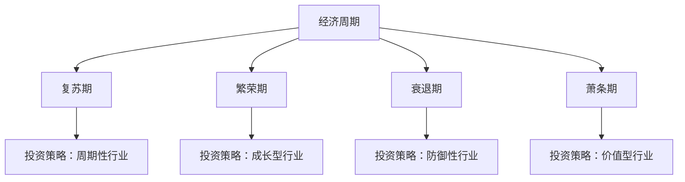
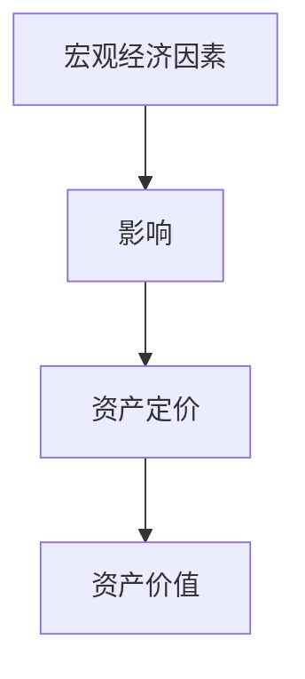

                 

<think>
好的，我需要根据用户提供的详细要求和目录结构，逐步完成《价值投资中的宏观经济考量：全局视野》这篇文章的撰写。用户已经提供了目录大纲，现在需要我按照这个大纲，详细展开每个部分的内容，确保每个章节和小节都有丰富的讲解，同时满足格式要求，使用Markdown格式，并包含必要的图表和代码示例。

首先，我会从第一章开始，逐步深入，确保每个部分的内容详尽且符合逻辑。对于每个小节，我需要详细解释核心概念，并使用mermaid图表和Python代码来辅助说明。

### 第1章: 价值投资与宏观经济概述

#### 1.1 价值投资的核心理念

##### 1.1.1 价值投资的定义与起源

价值投资是一种投资策略，其核心在于寻找那些市场价格低于其内在价值的证券。这种方法由本杰明·格雷厄姆和戴维·多德在20世纪初提出，强调深入分析企业的基本面，关注长期价值而非短期市场波动。

##### 1.1.2 价值投资的基本原则

价值投资的原则包括：
1. 质量优先：选择财务健康、管理稳健的企业。
2. 安全边际：购买价格应显著低于内在价值。
3. 长期视角：关注企业的长期盈利能力，而非短期波动。

##### 1.1.3 价值投资与宏观经济的关系

宏观经济环境直接影响企业的盈利能力和资产价值。例如，低利率环境可能推动股价上涨，而高通胀可能侵蚀企业利润。因此，价值投资者需要考虑宏观经济因素来调整投资策略。

#### 1.2 宏观经济的基本概念

##### 1.2.1 宏观经济的核心指标

关键宏观经济指标包括：
- GDP：国内生产总值，衡量经济规模。
- 失业率：反映就业市场状况。
- 利率：影响企业和个人的借贷成本。
- 通货膨胀率：影响 purchasing power。

##### 1.2.2 宏观经济与金融市场的关系

宏观经济因素直接影响金融市场。例如，中央银行的货币政策（如利率调整）会直接影响股市、债市和货币市场。

##### 1.2.3 宏观经济分析的基本方法

常用的分析方法包括：
1. 定量分析：使用经济指标进行预测。
2. 定性分析：考虑政策、社会趋势等非量化因素。

#### 1.3 价值投资中的宏观经济考量

##### 1.3.1 宏观经济对资产定价的影响

资产定价模型（如CAPM）将宏观经济因素如利率、经济增长率纳入考虑，以确定证券的合理价格。

##### 1.3.2 宏观经济周期与投资策略

在不同的经济周期（复苏、繁荣、衰退、萧条），价值投资者应调整投资策略。例如，在衰退期寻找价值被低估的企业。

##### 1.3.3 宏观经济风险的识别与管理

通过 diversification 和风险评估来管理宏观经济风险，确保投资组合的稳定性。

### 第2章: 宏观经济对价值投资的影响

#### 2.1 宏观经济周期与投资策略

##### 2.1.1 经济周期的定义与特征

经济周期分为四个阶段：复苏、繁荣、衰退、萧条。每个阶段对企业盈利和证券价格有不同的影响。

##### 2.1.2 不同经济周期下的投资策略

- 复苏期：投资于周期性行业如制造业。
- 繁荣期：关注高成长行业。
- 衰退期：寻找防御性行业如公用事业。
- 萧条期：寻找价值被低估的企业。

##### 2.1.3 宏观经济周期对行业选择的影响

行业表现与经济周期密切相关。例如，科技行业在繁荣期表现较好，而能源行业在衰退期可能受益于低油价。

#### 2.2 宏观经济指标与投资决策

##### 2.2.1 GDP与经济表现

高GDP增长通常伴随股市上涨，反之亦然。

##### 2.2.2 利率与货币政策

低利率环境通常有利于股市和债市，而高利率可能抑制经济增长。

##### 2.2.3 通货膨胀与购买力

高通胀可能侵蚀企业利润和消费者购买力，影响证券价格。

#### 2.3 行业分析与宏观经济环境

##### 2.3.1 行业生命周期与宏观经济的关系

行业处于不同生命周期阶段时，宏观经济环境对其影响不同。例如，成熟行业在衰退期可能面临更大压力。

##### 2.3.2 宏观经济环境对行业选择的影响

行业选择应考虑宏观经济趋势，如技术行业在技术革命时期的高增长。

##### 2.3.3 行业竞争优势分析

分析行业内的竞争结构，如市场集中度、进入壁垒等，以评估企业的竞争优势。

### 第3章: 宏观经济指标与资产定价模型

#### 3.1 宏观经济指标对资产定价的影响

##### 3.1.1 利率对债券价格的影响

利率上升会降低债券价格，反之亦然，因为债券收益率与价格成反比。

##### 3.1.2 GDP增长对股市的影响

高GDP增长通常带来股市上涨，反之则可能引发下跌。

##### 3.1.3 通货膨胀对商品价格的影响

高通胀可能导致商品价格上涨，尤其是原材料和能源产品。

#### 3.2 资产定价模型的数学公式

##### 3.2.1 CAPM模型的公式与应用

CAPM公式：
$$ R_i = R_f + \beta_i (R_m - R_f) $$

其中，\( R_i \) 是资产的预期回报率，\( R_f \) 是无风险利率，\( \beta_i \) 是资产的贝塔系数，\( R_m \) 是市场预期回报率。

##### 3.2.2 Fama-French三因子模型的公式与应用

Fama-French三因子模型：
$$ R_i = R_f + \beta_i (R_m - R_f) + S_i + C_i $$

其中，\( S_i \) 是规模因子，\( C_i \) 是价值因子。

##### 3.2.3 资产定价的宏观经济因素分析

宏观经济因素如GDP增长、通货膨胀、利率等会影响资产定价，这些因素通过影响企业的盈利能力和风险偏好，进而影响证券价格。

#### 3.3 宏观经济指标与投资组合优化

##### 3.3.1 投资组合的风险与收益分析

通过宏观经济分析，投资者可以优化投资组合的风险和收益，例如通过 diversification 和资产配置来分散风险。

##### 3.3.2 宏观经济因素对投资组合的影响

宏观经济因素如经济周期、通货膨胀率、利率等会影响投资组合的表现。例如，在高通胀环境下，持有抗通胀资产如房地产或黄金可能更有利。

### 图形部分：

为了帮助读者更好地理解，可以插入以下mermaid图表：

#### 经济周期与投资策略的mermaid图



#### 资产定价模型的mermaid图



### 代码示例：

为了进一步说明，以下是一个使用Python进行宏观经济数据分析的示例：

```python
import pandas as pd
import numpy as np
import matplotlib.pyplot as plt

# 示例宏观经济数据
data = {
    'GDP增长率': [2.5, 3.1, 2.8, 1.9, 2.2],
    '失业率': [5.2, 4.8, 6.1, 5.5, 4.3],
    '通胀率': [2.1, 1.8, 2.5, 1.6, 2.2]
}

df = pd.DataFrame(data)
print(df)

# 绘制通胀率与失业率的散点图
plt.scatter(df['通胀率'], df['失业率'])
plt.xlabel('通胀率')
plt.ylabel('失业率')
plt.title('通胀率与失业率的关系')
plt.show()
```

这个代码示例展示了如何使用Python分析宏观经济数据，并绘制相关图表来观察变量之间的关系。

### 总结

通过以上分析，可以清晰地看到宏观经济因素对价值投资的重要影响。投资者需要综合考虑宏观经济指标、经济周期、行业趋势等多方面因素，制定合理的投资策略。同时，利用数学模型和数据分析工具，可以帮助投资者更准确地评估宏观经济因素对资产定价的影响，从而做出更明智的投资决策。

