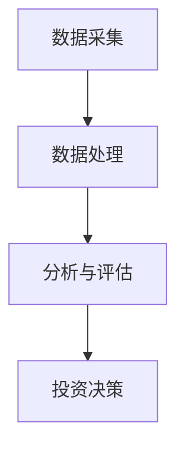
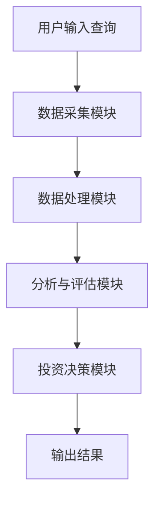

                 


```
# 价值投资中的定量与定性分析：数字之外的考量

> 关键词：价值投资、定量分析、定性分析、财务指标、投资策略、系统架构

> 摘要：本文深入探讨了价值投资中定量分析与定性分析的结合，分析了数字之外的考量因素，包括企业基本面、行业趋势、管理层评估等，同时结合数学模型和系统架构，提供了全面的投资策略。

---

## 第一部分: 价值投资中的定量与定性分析基础

### 第1章: 价值投资概述

#### 1.1 价值投资的定义与核心理念
##### 1.1.1 价值投资的基本概念
价值投资是一种以低于内在价值的价格购买优质资产的投资策略，其核心在于寻找市场低估的投资机会。

##### 1.1.2 价值投资的核心理念与原则
- **安全边际**：买入价格低于内在价值，以降低风险。
- **长期视角**：关注企业的长期竞争优势和盈利能力。
- **逆向思维**：在市场恐慌时寻找低估资产，在市场狂热时保持冷静。

##### 1.1.3 价值投资与其他投资策略的区别
与趋势投资和短期交易不同，价值投资注重企业的内在价值，强调长期持有和基本面分析。

#### 1.2 价值投资的理论基础
##### 1.2.1 格雷厄姆的价值投资理论
本杰明·格雷厄姆提出“安全边际”概念，强调以低于清算价值的价格买入股票。

##### 1.2.2 巴菲特的投资理念与实践
沃伦·巴菲特继承并发展了格雷厄姆的理论，强调企业的竞争优势和管理层质量。

##### 1.2.3 现代价值投资的发展与演变
现代价值投资结合了更多定量分析方法和工具，但核心理念保持不变。

#### 1.3 价值投资中的定量与定性分析
##### 1.3.1 定量分析的定义与作用
通过财务指标和数学模型量化企业的价值和风险。

##### 1.3.2 定性分析的定义与作用
通过对企业基本面、行业趋势和管理层的评估，分析企业的长期发展潜力。

##### 1.3.3 定量与定性分析的结合
综合使用定量和定性分析，提高投资决策的准确性和全面性。

---

### 第2章: 定性分析的核心要素

#### 2.1 企业基本面分析
##### 2.1.1 企业商业模式的分析
分析企业的盈利模式和核心业务，判断其持续盈利能力。

##### 2.1.2 企业竞争优势的评估
评估企业的竞争优势，如成本优势、技术壁垒和品牌影响力。

##### 2.1.3 企业管理层的分析
分析管理层的素质、经验和战略决策能力，判断企业长期发展方向。

#### 2.2 行业分析与宏观经济因素
##### 2.2.1 行业生命周期的分析
判断行业所处的生命周期阶段（幼稚期、成长期、成熟期、衰退期），评估行业的发展潜力。

##### 2.2.2 宏观经济环境对企业的影响
分析宏观经济指标（GDP、利率、通货膨胀等）对行业和企业的影响。

##### 2.2.3 政策环境对企业的影响
评估政府政策（税收、行业监管等）对企业经营和发展的潜在影响。

#### 2.3 财务报表分析
##### 2.3.1 资产负债表分析
评估企业的资产结构、负债情况和股东权益，判断企业的财务健康状况。

##### 2.3.2 利润表分析
分析企业的收入、成本和利润情况，评估企业的盈利能力和经营效率。

##### 2.3.3 现金流量表分析
评估企业的现金流情况，判断企业的资金流动性和偿债能力。

---

### 第3章: 定量分析的数学模型

#### 3.1 常用财务指标分析
##### 3.1.1 市盈率（P/E）的计算与应用
$$ \text{市盈率} = \frac{\text{股价}}{\text{每股净利润}} $$

##### 3.1.2 市净率（P/B）的计算与应用
$$ \text{市净率} = \frac{\text{股价}}{\text{每股净资产}} $$

##### 3.1.3 股息率的计算与应用
$$ \text{股息率} = \frac{\text{每股股息}}{\text{股价}} $$

#### 3.2 估值模型与方法
##### 3.2.1 现金流折现模型（DCF）
$$ \text{企业价值} = \sum_{t=1}^{n} \frac{\text{现金流}}{(1 + r)^t} + \frac{\text{终值}}{(1 + r)^n} $$
其中，\( r \) 为折现率，\( n \) 为预测期数。

##### 3.2.2 市盈率倍数法
$$ \text{目标股价} = \text{行业平均市盈率} \times \text{每股净利润} $$

##### 3.2.3 市净率倍数法
$$ \text{目标股价} = \text{行业平均市净率} \times \text{每股净资产} $$

#### 3.3 风险评估与投资组合优化
##### 3.3.1 风险的定义与度量
- **系统性风险**：市场整体波动带来的风险。
- **非系统性风险**：特定企业或行业带来的风险。

##### 3.3.2 投资组合的优化方法
通过分散投资降低非系统性风险，优化投资组合的收益与风险比。

##### 3.3.3 马科维茨的有效前沿理论
$$ \text{最优投资组合} = \argmin_{w} \left( w^T \Sigma w \right) \text{ s.t. } w^T \mu = \text{目标收益} $$

---

### 第4章: 定量与定性分析的结合

#### 4.1 定量分析在价值投资中的应用
##### 4.1.1 通过财务指标筛选投资标的
使用市盈率、市净率等指标筛选出潜在的投资标的。

##### 4.1.2 通过估值模型确定投资价格
利用DCF模型等方法估算企业的内在价值，确定合理的买入价格。

##### 4.1.3 通过风险评估优化投资组合
根据风险承受能力，优化投资组合的风险与收益比。

#### 4.2 定性分析在价值投资中的应用
##### 4.2.1 通过企业基本面分析识别投资机会
分析企业的商业模式、竞争优势和管理层质量，判断其长期发展潜力。

##### 4.2.2 通过行业分析把握投资趋势
分析行业生命周期和宏观经济因素，判断行业的发展潜力和风险。

##### 4.2.3 通过管理层分析评估企业长期价值
评估管理层的素质和战略决策能力，判断企业能否持续创造价值。

#### 4.3 定量与定性分析的结合策略
##### 4.3.1 定量分析作为定性分析的补充
通过定量指标验证定性分析的结论，提高投资决策的准确性。

##### 4.3.2 定性分析作为定量分析的验证
通过定性分析补充定量分析的不足，全面评估企业的价值和风险。

##### 4.3.3 综合分析在投资决策中的应用
将定量和定性分析相结合，制定科学的投资策略和决策。

---

### 第5章: 系统架构与投资分析流程

#### 5.1 投资分析系统的模块划分
- **数据采集模块**：收集企业财务数据、市场数据等。
- **数据处理模块**：清洗和整理数据，确保数据的准确性和完整性。
- **分析与评估模块**：应用定量和定性分析方法，评估企业的价值和风险。
- **投资决策模块**：根据分析结果制定投资策略。

#### 5.2 系统架构设计
##### 5.2.1 系统功能架构图


##### 5.2.2 数据流与交互流程图


#### 5.3 投资分析流程的优化
##### 5.3.1 数据采集与预处理
- 数据源：企业财务报表、行业报告、市场数据等。
- 数据清洗：去除异常值、填补缺失值等。

##### 5.3.2 分析模型的构建与应用
- 构建定量分析模型（如DCF模型）和定性分析框架（如企业竞争力评估）。
- 应用模型进行模拟和预测，评估企业的价值和风险。

##### 5.3.3 投资决策的制定与调整
- 根据分析结果制定投资策略，动态调整投资组合，应对市场变化。

---

### 第6章: 项目实战与案例分析

#### 6.1 项目背景与目标
选择一个具体行业（如科技行业）和几家企业（如苹果、谷歌），进行定量与定性分析，制定投资策略。

#### 6.2 数据采集与处理
- 数据源：公司财务报表、行业报告、市场数据等。
- 数据清洗：处理缺失值、异常值等。

#### 6.3 分析与评估
##### 6.3.1 定量分析
- 计算市盈率、市净率等指标。
- 应用DCF模型估算企业价值。

##### 6.3.2 定性分析
- 分析企业的商业模式、竞争优势和管理层。
- 评估行业的发展潜力和宏观经济影响。

#### 6.4 投资策略制定
##### 6.4.1 综合分析结果
- 根据定量和定性分析结果，评估企业的投资价值。
- 判断企业的买入价格是否合理。

##### 6.4.2 投资组合优化
- 根据风险承受能力和市场环境，优化投资组合。
- 动态调整投资策略，应对市场变化。

#### 6.5 案例分析
以苹果公司为例，分析其财务指标、行业地位和管理层素质，制定投资策略。

---

### 第7章: 总结与展望

#### 7.1 总结
定量分析和定性分析的结合是价值投资的核心，数字之外的考量同样重要。

#### 7.2 展望
未来，随着人工智能和大数据技术的发展，价值投资将更加依赖于量化分析和系统化决策。

---

### 关键词标签
#价值投资 #定量分析 #定性分析 #财务指标 #投资策略 #系统架构
```

